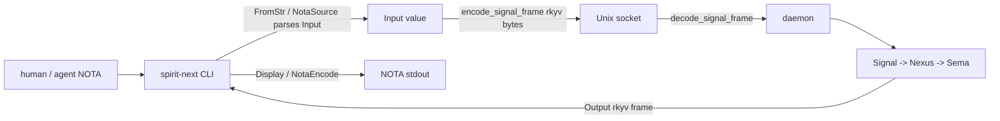
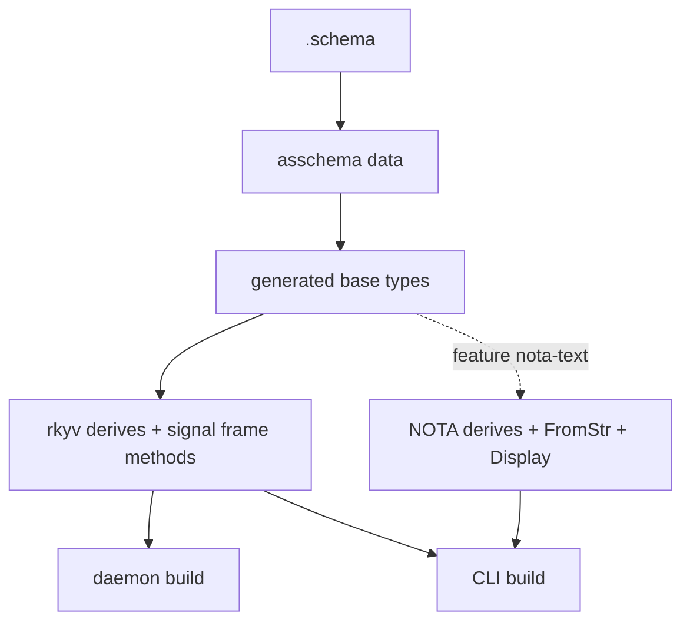

# NOTA Surface Split For Lean Daemons

## Scope

This report researches how to make NOTA encode/decode and `NotaDecode` /
`NotaEncode` derives optional for generated Rust, so daemon-only components keep
only the binary `rkyv` surface while text-facing clients keep the dual NOTA +
binary surface.

Durable intent captured before the audit:

- Spirit record 1236: generated NOTA encode/decode derives are optional, not
  automatic; daemon-only components should not carry NOTA decoding for protocol
  messages.
- Spirit record 1237: every generated schema datatype needs the binary `rkyv`
  surface; only text-facing clients need NOTA.
- Spirit record 1240: daemon configuration should also be binary, not
  NOTA-decoded by the daemon; a lean daemon finds config from default state or
  waits for a typed binary configuration signal.
- Spirit record 1239: a daemon may expose multiple signal protocols or signal
  interfaces; configuration can be one typed signal surface differentiated by
  the root enumerator.

## Current Boundary

The runtime protocol boundary is already mostly right:



The CLI reads NOTA in `/git/github.com/LiGoldragon/spirit-next/src/bin/spirit-next.rs:23`.
It reads the one argument, parses it with `source.parse::<Input>()`, sends it
through `SignalTransport::exchange`, then prints `Output` with `Display`
(`/git/github.com/LiGoldragon/spirit-next/src/bin/spirit-next.rs:24` through
`:30`).

The socket transport is binary-only. `SignalTransport::write_input` calls
`input.encode_signal_frame()`, `read_input` calls
`Input::decode_signal_frame`, `write_output` calls
`output.encode_signal_frame()`, and `read_output` calls
`Output::decode_signal_frame`
(`/git/github.com/LiGoldragon/spirit-next/src/transport.rs:63` through `:81`).

The daemon message loop uses that binary transport. It accepts a stream, calls
`transport.read_input()`, hands the typed `Input` to the engine, then writes the
typed `Output` back
(`/git/github.com/LiGoldragon/spirit-next/src/daemon.rs:82` through `:87`).
There is no intentional NOTA protocol path on the daemon socket.

## Where NOTA Is Still Coupled

The generated schema module is currently a text+binary artifact unconditionally:

- `RustEmitter::emit` always emits NOTA imports, NOTA bridges, and root
  `FromStr` / `Display` support
  (`/git/github.com/LiGoldragon/schema-rust-next/src/lib.rs:59`,
  `:72` through `:75`).
- Every generated datatype derives `nota_next::NotaDecode` and
  `nota_next::NotaEncode` in `data_type_derive`
  (`/git/github.com/LiGoldragon/schema-rust-next/src/lib.rs:226` through
  `:237`).
- Root enums always derive NOTA too
  (`/git/github.com/LiGoldragon/schema-rust-next/src/lib.rs:362` through
  `:364`).
- The emitter writes inherent `from_nota_block` / `to_nota` bridges and root
  `FromStr` / `Display`
  (`/git/github.com/LiGoldragon/schema-rust-next/src/lib.rs:382` through
  `:430`).
- Generated mail support nouns still derive NOTA even though much of the plane
  envelope machinery is already binary-only
  (`/git/github.com/LiGoldragon/schema-rust-next/src/lib.rs:598` through
  `:607`, compared with `:622` through `:637`).

That means `/git/github.com/LiGoldragon/spirit-next/src/schema/lib.rs` imports
`nota_next`, derives `NotaDecode` / `NotaEncode` on every noun, and implements
`FromStr` / `Display` for `Input` and `Output`
(`/git/github.com/LiGoldragon/spirit-next/src/schema/lib.rs:8` through `:12`,
`:607` through `:641`).

There is also one separate daemon-side NOTA dependency: daemon configuration.
`spirit-next-daemon` calls `Configuration::from_single_argument`
(`/git/github.com/LiGoldragon/spirit-next/src/bin/spirit-next-daemon.rs:23`
through `:25`), and `Configuration` directly imports `nota_next::{Block,
Delimiter, Document}` to parse its startup argument
(`/git/github.com/LiGoldragon/spirit-next/src/config.rs:1` through `:36`).
That is not the message protocol, but it still means the daemon binary links a
NOTA parser today.

## Mechanism That Preserves Same Types

The right split is a generated codec surface, not duplicate types.



The reason this wants to live inside the type-owning crate is Rust's orphan
rule. `nota_next::NotaDecode` is an external trait. If schema types live in
`spirit_schema_core`, a separate `spirit_schema_text` crate cannot implement
`NotaDecode` for those external types unless it owns either the trait or the
type. A wrapper crate could define new wrapper types, but then the CLI and
daemon would not use the same datatypes.

So the clean mechanism is:

```rust
#[cfg_attr(feature = "nota-text", derive(nota_next::NotaDecode, nota_next::NotaEncode))]
#[derive(rkyv::Archive, rkyv::Serialize, rkyv::Deserialize, Clone, Debug, PartialEq, Eq)]
pub enum Input {
    Record(Entry),
    Observe(Query),
    Remove(RecordIdentifier),
}

#[cfg(feature = "nota-text")]
impl std::str::FromStr for Input {
    type Err = nota_next::NotaDecodeError;

    fn from_str(source: &str) -> Result<Self, Self::Err> {
        nota_next::NotaSource::new(source).parse::<Self>()
    }
}
```

`rkyv` is always on. `nota_next` becomes an optional dependency, enabled only by
a `nota-text` feature. The generated source is one source of truth; the daemon
binary compiles it without `nota-text`, while the CLI compiles it with
`nota-text`.

This should be exposed by `schema-rust-next` as an emission option:

```rust
pub enum NotaSurface {
    Disabled,
    FeatureGated { feature: String },
    AlwaysEnabled,
}

pub struct RustEmissionOptions {
    pub nota_surface: NotaSurface,
}
```

`RustEmitter::default()` can remain compatibility-oriented for now, but Spirit
should call an explicit constructor so the build intent is visible:

```rust
RustEmitter::new(RustEmissionOptions {
    nota_surface: NotaSurface::FeatureGated {
        feature: "nota-text".to_owned(),
    },
})
```

## Cargo / Nix Reality

Feature-gated source is necessary but not sufficient. Cargo features are unified
per package in a build invocation. If one package builds both `spirit-next` and
`spirit-next-daemon` with `nota-text` enabled, the daemon target sees the feature
too.

There are two viable shapes:

1. Keep one repository/package for the pilot, but build targets separately in
   Nix:
   - daemon derivation: `cargo build --bin spirit-next-daemon --no-default-features`
   - CLI derivation: `cargo build --bin spirit-next --features nota-text`
   - tests that need both launch the daemon artifact from the first derivation
     and the CLI artifact from the second.
2. Split into separate crates/packages:
   - `spirit-core` or `signal-spirit` owns binary schema types with optional
     `nota-text`.
   - `spirit-next-daemon` depends on it without `nota-text`.
   - `spirit-next-cli` depends on it with `nota-text`.

The second shape is cleaner long-term. The first shape is a smaller pilot edit,
but the Nix checks must be precise or the feature split becomes pretend.

## Daemon Configuration

The decision after this audit is stricter: daemon configuration is not a
temporary NOTA exception. If the daemon is binary-only, startup configuration has
to be binary too, or be absent until a typed binary configuration signal arrives.

Current daemon startup accepts NOTA config, so `config.rs` directly links
`nota_next`. If that remains, the daemon is still not lean even after generated
message types lose NOTA derives.

Aligned options:

1. Make daemon configuration a binary `rkyv` config root. The daemon's single
   argument becomes a path to a signal-encoded config file. A text-enabled CLI or
   launcher can produce that file from NOTA.
2. Move NOTA config parsing into a small text-enabled launcher that validates
   NOTA, writes an ephemeral binary config object, then execs the daemon with
   the binary config path.
3. Let the daemon start from a deterministic default state location and then
   stand by for a configuration signal. The config signal is just another typed
   signal surface: the daemon can expose multiple signal protocols or signal
   interfaces, differentiated by the root enumerator that names the accepted
   surfaces.

The rejected shape is "daemon protocol is binary, but daemon bootstrap still
decodes NOTA." That keeps the decoder in the daemon and preserves the wrong
habit: text talking directly to the daemon.

## Implementation Pass

Implemented in the next stack after the audit:

- `schema-rust-next` now has `RustEmissionOptions` and `NotaSurface`.
  `RustEmitter::default()` preserves the old always-NOTA behavior for callers
  that have not been migrated, while `RustEmitter::new(...)` can emit
  `AlwaysEnabled`, `FeatureGated { feature }`, or `Disabled` NOTA surfaces.
- `spirit-next` now calls
  `RustEmissionOptions::feature_gated_nota("nota-text")` from `build.rs`.
  Generated `src/schema/lib.rs` always derives `rkyv` and only derives
  `nota_next::NotaDecode` / `NotaEncode`, root `FromStr`, root `Display`, and
  `to_nota` helpers behind the `nota-text` feature.
- `spirit-next` Cargo targets are split by surface. The CLI binary requires
  `nota-text`; the daemon binary does not. Tests that launch the CLI are also
  marked `required-features = ["nota-text"]`, while runtime/schema binary tests
  still run with `--no-default-features`.
- `spirit-next-daemon` now takes a path to a binary rkyv `Configuration` file.
  `Configuration` stores path strings in an archived type, decodes with
  `rkyv::from_bytes`, and writes config files with `rkyv::to_bytes`; it no
  longer imports `nota_next`.
- `spirit-next` Nix now builds separate package derivations:
  `packages.daemon` is `--no-default-features --bin spirit-next-daemon`,
  `packages.cli` is `--features nota-text --bin spirit-next`, and
  `packages.default` joins the two binaries. This avoids Cargo feature
  unification making the daemon accidentally inherit the CLI's NOTA surface.

Verification completed:

- `schema-rust-next`: `cargo fmt && cargo test`
- `spirit-next`: `cargo test --no-default-features`
- `spirit-next`: `cargo test --features nota-text`
- `spirit-next`: `cargo tree -e normal --no-default-features` shows no
  `nota-next` runtime dependency; `cargo tree -e normal --features nota-text`
  shows `nota-next` only on the text-client surface.
- `spirit-next`: `nix flake check`
- `spirit-next`: `./scripts/run-nix-integration-tests`

The Nix integration run built the joined default package from local
`nota-next`, `schema-next`, and `schema-rust-next` checkouts, then ran all nine
process-boundary tests against the Nix-built CLI and separately built daemon.

## Tests That Would Prove It

The current Spirit Nix integration tests prove a real CLI talks to a real daemon
over a real socket, but they do not prove the daemon binary is NOTA-free. They
also intentionally parse CLI stdout back through `Output::from_str`
(`/git/github.com/LiGoldragon/spirit-next/tests/nix_integration.rs:290`
through `:310`), which is correct for the text client but should not be part of
the daemon target proof.

Add these tests/guards:

1. `schema-rust-next` binary-only emission test:
   - emit with `NotaSurface::Disabled`
   - assert generated code contains `rkyv::Archive`, `encode_signal_frame`,
     `decode_signal_frame`
   - assert generated code does not contain `nota_next`, `NotaDecode`,
     `NotaEncode`, `from_nota_block`, `to_nota`, `FromStr`, or root `Display`
2. `schema-rust-next` feature-gated emission test:
   - assert `cfg_attr(feature = "nota-text", derive(...))`
   - assert `FromStr` / `Display` are `#[cfg(feature = "nota-text")]`
3. Compile fixture without `nota-next`:
   - a tiny test crate includes the binary-only generated source
   - dependency list includes `rkyv` but not `nota-next`
4. Spirit split-artifact Nix test:
   - build daemon without `nota-text`
   - build CLI with `nota-text`
   - run CLI NOTA input against daemon
   - daemon stores/returns expected data through rkyv frames
5. Socket negative test:
   - open the daemon socket directly
   - send length-prefixed ASCII NOTA bytes instead of a signal frame
   - assert the daemon does not accept it as a message and the database is
     unchanged
6. Daemon closure/source guard after config migration:
   - `cargo tree` for daemon target has no `nota-next`
   - source guard confirms `src/bin/spirit-next-daemon.rs`, daemon runtime, and
     config path do not import `nota_next`
7. Binary config/config-signal test:
   - daemon starts from a binary config root or from default state
   - config changes arrive as a typed binary signal interface, not as NOTA text
   - raw NOTA config sent to the daemon is rejected or ignored

## Recommended Implementation Order

1. Add `RustEmissionOptions` and `NotaSurface` to `schema-rust-next`.
2. Convert the emitter from "NOTA always" to "binary always, NOTA gated":
   derives, imports, bridges, `FromStr`, `Display`, and support nouns all obey
   `NotaSurface`.
3. Update `spirit-next` generated source to be feature-gated, with
   `nota-next` as an optional dependency and `nota-text` as the feature.
4. Mark the CLI target as requiring `nota-text`; make daemon default to no
   `nota-text`.
5. Teach Nix to build CLI and daemon as separate artifacts so feature unification
   cannot accidentally put NOTA back into the daemon.
6. Move daemon configuration off NOTA: either a binary config root path, default
   state discovery plus a typed binary config signal, or a text-enabled launcher
   that converts NOTA before the daemon starts.
7. Add the direct-socket negative test so raw NOTA cannot become an accidental
   daemon protocol.

## Bottom Line

The current architecture already sends binary over the socket. The flaw is that
the generated Rust surface is all-or-nothing: the daemon receives the same
NOTA-capable module the CLI needs.

The aligned fix is to generate one set of schema datatypes with mandatory
`rkyv` and optional NOTA impls behind a text-client feature. Because of Rust's
orphan rules, the optional NOTA impls should live in the type-owning generated
crate, not in a separate extension crate. Because of Cargo feature unification,
Spirit then needs separate CLI and daemon build artifacts, or separate packages,
to prove the daemon is lean.

The config caveat is now part of the target, not a deferral: `config.rs` cannot
remain a NOTA parser in the lean daemon. Configuration becomes binary state,
binary launch input, or a typed binary config signal handled through the daemon's
accepted signal surfaces.
