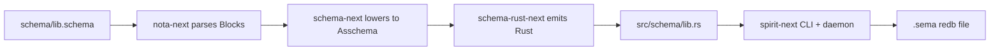
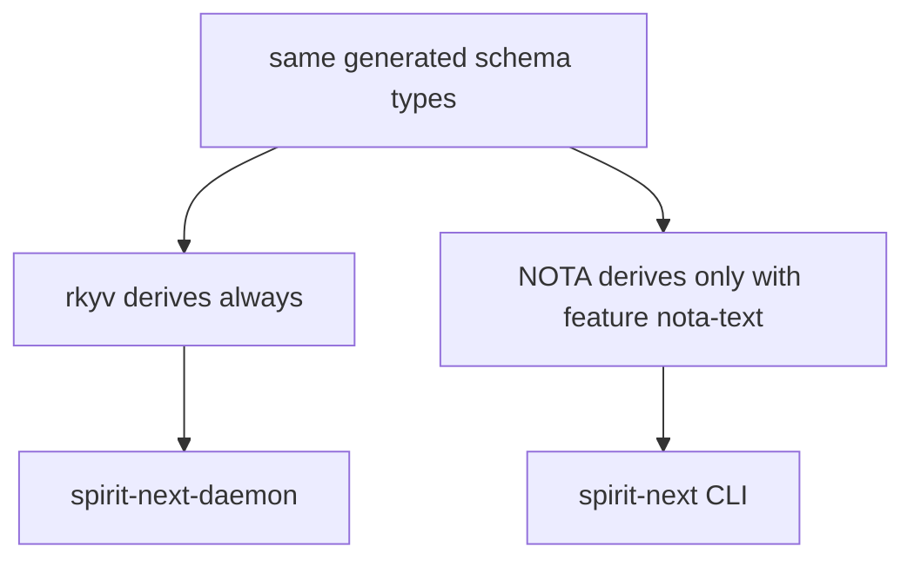
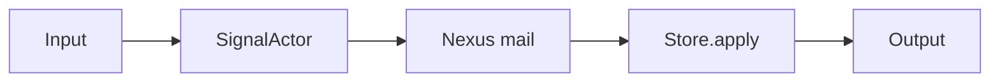
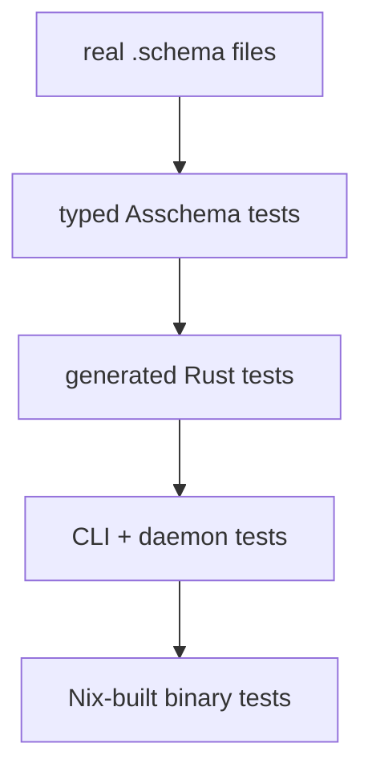

# 248 - Schema / NOTA / Spirit whole-stack tour

Kind: presentation / implementation state

Topics: schema, nota, asschema, emission, spirit, wire, runtime

Date: 2026-05-30

This report shows the current implemented stack from the actual files in
`spirit-next`, `schema-next`, and `schema-rust-next`. It is not an idealised
language sketch. Where the implementation is still short of the design, the gap
is called out directly.

## 1. The Current Stack In One Picture



The real pipeline is:

1. `spirit-next/schema/lib.schema` is authored in schema syntax, which is
   legal NOTA text.
2. `nota-next` parses that text into delimiter blocks.
3. `schema-next` lowers the blocks into an `Asschema` Rust value.
4. `schema-rust-next` emits `spirit-next/src/schema/lib.rs`.
5. `spirit-next/build.rs` checks that the generated Rust checked into the repo
   is fresh.
6. The CLI enables NOTA text support.
7. The daemon uses binary rkyv frames and a `.sema` redb store.

The main gap: `Asschema` is currently a typed in-memory Rust value. It is not
yet itself emitted as a checked-in `.asschema` NOTA file or rkyv artifact. That
is the next place the "everything is data" rule still needs more work.

## 2. The Five Surfaces

### Surface A: Raw NOTA Values

NOTA is the text data substrate.

```nota
[a b c]
{key value otherKey otherValue}
(Record ([[schema stack]] Decision [the schema emits Rust] Maximum))
None
(Some 7)
```

Current value-level rules:

- `[...]` is a vector value. At a string-typed position, bracket text is a
  string.
- `{...}` is a flat key/value map value.
- `(...)` is read against the expected type. If the expected type is an enum,
  the first PascalCase token is the variant tag.
- `None` / `(Some value)` are option values.
- Quotation marks are not the string language.

### Surface B: Authored Schema

Authored schema is the schema language written as NOTA-compatible text. The
current `spirit-next/schema/lib.schema` starts like this:

```schema
{}
[(Record Entry) (Observe Query) (Remove RecordIdentifier)]
[(RecordAccepted SemaReceipt) (RecordsObserved ObservedRecords) (RecordRemoved RemoveReceipt) (Error ErrorReport) (Rejected SignalRejection)]
{
  SourcePath String
  LocalPath String
  PublicPath String
  Import { SourcePath * LocalPath * }
  Export { LocalPath * PublicPath * }
  NexusInput [(Signal Input) (Sema SemaOutput)]
  NexusOutput [(Sema SemaInput) (Signal Output)]
  SemaInput [(Record Entry) (Observe Query) (Remove RecordIdentifier)]
  SemaOutput [(Recorded SemaReceipt) (Observed ObservedRecords) (Removed RemoveReceipt) (Missed ErrorReport)]
  Topic String
  Topics (Vec Topic)
  Query { TopicMatch * kind (Optional Kind) }
  Entry { Topics * Kind * Description * Magnitude * }
}
```

The schema syntax rules in use:

- `Name String` declares a newtype around the scalar `String`.
- `Name { ... }` declares a struct map.
- `Name [ ... ]` declares an enum body.
- `(Variant Payload)` declares a data-carrying enum variant.
- Bare `Variant` inside an enum body declares a unit variant.
- `TypeName *` at a struct field derives the field name from the type:
  `RecordIdentifier *` becomes field `record_identifier`.
- `field@(Optional Kind)` uses an explicit field name with a composite
  reference.
- `(Vec Topic)`, `(Optional Kind)`, and `(Map (Key Value))` are schema
  type-reference forms, not raw NOTA vector/map values.

The current target writes the input and output roots as known positional
bracket bodies, not as labeled root wrappers. It does not wrap the whole file
in an outer schema object.

### Surface C: Asschema

`schema-next` lowers authored schema into this Rust model:

```rust
pub struct Asschema {
    identity: SchemaIdentity,
    imports: Vec<ImportDeclaration>,
    resolved_imports: Vec<ResolvedImport>,
    roots: Vec<RootDeclaration>,
    namespace: Vec<Declaration>,
}

pub struct Declaration {
    visibility: Visibility,
    name: Name,
    value: TypeDeclaration,
}

pub enum TypeDeclaration {
    Struct(StructDeclaration),
    Enum(EnumDeclaration),
    Newtype(NewtypeDeclaration),
}
```

Structs preserve source order but are semantically field-name -> type-reference
maps:

```rust
pub struct StructDeclaration {
    pub name: Name,
    pub fields: StructFieldMap,
}
```

A real test proves a real `.schema` fixture lowers into this typed object:

```rust
let source = include_str!("fixtures/big-schemas/spirit-reactive-large.schema");
Document::parse(source).expect("schema fixture is legal NOTA");

let asschema = SchemaEngine::default()
    .lower_source(
        source,
        SchemaIdentity::new("example:spirit-reactive-large", "0.1.0"),
    )
    .expect("schema lowers into typed Asschema data");

let TypeDeclaration::Struct(record_set) = asschema
    .type_named("RecordSet")
    .expect("RecordSet declaration")
else {
    panic!("RecordSet must be a struct declaration");
};
```

The intended `.asschema` text shape is still this kind of tagged NOTA data:

```nota
(Public Topic (Newtype String))
(Public Topics (Newtype (Vector (Plain Topic))))
(Public Entry (Struct { topics (Plain Topics) kind (Plain Kind) description (Plain Description) }))
(Public Kind (Enum [Decision Principle Correction Clarification Constraint]))
```

But that textual `.asschema` artifact is not yet part of the build path. Today
the equivalent exists as Rust data in memory.

### Surface D: Emitted Rust

`schema-rust-next` emits checked-in Rust. The top of
`spirit-next/src/schema/lib.rs` shows the split between binary base and optional
NOTA text:

```rust
// @generated by schema-rust-next

pub type String = std::string::String;
pub type Integer = u64;
pub type Boolean = bool;
pub type Path = std::string::String;

#[cfg(feature = "nota-text")]
pub use nota_next::{
    NotaDecode, NotaDecodeError, NotaEncode, NotaSource,
};

#[cfg_attr(feature = "nota-text", derive(nota_next::NotaDecode, nota_next::NotaEncode))]
#[derive(rkyv::Archive, rkyv::Serialize, rkyv::Deserialize, Clone, Debug, PartialEq, Eq)]
pub struct Topic(pub String);
```

The generated signal root is a normal Rust enum:

```rust
#[cfg_attr(feature = "nota-text", derive(nota_next::NotaDecode, nota_next::NotaEncode))]
#[derive(rkyv::Archive, rkyv::Serialize, rkyv::Deserialize, Clone, Debug, PartialEq, Eq)]
pub enum Input {
    Record(Entry),
    Observe(Query),
    Remove(RecordIdentifier),
}
```

The generated frame code is also on the root object:

```rust
impl Input {
    pub fn encode_signal_frame(&self) -> Result<Vec<u8>, SignalFrameError> {
        let archive = rkyv::to_bytes::<rkyv::rancor::Error>(self)
            .map_err(|_| SignalFrameError::ArchiveEncode)?;
        let mut frame = Vec::with_capacity(SIGNAL_SHORT_HEADER_BYTE_COUNT + archive.len());
        frame.extend_from_slice(&self.short_header().to_le_bytes());
        frame.extend_from_slice(&archive);
        Ok(frame)
    }

    pub fn decode_signal_frame(frame: &[u8]) -> Result<(InputRoute, Self), SignalFrameError> {
        if frame.len() < SIGNAL_SHORT_HEADER_BYTE_COUNT {
            return Err(SignalFrameError::FrameTooShort { found: frame.len() });
        }
        let mut header_bytes = [0_u8; SIGNAL_SHORT_HEADER_BYTE_COUNT];
        header_bytes.copy_from_slice(&frame[..SIGNAL_SHORT_HEADER_BYTE_COUNT]);
        let header = u64::from_le_bytes(header_bytes);
        let route = Self::route_from_short_header(header)?;
        let value = rkyv::from_bytes::<Self, rkyv::rancor::Error>(
            &frame[SIGNAL_SHORT_HEADER_BYTE_COUNT..],
        )
        .map_err(|_| SignalFrameError::ArchiveDecode)?;
        let expected = value.short_header();
        if expected != header {
            return Err(SignalFrameError::HeaderMismatch { expected, found: header });
        }
        Ok((route, value))
    }
}
```

### Surface E: Binary Wire And `.sema`

The daemon socket is length-prefixed binary. The payload inside the length
prefix is a schema-emitted signal frame:

```text
u32 big-endian frame length
u64 little-endian schema short header
rkyv archived root object
```

The `.sema` file is a redb database. It stores rkyv-archived schema-emitted
`Entry` objects by durable identifier, plus a ledger table for the commit
sequence.

## 3. The Build Mechanism

`spirit-next/build.rs` is the proof gate:

```rust
fn generated_schema_file(&self) -> GeneratedFile {
    let package = SchemaPackage::new(&self.crate_root, "spirit-next", "0.1.0");
    let source = package.load_lib().expect("read schema/lib.schema");
    let asschema = SchemaEngine::default()
        .lower_source(source.source(), source.identity().clone())
        .expect("lower spirit-next schema");
    RustEmitter::new(RustEmissionOptions::feature_gated_nota("nota-text")).emit_file(&asschema)
}

fn assert_checked_in_schema_is_fresh(&self, generated: &GeneratedFile) {
    let actual = fs::read_to_string(checked_in.path()).unwrap_or_else(|error| {
        panic!(
            "checked-in generated schema source is missing at {}: {error}",
            checked_in.path().display()
        )
    });
    let expected = checked_in.expected_source();
    if actual != expected {
        panic!(
            "checked-in generated schema source is stale at {}; regenerate it from schema/lib.schema",
            checked_in.path().display()
        );
    }
}
```

This means `src/schema/lib.rs` is not a hand-edited design sketch. The build
recomputes the generated source and fails if the checked-in file drifts.

## 4. Text Client Versus Lean Daemon



The CLI has NOTA because humans pass text:

```rust
let source = self.read_single_argument(argument)?;
let input = source.parse::<Input>()?;
let (_route, output) = SignalTransport::connect(socket_path)?.exchange(&input)?;
println!("{output}");
```

The daemon starts from a binary configuration path:

```rust
let configuration = Configuration::from_binary_path(self.single_argument()?)?;
Daemon::new(configuration).run()?;
```

The configuration type says the intent explicitly:

```rust
/// Daemon configuration loaded from a binary rkyv file.
///
/// The daemon intentionally does not decode NOTA at startup. Text-facing
/// launchers or tests can produce this binary object, but the daemon itself
/// only receives the binary configuration path.
#[derive(rkyv::Archive, rkyv::Serialize, rkyv::Deserialize, Clone, Debug, Eq, PartialEq)]
pub struct Configuration {
    socket_path: ConfigurationPath,
    database_path: ConfigurationPath,
}
```

The dependency tests enforce that split:

```rust
#[test]
fn binary_only_surface_has_no_nota_next_runtime_dependency() {
    let manifest = WorkspaceManifest::from_environment();
    let tree = manifest.cargo_tree(&["--edges", "normal", "--no-default-features"]);

    assert!(
        !tree.contains("nota-next") && !tree.contains("nota_next"),
        "binary-only runtime dependency tree must not contain nota-next:\n{tree}"
    );
}

#[test]
fn text_client_surface_has_nota_next_runtime_dependency() {
    let manifest = WorkspaceManifest::from_environment();
    let tree = manifest.cargo_tree(&["--edges", "normal", "--features", "nota-text"]);

    assert!(
        tree.contains("nota-next"),
        "nota-text runtime dependency tree must contain nota-next:\n{tree}"
    );
}
```

The daemon socket rejects raw NOTA bytes:

```rust
#[test]
fn transport_rejects_length_prefixed_raw_nota_text() {
    let nota = b"(Record ([[socket-negative]] Decision [text must not be daemon wire] Maximum))";
    let bytes = LengthPrefixedFrame::new(nota).to_bytes();
    let mut transport = SignalTransport::new(Cursor::new(bytes));

    assert!(
        transport.read_input().is_err(),
        "daemon wire transport must reject length-prefixed raw NOTA bytes"
    );
}
```

## 5. Signal, Nexus, Sema



The generated plane envelopes carry an origin route:

```rust
pub struct Signal<Root> {
    pub origin_route: OriginRoute,
    pub root: Root,
}

pub struct Nexus<Root> {
    pub origin_route: OriginRoute,
    pub root: Root,
}

pub struct Sema<Root> {
    pub origin_route: OriginRoute,
    pub root: Root,
}
```

The generated plane traits are the ordering surface:

```rust
pub trait NexusEngine {
    fn execute(&self, input: nexus::Nexus<nexus::Input>) -> nexus::Nexus<nexus::Output>;
}

pub trait SemaEngine {
    fn apply(&mut self, input: sema::Sema<sema::Input>) -> sema::Sema<sema::Output>;
}
```

The hand-written engine composes the three centers:

```rust
pub struct Engine {
    signal_actor: SignalActor,
    nexus: Mutex<Nexus>,
}

impl Engine {
    pub fn handle(&self, input: Input) -> signal_plane::Signal<Output> {
        let accepted = match self.signal_actor.accept(input) {
            Ok(accepted) => accepted,
            Err(rejected) => return rejected.into_signal_output(self.database_marker()),
        };
        let mut nexus = self.nexus.lock().expect("nexus lock");
        accepted.process_with(&mut nexus)
    }
}
```

The Nexus object is the mail keeper:

```rust
pub struct Nexus {
    store: Store,
    mail_ledger: MailLedger,
}

pub struct Mail<Phase> {
    identifier: MessageIdentifier,
    origin_route: OriginRoute,
    phase: Phase,
}

pub struct BeingProcessed {
    sema_input: sema_plane::Sema<sema_plane::Input>,
}

pub struct Processed {
    output: signal_plane::Signal<Output>,
}
```

The Sema store is database work:

```rust
impl SemaEngine for Store {
    fn apply(
        &mut self,
        command: sema_plane::Sema<sema_plane::Input>,
    ) -> sema_plane::Sema<sema_plane::Output> {
        let origin_route = command.origin_route();
        let output = match command.into_root() {
            SemaInput::Record(entry) => match self.record(entry) {
                Ok(identifier) => SemaOutput::Recorded(SemaReceipt {
                    record_identifier: RecordIdentifier(identifier),
                    database_marker: self.database_marker(),
                }),
                Err(error) => SemaOutput::Missed(ErrorReport {
                    error_message: ErrorMessage(error.to_string()),
                    database_marker: self.database_marker(),
                }),
            },
            SemaInput::Observe(query) => match self.observe(&query) {
                Ok(entries) if !entries.is_empty() => SemaOutput::Observed(ObservedRecords {
                    record_set: RecordSet(entries),
                    database_marker: self.database_marker(),
                }),
                Ok(_) => SemaOutput::Missed(ErrorReport {
                    error_message: ErrorMessage(String::from("no matching record")),
                    database_marker: self.database_marker(),
                }),
                Err(error) => SemaOutput::Missed(ErrorReport {
                    error_message: ErrorMessage(error.to_string()),
                    database_marker: self.database_marker(),
                }),
            },
            SemaInput::Remove(record_identifier) => match self.remove(record_identifier.0) {
                Ok(true) => SemaOutput::Removed(RemoveReceipt {
                    record_identifier,
                    database_marker: self.database_marker(),
                }),
                Ok(false) => SemaOutput::Missed(ErrorReport {
                    error_message: ErrorMessage(String::from("record not found")),
                    database_marker: self.database_marker(),
                }),
                Err(error) => SemaOutput::Missed(ErrorReport {
                    error_message: ErrorMessage(error.to_string()),
                    database_marker: self.database_marker(),
                }),
            },
        };
        output.with_origin_route(origin_route)
    }
}
```

That is the current full execution chain:

```text
Input -> SignalActor::accept -> SignalAccepted -> Nexus::process
      -> Mail<BeingProcessed> -> Store::apply -> Mail<Processed>
      -> Output with same origin_route
```

## 6. What The Tests Prove



The strongest test surfaces:

- `schema-next/tests/asschema_definition.rs` parses real `.schema` fixtures and
  asserts typed `Asschema` values.
- `schema-rust-next/tests/emission.rs` and fixtures assert emitted Rust source.
- `spirit-next/tests/generated_signal_plane.rs` asserts generated root enums own
  route headers and rkyv frames.
- `spirit-next/tests/runtime_triad.rs` asserts Signal -> Nexus -> Sema behavior,
  mail lifecycle, `.sema` persistence, and query behavior.
- `spirit-next/tests/socket_negative.rs` asserts NOTA text is rejected by the
  daemon binary wire.
- `spirit-next/tests/dependency_surface.rs` asserts daemon builds without
  `nota-next` in the runtime dependency tree.
- `spirit-next/tests/nix_integration.rs` launches Nix-built CLI and daemon
  binaries and exchanges real rkyv over a Unix socket.

Example from `generated_signal_plane.rs`:

```rust
#[test]
fn generated_input_surface_owns_route_header_and_rkyv_frame() {
    let input = Input::Record(Entry {
        topics: Topics(vec![Topic(String::from("schema"))]),
        kind: Kind::Constraint,
        description: Description(String::from("schema creates the signal plane")),
        magnitude: Magnitude::Maximum,
    });

    assert_eq!(input.route(), InputRoute::Record);

    let frame = input.encode_signal_frame().expect("encode frame");
    let (route, decoded) = Input::decode_signal_frame(&frame).expect("decode frame");

    assert_eq!(route, InputRoute::Record);
    assert_eq!(decoded, input);
}
```

Example from `runtime_triad.rs`:

```rust
#[test]
fn sema_engine_writes_durable_records_and_returns_schema_objects() {
    let sema = SemaFile::new();
    let mut store = sema.open_store();
    let operation = sema_message(SemaInput::Record(entry("SEMA writes durable facts")), 1);

    let response = SemaEngine::apply(&mut store, operation);

    assert_eq!(response.origin_route(), route(1));
    match response.root() {
        SemaOutput::Recorded(receipt) => {
            assert_eq!(receipt.record_identifier, RecordIdentifier(1));
            assert_eq!(receipt.database_marker.commit_sequence, CommitSequence(1));
            assert_ne!(receipt.database_marker.state_digest, StateDigest(0));
        }
        other => panic!("expected schema-emitted Recorded receipt, got {other:?}"),
    }
    assert_eq!(store.len(), 1);
    assert!(store.path().exists(), "the .sema database file exists");
}
```

## 7. Current Gaps

### Gap 1: Asschema Is Not Yet Serialized As Its Own Artifact

`Asschema` is real typed Rust data, but it is not yet:

- `NotaEncode` / `NotaDecode` derived,
- rkyv archived,
- emitted to a checked-in `.asschema` fixture,
- loaded from preassembled macro/table data.

That is the biggest remaining "everything is data" gap.

### Gap 2: Emitter Still Renders Through A String Writer

`schema-rust-next` still has a `RustWriter` object that appends lines:

```text
RustEmitter -> RustWriter -> String
```

The better target is:

```text
Asschema -> RustModule data -> renderer -> String
```

The current path works and is tested, but it is still not as data-shaped as the
schema design wants.

### Gap 3: Macro Table Is Not Fully Loaded From Typed Asschema Data

The surface syntax is load-bearing, and built-in lowering works. But the macro
system itself is not yet a serialized/archived macro table loaded from typed
schema data. The current implementation still has Rust-side lowering logic for
the built-in language.

### Gap 4: Configuration Is Binary, But Not Yet A Full Owner-Signal Flow On Main

The daemon now avoids NOTA startup parsing by accepting a binary configuration
path. The fuller designer prototype has state-aware startup, standby mode, and
config as owner-signal operations. Main has the binary-config half-step, not the
full multi-signal config protocol.

### Gap 5: Shared Support Nouns Are Still Local In The Generated File

Mail identifiers, origin routes, frame errors, plane envelopes, and upgrade
traits are emitted locally into `spirit-next/src/schema/lib.rs`. The cleaner
future shape is a shared schema-core floor imported by generated code instead of
redeclared in each component.

## 8. The Short Version

The working system is:

```text
.schema text
  -> nota-next Block tree
  -> schema-next Asschema Rust value
  -> schema-rust-next generated Rust nouns
  -> CLI parses NOTA only when nota-text is enabled
  -> daemon accepts only binary rkyv signal frames
  -> Signal validates and issues origin_route
  -> Nexus holds mail and invokes Sema
  -> Sema writes/reads the .sema redb file
  -> Output returns over the same binary frame protocol
```

The most important truth: the schema is already driving the running Spirit pilot
through generated datatypes, binary frames, and the three-engine runtime. The
most important remaining truth: the assembled schema and macro table still need
to become first-class serialized data artifacts, not only in-memory Rust values.
