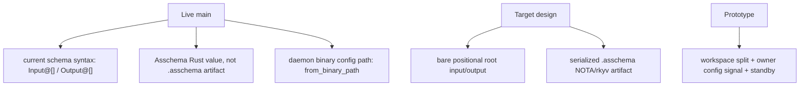

# 249 - Comparison: designer 433 vs operator 248

Kind: comparison / audit

Topics: schema, nota, asschema, spirit, reports

Date: 2026-05-30

Compared:

- `reports/designer/433-whole-stack-comprehensive-every-part-with-code.md`
- `reports/operator/248-schema-nota-spirit-whole-stack-tour.md`

## Verdict

Designer 433 is the better teaching document. It shows more syntax, more
feature-surface context, the production Spirit intent loop, Nix feature
isolation, and the slice-2 prototype.

Operator 248 is the safer implementation-state document. It is stricter about
what is actually on main and calls out the most important live gap: `Asschema`
exists as typed Rust data, but not yet as a checked-in `.asschema` NOTA/rkyv
artifact.

The merged target should be: designer 433's breadth, with operator 248's
current-main discipline. Every section should say whether it is live, target,
or prototype.

## Shared Claims That Match

Both reports agree on the main architecture:

- `.schema` is legal NOTA text.
- `nota-next` parses delimiter blocks.
- `schema-next` lowers to `Asschema`.
- `schema-rust-next` emits Rust.
- The emitted Rust has unconditional rkyv and optional NOTA text.
- The CLI owns the NOTA surface.
- The daemon owns binary rkyv frames and `.sema` database work.
- Signal / Nexus / Sema are the three runtime centers.
- The schema-emitted root types own route headers and signal-frame methods.
- The tests prove more than parser-only behavior: generated Rust, process
  boundaries, binary rejection, and Nix-built binaries are all represented.

## What Designer 433 Does Better

### Breadth

Designer 433 covers several areas that operator 248 only touches or omits:

- `NotaSurface::{Disabled, FeatureGated, AlwaysEnabled}` as an explicit API.
- The `Cargo.toml` shape with `required-features = ["nota-text"]` on the CLI
  and no required feature on the daemon.
- The Nix dual-derivation split: daemon builds with `--no-default-features`,
  CLI builds with `--features nota-text`.
- Production `spirit` CLI operations: `Record`, `Observe`, and `Remove`.
- The slice-2 prototype branch:
  `~/wt/github.com/LiGoldragon/spirit-next/daemon-zero-nota-2026-05-30`.
- The long end-to-end trace from text input to rkyv frame to daemon reply.

### Syntax Coverage

Designer 433 gives a fuller schema syntax surface:

```text
Name@{ ... }       struct
Name@{ Type }      newtype
Name@Type          newtype short form
Name@[ ... ]       enum
Name@(Vec X)       named composite alias
@Type              derive field or data-variant name
field@(Optional X) explicit field name over composite
```

Operator 248 includes the same basic syntax but does not explain the
`NotaSurface` and Nix surfaces as clearly.

### Slice Separation

Designer 433 does a useful job naming slice 2 as designed/prototyped but not
yet on main. Operator 248 only lists the same area as a gap. Both are true, but
433 gives the user more shape for what the prototype contains.

## What Operator 248 Does Better

### Current-main Discipline

Operator 248 is more careful to say that the `.asschema` artifact is not live:

```text
.schema -> nota-next Block tree -> schema-next Asschema Rust value
        -> schema-rust-next generated Rust -> daemon / CLI
```

That is the actual build path. There is no checked-in `spirit.asschema` file in
the running stack yet.

### Actual Code Names

Operator 248 uses the current `spirit-next` names:

```rust
Configuration::from_binary_path(self.single_argument()?)?;
```

Designer 433 still shows stale names:

```rust
Configuration::from_single_argument(...)
Configuration::from_binary_file(...)
```

Those were renamed on main. The designer report should update them to
`from_binary_path`.

### Actual Frame Methods

Operator 248 quotes the current generated signal-frame methods more faithfully.
The live `Input::decode_signal_frame` returns both the route and the value:

```rust
pub fn decode_signal_frame(frame: &[u8]) -> Result<(InputRoute, Self), SignalFrameError>
```

It also validates that the decoded value's expected header matches the frame
header. Designer 433's frame code is simplified enough that it reads like a
different API:

```rust
pub fn decode_signal_frame(frame: &[u8]) -> Result<Self, SignalDecodeError>
```

That should be marked as a sketch or replaced with the live method shape.

## Corrections Needed In Designer 433

### 1. `spirit.asschema` Is Presented As Live

The diagram says:

```text
schema-next: read + lower -> spirit.asschema (macro-free assembled data)
```

This is target language, not current main. Current main lowers to an in-memory
`Asschema` Rust value and immediately emits Rust from that value. There is no
checked-in `spirit.asschema` artifact in the build path.

Suggested wording:

```text
schema-next: read + lower -> Asschema Rust value
future artifact -> spirit.asschema (macro-free NOTA/rkyv data)
```

### 2. Root Syntax Is Shown As Target While Labeled Current

Designer 433 says the root struct fields are bare positional values:

```schema
{}
[ Record@Entry  Observe@Query ]
[ Recorded@Receipt  Observed@RecordSet ]
{ ... }
```

But current `spirit-next/schema/lib.schema` uses named root declarations:

```schema
{}
Input@[Record@Entry Observe@Query Remove@RecordIdentifier]
Output@[RecordAccepted@SemaReceipt RecordsObserved@ObservedRecords RecordRemoved@RemoveReceipt Error@ErrorReport Rejected@SignalRejection]
{ ... }
```

The bare-root syntax may be the target after the latest design clarification,
but it is not the live main syntax. Designer 433 should label this as target,
or it should show the live syntax first and the target syntax second.

### 3. `Asschema` Codec Derives Are Claimed Too Strongly

Designer 433 says the shared codec is used by "the assembled-schema's own
`Asschema` type." Current `schema-next/src/asschema.rs` does not derive
`NotaDecode`, `NotaEncode`, or rkyv traits on `Asschema`.

Live state:

```rust
pub struct Asschema {
    identity: SchemaIdentity,
    imports: Vec<ImportDeclaration>,
    resolved_imports: Vec<ResolvedImport>,
    roots: Vec<RootDeclaration>,
    namespace: Vec<Declaration>,
}
```

Target state: `Asschema` should become serializable/archivable data. That is
not complete.

### 4. `Declaration` / `TypeValue` Sketch Does Not Match Current Code

Designer 433 sketches:

```rust
pub enum Declaration { Public(Name, TypeValue), Private(Name, TypeValue) }
pub enum TypeValue { Newtype(TypeReference), Struct(StructFieldMap), Enum(Vec<Variant>) }
```

Current code is:

```rust
pub struct Declaration {
    visibility: Visibility,
    name: Name,
    value: TypeDeclaration,
}

pub enum TypeDeclaration {
    Struct(StructDeclaration),
    Enum(EnumDeclaration),
    Newtype(NewtypeDeclaration),
}
```

The designer version is a good canonical NOTA shape for the future, but the
report labels it too much like current code.

### 5. `NotaTransparent` Is Not In The Live `nota-next` API

Designer 433 names `NotaTransparent`. Live `nota-next` exports
`NotaDecode` and `NotaEncode`; its derive macro handles one-field tuple
newtypes directly. There is no `NotaTransparent` derive in the current
`nota-next` source.

If `NotaTransparent` is still wanted, it should be marked as target. If not,
the report should describe the live behavior:

```rust
#[derive(NotaDecode, NotaEncode)]
pub struct Topic(pub String);
```

### 6. The Step-9 `spirit-next` Invocation Uses Production `spirit` Syntax

Designer 433 traces:

```sh
spirit-next "(Observe (Records ((Partial [schema]) None Any SummaryOnly)))"
```

That looks like production `spirit` query syntax, not the current
`spirit-next` schema. Current `spirit-next` process tests use:

```sh
spirit-next "(Observe ((Full [[schema]]) (Some Constraint)))"
```

The designer report should either change that command to the current
`spirit-next` syntax or explicitly say the example is production `spirit`, not
`spirit-next`.

### 7. Some Code Snippets Are Conceptual But Not Marked That Way

Designer 433 mixes live excerpts with conceptual sketches. That is fine for a
designer report, but the section title says "as it runs today." The report
should mark each non-live snippet as:

- live code,
- simplified sketch,
- target model,
- prototype branch.

## Corrections Needed In Operator 248

Operator 248 is not wrong in the same way, but it is incomplete:

- It should pull in designer 433's explicit `NotaSurface` API section.
- It should include the `Cargo.toml` and `flake.nix` feature isolation
  snippets.
- It should show the production `spirit` intent-loop CLI separately from
  `spirit-next`, because the user asked for every part of the system.
- It should name the slice-2 prototype path and summarize what it proves.
- It should state the target bare-root syntax next to the current live
  `Input@[...]` / `Output@[...]` syntax.

The operator report is therefore good as a "truth on main" document, but not
complete as the single whole-stack presentation.

## Recommended Merge Shape

Use designer 433 as the base, then patch it with operator 248's current-main
corrections:



The final canonical walkthrough should have three labels everywhere:

- **Live**: checked on main and tested.
- **Target**: intended syntax/model not yet implemented.
- **Prototype**: implemented in a worktree branch but not integrated.

That would prevent the recurring confusion where a design sentence reads like
an implementation claim.

## Bottom Line

Designer 433 is the richer report. Operator 248 is the more accurate report
for main. The correct next report is a fused version:

```text
designer 433 breadth + operator 248 live-state guardrails
```

The single most important correction is to stop presenting `spirit.asschema`
and bare positional root syntax as live. They are the target direction. Current
main still uses `Input@[...]` / `Output@[...]` and an in-memory `Asschema` Rust
value.
