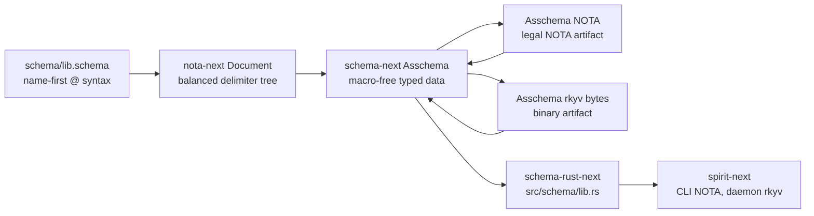

# Asschema Live Artifact Implementation

## Frame

Psyche intent this pass:

- Assembled schema must be real data, not parser side-effect.
- Schema sugar lowers into assembled schema first.
- Rust emission must consume assembled schema.
- Binary rkyv support is universal; NOTA is an opt-in text-client surface.
- Daemons should not accept or link NOTA unless they are explicitly a text-facing adapter.

Captured Spirit records:

- 1243 — assembled schema must be readable/writable as NOTA data and rkyv data.
- 1244 — generated component types need rkyv universally; NOTA encode/decode is opt-in.
- 1245 — schema language lowers into assembled schema, then assembled schema creates Rust.

## What Changed

`nota-next` commit `7661e7a2`:

```rust
impl<Inner> NotaDecode for Box<Inner>
where
    Inner: NotaDecode,
{
    fn from_nota_block(block: &Block) -> Result<Self, NotaDecodeError> {
        Inner::from_nota_block(block).map(Box::new)
    }
}

impl<Inner> NotaEncode for Box<Inner>
where
    Inner: NotaEncode,
{
    fn to_nota(&self) -> String {
        Inner::to_nota(self)
    }
}
```

`Box<T>` is storage indirection, not a NOTA shape. This lets recursive assembled-schema objects use boxes without adding syntax noise.

`schema-next` commit `665cbff8`:

```rust
impl Asschema {
    pub fn from_nota_source(source: &str) -> Result<Self, SchemaError> {
        NotaSource::new(source).parse::<Self>().map_err(SchemaError::from)
    }

    pub fn to_nota(&self) -> String {
        NotaEncode::to_nota(self)
    }

    pub fn from_binary_bytes(bytes: &[u8]) -> Result<Self, SchemaError> {
        rkyv::from_bytes::<Self, rkyv::rancor::Error>(bytes)
            .map_err(|_| SchemaError::ArchiveDecode)
    }

    pub fn to_binary_bytes(&self) -> Result<Vec<u8>, SchemaError> {
        rkyv::to_bytes::<rkyv::rancor::Error>(self)
            .map(|bytes| bytes.to_vec())
            .map_err(|_| SchemaError::ArchiveEncode)
    }
}
```

Most asschema nouns now derive `nota_next::NotaDecode`, `nota_next::NotaEncode`, and rkyv traits. Two shapes have explicit object-owned codec logic:

- `TypeReference`, because `Map(key, value)` is a two-field variant and recursive references need `#[rkyv(omit_bounds)]`.
- `StructFieldMap`, because a struct definition is semantically an ordered brace key/value map: field name -> type reference.

The load-bearing proof is `schema-next/tests/asschema_definition.rs`:

```rust
let nota = asschema.to_nota();
Document::parse(&nota).expect("emitted asschema is legal NOTA");
let from_nota = Asschema::from_nota_source(&nota).expect("asschema decodes");
assert_eq!(from_nota, asschema);

let bytes = asschema.to_binary_bytes().expect("asschema encodes");
let from_binary = Asschema::from_binary_bytes(&bytes).expect("asschema decodes");
assert_eq!(from_binary, asschema);
```

`schema-rust-next` commit `e08e78b7`:

```rust
fn generate_rust_after_asschema_roundtrip(&self) -> String {
    let (asschema, _) = self.lower();
    let nota = asschema.to_nota();
    let from_nota = Asschema::from_nota_source(&nota).expect("asschema NOTA artifact reads back");
    let bytes = from_nota.to_binary_bytes().expect("asschema rkyv artifact writes");
    let from_binary = Asschema::from_binary_bytes(&bytes).expect("asschema rkyv artifact reads back");
    RustEmitter::default().emit(&from_binary).as_str().to_owned()
}
```

The emitter still accepts `&Asschema`, but the test now proves the emitted Rust is stable after an actual asschema NOTA artifact and rkyv artifact round-trip.

`spirit-next` commit `46569aab`:

```rust
let asschema = SchemaEngine::default()
    .lower_source(source.source(), source.identity().clone())
    .expect("lower spirit-next schema");
let asschema = AsschemaArtifact::new(asschema).read_back();
RustEmitter::new(RustEmissionOptions::feature_gated_nota("nota-text")).emit_file(&asschema)
```

`build.rs` now lowers `schema/lib.schema`, writes the assembled schema to NOTA, reads it back, writes rkyv bytes, reads those back, and only then emits the checked-in `src/schema/lib.rs`.

## Shape



## Verification

Passed:

- `nota-next`: `cargo fmt && cargo test`
- `schema-next`: `cargo test`
- `schema-rust-next`: `cargo fmt && cargo test`
- `spirit-next`: `cargo fmt && cargo test`
- `spirit-next`: `cargo test --no-default-features`
- `spirit-next`: `nix flake check`

The first `nix flake check` failed correctly because `flake.lock` still pinned the older schema stack. Updating `nota-next-source`, `schema-next-source`, and `schema-rust-next-source` fixed the Nix vendor path; the second run passed all checks.

## Remaining Gaps

The macro table itself is still the next frontier. `SchemaNode` is NOTA-derived data now, but the built-in macro registry is still loaded through the current declarative reader rather than from a fully typed, pre-assembled macro table.

The emitter still renders strings directly. This pass proves the emitter input is live `Asschema`; the later cleanup is to model the output as a `RustModule` data object before rendering source text.

Mail support nouns are still emitted by the support surface rather than imported from a shared schema-core crate.

Schema diff/upgrade remains future work.
