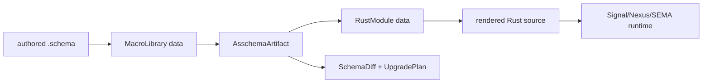

# 253 — Schema Gap Closure Vision

*Kind: design-implementation vision · Topics: schema, asschema, macros, emission, core, upgrade · 2026-05-30 · operator lane*

## Frame

The immediate artifact gap is closed:

```text
.schema
  -> AsschemaArtifact
  -> .asschema / .asschema.rkyv file
  -> RustEmitter reads artifact path
  -> checked-in src/schema/lib.rs
```

The remaining gaps are not small polish items. They are the next structural
layer: make macros data, make Rust emission data, make shared support nouns
real imports, and make schema change a typed upgrade path.

My vision is that each remaining gap should close the same way the artifact
gap closed: introduce the missing noun, serialize it, make the downstream step
consume that noun, and add a test that fails if a private side channel sneaks
back in.



## Gap 1 — Macro Table As Data

Current state: `schema-next` lowers the current authoring syntax into
`Asschema`, but the structural macro knowledge still lives in Rust lowering
logic. That is bootstrap-acceptable; it is not the final data model.

Target state: a macro is a typed data object. The engine loads a
`MacroLibrary` artifact, then applies those macro definitions to raw NOTA
blocks to produce `Asschema` fragments.

The missing noun:

```rust
pub struct MacroLibrary {
    pub identity: SchemaIdentity,
    pub imports: Vec<ImportDeclaration>,
    pub macros: Vec<MacroDefinition>,
}

pub struct MacroDefinition {
    pub name: Name,
    pub position: MacroPosition,
    pub pattern: MacroPattern,
    pub expansion: MacroExpansion,
}
```

The important point: `MacroPattern` and `MacroExpansion` must not be strings.
They are enums with data-carrying variants:

```rust
pub enum MacroPattern {
    NameAtBrace,
    NameAtBracket,
    AtType,
    FieldAtType,
    FieldAtComposite,
    CompositeReference,
}

pub enum MacroExpansion {
    PublicDeclaration,
    PrivateDeclaration,
    StructField,
    EnumVariant,
    TypeReference,
}
```

That is not the final full macro language; it is the first honest substrate.
The current built-ins become data first, then later user-declared macros can
grow by adding richer pattern and expansion variants.

The first implementation target should be:

```text
schema/core-macros.schema
  -> MacroLibrary AsschemaArtifact
  -> MacroRegistry::from_library(...)
  -> SchemaEngine lowers existing fixtures identically
```

Acceptance tests:

- A real `schema/core-macros.schema` file lowers into a `MacroLibrary`.
- The `MacroLibrary` writes and reads `.asschema` and `.asschema.rkyv`.
- `SchemaEngine::with_macro_library(library)` lowers `spirit-next/schema/lib.schema`
  to byte-identical `Asschema`.
- A guard rejects a macro whose expansion is a raw string template.

This closes the "black box macro" risk. The engine can still have a tiny
bootstrap reader for the first macro-library shape, but the active macro table
must be data once loaded.

## Gap 2 — RustModule Data Model

Current state: `schema-rust-next` mostly emits Rust by pushing strings through
`RustWriter`. It is tested and useful, but the emitter itself has not learned
the "everything is data" lesson yet.

Target state: emission has two phases:

```text
AsschemaArtifact -> RustModule -> RustRenderer -> RustCode
```

The missing noun:

```rust
pub struct RustModule {
    pub path: RustModulePath,
    pub items: Vec<RustItem>,
}

pub enum RustItem {
    TypeAlias(RustTypeAlias),
    Struct(RustStruct),
    Enum(RustEnum),
    Trait(RustTrait),
    Implementation(RustImplementation),
    Module(RustSubmodule),
}
```

`RustRenderer` is the only place that turns module data into text. The mapping
from schema to Rust becomes testable before rendering:

```rust
let artifact = AsschemaArtifact::read_nota_file(path)?;
let module = RustEmitter::default().emit_module_from_artifact(&artifact)?;
assert!(module.has_enum("Input"));
assert!(module.has_trait("SemaEngine"));
let code = RustRenderer::default().render(&module);
```

The key engineering win is not aesthetics. It lets us assert that the module
contains the right objects without brittle `generated.contains("...")`
string tests. It also gives later content-addressed crate emission a clean
input: hash the `RustModule` data, then render/build it.

Acceptance tests:

- Existing snapshot tests still compare final Rust text.
- New structural tests assert on `RustModule` items: roots, support traits,
  plane namespaces, scalar aliases, visibility boundaries.
- The rendered output from `RustModule` remains byte-identical to current
  checked-in fixtures.
- No emitter test asserts on internal trace strings or raw writer call counts.

Implementation order:

1. Introduce `RustModule` alongside the existing renderer.
2. Make `RustEmitter::emit_module(&AsschemaArtifact)` populate just type
   aliases, structs, enums, and roots.
3. Render `RustModule` through the current text shape.
4. Move support traits, mail objects, and plane modules into `RustModule`.
5. Delete direct public access to the old writer once coverage matches.

## Gap 3 — Shared Schema-Core Support Nouns

Current state: mail support, plane envelopes, message identifiers, origin
routes, `MessageSent`, `MessageProcessed`, and engine traits are emitted
locally into each consumer. That got `spirit-next` running, but it makes every
component pretend it owns universal support nouns.

Target state: schema-core is a real schema library. Components import support
nouns from it instead of re-emitting local copies.

```text
schema-core/schema/lib.schema
  exports:
    MessageIdentifier
    OriginRoute
    MessageSent
    MessageProcessed
    Signal
    Nexus
    Sema
    Plane
    UpgradeFrom
    AcceptPrevious

spirit-next/schema/lib.schema
  imports schema-core:mail:OriginRoute
  imports schema-core:plane:Signal
  declares Entry, Query, RecordSet, ...
```

The emitted Rust should then read like ownership:

```rust
pub use schema_core::schema::mail::OriginRoute;
pub use schema_core::schema::mail::MessageIdentifier;

pub enum Input {
    Record(Entry),
    Observe(Query),
}
```

The support nouns are universal; the component nouns remain local.

Acceptance tests:

- A `schema-core` fixture emits support Rust once.
- `spirit-next` imports `OriginRoute` and `MessageIdentifier` as aliases, not
  local declarations.
- Existing runtime triad tests still pass with imported support nouns.
- A Nix guard fails if `spirit-next/src/schema/lib.rs` contains a local
  `pub struct OriginRoute` once schema-core is active.

Implementation order:

1. Create or designate `schema-core-next` as the support schema crate.
2. Move the support nouns into `schema-core-next/schema/lib.schema`.
3. Teach cross-crate import resolution to support these imports in the
   generator path, not just tests.
4. Flip `spirit-next/schema/lib.schema` to import support nouns.
5. Keep generated aliases in source-visible Rust so the boundary is obvious.

## Gap 4 — Schema Diff And Upgrade

Current state: generated code emits placeholder upgrade trait surfaces, but
there is no real schema-diff artifact and no versioned upgrade proof.

Target state: schema change produces a typed diff, and that diff decides which
upgrade traits appear.

```text
old .asschema.rkyv
new .asschema.rkyv
  -> SchemaDiff
  -> UpgradePlan
  -> generated Rust traits for changed nouns only
```

The missing nouns:

```rust
pub struct SchemaDiff {
    pub from: SchemaIdentity,
    pub to: SchemaIdentity,
    pub changes: Vec<TypeChange>,
}

pub enum TypeChange {
    Added { name: Name },
    Removed { name: Name },
    FieldAdded { type_name: Name, field: FieldDeclaration },
    FieldRemoved { type_name: Name, field: Name },
    VariantAdded { type_name: Name, variant: EnumVariant },
    VariantRemoved { type_name: Name, variant: Name },
    ReferenceChanged { type_name: Name, path: TypePath, from: TypeReference, to: TypeReference },
}

pub struct UpgradePlan {
    pub required: Vec<UpgradeRequirement>,
}
```

Generated Rust should not emit upgrade hooks everywhere. It should emit them
where the diff says the type changed:

```rust
pub trait UpgradeFromPreviousEntry {
    fn upgrade(previous: previous::Entry) -> Result<Entry, UpgradeError>;
}
```

Acceptance tests:

- Two real `.asschema` fixture versions produce a `SchemaDiff`.
- Adding a field emits an upgrade requirement for the changed struct only.
- Adding an enum variant does not force upgrades on unrelated structs.
- Loading old rkyv data in a test calls the generated upgrade path before
  acceptance.
- An unchanged schema emits no upgrade trait churn.

Implementation order:

1. Build `schema-diff-next` or a `schema_next::diff` module around two
   `AsschemaArtifact` values.
2. Emit a small `UpgradePlan` data artifact.
3. Teach `schema-rust-next` to accept an optional plan.
4. Add a `spirit-next` fixture pair: `lib-0.1.0.asschema` and
   `lib-0.2.0.asschema`.
5. Add one runtime acceptance test for old data.

## Gap 5 — Checked-In Asschema Artifacts

The current `spirit-next` build writes `lib.asschema` and
`lib.asschema.rkyv` into Cargo `OUT_DIR`. That is enough to prove the emitter
reads serialized files, but it is not the most inspectable long-term surface.

My preferred next step is to check in the text artifact:

```text
schema/lib.schema       authored sugar
schema/lib.asschema     assembled NOTA artifact
src/schema/lib.rs       emitted Rust
```

The binary `.asschema.rkyv` can remain generated unless we decide that stable
binary artifacts should be versioned too. Text is the review surface; binary
is the runtime/cache surface.

Acceptance test:

```text
build.rs:
  lower schema/lib.schema
  write expected asschema into OUT_DIR
  compare with checked-in schema/lib.asschema
  emit Rust from checked-in schema/lib.asschema
  compare with checked-in src/schema/lib.rs
```

That would make every stage visible in the repo:

```text
authored schema -> assembled schema -> Rust source -> runtime tests
```

I did not force that in the closure pass because build scripts must not rewrite
the source tree, and checking in the artifact needs a regeneration command or
script. The right implementation is a small crate-local tool or script:

```text
spirit-next "(RegenerateSchemaArtifacts)"
```

or, during bootstrap, a script that writes only the schema artifacts and source
then lets `build.rs` enforce freshness.

## Priority

The order I would implement is:

1. Checked-in `.asschema` text artifact for `spirit-next`, because it makes
   the current system visible immediately.
2. `RustModule` data model, because it removes string-emitter brittleness and
   makes future codegen changes safer.
3. Macro-table-as-data, because it is conceptually deepest and needs the
   artifact discipline already in place.
4. Schema-core support nouns, because it will simplify every component after
   the import path is stable.
5. Schema diff/upgrade, because it depends on stable artifact comparison and
   should be built against real versioned artifacts, not an in-memory mock.

The invariant across all five: no hidden magic, no side-channel traces as
proof, no local mirrors of schema nouns. Each step creates data, serializes
data, consumes data, and tests the actual path.

