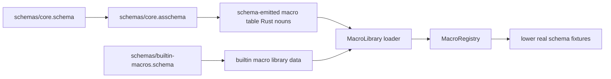

# 255 — Schema Next Move After The Leans

*Kind: implementation vision · Topics: schema, asschema, macro-table, schema-core, upgrade · 2026-05-30 · operator lane*

## Current Ground

The first lean pass landed the right pressure points:

- `spirit-next` now checks in `schema/lib.asschema`, compares it against fresh lowering, and emits Rust from the assembled artifact path.
- `schema-rust-next` now builds a `RustModule` data model before rendering Rust source.
- `schema-next` now has `MacroLibraryData` as real typed data, and that macro data now archives directly through rkyv instead of archiving a NOTA source string.

So the stack has crossed an important line: the major stages now have named nouns. The missing work is not "make something work" in the shallow sense. It is making every noun come from the layer that claims to define it.

## What Is Still Missing

### 1. Macro Table Is Typed Data, But Not Schema-Emitted Data

Current state:

```text
schemas/builtin-macros.schema
  -> DeclarativeMacroLibrary parser
  -> hand-written MacroLibraryData
  -> rkyv / NOTA round trip
  -> executable macro registry
```

This is much better than a black-box Rust macro table, but it still has one hand-written mirror: the `MacroLibraryData` noun itself. The schema system should define that noun, emit the Rust type for it, and then load macro libraries through that emitted type.

Target:

```text
schemas/core.schema
  -> core.asschema
  -> schema-rust-next emits MacroLibrary / MacroDefinition / MacroPattern / MacroTemplate
  -> builtin-macros.asschema is read through those emitted types
  -> MacroRegistry is built from emitted macro-table data
```

The bootstrap reader can remain tiny and explicit. The active macro table after bootstrap should be data loaded through schema-emitted nouns.

### 2. RustModule Exists, But It Is Not Yet The Whole Emitter

Current state: `RustModule` exists and tests assert on module data, but the renderer/emitter still has support code and emitted behavior surfaces that are partly shaped by Rust rendering logic.

Target: every emitted Rust item is data before text:

```text
Asschema
  -> RustModule {
       imports,
       scalar aliases,
       declarations,
       root enums,
       traits,
       impls,
       support uses,
     }
  -> RustRenderer
  -> .rs
```

The renderer may stay string-producing. That is its job. The missing part is making the emitter's decisions visible as `RustItem`-style data, especially traits, impls, plane envelopes, and support imports.

### 3. Schema-Core Support Nouns Are Still Local Copies

Current state: `spirit-next` still gets local emitted copies of universal nouns such as `OriginRoute`, `MessageIdentifier`, plane envelopes, mail events, frame errors, and schema plane traits.

Target: a support crate or support schema package owns those nouns once.

```text
schema-core/schema/lib.schema
  -> schema-core/schema/lib.asschema
  -> schema-core/src/schema/lib.rs

spirit-next/schema/lib.schema
  imports schema-core:mail:OriginRoute
  imports schema-core:mail:MessageIdentifier
  imports schema-core:plane:Signal
```

Then `spirit-next` emits component nouns, not universal support nouns.

### 4. SchemaDiff And UpgradePlan Are Still Future

Current state: the system can compare generated artifacts for freshness, but it cannot semantically compare one assembled schema against another and produce an upgrade obligation.

Target:

```text
old .asschema.rkyv
new .asschema.rkyv
  -> SchemaDiff
  -> UpgradePlan
  -> generated upgrade trait obligations
```

The diff must use path-shaped changes, not only flat field changes:

```rust
pub struct ReferenceChanged {
    pub type_name: Name,
    pub path: TypePath,
    pub from: TypeReference,
    pub to: TypeReference,
}
```

That handles nested changes such as `Vector<Old>` becoming `Vector<New>` under a field inside another type.

### 5. The First Self-Hosting Loop Is Not Closed

Current state: the pipeline can lower schema to asschema, write asschema, emit Rust, and run Spirit. It does not yet use schema-emitted schema-core nouns to define the schema framework itself.

Target:

```text
core schema authored form
  -> core asschema
  -> emitted core Rust nouns
  -> macro table loaded through emitted nouns
  -> schema files lowered by those macros
```

That is the first real loop closure. It does not mean removing bootstrap code entirely. It means the bootstrap code becomes visibly narrow and the normal path is data.

## My Next Move

The next move should be **Core Macro Library Self-Hosting**, not schema-core and not schema diff.

Reason: it closes the remaining "magic" nearest the bottom of the stack. If we extract schema-core first, we will still be extracting duplicated support nouns with a macro engine whose own table is only half data. If we build diff first, we will diff artifacts produced by a system whose macro table still has a hand-written noun at the center.

The right slice is small and testable:



## Implementation Shape

Step 1: define the macro table shape as schema, not just Rust.

The macro table schema should define nouns like:

```text
MacroLibrary
MacroDefinition
MacroPosition
MacroPattern
MacroPatternObject
MacroTemplate
MacroTemplateObject
MacroDelimiter
```

The authored schema can be simple at first. It should not try to express every future macro language feature. It only needs enough to define the current typed data substrate.

Step 2: lower that schema into checked-in `.asschema`.

Add a fixture or real artifact:

```text
schema-next/schemas/core.asschema
```

That file becomes reviewable. If it drifts from `schemas/core.schema`, tests fail.

Step 3: emit Rust for the macro table nouns.

Use `schema-rust-next` to emit a module for the macro-table types. Initially this can live beside the current hand-written `MacroLibraryData` so the migration is reversible and easy to review.

Step 4: replace hand-written `MacroLibraryData` with the schema-emitted noun.

The executable wrapper stays hand-written:

```text
MacroLibraryData  ->  DeclarativeMacroLibrary  ->  MacroRegistry
```

But `MacroLibraryData` itself comes from emitted code.

Step 5: prove it with real fixtures.

Tests should use real files only:

```text
schemas/core.schema
schemas/core.asschema
schemas/builtin-macros.schema
tests/fixtures/macro-library/*.schema
```

The proof should be:

```text
core.schema lowers to core.asschema
core.asschema emits macro-table Rust nouns
builtin macro source reads through emitted nouns
registry built from emitted macro data lowers spirit schema identically
```

## Acceptance Tests

The slice is done when these are true:

- `schemas/core.asschema` is checked in and freshness-checked.
- The macro table Rust noun is emitted from asschema, not hand-written.
- `MacroLibraryData::to_binary_bytes` and `from_binary_bytes` still round-trip direct rkyv bytes.
- `DeclarativeMacroLibrary::builtin()` can be rebuilt from serialized macro data.
- Existing `spirit-next/schema/lib.schema` lowers to the same `schema/lib.asschema`.
- A guard fails if macro definitions are asserted only through trace strings such as `macros_applied`.

## What Comes After

Once the macro-table noun is schema-emitted, the next two moves become much cleaner:

1. Extract `schema-core` support nouns. At that point, the macro system that defines the imports is itself schema-defined enough to trust as a substrate.
2. Build `SchemaDiff` and `UpgradePlan`. At that point, checked-in `.asschema` artifacts exist across the stack, so the diff has real files to compare.

My ordering:

```text
1. core macro table self-hosting
2. complete RustModule data for traits / impls / support imports
3. schema-core support noun extraction
4. SchemaDiff + UpgradePlan
5. first self-hosted schema-of-schema loop
```

The invariant I would keep applying is:

```text
No hidden magic.
No side-channel trace as proof.
No local mirror of a schema noun.
Each step creates data, serializes data, consumes data, and tests the actual path.
```

That invariant is the shape that prevents the stack from drifting back into private intermediates.
