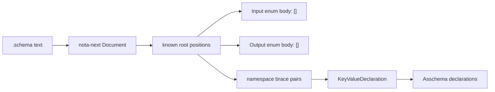

# 256 — Strict brace key/value schema implementation

*Kind: implementation report · Topics: schema, nota, strict-brace, root-position, key-value-namespace · 2026-05-30 · operator lane*

## What Changed

The implementation now treats the authored schema namespace as an honest NOTA
brace map: every namespace declaration is a key/value pair, and the root input
and output enum bodies are read from their known positions instead of being
named at the root.

Target shape now used by the core files:

```nota
[]
[]
{
  Topic String
  Topics (Vec Topic)
  Entry { Topics * kind Kind }
  Kind [Decision Correction]
}
```

Meaning:

- first `[]` is the known `Input` root enum body
- second `[]` is the known `Output` root enum body
- namespace braces are `TypeName Value` pairs
- struct braces are `fieldName TypeReference` pairs
- `Topics *` derives field name `topics` and type `Topics`
- square-bracket namespace values lower to enum declarations
- atom or parenthesized reference namespace values lower to newtypes

## Code Path



The load-bearing changes are in `schema-next`:

- `RootEnumMacro` now accepts bare square-bracket root bodies and names them
  from position (`Input` / `Output`).
- `RootNamespaceMacro` now recognizes true brace key/value declaration pairs.
- `KeyValueDeclarationMacro` lowers `Name Value` namespace entries:
  - brace value -> struct declaration
  - square-bracket value -> enum declaration
  - atom/parenthesized reference value -> newtype declaration
- `AssembledFields` supports `PascalCase *` as the derived-field shorthand and
  rejects ambiguous `PascalCase OtherType` in struct maps.
- `AssembledVariants` supports `Variant@ Payload` as a pair-preserving
  data-variant shape.

## Real Files Migrated

The main schema files now exercise the new surface directly:

```text
schemas/core.schema
schemas/root.schema
schemas/spirit-min.schema
```

Example from `schemas/core.schema`:

```nota
[]
[]
{
  SchemaMacro { MacroName * MacroPosition * MacroPattern * MacroTemplate * }
  MacroPattern MacroPatternObject
  MacroPatternObject [Capture@ MacroCaptureName RestCapture@ MacroCaptureName Atom@ MacroAtom Delimited@ MacroPatternDelimited]
}
```

This is intentionally not `SchemaMacro@{ ... }`; the namespace brace now has
the key `SchemaMacro` and the value `{ ... }`.

## Designer 437 Comparison

Designer report 437 suggested `(Derive)` as the value-side marker. I did not
make that the implemented default in this slice. The prompt specifically
pointed toward a small same-type value marker, so the implementation uses `*`:

```nota
Entry { Topics * Kind * description Description }
```

That keeps the brace pair rhythm while staying terse. `(Derive)` can still be
added later as a more verbose alias if the design moves that way.

## Compatibility Left

The engine still accepts older self-named `Name@{...}` / `Name@[...]` and pipe
forms in some fixture paths. They are now documented as compatibility syntax,
not target syntax. The production target is the strict key/value surface above.

The separate `SyntaxSchema` raw-layer tests still exercise the older `@`
surface because that layer is a raw-schema experiment and has not been fully
migrated in this slice.

## Verification

Passed in `repos/schema-next`:

```text
cargo test
cargo clippy --all-targets -- -D warnings
nix flake check
```

The Nix design guard was updated to track the renamed design example:
`design_example_namespace_brace_contains_key_value_declarations`.
