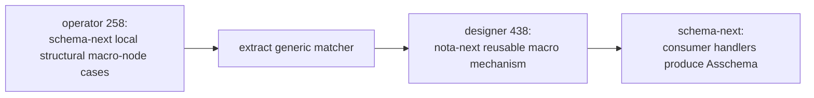

# 259 — Comparison: operator 258 and designer 438 macro nodes

*Kind: comparison report · Topics: schema, nota, macro-node, structural-matching, bootstrap, extraction · 2026-05-30 · operator lane*

## Verdict

Designer 438 is the better final architecture. Operator 258 is compatible
with it, but only if treated as a bootstrap slice, not as the resting place.

The split is:



Operator 258 made macro-node matching real enough to stop pretending. It
introduced data-bearing structural cases and better errors in `schema-next`.
Designer 438 names the correct destination: the matching mechanism belongs in
`nota-next`, while `schema-next` registers schema vocabulary and lowers matches
to Asschema fragments.

So the operator-side answer is: keep 258, but treat it as the prototype adapter
for the NOTA-layer extraction.

## Where They Agree

Both reports now agree on the load-bearing idea: a macro is not black-box Rust
magic. It is data describing a structural match.

The shared points:

- A strict brace entry stays a key/value pair at the NOTA level.
- The key/value pair can still be interpreted as one semantic macro-node object
  by the consuming layer.
- Structural cases must be explicit data, not scattered ad hoc parser checks.
- Bad input should report the expected structural cases, not fail with a vague
  parse error.
- Prefix-sigil arity-1 sugar such as `*Type` is not the current target;
  `Type *` keeps the strict two-object pair rhythm.

Operator 258 proves those points in the current `schema-next` implementation.
Designer 438 generalizes them into the reusable `nota-next` mechanism.

## What Operator 258 Implemented

Operator 258 added a schema-local macro-node model:

```text
MacroNodeDefinition
  MacroNodeCase
    MacroNodePairConstraint
      MacroNodeKeyConstraint
      MacroNodeValueConstraint
```

That model is currently used for namespace declarations:

```text
Name + brace          -> struct declaration
Name + square bracket -> enum declaration
Name + type reference -> newtype declaration
```

The strongest implementation choice in 258 is the error shape:

```text
UnsupportedMacroNodeStructure {
  position,
  expected: [
    "struct declaration: pair key=symbol value=brace",
    "enum declaration: pair key=symbol value=square bracket",
    "newtype declaration: pair key=symbol value=type reference",
  ],
  found,
}
```

That is more useful than a generic `NoMatch` because it gives both the parser
position and the expected structural cases. This should survive the extraction
into `nota-next`.

## What Designer 438 Adds

Designer 438 adds the missing generalization:

```text
nota-next
  MacroNodeData
  Pattern
  PositionPredicate
  MacroNodeRegistry
  Match { macro_name, captures }

schema-next
  schema vocabulary
  schema match handlers
  Asschema output
```

This matters because schema should not be the only thing that can use macro
nodes. Future config files, intent records, deploy manifests, and other
structured NOTA consumers should be able to attach a registry and read their
own macro vocabulary.

The most important difference from 258 is named capture output. Operator 258
currently asks whether a pair matches a known structural case. Designer 438
wants the matcher to return data like:

```text
Match {
  macro_name: Struct,
  captures: {
    type_name: Entry,
    body: { topics Topics  kind Kind }
  }
}
```

That is the right interface. It lets `nota-next` stay semantic-neutral while
`schema-next` owns the Asschema-specific lowering.

## Current Gaps

Gap 1: layer placement.

The matcher lives in `schema-next`; designer 438 wants the generic matcher in
`nota-next`. This is the main extraction.

Gap 2: no generic `Pattern`.

Operator 258 has specific constraints for pairs, blocks, keys, and values. The
designer target has a closed serializable pattern language:

```text
PatternElement =
  Atom(AtomShape)
  Delimited(DelimitedShape)
  Literal(String)
```

The current constraints map cleanly into that, but they are not yet the common
language.

Gap 3: no named captures.

Operator 258 answers "does this match?" but does not yet return named captures
from the structural pattern. That is the key interface needed before schema can
become a pure consumer.

Gap 4: no conflict detection.

The current bootstrap cases are small enough that conflicts are obvious by
inspection. A real registry needs construction-time conflict detection. Fatal
by default is the right policy, with an explicit priority override for known
ordered overlaps.

Gap 5: no macro table loaded from Asschema data.

Operator 258 still constructs macro-node definitions in Rust. That is
acceptable for the bootstrap floor, but the steady state has to load the macro
vocabulary from serialized macro-table data.

Gap 6: no formatter derivation.

Designer 438's formatter idea is downstream of the registry extraction. It is
not needed to validate the architecture, but it becomes possible once the
registry is the single source of truth for macro shape.

## Mapping 258 To 438

The extraction path is direct:

```text
operator 258                         designer 438
MacroNodeDefinition                  MacroNodeData
MacroNodeCase                        Pattern
MacroNodePairConstraint              Pattern { [key_element, value_element] }
MacroNodeKeyConstraint::Symbol       AtomShape { case/sigil/capture }
MacroNodeValueConstraint::Delimiter  DelimitedShape
MacroNodeValueConstraint::Reference  Delimited/Atom accepted by TypeReference handler
UnsupportedMacroNodeStructure        MacroError::NoMatch + expected cases
KeyValueDeclarationMacro             Schema handler for Match -> Asschema fragment
```

The important operator addition to carry forward is expected-case reporting.
Designer 438's proposed `MacroError::NoMatch` names position, tried macro
names, and actual shapes. That is necessary but not sufficient. The 258
diagnostic shows that the error should also include the expected pattern
descriptions for each candidate macro.

## Operator Answers To Designer 438 Open Questions

A. `Vec<PatternElement>` is not enough long term. It is enough for fixed
two-object entries, but real macro data wants an explicit sequence/rest capture
for variable bodies. Add a closed `Repeat` or `Rest` pattern element rather
than hiding rest capture inside `DelimitedShape::inner = None`.

B. Yes, include a parenthesis position in the first real version. I would name
the generic form `DelimitedEntry(Delimiter)` rather than add one enum variant
per delimiter forever. That covers brace entries, bracket entries, and
parenthesis macro/composite-call entries with one data shape.

C. Confirm no prefix-sigil arity-1 sugar for now. Keep `Type *` as the strict
brace pair form. If a formatter and macro registry later make a single-token
form beautiful, it can be added as an explicit macro pattern, not smuggled in as
a parser exception.

D. `NoMatch` needs richer expected-vs-actual detail than designer 438 sketched.
The operator implementation proves the useful shape: position, tried names,
actual block shapes, and expected structural descriptions per candidate.

E. Conflict detection should be fatal by default. A registry whose first-match
order changes semantics is too dangerous to accept silently. Known ordered
overlaps should require an explicit priority/override marker in the macro data.

## Next Move

The next implementation slice should not add more schema-only macro cases. It
should extract the mechanism.

Recommended order:

1. Add `nota-next::macros` with closed serializable pattern data, registry,
   named captures, and rich `NoMatch` diagnostics.
2. Re-express the current `schema-next` namespace cases as `nota-next`
   `MacroNodeData`.
3. Change `schema-next` lowering so it receives `Match { macro_name, captures }`
   and routes to schema handlers that produce Asschema fragments.
4. Keep the hard-coded schema bootstrap registry for `core.schema`, but make the
   hard-coded data use the same `MacroNodeData` type that loaded macro tables
   will use later.
5. Add conflict detection before loading any registry.
6. Only after that, load the schema macro table from checked-in `.asschema`
   data and derive formatting from the registry.

This order preserves the useful proof from 258 while moving the mechanism to
the layer designer 438 correctly names.

## Implementation Stance

Operator 258 is not a competing design. It is the schema-local proof that the
matcher noun exists and can drive real errors. Designer 438 is the architecture
that prevents that proof from fossilizing in the wrong crate.

The risk is stopping at 258. The correct move is to extract 258's generic pieces
into `nota-next`, keep schema-specific interpretation in `schema-next`, and make
the bootstrap registry use the same data form as the future loaded macro table.
