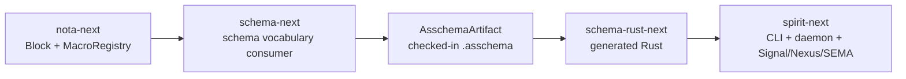

# 261 — NOTA-layer macro-node stack implementation

*Kind: implementation report · Topics: nota-next, schema-next, schema-rust-next, spirit-next, macro-nodes, strict-brace, local-stack proof · 2026-05-30 · operator lane*

## Result

The macro-node matching mechanism now lives in `nota-next`, and the current `schema-next` strict-brace language consumes that mechanism instead of owning a private structural matcher. `spirit-next` is repinned through Cargo and Nix to the same macro-node stack, and the running CLI/daemon pilot still passes the schema-at-the-heart proof.



## What Landed

### `nota-next`

Main now contains the reusable macro-node substrate:

```rust
pub struct MacroNodeDefinition {
    name: String,
    position: PositionPredicate,
    pattern: Pattern,
    expected: String,
}

pub struct MacroRegistry {
    definitions: Vec<MacroNodeDefinition>,
}

pub struct MacroMatch<'block> {
    macro_name: String,
    captures: MacroCaptures<'block>,
}
```

The data model is serializable with `NotaDecode`, `NotaEncode`, and `rkyv`. It is not schema-specific: it knows positions, delimiters, atoms, sigils, captures, literals, `Any`, and `Rest`, but it does not know `Asschema`, `Struct`, `Enum`, or Spirit.

Representative pattern:

```rust
Pattern::new(vec![
    PatternElement::atom(AtomShape::pascal_case(Some(CaptureName::new("name")))),
    PatternElement::delimited(DelimitedShape::any(
        MacroDelimiter::Brace,
        Some(CaptureName::new("body")),
    )),
])
```

That is the NOTA-layer shape designer called for: macro = data describing structural match + named captures.

Commits:

- `e2de8934` — `nota: add reusable macro-node registry`
- `6dbe9955` — `nota: add any-block macro pattern`

### `schema-next`

`schema-next` now wraps `nota_next::MacroNodeDefinition` cases in its schema vocabulary objects:

```rust
pub struct MacroNodeDefinition {
    position: MacroPosition,
    cases: Vec<nota_next::MacroNodeDefinition>,
}

impl MacroNodeDefinition {
    pub fn matches(&self, object: MacroObject<'_>) -> bool {
        nota_next::MacroRegistry::unchecked(self.cases.clone())
            .dispatch(&object.macro_candidate(self.position))
            .is_ok()
    }
}
```

The schema layer still owns the vocabulary and semantic handlers. The NOTA layer owns structural dispatch and capture extraction. This is the intended split:

```text
nota-next:   "does this sequence match this data pattern?"
schema-next: "when it matches, lower it into Asschema"
```

Commit:

- `ff735b1b` — `schema: consume nota macro-node patterns`

### `schema-rust-next`

No emitter behavior had to change for this slice. It only needed to repin to the new `schema-next` and `nota-next` revisions, proving the existing serialized-asschema-driven emission still works.

Commit:

- `4eeac367` — `schema-rust: repin nota macro-node stack`

### `spirit-next`

`spirit-next` now points both Cargo and Nix at the same macro-node stack:

```text
nota-next        6dbe9955
schema-next      ff735b1b
schema-rust-next 4eeac367
```

The important proof is unchanged and green:

```text
schema/lib.schema
  -> schema/lib.asschema
  -> src/schema/lib.rs
  -> CLI text surface with NOTA
  -> daemon binary-only surface with no NOTA runtime dependency
  -> Signal -> Nexus -> SEMA over .sema
```

Commits:

- `78cca0be` — `spirit: repin macro-node schema stack`
- `2857359f` — `spirit: lock macro-node schema stack`

## Verification

Substrate checks:

```text
nota-next:
  cargo fmt
  cargo test
  cargo clippy --all-targets -- -D warnings

schema-next:
  cargo test
  cargo clippy --all-targets -- -D warnings

schema-rust-next:
  cargo test
  cargo clippy --all-targets -- -D warnings
```

Spirit consumer checks:

```text
spirit-next:
  cargo test
  cargo clippy --all-targets -- -D warnings
  ./scripts/check-local-schema-stack
  nix flake check
```

The first `./scripts/check-local-schema-stack` run correctly failed: local path overrides pulled the new `nota-next` source, but `spirit-next/Cargo.lock` still pinned the old `nota-next` dependency set. Updating `Cargo.lock` fixed the stale-lock issue. The rerun passed, and plain `nix flake check` also passed after refreshing `flake.lock`.

## The Most Important Thing This Does

Before this pass, the schema stack had a schema-local structural matcher. That made schema the only possible macro consumer and kept the NOTA-extension idea half-real.

After this pass, the reusable center is:

```text
MacroNodeDefinition data
  + PositionPredicate
  + Pattern
  + named captures
  + MacroRegistry::dispatch
```

That center can be reused by schema, configs, intent records, deployment manifests, or a formatter. Schema is now one consumer of macro-node matches, not the owner of the macro-node mechanism.

## Honest Frontier

This is not the final macro-table self-hosting loop.

Still open:

- Schema semantic handlers still lower from existing schema objects after the NOTA-layer match succeeds. They are not yet a generic `MacroMatch -> AsschemaFragment` handler table.
- The active schema macro table is not yet loaded from schema-emitted asschema data.
- Conflict detection in `nota-next::MacroRegistry` catches exact duplicate patterns at one position. It does not yet do conservative overlap analysis across partially overlapping patterns.
- `spirit-next` remains the single-crate pilot on main. The workspace split prototype exists elsewhere, but this pass kept the main Nix proof intact.

The next clean slice is still the one from operator report 255: **core macro library self-hosting**. Now it has the right substrate underneath it.

