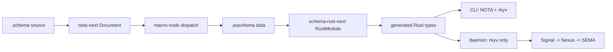
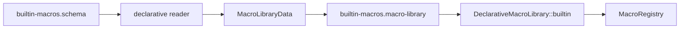
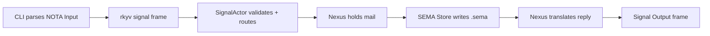

# 262 — Total architecture with core macro artifacts

*Kind: implementation report · Topics: schema-next, schema-rust-next, spirit-next, asschema-artifact, macro-library-artifact, bootstrap, layered-walkthrough · 2026-05-30 · operator lane*

Operator report for the next slice after `reports/operator/261-nota-layer-macro-node-stack-implementation.md`. The previous slice lifted the macro-node mechanism to the NOTA layer (Spirit record 1263, designer 438 §6 five critical decisions); this slice promotes the macro library itself to a checked-in data artifact, closing the artifact-discipline loop on the core macro table the same way report 252 closed it on assembled schema (Spirit record 1246).

## Slice Taken

The slice taken here is the core macro-library artifact step from `reports/operator/255-schema-next-move-after-leans.md`: make the macro table and core assembled schema visible, serialized data artifacts, then make the runtime path consume the macro artifact instead of keeping it as an invisible parser intermediate.

Landed in `schema-next`:

- `schemas/core.asschema` is checked in as the assembled form of `schemas/core.schema`.
- `schemas/builtin-macros.macro-library` is checked in as serialized `MacroLibraryData`.
- `DeclarativeMacroLibrary::builtin()` now loads from `builtin-macros.macro-library`.
- `schemas/builtin-macros.schema` remains the bootstrap authoring source and tests freshness-check it against the artifact.
- `MacroLibraryArtifact` owns `.macro-library` NOTA and `.macro-library.rkyv` file IO, mirroring `AsschemaArtifact`.
- `examples/emit_artifacts.rs` gives a deterministic developer tool to refresh both core artifacts.

Downstream:

- `schema-rust-next` is repinned to the new `schema-next`.
- `spirit-next` is repinned to the new `schema-next` and `schema-rust-next`.

Commits:

- `schema-next` `f2772ee` — `schema: load builtin macros from data artifacts`
- `schema-rust-next` `621492f` — `schema-rust: repin schema artifacts stack`
- `spirit-next` `595238c` — `spirit: repin schema artifact stack`
- `primary` `fa898a5d` — `operator: report total schema spirit architecture` (this report)

## One Picture



The invariant is: every important boundary creates data, serializes data, consumes data, and tests that real path. This is record 1109 (everything is data, macros included) realized one more layer deeper: the macro library that the runtime consumes is now itself a typed, serialized artifact, not an in-memory build product of the parser.

## Layer 1: NOTA

NOTA is the structure and codec layer. It does not own the Schema type vocabulary.

The raw meanings stay strict:

- `[]` is raw vector/bracket structure.
- `{}` is raw key/value map structure.
- `()` is raw record/struct structure read against an expected type.
- `[text]` and `[|text|]` are string forms. Schema symbols like `Entry` stay bare when they qualify as symbols.

The reusable NOTA macro-node mechanism lives in `nota-next` and is consumed by `schema-next` (Spirit record 1263; designer 438 §6 names the five critical decisions — layer placement, closed pattern enum, ordered dispatch, named captures, `Match` output — all of which this stack honors):

```rust
pub struct MacroNodeDefinition {
    name: String,
    position: PositionPredicate,
    pattern: Pattern,
    expected: String,
}
```

Schema-next consumes that NOTA-layer type by wrapping it in a schema-vocabulary outer record (lifted in `reports/operator/261-nota-layer-macro-node-stack-implementation.md` §schema-next):

```rust
// schema-next's outer wrapper around nota-next's type
pub struct MacroNodeDefinition {
    position: MacroPosition,
    cases: Vec<nota_next::MacroNodeDefinition>,
}
```

The split is structurally enforced: nota-next decides "does this block sequence match this data pattern?"; schema-next decides "when it matches, lower it into Asschema." Future consumers (configs, intent records, deploy manifests) register their own outer wrappers against the same nota-next mechanism.

## Layer 2: Authored Schema

A `.schema` file is legal NOTA first, then schema semantics are applied by position. The brace contract is strict (Spirit record 1259, landed in `reports/operator/256-strict-brace-key-value-schema-implementation.md`): every entry inside `{}` is exactly two objects — a key and a value, no single-token entries.

Current target syntax shape:

```schema
{}
[(Record Entry) (Observe Query) (Remove RecordIdentifier)]
[(RecordAccepted SemaReceipt) (RecordsObserved ObservedRecords) (Rejected SignalRejection)]
{
  Topic String
  Topics (Vec Topic)
  Entry { Topics * Kind * Description * Magnitude * }
  Query { TopicMatch * kind (Optional Kind) }
  Kind [Decision Principle Correction Clarification Constraint]
}
```

The root object is known before reading the file:

- optional position 0: imports map
- position 1: input root enum body
- position 2: output root enum body
- position 3: namespace map

Inside the namespace, braces are strict key/value maps:

```schema
Topic String
Topics (Vec Topic)
Entry { Topics * Kind * Description * Magnitude * }
Kind [Decision Principle Correction]
```

Those lower as:

- `Topic String` -> newtype
- `Topics (Vec Topic)` -> newtype around vector reference
- `Entry { ... }` -> struct declaration
- `Kind [ ... ]` -> enum declaration

`Topics *` in a struct body is the derived-field shorthand: the key is PascalCase, the value marker is `*` (the value-side marker chosen per Spirit record 1259 — strict pair rhythm, no prefix-sigil arity-1 sugar), and the lowered field is `topics: Topics`.

Compatibility for older pipe and self-named `@` syntax exists transitionally while fixtures and older reports migrate; the target authored structure is strict key/value.

## Layer 3: Assembled Schema

`Asschema` is the macro-free endpoint. It is not a witness string; it is a typed data object with NOTA and rkyv IO. The artifact discipline (assembled schema as a live serializable artifact, Spirit record 1246) was closed for the spirit example in report 252; this slice extends the same discipline to the core schema and the macro library, so every macro the runtime consumes is also a checked-in data file.

The Spirit example now has a checked-in `schema/lib.asschema`. The start of it is:

```nota
((spirit-next:lib [0.1.0]) [] []
 [((Input [(Record (Some (Plain Entry))) ...]))
  ((Output [(RecordAccepted (Some (Plain SemaReceipt))) ...]))]
 [(Public SourcePath (Newtype (SourcePath String))) ...])
```

The core schema now also has a checked-in artifact:

```nota
((schema-next:core [0.1.0]) [] []
 [((Input [])) ((Output []))]
 [(Public CoreSchema (Struct (CoreSchema {...}))) ...])
```

The canonical assembled declarations are data-carrying variants:

```nota
(Public Topic (Newtype (Topic String)))
(Public Entry (Struct (Entry {topics (Plain Topics) kind (Plain Kind)})))
(Public Kind (Enum (Kind [(Decision None) (Correction None)])))
```

Struct definitions use a brace map in assembled schema:

```nota
(Struct (Entry {topics (Plain Topics) kind (Plain Kind)}))
```

Newtypes are not fake one-field structs:

```nota
(Newtype (Topic String))
(Newtype (Topics (Vector (Plain Topic))))
```

## Artifact Code — Macro Library and Core Asschema

The runtime built-in macro path now consumes a data artifact:

```rust
impl DeclarativeMacroLibrary {
    pub fn builtin() -> Result<Self, SchemaError> {
        Ok(Self::from_data(
            MacroLibraryData::from_nota_source(include_str!(
                "../schemas/builtin-macros.macro-library"
            ))?,
        ))
    }
}
```

The source form is still present, but as freshness input:

```rust
pub fn builtin_source() -> Result<Self, SchemaError> {
    Self::from_source(include_str!("../schemas/builtin-macros.schema"))
}
```

The new artifact owner mirrors `AsschemaArtifact`:

```rust
pub struct MacroLibraryArtifact {
    data: MacroLibraryData,
}

impl MacroLibraryArtifact {
    pub fn read_nota_file(path: impl AsRef<Path>) -> Result<Self, SchemaError> { ... }
    pub fn write_binary_file(&self, path: impl AsRef<Path>) -> Result<(), SchemaError> { ... }
}
```

Freshness is tested against real checked-in files:

```rust
let source_data = DeclarativeMacroLibrary::builtin_source()?.to_data();
let checked_in = MacroLibraryArtifact::from_nota_source(include_str!(
    "../schemas/builtin-macros.macro-library"
))?;
assert_eq!(checked_in.data(), &source_data);
```

Core asschema is freshness-checked the same way:

```rust
let expected = SchemaEngine::default().lower_source(
    include_str!("../schemas/core.schema"),
    SchemaIdentity::new("schema-next:core", "0.1.0"),
)?;
let checked_in = AsschemaArtifact::from_nota_source(include_str!("../schemas/core.asschema"))?;
assert_eq!(checked_in.asschema(), &expected);
```

## Macro Bootstrap Now



The important change is the right half: `MacroRegistry` is fed from serialized data. The left half still exists as bootstrap authoring and artifact freshness checking.

The remaining loop closure is:


That is the next self-hosting step: replace the hand-written `MacroLibraryData` noun with the schema-emitted noun produced from `core.asschema`.

## Layer 4: Rust Emission

`schema-rust-next` consumes assembled schema and emits checked-in Rust. It already uses a RustModule data model before rendering text, and it can gate NOTA text support:

- rkyv is base and universal.
- NOTA encode/decode is optional for text clients.
- Daemon binaries compile without the NOTA dependency.

The `spirit-next` crate shape enforces that:

```toml
[[bin]]
name = "spirit-next"
required-features = ["nota-text"]

[[bin]]
name = "spirit-next-daemon"

[features]
default = []
nota-text = ["dep:nota-next"]
```

Generated `src/schema/lib.rs` owns the wire nouns and plane envelopes:

```rust
pub enum Plane<SignalRoot, NexusRoot, SemaRoot> {
    Signal(super::Signal<SignalRoot>),
    Nexus(super::Nexus<NexusRoot>),
    Sema(super::Sema<SemaRoot>),
}
```

Each envelope carries the origin route automatically:

```rust
pub struct Signal<Root> {
    pub origin_route: OriginRoute,
    pub root: Root,
}
```

## Layer 5: Spirit Runtime

The runtime is the three-engine chain over schema-generated objects:



The daemon does not parse NOTA. The CLI is the text/binary translator:

```rust
let source = self.read_single_argument(argument)?;
let input = source.parse::<Input>()?;
let (_route, output) = SignalTransport::connect(socket_path)?.exchange(&input)?;
```

The daemon starts from a binary configuration path:

```rust
let configuration = Configuration::from_binary_path(self.single_argument()?)?;
Daemon::new(configuration).run()?;
```

The central runtime method is object-to-object:

```rust
pub fn handle(&self, input: Input) -> signal_plane::Signal<Output> {
    let accepted = match self.signal_actor.accept(input) {
        Ok(accepted) => accepted,
        Err(rejected) => return rejected.into_signal_output(self.database_marker()),
    };
    accepted.process_with(&mut self.nexus.lock().expect("nexus lock"))
}
```

Signal accepts and stamps identity:

```rust
pub fn accept(&self, input: Input) -> Result<SignalAccepted, SignalRejected> {
    let identifier = self.issue_message_identifier();
    let origin_route = self.issue_origin_route();
    input.validate()?;
    Ok(SignalAccepted { sent: input.message_sent(identifier), input: input.with_origin_route(origin_route) })
}
```

Nexus holds mail across SEMA:

```rust
pub fn process<Payload>(&mut self, mail: NexusMail<Payload>) -> signal_plane::Signal<Output>
where
    Mail<BeingProcessed>: FromMail<Payload>,
{
    let in_flight = Mail::<BeingProcessed>::from_mail(mail);
    let processed = in_flight.run_sema(&mut self.store);
    processed.emit_processed(&mut self.mail_ledger.hook()).expect("infallible");
    processed.into_output()
}
```

SEMA means database work: `Store` writes to the `.sema` file and returns schema objects.

## Interesting Tests

The tests that matter now are not trace-string tests; they prove data paths.

Schema core artifacts:

- `core_asschema_artifact_is_checked_in_and_fresh`
- `core_asschema_artifact_round_trips_as_nota_and_rkyv`
- `builtin_macro_library_artifact_is_checked_in_and_fresh`
- `macro_library_artifact_reads_and_writes_real_nota_and_binary_files`

Rust emission:

- `emitter_builds_rust_module_data_before_rendering_text`
- `emission_can_disable_nota_surface_for_binary_only_consumers`
- `rust_emission_options_default_is_feature_gated_nota_text`
- `rust_emission_is_stable_after_live_asschema_artifact_files`

Spirit runtime:

- `binary_only_surface_has_no_nota_next_runtime_dependency`
- `transport_rejects_length_prefixed_raw_nota_text`
- `signal_actor_pushes_accepted_message_through_sent_hook_before_nexus_holds_mail`
- `nexus_holds_the_mail_in_being_processed_typestate_before_sema_runs`
- `full_runtime_triad_records_then_observes_through_durable_sema`
- `sema_store_persists_records_across_reopen_of_the_same_sema_file`

Nix/process boundary:

- `nix_integration` launches the Nix-built CLI and daemon, exchanges real rkyv over a Unix socket, then decodes CLI output through schema-emitted types.
- `scripts/check-local-schema-stack` rebuilds Spirit with local `nota-next`, `schema-next`, and `schema-rust-next` path overrides.

## Current Verification

Passed before this report:

```text
schema-next: cargo fmt && cargo test && cargo clippy --all-targets -- -D warnings
schema-rust-next: cargo test && cargo clippy --all-targets -- -D warnings
spirit-next: cargo test && cargo clippy --all-targets -- -D warnings
spirit-next: nix flake check
```

The first `scripts/check-local-schema-stack` run was interrupted after the remote builder went quiet during local path override copying. The canonical `nix flake check` pass completed afterward and includes the `local-schema-source-patches` check, so the committed/pinned stack is verified through Nix.

## Remaining Gaps

The five-gap framing from `reports/operator/253-schema-gap-closure-vision.md` (and designer 435's four-gap vision) has evolved with this slice. Gap status now:

1. **Macro-table Rust noun still hand-written** (was 253 Gap A, designer 435 Gap A — macro-table-as-data). The table is now serialized data and the runtime path consumes the artifact, but the Rust type itself must be emitted from `core.asschema`. This is the last step to close Stage 5 self-hosting.
2. **Declarative macros still expand through template strings** before lowering into assembled fragments. The cleaner next target is direct capture-to-Asschema construction from nota-next `MacroMatch` — a new gap surfaced by this slice (the lowering path is the next refactor once the macro-table noun is generated).
3. **Compatibility syntax remains.** Pipe forms and self-named `@` forms still exist while fixtures and older reports migrate; the strict key/value schema target (Spirit record 1259) needs a final cleanup pass.
4. **Diff/upgrade is not live** (was 253 Gap D, designer 435 Gap D). With checked-in `.asschema` artifacts, the next stable basis for upgrade is comparing old/new asschema and emitting path-based change objects.
5. **Shared support nouns are still mostly local to generated modules** (was 253 Gap C, designer 435 Gap C). The eventual `schema-core` crate should own common envelopes, origin routes, macro-table nouns, and support traits imported by components.

Designer 435 Gap B (RustModule-as-data emitter) is closed — the emitter already produces typed `RustModule` data before rendering text, proven by `emitter_builds_rust_module_data_before_rendering_text`.

## Next Move

The next implementation slice should be:

1. Use `schemas/core.asschema` as the source for generated macro-table Rust nouns.
2. Move `MacroLibraryData` to the schema-emitted type or a temporary adapter around it.
3. Rewrite built-in macro handlers so successful NOTA macro matches lower captures directly into assembled-schema data instead of assembling template text.
4. Keep `builtin-macros.schema` and `builtin-macros.macro-library` as the reviewable bootstrap pair until the generated macro-table noun fully replaces the hand-written one.

That closes the loop one layer deeper: schema describes the macro table, asschema serializes it, Rust emission creates its noun, and schema-next loads that noun as data.
