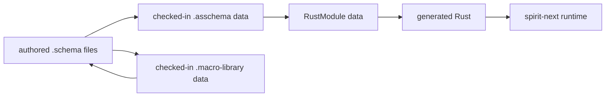
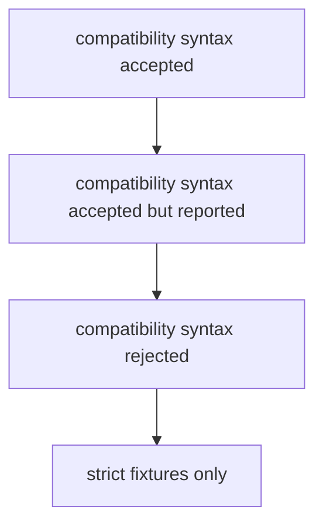
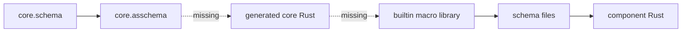

# Unimplemented Gap Audit After Core Macro Artifacts

*Kind: implementation audit · Topics: nota-next, schema-next, schema-rust-next, spirit-next, asschema-artifact, macro-nodes, strict-syntax, daemon-runtime · 2026-05-31 · operator lane*

## Frame

This audit answers: what remains unaddressed or unimplemented after the recent schema stack passes, especially after:

- `schema-next` landed checked-in `core.asschema` and `builtin-macros.macro-library`.
- `schema-rust-next` landed `RustModule` as the data model before rendering.
- `spirit-next` landed binary-only daemon support, NOTA-gated CLI support, generated Signal/Nexus/SEMA envelopes, and the running triad pilot.

The audit used live code, not only reports:

- `repos/schema-next`
- `repos/schema-rust-next`
- `repos/spirit-next`
- recent operator/designer reports through operator `262` and designer `438`

## Answer First

The stack is no longer missing the broad architecture. What remains is the hard closure work:

1. **Macro-table nouns are still hand-written Rust**, even though `core.asschema` now describes them as assembled schema data.
2. **Declarative macro expansion still goes through rendered template text**, then reparses that text into assembled fragments.
3. **Strict schema syntax is not fully enforced**, because compatibility paths still accept pipe declarations, `Name@{...}`, `Input@[]`, and related older forms.
4. **Shared support nouns are still emitted locally into every generated module**, instead of imported from a shared `schema-core` floor.
5. **Schema diff/upgrade is only a trait surface**, not a real asschema-to-asschema change detector or migration planner.
6. **The daemon has binary config loading, but not the full state-aware standby/multi-signal configuration runtime** on main.
7. **Macro conflict handling is runtime/local**, not a construction-time conservative overlap check with strong diagnostics.
8. **The self-hosting loop is not closed**, because the schema-of-schema and macro library are visible artifacts, but the live code still relies on handwritten bridge nouns and handlers.

## What Is Not A Gap Anymore

The current pipeline is real enough that the remaining gaps are specific:



Closed pieces:

- `.asschema` exists as a checked-in, parseable assembled artifact.
- `.macro-library` exists as checked-in macro-table data.
- `schema-rust-next` consumes asschema through `RustModule`, not direct string-only emission.
- `spirit-next-daemon` can be built without `nota-next` in its normal runtime dependency closure.
- `spirit-next` has a running Signal -> Nexus -> SEMA flow over schema-emitted types.

## Gap 1: Macro-Table Nouns Are Still Hand-Written

`schemas/core.schema` and `schemas/core.asschema` now describe the macro table as schema data:

```schema
{
  CoreSchema { BuiltinMacroPositions * BuiltinMacroShapes * BuiltinMacroOutputs * BuiltinMacroDefinitions * }
  BuiltinMacroDefinitions { schemaMacro (Vec SchemaMacro) }
  SchemaMacro { MacroName * MacroPosition * MacroPattern * MacroTemplate * }
  MacroPatternObject [Capture@ MacroCaptureName RestCapture@ MacroCaptureName Atom@ MacroAtom Delimited@ MacroPatternDelimited]
  MacroTemplateObject [Capture@ MacroCaptureName RestCapture@ MacroCaptureName Atom@ MacroAtom Delimited@ MacroTemplateDelimited]
}
```

But the actual Rust noun consumed by the runtime is still written manually in `schema-next/src/declarative.rs`:

```rust
#[derive(
    rkyv::Archive,
    rkyv::Serialize,
    rkyv::Deserialize,
    nota_next::NotaDecode,
    nota_next::NotaEncode,
    Clone,
    Debug,
    Eq,
    PartialEq,
)]
pub struct MacroLibraryData {
    definitions: Vec<MacroDefinitionData>,
}
```

This is better than the old black box because the type is serializable data, but it is not the final architecture. The final architecture is:


Target shape:

```rust
pub mod generated_core;

use generated_core::{
    MacroLibraryData,
    MacroDefinitionData,
    MacroPatternData,
    MacroTemplateData,
};

impl MacroLibraryArtifact {
    pub fn from_nota_source(source: &str) -> Result<Self, SchemaError> {
        MacroLibraryData::from_nota_source(source).map(Self::new)
    }
}
```

The bridge can be incremental: first emit the generated core nouns and adapt them to the existing handwritten `MacroLibraryData`; then delete the handwritten duplicate after the generated surface is stable.

## Gap 2: Macro Expansion Still Rehydrates Text

The built-in macro library is now loaded from data:

```rust
impl DeclarativeMacroLibrary {
    pub fn builtin() -> Result<Self, SchemaError> {
        Ok(Self::from_data(MacroLibraryData::from_nota_source(
            include_str!("../schemas/builtin-macros.macro-library"),
        )?))
    }
}
```

But after a macro matches, the expansion still creates a string, parses that string as a NOTA document, and lowers the parsed template:

```rust
let expanded = self.definition.template.expand(&bindings)?;
context.remember_expanded_template(self.name(), expanded.source());
expanded.lower_to_output(registry, context)
```

```rust
struct ExpandedTemplate {
    source: String,
}

impl ExpandedTemplate {
    fn lower_to_output(
        &self,
        registry: &MacroRegistry,
        context: &mut MacroContext,
    ) -> Result<MacroOutput, SchemaError> {
        let document = Document::parse(&self.source)?;
        AssembledTemplate::new(document.root_object_at(0).expect("expanded template root count checked"))
            .lower(registry, context)
    }
}
```

This violates the direction “each step creates data, serializes data, consumes data.” It still has a text-template middle.

Better target:

```rust
pub struct AsschemaFragment {
    output: MacroOutput,
}

pub struct MacroLoweringRequest<'capture> {
    captures: nota_next::MacroMatch<'capture>,
    position: MacroPosition,
}

pub trait MacroLoweringHandler {
    fn lower(&self, request: MacroLoweringRequest<'_>) -> Result<AsschemaFragment, SchemaError>;
}
```

Then a struct macro handler returns `MacroOutput::Type(TypeDeclaration::Struct(...))` directly from captures. No expanded source string, no second parse, no template trace as proof.

## Gap 3: Strict Schema Syntax Is Not Fully Enforced

The target rule is now clear:

- NOTA `{}` is a strict key-value map.
- Schema authoring can add macro meaning, but the brace rhythm remains pairs.
- Old one-token-in-brace forms and old self-named forms should become migration-only, then errors.

The current `core.schema` is closer to that target:

```schema
[]
[]
{
  CoreSchema { BuiltinMacroPositions * BuiltinMacroShapes * BuiltinMacroOutputs * BuiltinMacroDefinitions * }
  BuiltinMacroPositions { macroPosition (Vec MacroPosition) }
}
```

But compatibility remains live in code and tests:

```rust
fn lower_legacy_declarations(
    &self,
    registry: &MacroRegistry,
    context: &mut MacroContext,
) -> Result<Vec<TypeDeclaration>, SchemaError> {
    ...
}
```

Live test fixtures still use older forms:

```schema
Input@[] Output@[] { Entry@{ topic@Topic kind@Kind } }
```

And `schemas/builtin-macros.schema` still defines the built-ins using pipe declarations:

```schema
(SchemaMacro SchemaStructDefinition NamespaceDeclaration
  {| $Name $*Fields |}
  (Type (Struct $Name [$*Fields])))

(SchemaMacro SchemaEnumDefinition NamespaceDeclaration
  (| $Name $*Variants |)
  (Type (Enum $Name ($*Variants))))
```

The implementation question is no longer “what should the syntax be?” The implementation question is now the migration gate:



Recommended next action:

- Keep raw NOTA support for pipe delimiters only if they are still a deliberate NOTA feature.
- Stop treating pipe declarations as valid Schema authoring syntax.
- Convert fixture schemas to strict pair-rhythm forms.
- Keep explicit tests proving old forms fail with useful diagnostics.

## Gap 4: Support Nouns Are Still Emitted Locally

`spirit-next/src/schema/lib.rs` contains the shared support floor inside the generated local module:

```rust
pub struct Signal<Root> {
    pub origin_route: OriginRoute,
    pub root: Root,
}

pub struct Nexus<Root> {
    pub origin_route: OriginRoute,
    pub root: Root,
}

pub struct Sema<Root> {
    pub origin_route: OriginRoute,
    pub root: Root,
}
```

It also emits common traits locally:

```rust
pub trait NexusEngine {
    fn execute(&self, input: nexus::Nexus<nexus::Input>) -> nexus::Nexus<nexus::Output>;
}

pub trait SemaEngine {
    fn apply(&mut self, input: sema::Sema<sema::Input>) -> sema::Sema<sema::Output>;
}
```

That is useful for the pilot, but the design target is a shared schema floor:

```rust
use schema_core::{
    OriginRoute,
    Signal,
    Nexus,
    Sema,
    Plane,
    MessageIdentifier,
    MessageSent,
    MessageProcessed,
};
```

Generated component modules should emit component-specific roots and payloads, then import the universal message/envelope nouns. Otherwise every component grows a local mirror of the same support language.

## Gap 5: Diff And Upgrade Are Not A Real System Yet

The generated Rust contains generic upgrade traits:

```rust
pub trait UpgradeFrom<Previous>: Sized {
    type Error;

    fn upgrade_from(previous: Previous) -> Result<Self, Self::Error>;
}

pub trait AcceptPrevious<Previous>: UpgradeFrom<Previous> {
    fn accept_previous(previous: Previous) -> Result<Self, Self::Error> {
        Self::upgrade_from(previous)
    }
}
```

But nothing yet compares old asschema to new asschema and produces path-based change data.

Target shape:

```rust
pub struct SchemaDiffRequest {
    previous: Asschema,
    current: Asschema,
}

pub enum SchemaChange {
    DeclarationAdded(DeclarationAdded),
    DeclarationRemoved(DeclarationRemoved),
    ReferenceChanged(ReferenceChanged),
}

pub struct ReferenceChanged {
    declaration: Name,
    path: TypePath,
    from: TypeReference,
    to: TypeReference,
}

impl SchemaDiffRequest {
    pub fn evaluate(&self) -> SchemaDiff {
        todo!("walk declarations and emit path-addressed schema changes")
    }
}
```

The important point is the path:

```text
Entry.topics.values.item
RecordSet.byTopic.value
Signal.Input.Record.payload
```

A flat “field changed” diff is not enough because schema references can be nested inside `Vec`, `Optional`, `Map`, root variants, envelopes, and imported types.

## Gap 6: The Daemon Is Binary-Only, But Not Fully State-Aware

The daemon has the correct first hard boundary: it receives a path to binary configuration, not a NOTA argument.

```rust
impl SpiritNextDaemonCli {
    fn run(&self) -> Result<(), Box<dyn std::error::Error>> {
        let configuration = Configuration::from_binary_path(self.single_argument()?)?;
        Daemon::new(configuration).run()?;
        Ok(())
    }
}
```

```rust
/// The daemon intentionally does not decode NOTA at startup.
pub struct Configuration {
    socket_path: ConfigurationPath,
    database_path: ConfigurationPath,
}
```

What is not on main yet:

- state discovery from a default `.sema` state location
- standby mode when no configuration exists
- configuration delivered as an owner/config signal
- multi-signal numerator over working signal plus policy/config signal
- runtime state generation and persisted configuration metadata

Target shape:

```rust
pub enum SpiritNextSignal {
    Working(signal::Signal<signal::Input>),
    Owner(owner_signal::Signal<owner_signal::Input>),
}

pub struct DaemonStartup {
    default_state_path: StatePath,
    explicit_configuration: Option<Configuration>,
}

impl DaemonStartup {
    pub fn resolve(self) -> Result<DaemonMode, StartupError> {
        todo!("load state, enter running mode, or enter standby mode")
    }
}
```

This is the next runtime gap after the dependency boundary. The daemon already rejects NOTA by dependency shape; it does not yet use signal-delivered configuration as the normal runtime path.

## Gap 7: Macro Conflict Detection Is Still Too Local

`schema-next::MacroRegistry` dispatches macros by scanning registered schema macros:

```rust
pub fn lower(
    &self,
    object: MacroObject<'_>,
    position: MacroPosition,
    context: &mut MacroContext,
) -> Result<MacroOutput, SchemaError> {
    for schema_macro in &self.macros {
        if schema_macro.matches(object, position) {
            return schema_macro.lower(object, position, context, self);
        }
    }
    ...
}
```

`nota-next` has `MacroMatch`, `MacroCaptures`, `MacroConflict`, and `MacroError::Conflict`, but schema still uses unchecked registries for node definition dispatch in several places:

```rust
NotaMacroRegistry::unchecked(self.cases.clone())
    .dispatch(&object.macro_candidate(self.position))
```

What remains:

- construction-time validation of a full schema macro registry
- fatal conflict by default when two macros can plausibly own the same shape
- conservative overlap detection, not only exact duplicate dispatch collisions
- end-user diagnostics that name the position, candidate shape, tried macro names, and capture mismatch

Target construction surface:

```rust
pub struct MacroRegistryBuilder {
    definitions: Vec<MacroNodeDefinition>,
}

impl MacroRegistryBuilder {
    pub fn build(self) -> Result<MacroRegistry, MacroRegistryError> {
        todo!("validate exact conflicts and conservative overlaps before runtime")
    }
}
```

## Gap 8: The Self-Hosting Loop Is Not Closed

The system now has the right artifacts, but it still has handwritten bridges:



The missing loop closure is not abstract. It means:

1. `core.asschema` emits the Rust type definitions for the macro table.
2. `builtin-macros.macro-library` is decoded using those emitted types.
3. schema authoring expands through macro node matches into assembled schema data.
4. the same assembled schema data emits Rust.
5. the schema-of-schema can be expressed in the short schema syntax and regenerate the same assembled artifact.

Until then, the stack has a visible assembled stage, but it is not fully self-hosting.

## Priority Order

Recommended implementation order:

1. **Generate the core macro-table nouns from `core.asschema`.** This closes the most obvious hand-written duplicate.
2. **Replace text-template macro expansion with capture-to-asschema fragments.** This removes the last template-string side channel.
3. **Turn strict schema syntax into the only accepted schema authoring surface.** Migrate fixtures, then make old forms errors.
4. **Extract `schema-core` support nouns.** Keep component schemas focused on component payloads and roots.
5. **Integrate state-aware daemon startup and owner/config signal path.** The zero-NOTA boundary is already proven; now make configuration signal-driven.
6. **Implement asschema diff/upgrade.** This needs stable checked-in asschema artifacts and path-addressed change objects.
7. **Harden macro registry construction diagnostics.** This matters more once user macros become real.
8. **Close self-hosting.** After the generated core noun and direct lowering slices, the loop becomes mechanical.

## The Next Slice I Would Take

I would take **core macro-table noun generation** next, because it is the narrowest slice that visibly closes the “everything is data” loop.

Acceptance tests:

```rust
#[test]
fn core_asschema_emits_macro_library_nouns() {
    let artifact = AsschemaArtifact::from_nota_source(include_str!("../schemas/core.asschema"))
        .expect("core asschema reads");
    let module = RustEmitter::default().emit_module(artifact.asschema());

    assert!(module.declaration_named("MacroLibraryData").is_some());
    assert!(module.declaration_named("MacroDefinitionData").is_some());
    assert!(module.declaration_named("MacroPatternObject").is_some());
    assert!(module.declaration_named("MacroTemplateObject").is_some());
}
```

```rust
#[test]
fn builtin_macro_library_decodes_through_generated_core_types() {
    let source = include_str!("../schemas/builtin-macros.macro-library");
    let library = generated_core::MacroLibraryData::from_nota_source(source)
        .expect("macro library reads through generated core types");

    assert_eq!(library.definitions().len(), 4);
}
```

```rust
#[test]
fn hand_written_macro_library_data_has_no_live_copy_after_generated_core_lands() {
    let source = std::fs::read_to_string("src/declarative.rs").expect("read declarative");

    assert!(
        !source.contains("pub struct MacroLibraryData"),
        "MacroLibraryData should be generated from core.asschema, not hand-written"
    );
}
```

That slice is also low-risk: it can keep an adapter from generated core types to the existing runtime `DeclarativeMacroLibrary` while the direct macro-capture lowering is still being built.

## Bottom Line

The remaining work is no longer “invent the architecture.” It is to remove the bridges that were necessary to bootstrap it:

- handwritten core nouns
- text-template expansion
- compatibility syntax
- local support-noun copies
- generic upgrade traits without asschema diff data
- daemon config as startup file instead of signal-delivered state

The next move should make the core macro table generated from `core.asschema`, then use that generated core to remove the text-template path.
