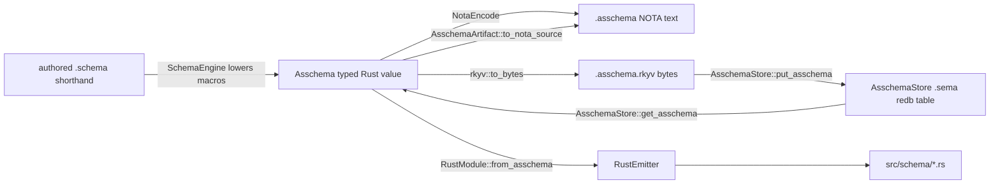
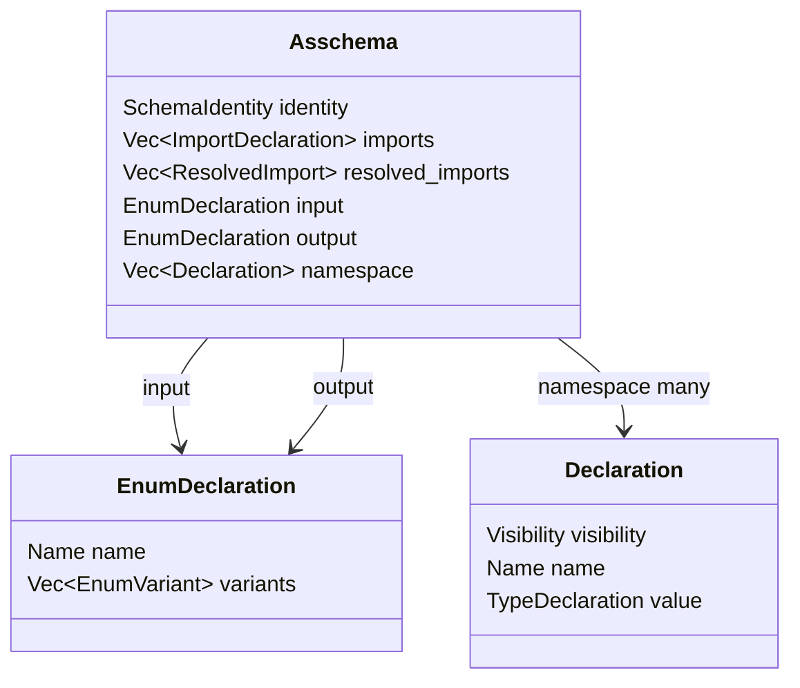
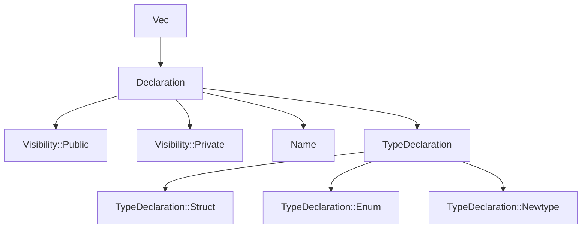
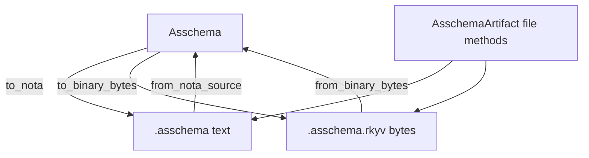
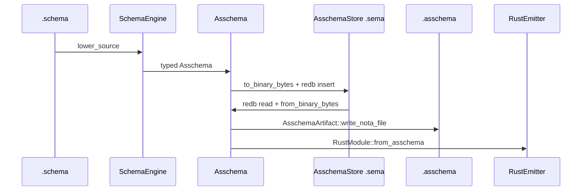
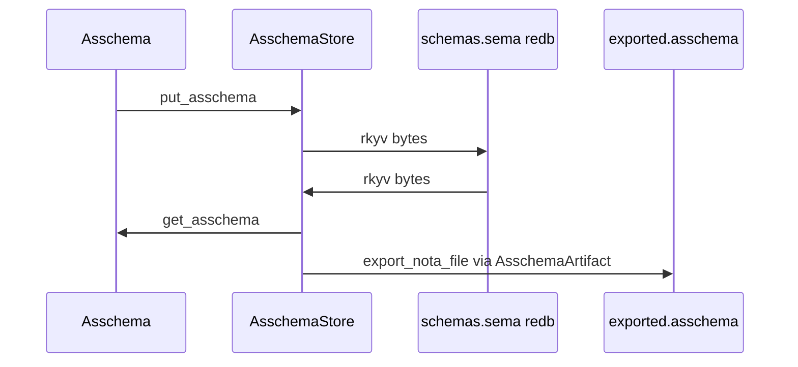
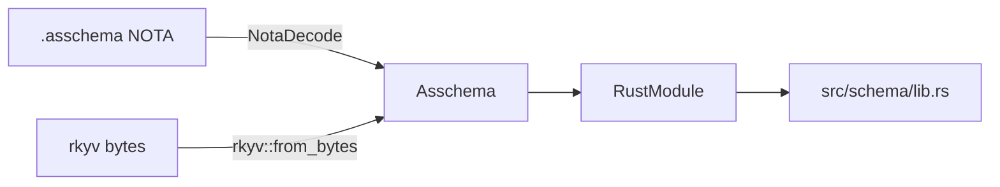
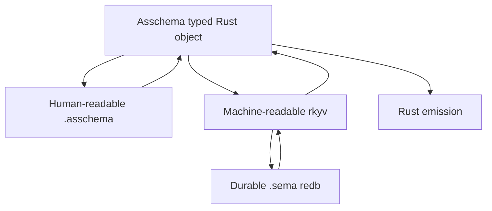

# Asschema As Typed Data: NOTA Projection, Rkyv Storage, SEMA Export

*Kind: architecture presentation - Topics: asschema, nota, rkyv, sema, schema-next, schema-rust-next, spirit-next - 2026-05-31 - operator lane*

## Frame

This report re-presents the crucial current stack after the root-shape correction:

- `Asschema` is a typed Rust data model.
- `.asschema` is the NOTA text projection of that typed data.
- `.asschema.rkyv` is the binary archive projection of that same typed data.
- A SEMA database can store the rkyv bytes and later re-export the same value back to `.asschema` through the `NotaEncode` surface.
- Rust emission consumes typed assembled schema data, not authored shorthand and not display-only syntax.

Spirit intent anchors:

- `1267`: vectors are homogeneous; root syntax must not imply otherwise.
- `1269`: notation must truthfully represent the underlying data shape.
- `1270`: asschema is a typed Rust data model with a NOTA projection.
- `1271`: asschema should be storable as rkyv in SEMA and re-exportable as NOTA through the same typed object.
- `1272`: the implementation separates the responsibilities: `Asschema` owns data, `AsschemaArtifact` owns NOTA/rkyv projection, `AsschemaStore` owns durable SEMA persistence, and Rust emission consumes the typed object.

Comparison input:

- `reports/designer/441-asschema-types-rkyv-sema-roundtrip.md` adds the forward vision: the same typed object should round-trip through `.asschema`, rkyv bytes, and a SEMA database; macro declarations should eventually join type declarations in the namespace; module-prefixing semantics need a psyche call before that larger model change.
- This operator pass implements the clean storage slice now: `schema-next::AsschemaStore` persists rkyv-archived `Asschema` values in redb and re-exports them through `AsschemaArtifact`.

## One Picture



The important invariant: every arrow is a projection or reconstruction of the same typed object. There is no separate "asschema string language" with its own truth.

## Current Root Shape

The previous bad shape was a vector pretending to hold different root kinds:

```nota
[
  ((Input [...]))
  ((Output [...]))
]
```

That was wrong because `[]` is a vector, and a vector has one element type. Adding a wrapper only hid the mismatch.

The current shape is direct product fields on `Asschema`:

```nota
((schema-next:core [0.1.0])
 []
 []
 (Input [])
 (Output [])
 [(Public CoreSchema ...)])
```

The two empty `[]` values are real homogeneous vectors: imports and resolved imports. The `(Input ...)` and `(Output ...)` objects are direct fields of the root `Asschema` record. The final `[...]` is a homogeneous vector of `Declaration`.

## The Rust Type That Owns The Shape

Live code in `schema-next/src/asschema.rs`:

```rust
#[derive(
    rkyv::Archive,
    rkyv::Serialize,
    rkyv::Deserialize,
    nota_next::NotaDecode,
    nota_next::NotaEncode,
    Clone,
    Debug,
    Eq,
    PartialEq,
)]
pub struct Asschema {
    identity: SchemaIdentity,
    imports: Vec<ImportDeclaration>,
    resolved_imports: Vec<ResolvedImport>,
    input: EnumDeclaration,
    output: EnumDeclaration,
    namespace: Vec<Declaration>,
}
```

This is the type truth:

- `identity` says which schema/module this assembled value belongs to.
- `imports` is a homogeneous vector of authored import declarations.
- `resolved_imports` is a homogeneous vector of resolved import facts.
- `input` is one enum declaration.
- `output` is one enum declaration.
- `namespace` is a homogeneous vector of declarations.

The accessor surface now reflects that:

```rust
impl Asschema {
    pub fn input(&self) -> &EnumDeclaration {
        &self.input
    }

    pub fn output(&self) -> &EnumDeclaration {
        &self.output
    }

    pub fn input_and_output(&self) -> [&EnumDeclaration; 2] {
        [self.input(), self.output()]
    }
}
```

So the root is a product, not a vector:



## Namespace Declarations

The namespace vector is homogeneous: every element is `Declaration`.

```rust
pub struct Declaration {
    visibility: Visibility,
    name: Name,
    value: TypeDeclaration,
}

pub enum Visibility {
    Public,
    Private,
}
```

The NOTA projection is therefore a vector of one element type:

```nota
[
  (Public Topic (Newtype (Topic String)))
  (Public Entry (Struct (Entry {topics (Plain Topics) kind (Plain Kind)})))
  (Private Receipt (Struct (Receipt {record_identifier (Plain RecordIdentifier)})))
]
```

Each item is a `Declaration`. The variants differ, but they differ inside the same enum type, which is valid homogeneous vector structure.



## Type Declarations

The core declaration enum:

```rust
pub enum TypeDeclaration {
    Struct(StructDeclaration),
    Enum(EnumDeclaration),
    Newtype(NewtypeDeclaration),
}
```

A struct declaration owns an ordered field map:

```rust
pub struct StructDeclaration {
    pub name: Name,
    pub fields: StructFieldMap,
}

pub struct StructFieldMap {
    entries: Vec<FieldDeclaration>,
}

pub struct FieldDeclaration {
    pub name: Name,
    pub reference: TypeReference,
}
```

It projects to a brace map:

```nota
(Struct
  (Entry
    {topics (Plain Topics)
     kind (Plain Kind)
     description (Plain Description)}))
```

A newtype is not a one-field struct map. It is a single contained reference:

```rust
pub struct NewtypeDeclaration {
    pub name: Name,
    pub reference: TypeReference,
}
```

Projection:

```nota
(Newtype (Topic String))
(Newtype (Topics (Vector (Plain Topic))))
```

An enum is a name plus a homogeneous vector of variants:

```rust
pub struct EnumDeclaration {
    pub name: Name,
    pub variants: Vec<EnumVariant>,
}

pub struct EnumVariant {
    pub name: Name,
    pub payload: Option<TypeReference>,
}
```

Projection:

```nota
(Enum
  (Kind
    [(Decision None)
     (Correction None)
     (Clarification None)]))
```

Again: the vector is homogeneous because every element is an `EnumVariant`.

## Type References

`TypeReference` is the object that appears in fields, enum payloads, imports, collections, and macro-table shapes.

```rust
pub enum TypeReference {
    String,
    Integer,
    Boolean,
    Path,
    Plain(Name),
    Vector(Box<TypeReference>),
    Map(Box<TypeReference>, Box<TypeReference>),
    Optional(Box<TypeReference>),
}
```

The scalars are reserved schema reference variants. `Plain(Name)` means a declared or imported type by name:

```nota
String
Integer
Boolean
Path
(Plain Entry)
(Vector (Plain Entry))
(Optional (Plain Kind))
(Map ((Plain Topic) (Plain RecordIdentifier)))
```

The parenthesized objects here are not raw `Vec` declarations. They are data-carrying variants of `TypeReference`.

## Name Is Not String

`Name` is its own typed object:

```rust
pub struct Name(String);

impl NotaEncode for Name {
    fn to_nota(&self) -> String {
        if self.qualifies_as_symbol_name() {
            self.as_str().to_owned()
        } else {
            NotaString::new(self.as_str()).format()
        }
    }
}
```

This is why `Entry` emits as `Entry`, not `[Entry]`.

That matters because names are reference identities. They are not general text. A future schema module system can keep module-qualified identity such as:

```nota
(Plain schema-next:core:MacroPatternObject)
(Plain spirit-next:lib:Entry)
```

The module-qualified name is the stable key that lets one asschema value refer to declarations from another module, crate, or schema library.

## Artifact Owner

`AsschemaArtifact` is the object that owns file/binary projection:

```rust
pub struct AsschemaArtifact {
    asschema: Asschema,
}

impl AsschemaArtifact {
    pub fn from_nota_source(source: &str) -> Result<Self, SchemaError> {
        Asschema::from_nota_source(source).map(Self::new)
    }

    pub fn to_nota_source(&self) -> String {
        self.asschema.to_nota()
    }

    pub fn from_binary_bytes(bytes: &[u8]) -> Result<Self, SchemaError> {
        Asschema::from_binary_bytes(bytes).map(Self::new)
    }

    pub fn to_binary_bytes(&self) -> Result<Vec<u8>, SchemaError> {
        self.asschema.to_binary_bytes()
    }
}
```

The four projections are all already live:



## SEMA Storage Is Live For Asschema

`spirit-next` already proved the durable SEMA pattern: redb tables store rkyv bytes.

Live pattern in `spirit-next/src/store.rs`:

```rust
const RECORDS: TableDefinition<u64, &[u8]> = TableDefinition::new("records");

impl Store {
    fn record(&self, entry: Entry) -> Result<u64, StoreError> {
        let archive =
            rkyv::to_bytes::<rkyv::rancor::Error>(&entry)
                .map_err(|_| StoreError::ArchiveEncode)?;
        let transaction = self.database.begin_write()?;
        ...
    }
}
```

And reading:

```rust
let entry = rkyv::from_bytes::<Entry, rkyv::rancor::Error>(archive.value())
    .map_err(|_| StoreError::ArchiveDecode)?;
```

The same pattern works for `Asschema`, because `Asschema` derives `rkyv::Archive`, `Serialize`, and `Deserialize`.

This pass makes that pattern concrete in `schema-next/src/store.rs`:

```rust
const ASSEMBLED_SCHEMAS: TableDefinition<&str, &[u8]> =
    TableDefinition::new("assembled-schemas");

pub struct AsschemaStore {
    database: redb::Database,
    path: PathBuf,
}
```

`AsschemaStore` is the durable SEMA owner for assembled schema. It does not lower authored schema, does not render text, and does not emit Rust. It stores and retrieves one thing: rkyv bytes for typed `Asschema` objects.

## Asschema In A SEMA Database

Store one assembled schema value:

```rust
impl AsschemaStore {
    pub fn put_asschema(&self, asschema: &Asschema) -> Result<(), SchemaError> {
        let key = AsschemaStoreKey::from_identity(asschema.identity());
        let bytes = asschema.to_binary_bytes()?;
        self.put_binary_bytes(&key, bytes.as_slice())
    }
}
```

The store key is derived from the schema identity:

```rust
pub struct AsschemaStoreKey {
    value: String,
}

impl AsschemaStoreKey {
    pub fn from_identity(identity: &SchemaIdentity) -> Self {
        Self {
            value: format!("{}@{}", identity.component().as_str(), identity.version()),
        }
    }
}
```

Read it back into the typed Rust value:

```rust
impl AsschemaStore {
    pub fn get_asschema(&self, identity: &SchemaIdentity) -> Result<Option<Asschema>, SchemaError> {
        self.get_artifact(identity)
            .map(|artifact| artifact.map(AsschemaArtifact::into_asschema))
    }
}
```

Export it back to `.asschema` NOTA:

```rust
impl AsschemaStore {
    pub fn export_nota_file(
        &self,
        identity: &SchemaIdentity,
        path: impl AsRef<std::path::Path>,
    ) -> Result<(), SchemaError> {
        let key = AsschemaStoreKey::from_identity(identity);
        let artifact =
            self.get_artifact(identity)?
                .ok_or_else(|| SchemaError::MissingAsschema {
                    key: key.as_str().to_owned(),
                })?;
        artifact.write_nota_file(path)
    }
}
```

The path is:



The new test is `schema-next/tests/asschema_definition.rs::asschema_store_round_trips_rkyv_and_reexports_nota`:

```rust
let store = AsschemaStore::open(paths.sema_path()).expect("open asschema sema store");
store
    .put_asschema(&asschema)
    .expect("persist asschema as rkyv bytes in sema store");

let recovered = store
    .get_asschema(asschema.identity())
    .expect("read asschema from sema store")
    .expect("stored asschema is present");
assert_eq!(recovered, asschema);

store
    .export_nota_file(asschema.identity(), paths.exported_nota_path())
    .expect("export stored asschema back to NOTA");
let exported = std::fs::read_to_string(paths.exported_nota_path())
    .expect("read exported asschema nota file");
assert_eq!(
    Asschema::from_nota_source(&exported).expect("exported asschema decodes"),
    asschema
);
assert_eq!(exported, asschema.to_nota());
```

That test proves the actual path the design cares about:



## Why This Is Not A Side Format

The `.asschema` file is not a new syntax language beside Rust. It is the NOTA encoding of `Asschema`.

The `.sema` database is not a schema parser cache. It stores rkyv bytes for the same `Asschema`.

The emitted Rust is not generated from text heuristics. It is generated from the typed object:



This is the core correctness claim: the text and binary surfaces both pass through the same Rust type.

## What Is Live Versus Next

Live now:

- `Asschema` is typed Rust.
- `Asschema` derives NOTA and rkyv surfaces.
- `AsschemaArtifact` reads/writes `.asschema` and `.asschema.rkyv`.
- `AsschemaStore` stores rkyv-archived `Asschema` values in a redb-backed `.sema` database and re-exports recovered values through `AsschemaArtifact`.
- `schema-rust-next` emits Rust from `Asschema`, including from NOTA/binary artifacts.
- `spirit-next` proves the redb SEMA pattern with rkyv-archived values in a `.sema` file.

Next implementation:

- Decide module-prefixing semantics for stored declarations: always-qualified storage, reference-time qualification only, or qualified wire form with bare Rust-facing API.
- Decide whether `AsschemaStore` remains a library SEMA surface in `schema-next` or becomes the storage core of a `persona-schema` daemon.
- Lift macro declarations into the same asschema namespace as type declarations, likely by widening declaration values to `Type(...) | Macro(...)`.
- Generate the asschema core Rust nouns from `core.asschema` instead of hand-writing them.

## Current Questions

The comparison with `reports/designer/441-asschema-types-rkyv-sema-roundtrip.md` leaves three real questions:

1. **Module qualification**: should declarations be stored internally as bare local names (`Entry`) with qualification only at cross-module reference sites, or should the serialized asschema wire form always store module-qualified names (`spirit-next:lib:Entry`)?
2. **Macro declaration unification**: designer 441's `DeclarationValue::{Type, Macro}` shape is elegant, but it changes the namespace model. It should land after the module-qualification answer, because macro declarations also need stable names.
3. **SEMA owner boundary**: `schema-next::AsschemaStore` proves the storage object. The next product question is whether build-time schema caches use this directly, or whether a future schema daemon owns a `.sema` store and serves asschema artifacts over a signal surface.

## The Crucial Mental Model



Everything important hangs from the center. The center is the typed Rust object. NOTA is the projection for humans and review; rkyv is the projection for machines and SEMA; Rust emission is another consumer of the same object.
