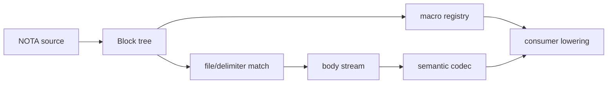

# 1 - NOTA Layer: Programmable Structural Syntax

Kind: presentation report. Topics: nota-next, parser, codec, derive, delimiter, macro-node, structural-patterns.

## Vision

NOTA is the parsed-structure and structural-programming library. It knows what a block, delimiter, atom, document body, pattern, capture and macro candidate are. It does not know that `Input`, `Output`, `NamespaceDeclaration`, or `TypeReference` are Schema concepts.



The boundary is clean: NOTA owns mechanics; Schema supplies vocabulary and lowering.

## Parser Structure

`Block` exposes structural predicates and child accessors that consumers can use without re-matching enum internals. Current code:

```rust
// repos/nota-next/src/parser.rs:139
pub fn is_delimited_with(&self, delimiter: Delimiter) -> bool {
    matches!(self, Self::Delimited { delimiter: found, .. } if *found == delimiter)
}

pub fn as_delimited(&self, delimiter: Delimiter) -> Option<&[Block]> {
    match self {
        Self::Delimited { delimiter: found, root_objects, .. } if *found == delimiter => {
            Some(root_objects)
        }
        Self::Delimited { .. } | Self::PipeText(_) | Self::Atom(_) => None,
    }
}
```

`Delimiter` is now public enough to be the single delimiter-text substrate:

```rust
// repos/nota-next/src/parser.rs:258
impl Delimiter {
    pub fn opening_text(self) -> &'static str { /* ... */ }
    pub fn closing_text(self) -> &'static str { /* ... */ }
    pub fn description(self) -> &'static str { /* ... */ }
    pub fn wrap(self, children: impl IntoIterator<Item = String>) -> String { /* ... */ }
}
```

This is the substrate Schema used to lack. The direct witness is `repos/nota-next/tests/block_queries.rs:36`, where `Delimiter::PipeParenthesis.wrap(...)`, `Block::is_delimited_with`, and `Block::as_delimited` are tested together.

## Body-Content Codec

NOTA now treats a known-root file body and a matched delimited object body as the same semantic surface. The parser first proves "this file body" or "this parenthesized object" structurally; the codec then hands the inner object stream to the expected type. `#[nota(known_root)]` document decode delegates to the same body decode implementation that named struct decode uses after the outer parentheses match.

```rust
// repos/nota-next/derive/src/lib.rs
impl #implementation_generics ::nota_next::NotaBodyDecode for #name #type_generics #where_clause {
    fn from_nota_body(body: &::nota_next::NotaBody<'_>) -> Result<Self, ::nota_next::NotaDecodeError> {
        let children = body.expect_fields(#type_name, #field_count)?;
        Ok(Self {
            #(#body_fields,)*
        })
    }
}

impl #implementation_generics ::nota_next::NotaDocumentDecode for #name #type_generics #where_clause {
    fn from_nota_document_body(body: &::nota_next::NotaDocumentBody<'_>) -> Result<Self, ::nota_next::NotaDecodeError> {
        <Self as ::nota_next::NotaBodyDecode>::from_nota_body(body.as_body())
    }
}
```

The test surface proves the intended consumer shape:

```rust
// repos/nota-next/tests/derive.rs:62
#[derive(Clone, Debug, Eq, NotaDecode, NotaEncode, PartialEq)]
#[nota(known_root)]
struct KnownRootDocument {
    name: String,
    imports: Vec<String>,
    #[nota(name = "Input")]
    input: NamedVariants,
}
```

The direct test witness is `repos/nota-next/tests/derive.rs`, where the same `KnownRootDocument` decodes from `[schema]\n[]\n[[Record] [Observe]]` as a known-root document and from `([schema] [] [[Record] [Observe]])` as a parenthesized object. `repos/nota-next/tests/codec.rs` also manually decodes both through `KnownRootExample::from_nota_body`.

## Derives and Multi-Field Variants

The derive now handles enum variants with more than one unnamed field by grouping payload fields inside a parenthesized payload. This matters because real structural languages need tuple-like payloads.

```rust
// repos/nota-next/tests/derive.rs:25
enum TypeReference {
    String,
    Plain(String),
    Map(Box<Self>, Box<Self>),
    Optional(Box<Self>),
}
```

The current round-trip proof:

```rust
// repos/nota-next/tests/derive.rs:103
let reference = NotaSource::new("(Map (String (Optional (Plain [Entry]))))")
    .parse::<TypeReference>()
    .expect("multi-field enum variant decodes");
assert_eq!(reference.to_nota(), "(Map (String (Optional (Plain [Entry]))))");
```

This directly removes pressure from Schema to hand-write codecs for recursive and multi-field schema nouns.

## Macro-Node Registry and Pattern Matching

NOTA macro nodes are structural pattern matching over parsed blocks. `Pattern` owns the sequence of pattern elements; `DelimitedShape` can recursively constrain children through `Option<Box<Pattern>>`.

```rust
// repos/nota-next/src/macros.rs:183
pub struct Pattern {
    elements: Vec<PatternElement>,
}

// repos/nota-next/src/macros.rs:489
pub struct DelimitedShape {
    delimiter: MacroDelimiter,
    object_count: MacroObjectCount,
    capture: Option<CaptureName>,
    #[rkyv(omit_bounds)]
    children: Option<Box<Pattern>>,
}
```

The test is intentionally Schema-flavored but still lives at the NOTA layer:

```rust
// repos/nota-next/tests/macro_nodes.rs:47
fn dispatches_nested_structural_constraints_inside_delimited_values() {
    let document = Document::parse("{Entry {topic Topic}}").expect("fixture parses");
    // pattern matches a Pascal type key followed by a brace body.
}
```

The key point: NOTA can say "a brace with exactly two children whose first child is literal `topic` and second child is Pascal-case"; it does not say "this is a struct field declaration." Schema says that later.

## Current Open Gaps

- `NotaCollection` still carries encode helpers as associated functions on a block-backed type (`repos/nota-next/src/codec.rs` around `NotaCollection`). The direction from the delimiter substrate suggests `Delimiter::wrap` and value-owned encode nouns should absorb more of that surface.
- The shared body abstraction now covers known-root files and parenthesized named structs. Enum variant bodies and variant-level "bare unit" attributes are still the next semantic-codec pressure point where Schema has bare-symbol meaning.
- Macro-node matching is structural and recursive, but Schema still wraps nota macro definitions in `schema-next::MacroNodeDefinition`. That wrapper may be reduced once NOTA exposes a slightly richer registry profile.
