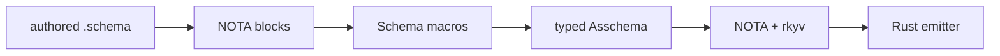

# 2 - Schema and Asschema Layer: Consumer Vocabulary

Kind: presentation report. Topics: schema-next, asschema, macro-consumer, artifacts, rkyv, sema-store.

## Vision

Schema is the first major consumer of programmable NOTA syntax. It registers Schema vocabulary over NOTA macro-node mechanics, lowers authored `.schema` into typed `Asschema`, and keeps `Asschema` as data that can be inspected, checked in, archived, stored, and emitted from.



Schema owns "what the structures mean"; NOTA owns "how structural patterns are parsed and matched."

## Asschema Is Data

`Asschema` is an ordinary data-bearing Rust noun with rkyv and NOTA derives. It uses `#[nota(known_root)]` and named document fields for `Input` and `Output`.

```rust
// repos/schema-next/src/asschema.rs:88
#[derive(rkyv::Archive, rkyv::Serialize, rkyv::Deserialize, nota_next::NotaDecode, nota_next::NotaEncode)]
#[nota(known_root)]
pub struct Asschema {
    identity: super::SchemaIdentity,
    imports: Vec<ImportDeclaration>,
    resolved_imports: Vec<super::ResolvedImport>,
    #[nota(name = "Input")]
    input: EnumDeclaration,
    #[nota(name = "Output")]
    output: EnumDeclaration,
    namespace: Vec<Declaration>,
}
```

Its text and binary surfaces are direct data projections:

```rust
// repos/schema-next/src/asschema.rs:172
pub fn from_nota_source(source: &str) -> Result<Self, SchemaError> {
    NotaSource::new(source)
        .parse_document_body()
        .map_err(SchemaError::from)
}

pub fn to_nota(&self) -> String {
    self.to_nota_document_body().to_nota()
}
```

That is the "not private magic" property: the assembled schema is not hidden inside the compiler or emitter. It is a durable, parseable artifact.

## Checked-In Asschema

`schemas/core.asschema` is a body-form NOTA artifact, not a wrapped private record. Its first fields are the known-root body fields:

```nota
;; repos/schema-next/schemas/core.asschema:1
(schema-next:core [0.1.0])
[]
[]
[]
[]
[(Public CoreSchema ...)]
```

The tests lock this shape:

```rust
// repos/schema-next/tests/asschema_definition.rs:267
let source = include_str!("../schemas/core.asschema");
let document = Document::parse(source).expect("core asschema is legal NOTA");
assert_eq!(document.root_objects().len(), 6);
assert!(!source.contains("(Input [") && !source.contains("(Output ["));
```

The assembled schema can also archive to rkyv and decode back:

```rust
// repos/schema-next/tests/asschema_definition.rs:280
let artifact = AsschemaArtifact::from_nota_source(source).expect("checked-in core asschema decodes");
let bytes = artifact.to_binary_bytes().expect("core asschema archives to rkyv");
let binary = Asschema::from_binary_bytes(&bytes).expect("core asschema decodes from archived bytes");
```

## Structural Macros, Current Truth

The older audit idea said declarative macro lowering still went through `Block -> String -> Document::parse -> Block`. That is no longer the current implementation. `schema-next` commit `877c03f5` moved macro bindings to `Block` values.

```rust
// repos/schema-next/src/declarative.rs:1027
struct MacroBindings {
    singles: Vec<SingleMacroBinding>,
    repeated: Vec<RepeatedMacroBinding>,
}

// repos/schema-next/src/declarative.rs:1090
struct SingleMacroBinding {
    name: String,
    value: Block,
}

struct RepeatedMacroBinding {
    name: String,
    values: Vec<Block>,
}
```

And the expanded template lowers through an object view, not by reparsing text:

```rust
// repos/schema-next/src/declarative.rs:1158
fn lower_to_output(
    &self,
    registry: &MacroRegistry,
    context: &mut MacroContext,
) -> Result<MacroOutput, SchemaError> {
    AssembledTemplate::new(ObjectView::Expanded(&self.object)).lower(registry, context)
}
```

The remaining `source: String` on `ExpandedTemplate` is still real, but it is a trace surface used by `context.remember_expanded_template`, not the lowering substrate.

## Schema Macro Wrapper Boundary

Schema still has a local `MacroRegistry` and `MacroNodeDefinition` wrapper. This is the consumer boundary today:

```rust
// repos/schema-next/src/macros.rs:223
pub struct MacroRegistry {
    macros: Vec<Box<dyn SchemaMacro>>,
    node_definitions: Vec<MacroNodeDefinition>,
}

// repos/schema-next/src/macros.rs:294
pub struct MacroNodeDefinition {
    position: MacroPosition,
    dispatch: MacroDispatch,
    cases: Vec<NotaMacroNodeDefinition>,
}
```

The clean interpretation: Schema owns `SchemaMacro`, `MacroPosition`, `MacroOutput`, and lowering into declarations. NOTA owns `NotaMacroNodeDefinition` and structural matching. The remaining design question is whether `position` and `dispatch` are enough Schema-specific information to justify the wrapper, or whether NOTA should expose a registry profile that lets Schema keep only handlers and vocabulary.

## Artifact and Store Path

`MacroLibraryArtifact` and `AsschemaArtifact` are explicit file/binary owners. This is the pattern:

```rust
// repos/schema-next/src/declarative.rs:90
pub fn from_nota_source(source: &str) -> Result<Self, SchemaError> {
    MacroLibraryData::from_nota_source(source).map(Self::new)
}

pub fn read_binary_file(path: impl AsRef<Path>) -> Result<Self, SchemaError> {
    let artifact_path = MacroLibraryArtifactPath::new(path.as_ref());
    let bytes = fs::read(artifact_path.path()).map_err(|error| artifact_path.io_error(error))?;
    Self::from_binary_bytes(&bytes)
}
```

`AsschemaStore` persists assembled schema artifacts in redb, giving Schema an early SEMA-like storage path:

```rust
// repos/schema-next/src/store.rs:47
pub fn put_asschema(&self, asschema: &Asschema) -> Result<(), SchemaError> {
    let key = AsschemaStoreKey::from_identity(asschema.identity());
    let bytes = asschema.to_binary_bytes()?;
    self.put_binary_bytes(&key, bytes.as_slice())
}
```

That makes `Asschema` a first-class object in three projections: body-form NOTA, rkyv bytes, and redb-backed store entry.

## Current Open Gaps

- `MacroLibraryArtifact` and `AsschemaArtifact` still duplicate the same IO/projection methods. A generic artifact noun can keep the pattern while removing the repetition.
- `AsschemaStore` repeats transaction scaffolding (`begin_write`, `open_table`, `insert`, `commit`) that spirit-next's SEMA store also repeats. This wants a shared store substrate once enough stores exist to justify it.
- `MacroPatternData` and `MacroTemplateData` remain parallel data families in `schemas/core.asschema`; the current architecture is structural, but not yet compact.
- `schema-next::MacroNodeDefinition` still wraps nota-next macro-node cases. The wrapper should stay only if it adds durable Schema vocabulary, not if it becomes a delegate layer.
