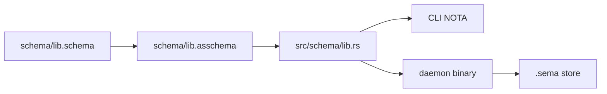
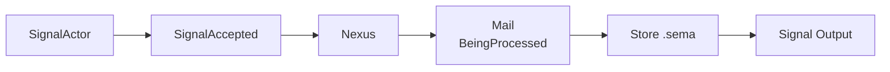

# 3 - Spirit Runtime Layer: Generated Types in Motion

Kind: presentation report. Topics: spirit-next, schema-rust-next, generated-types, CLI, daemon, Signal, Nexus, SEMA.

## Vision

Spirit is the integrated runtime proof. Authored `schema/lib.schema` lowers into checked-in `schema/lib.asschema`, `schema-rust-next` emits Rust nouns, the CLI enables NOTA text, and the daemon runs binary Signal/Nexus/SEMA over generated types and `.sema` state.



The CLI is the text edge. The daemon is the binary/runtime edge.

## Build-Time Artifact Chain

`spirit-next/build.rs` proves the artifact path at build time:

```rust
// repos/spirit-next/build.rs:36
let package = SchemaPackage::new(&self.crate_root, "spirit-next", "0.1.0");
let source = package.load_lib().expect("read schema/lib.schema");
let asschema = SchemaEngine::default()
    .lower_source(source.source(), source.identity().clone())
    .expect("lower spirit-next schema");
let artifact = AsschemaArtifact::new(asschema);
artifact.write_nota_file(artifact_files.nota_path()).expect("write generated asschema NOTA artifact");
artifact.write_binary_file(artifact_files.binary_path()).expect("write generated asschema rkyv artifact");
```

Then the checked-in artifact is the input to Rust emission:

```rust
// repos/spirit-next/build.rs:51
let checked_in_artifact = CheckedInAsschemaArtifact::new(&self.crate_root);
checked_in_artifact.assert_matches_generated_artifact(&artifact_files);

RustEmitter::new(RustEmissionOptions::feature_gated_nota("nota-text"))
    .emit_file_from_nota_path(checked_in_artifact.path())
    .expect("emit Rust from checked-in asschema NOTA artifact")
    .assert_matches_binary_artifact(&artifact_files)
```

This is the stack in one place: `.schema` -> `AsschemaArtifact` -> checked-in `.asschema` -> generated Rust -> binary artifact equivalence.

## Rust Emission Into Nouns

`schema-rust-next` now builds a `RustModule` before rendering text. The data model is real for aliases, imports, declarations, root enums and support witnesses:

```rust
// repos/schema-rust-next/src/lib.rs:84
pub struct RustModule {
    file_path: String,
    generator_name: String,
    scalar_aliases: Vec<RustScalarAlias>,
    imports: Vec<RustImport>,
    declarations: Vec<RustDeclaration>,
    root_enums: Vec<RustEnum>,
    support: RustSupportModel,
    options: RustEmissionOptions,
}
```

The test asserts module structure directly:

```rust
// repos/schema-rust-next/tests/emission.rs:92
let module = emitter.emit_module(&asschema);
assert_eq!(module.file_path(), "src/schema/lib.rs");
assert_eq!(module.root_enums()[0].name().as_str(), "Input");
let entry = module.declaration_named("Entry").expect("Entry declaration exists");
let RustTypeDeclaration::Struct(entry_struct) = entry.value() else {
    panic!("Entry should model as a Rust struct declaration");
};
```

The remaining text-heavy support emission is still visible:

```rust
// repos/schema-rust-next/src/lib.rs:188
writer.emit_signal_frame_support(&self.root_enums);
writer.emit_mail_event_support(&self.root_enums);
writer.emit_plane_namespaces(&self.declarations, &self.root_enums);
writer.emit_nexus_support(&self.root_enums);
```

That is the core `schema-core` extraction pressure: type declarations are data, but universal runtime support is still emitted as strings.

## Generated Runtime Nouns

`spirit-next/src/schema/lib.rs` contains the generated universal plane support:

```rust
// repos/spirit-next/src/schema/lib.rs:927
pub mod schema {
    pub enum Plane<SignalRoot, NexusRoot, SemaRoot> {
        Signal(super::Signal<SignalRoot>),
        Nexus(super::Nexus<NexusRoot>),
        Sema(super::Sema<SemaRoot>),
    }
}

// repos/spirit-next/src/schema/lib.rs:947
pub struct Signal<Root> {
    pub origin_route: OriginRoute,
    pub root: Root,
}
```

The same generated file also owns `Nexus<Root>`, `Sema<Root>`, `MessageSent`, `NexusMail<Payload>`, and `MessageProcessed<Reply>` at `repos/spirit-next/src/schema/lib.rs:974` through `1061`.

The best vision: these are not per-component private helpers forever. They are schema-emitted nouns today and candidates for shared `schema-core` nouns tomorrow.

## CLI and Daemon Split

The CLI is NOTA-enabled:

```rust
// repos/spirit-next/src/bin/spirit-next.rs:23
let argument = self.single_argument()?;
let source = self.read_single_argument(argument)?;
let input = source.parse::<Input>()?;
let (_route, output) = SignalTransport::connect(socket_path)?.exchange(&input)?;
println!("{output}");
```

The daemon is binary-only at startup:

```rust
// repos/spirit-next/src/config.rs:3
/// Daemon configuration loaded from a binary rkyv file.
///
/// The daemon intentionally does not decode NOTA at startup.
#[derive(rkyv::Archive, rkyv::Serialize, rkyv::Deserialize, Clone, Debug, Eq, PartialEq)]
pub struct Configuration {
    socket_path: ConfigurationPath,
    database_path: ConfigurationPath,
}
```

The daemon binary consumes that binary configuration path and runs the long-lived runtime:

```rust
// repos/spirit-next/src/bin/spirit-next-daemon.rs:21
let configuration = Configuration::from_binary_path(self.single_argument()?)?;
Daemon::new(configuration).run()?;
```

This matches the text/binary split: NOTA at human and agent invocation edges; rkyv/Signal inside runtime and storage.

## Signal/Nexus/SEMA Runtime Flow

The runtime flow is explicit in types:



`Engine::handle` runs Signal admission, locks Nexus, then processes:

```rust
// repos/spirit-next/src/engine.rs:72
pub fn handle(&self, input: Input) -> signal_plane::Signal<Output> {
    let accepted = match self.signal_actor.accept(input) {
        Ok(accepted) => accepted,
        Err(rejected) => return rejected.into_signal_output(self.database_marker()),
    };
    let mut nexus = self.nexus.lock().expect("nexus lock");
    accepted.process_with(&mut nexus)
}
```

Nexus owns the mail across the SEMA call:

```rust
// repos/spirit-next/src/nexus.rs:72
pub fn process<Payload>(&mut self, mail: NexusMail<Payload>) -> signal_plane::Signal<Output>
where
    Mail<BeingProcessed>: FromMail<Payload>,
{
    let in_flight = Mail::<BeingProcessed>::from_mail(mail);
    let processed = in_flight.run_sema(&mut self.store);
    processed.emit_processed(&mut self.mail_ledger.hook()).expect("spirit-next mail ledger is infallible");
    processed.into_output()
}
```

The test names the same property:

```rust
// repos/spirit-next/tests/runtime_triad.rs:167
// The mail's Rust TYPE is the proof: a `Mail<BeingProcessed>` exists
// and carries the lowered SEMA input, but the durable store has not
// yet been written.
```

## SEMA Store

`Store` is the durable `.sema` owner:

```rust
// repos/spirit-next/src/store.rs:20
/// The SEMA durable store: a real redb database written to a `*.sema`
/// file.
pub struct Store {
    database: Database,
    path: PathBuf,
}
```

The SEMA engine applies generated `SemaInput` variants and returns generated `SemaOutput` variants:

```rust
// repos/spirit-next/src/store.rs:34
impl SemaEngine for Store {
    fn apply(&mut self, command: sema_plane::Sema<sema_plane::Input>) -> sema_plane::Sema<sema_plane::Output> {
        let origin_route = command.origin_route();
        let output = match command.into_root() {
            SemaInput::Record(entry) => match self.record(entry) { /* ... */ }
            SemaInput::Observe(query) => match self.observe(&query) { /* ... */ }
            SemaInput::Remove(record_identifier) => match self.remove(record_identifier.0) { /* ... */ }
        };
        output.with_origin_route(origin_route)
    }
}
```

This is not a toy parse/print demo anymore. Generated nouns carry the runtime message planes and durable state path.

## Current Open Gaps

- `schema-rust-next` still emits universal support as text methods such as `emit_signal_frame_support` (`repos/schema-rust-next/src/lib.rs:991`) and `emit_mail_event_support`. That support should move toward shared schema-core nouns.
- `spirit-next` hand-writes repeated variant projection and sibling-plane translations in `repos/spirit-next/src/engine.rs:326` through `399` and `repos/spirit-next/src/nexus.rs:105` through `154`. The schema already knows these enum payload relationships.
- The daemon uses synchronous `Mutex<Nexus>` and one-stream-at-a-time handling. That is acceptable pilot scope, but the production actor substrate still belongs in the future kameo/sema-engine layer.
- The CLI still distinguishes inline NOTA vs path by string prefix in `repos/spirit-next/src/bin/spirit-next.rs:41`. That belongs in a NOTA source/input helper rather than each binary.
