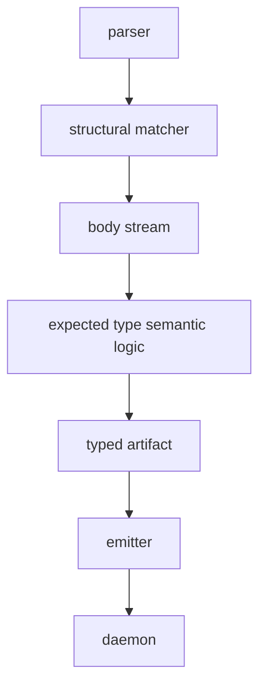

# 4 - Overview and Gaps

Kind: synthesis report. Topics: programmable-nota, schema-consumer, runtime-triad, current-truth, gaps.

## Whole-System Picture

The system's cleanest current reading:

- NOTA owns the programmable syntax substrate: parse trees, delimiters, body streams, derive codecs, structural patterns and macro captures.
- Schema consumes that substrate: it supplies macro positions, vocabulary, and lowering into `Asschema`.
- `Asschema` is a live data artifact: checked-in body-form NOTA, rkyv bytes, redb storage, and Rust-emission input.
- `schema-rust-next` turns `Asschema` into Rust nouns, not just strings, though its universal support surface is still text-heavy.
- `spirit-next` proves those nouns run: NOTA CLI input, Signal frame transport, Nexus mail ownership, SEMA redb state.

## The Important Rewrites Since the Older Audit

1. `nota-next` now exposes delimiter/block substrate. `Delimiter::opening_text`, `closing_text`, `description`, and `wrap` exist, plus `Block::is_delimited_with` and `as_delimited`.
2. `nota-next` macro patterns are recursively structural through `DelimitedShape { children: Option<Box<Pattern>> }`.
3. `nota-next` derive handles multi-field enum variant payloads, demonstrated by `TypeReference::Map(Box<Self>, Box<Self>)`.
4. `nota-next` now has a shared `NotaBody` abstraction. Known-root files and matched parenthesized object bodies both hand the inner object stream to the expected type's semantic codec.
5. `schema-next` uses `#[nota(known_root)]` on `Asschema`; manual known-root joins/readers are gone from the current `Asschema` body.
6. `schema-next` no longer lowers declarative macros by reparsing generated text. Macro bindings store `Block` values, and expanded templates lower through object views.

The sixth point is the most important correction to stale report context. The remaining trace `source` string in `ExpandedTemplate` should not be confused with the old lowering substrate.

## Best Current Vision

The architecture is becoming a programmable structural-language stack:

- Parser and structural matcher are reusable language mechanics.
- Body streams are the handoff between structural matching and semantic decoding.
- Consumer lowerer is Schema's responsibility once the expected type receives its body.
- Artifact is the stable handoff object.
- Emitter and daemon are downstream consumers of artifact data.

This is the right split for additional structural-macro languages: they can use NOTA mechanics without inheriting Schema semantics.

## Remaining Gaps, Tied to Code

### Gap 1 - Schema-core extraction

Universal generated runtime nouns still live inside every emitted component. Evidence:

- `repos/schema-rust-next/src/lib.rs:188` emits `emit_signal_frame_support`, `emit_mail_event_support`, plane namespaces, Nexus support and trait support for every module.
- `repos/spirit-next/src/schema/lib.rs:927` through `1061` contains generated `Plane`, `Signal`, `Nexus`, `Sema`, `MessageSent`, `NexusMail`, and `MessageProcessed`.

Current direction: extract the universal envelope/frame/mail/origin-route layer into shared schema-core nouns so each component imports them instead of re-emitting them.

### Gap 2 - RustModule-as-data is partial

`RustModule` owns declarations and root enums as data (`repos/schema-rust-next/src/lib.rs:84`), but support surfaces still render through `writer.line(...)` methods such as `emit_signal_frame_support` at `repos/schema-rust-next/src/lib.rs:991`.

Current direction: extend the item model until traits, impls, modules, constants and support items are also data. Then tests can assert structure instead of text.

### Gap 3 - Variant projections should be emitted

Spirit hand-writes mappings the schema already knows:

- `repos/spirit-next/src/engine.rs:326` through `345`: one `NexusMail<T>::into_nexus_input` impl per payload.
- `repos/spirit-next/src/engine.rs:347` through `399`: sibling-plane translations from Nexus to SEMA/Signal.
- `repos/spirit-next/src/nexus.rs:105` through `154`: three nearly identical `FromMail<Payload>` impls.

Current direction: schema-rust-next emits `From<Payload> for Enum` and sibling-plane translation helpers, or schema-core owns the generic mail conversion once component enum relationships are available as data.

### Gap 4 - Generic artifact/store substrate

Schema and Spirit both now have real artifact/store surfaces, but the common scaffolding is still local:

- `repos/schema-next/src/declarative.rs:72` through `155`: `MacroLibraryArtifact` file/binary methods.
- `repos/schema-next/src/store.rs:59` through `116`: redb transaction/error scaffolding for `AsschemaStore`.
- `repos/spirit-next/src/store.rs:84` through `121`: redb open/ensure-table scaffolding for the SEMA store.

Current direction: one generic artifact projection and one redb-backed store substrate once the second and third concrete stores make the pattern stable enough.

### Gap 5 - CLI source handling belongs in NOTA

`repos/spirit-next/src/bin/spirit-next.rs:41` decides inline NOTA vs path by checking whether the argument starts with `(`. That repeats a substrate concern in a component binary.

Current direction: a NOTA source helper should own "one argument can be inline NOTA or a path" and component CLIs should call it.

## Open Questions

1. Should `schema-next::MacroNodeDefinition` remain a Schema wrapper, or should NOTA expose enough registry profiling that Schema keeps only positions, handlers and lowering? The wrapper currently holds `position`, `dispatch`, and `cases` at `repos/schema-next/src/macros.rs:294`.
2. Should schema-core be one crate or several narrower crates such as frame, plane-envelope, origin-route and mail-keeper? The current generated support surface is cohesive enough for one crate, but the runtime ownership boundaries may argue for narrower libraries.
3. Should the generic artifact/store substrate live in `schema-next`, schema-core, or a future sema/storage crate? `AsschemaStore` is schema-specific, while `spirit-next::Store` is runtime SEMA-specific.
4. Should `ExpandedTemplate::source` stay as trace text, or should macro trace records store structured `ExpandedObject` plus optional rendered text? Current lowering is structural; the trace surface is the remaining string.

## Verification

This report is source-read verification, not code execution. I verified:

- All referenced repos have clean working copies through `jj status`.
- `schema-next` current parent is `fe770d1d`, carrying the structural macro lowering from `877c03f5` plus the recursive NOTA macro substrate repin, so the report reflects current code rather than the stale prompt-era state.
- The report files contain small Mermaid graphs, compact real snippets, and current open gaps tied to exact source paths.

The implementation cascade that this report describes was verified separately by the main operator session:

- `nota-next`: `cargo fmt && cargo test && cargo clippy --all-targets -- -D warnings`
- `schema-next`: `cargo fmt && cargo test && cargo clippy --all-targets -- -D warnings`
- `schema-rust-next`: `cargo fmt && cargo test && cargo clippy --all-targets -- -D warnings`
- `spirit-next`: `cargo fmt && cargo test && cargo clippy --all-targets --all-features -- -D warnings`, plus `nix flake check`
