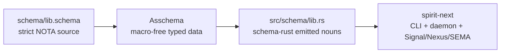

# Strict Schema Syntax E2E Closure

Kind: implementation report  
Topics: schema-next, schema-rust-next, spirit-next, strict-syntax, enum-body, notation-honesty, e2e  
Date: 2026-05-31  
Lane: operator

## Frame

Designer record 1294 and the surrounding thread made the remaining cleanup
unambiguous:

- a bracket body is a homogeneous vector;
- an enum body vector contains one semantic element type: variant signatures;
- unit variants are bare PascalCase symbols;
- data variants are parenthesized records `(Variant PayloadType)`;
- declaration forms that repeat their own name inside the value are not part of
  the production surface.

The user explicitly opted to remove compatibility because this stack is still a
prototype. This pass therefore removed the compatibility branch instead of
warning on it.

## Current Authored Syntax

The Spirit schema header now reads as a known-root schema body: imports, input
signature, output signature, namespace. No root wrappers, no labels.

```schema
{}
[(Record Entry) (Observe Query) (Remove RecordIdentifier)]
[(RecordAccepted SemaReceipt)
 (RecordsObserved ObservedRecords)
 (RecordRemoved RemoveReceipt)
 (Error ErrorReport)
 (Rejected SignalRejection)]
{
  Topic String
  Topics (Vec Topic)
  Entry { Topics * Kind * Description * Magnitude * }
  Query { TopicMatch * kind (Optional Kind) }
  Kind [Decision Principle Correction Clarification Constraint]
}
```

The important delimiter meanings are now clean:

- `{}` is a key/value map.
- `[]` is a vector. At enum-body positions, each element is a variant
  signature object.
- `()` is a record-like body used for type-reference arguments and
  data-carrying variant signatures.
- `*` is a value-side derive marker in struct maps: `Topics *` means field
  `topics: Topics`.

## Pipeline



The code path is now aligned across all three repos:

- `schema-next` owns parsing/lowering of the strict authored surface.
- `schema-rust-next` consumes `Asschema`, not source syntax, and emits Rust
  nouns plus trait surfaces.
- `spirit-next` pins both repos and runs the generated signal plane through
  CLI, daemon-side binary boundary, Nexus, and SEMA tests.

## Landed Commits

- `schema-next` `d8006b6f` — `schema: remove legacy declaration compatibility`
- `schema-next` `2d7b41f5` — `schema: make macro artifact strict key value data`
- `schema-rust-next` `abadd82f` — `schema-rust: consume strict schema surface`
- `schema-rust-next` `12b0d6c7` — `schema-rust: repin strict macro artifact stack`
- `spirit-next` `2b914fd0` — `spirit: repin strict schema stack`
- `spirit-next` `ce6ba208` — `spirit: repin strict macro artifact stack`

## What Changed

### schema-next

The default schema engine no longer registers the old declaration forms.
Namespace declarations are read only as strict key/value pairs:

```schema
Topic String
Topics (Vec Topic)
Entry { Topics * Kind * Description * }
Kind [Decision Principle Correction]
```

The data-variant macro pattern now matches a parenthesized record:

```schema
[(Record Entry) Observe (Rejected SignalRejection)]
```

The old suffix-pair variant spelling is gone from source, fixtures, tests, and
repo docs. Root wrappers are still rejected. The checked-in macro-library
artifact also now describes strict key/value declaration patterns:

```schema
(SchemaMacro SchemaStructDefinition NamespaceDeclaration
  ($Name {$*Fields})
  (Type (Struct $Name [$*Fields])))

(SchemaMacro SchemaEnumDefinition NamespaceDeclaration
  ($Name [$*Variants])
  (Type (Enum $Name ($*Variants))))

(SchemaMacro SchemaNewtypeDefinition NamespaceDeclaration
  ($Name $Reference)
  (Type (Newtype $Name $Reference)))
```

### schema-rust-next

Every schema fixture moved to strict source. Single-reference declarations now
use the newtype surface directly:

```schema
Topic String
RecordIdentifier Integer
RecordSet (Vec Entry)
```

Multi-field objects remain real struct maps:

```schema
Entry { Topics * kind Kind description Description magnitude Magnitude }
```

Generated Rust snapshots did not need semantic changes because the assembled
schema is the same model; the input source got stricter.

### spirit-next

`spirit-next` now pins:

- `nota-next` `64647b1a`
- `schema-next` `2d7b41f5`
- `schema-rust-next` `12b0d6c7`

The flake input update mattered: Nix had still been vendoring an older
`nota-next`, which failed against the new body-parser API. The Nix check now
uses the same stack as Cargo.

## Verification

Passed in `schema-next`:

```text
cargo fmt
cargo test
cargo clippy --all-targets -- -D warnings
```

Passed in `schema-rust-next`:

```text
cargo fmt
cargo test
cargo clippy --all-targets -- -D warnings
```

Passed in `spirit-next`:

```text
cargo fmt
cargo test
cargo clippy --all-targets -- -D warnings
nix flake check
```

The `spirit-next` test surface includes:

- zero-NOTA daemon dependency guard;
- socket-negative tests proving NOTA text is rejected at the daemon wire;
- generated signal plane route/frame tests;
- runtime triad tests for Signal -> Nexus -> SEMA -> Signal;
- durable SEMA `.sema` database tests;
- Nix integration witness over the pinned schema stack.

## Remaining Work

The strict syntax cleanup is closed on the default production path. The next
gaps are not source-syntax compatibility gaps:

1. Macro-table Rust nouns should be generated from schema instead of
   hand-written.
2. Macro expansion should eventually construct `Asschema` fragments directly
   from `MacroMatch` captures instead of expanding through template-owned
   structural objects.
3. Shared support nouns such as common envelopes, route identifiers, and macro
   table support types still want a `schema-core` import surface.
4. Upgrade/diff remains future work on top of checked-in `.asschema` artifacts.
