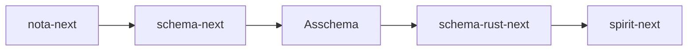
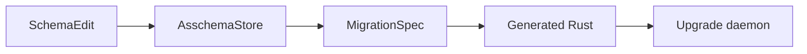

# Context Maintenance — Current Schema Stack State

*Kind: context maintenance · Topics: nota-next, schema-next, schema-rust-next, spirit-next, macro-library, rust-discipline, upgrade-as-sema · 2026-06-01 · operator lane*

## Frame

This report refreshes the current operator-side state after the fast NOTA / Schema / Asschema / Spirit sequence. It is a context-maintenance pass, not a new design proposal. It classifies what is closed, what is still load-bearing, and what the next implementation moves should be.

Sources read in this pass:

- `reports/operator/262-total-architecture-core-macro-artifacts-2026-05-30.md`
- `reports/operator/263-unimplemented-gap-audit-2026-05-31.md`
- `reports/operator/264-asschema-typed-data-rkyv-sema-nota-presentation-2026-05-31.md`
- `reports/operator/266-strict-schema-syntax-e2e-closure-2026-05-31.md`
- `reports/operator/267-macro-library-nota-types-2026-06-01.md`
- `reports/operator/268-schema-source-artifact-datatype-split-audit-2026-06-01.md`
- `reports/operator/269-rust-single-field-wrapper-validity-audit-2026-06-01.md`
- `reports/operator/270-single-field-wrapper-comparison-with-designer-448-2026-06-01.md`
- `reports/designer/445-next-stack-audit-2026-06-01.md`
- `reports/designer/446-next-stack-porting-research-2026-06-01/4-overview.md`
- `reports/designer/447-upgrade-as-sema-design-2026-06-01.md`
- `reports/designer/448-single-field-wrapper-audit-2026-06-01.md`

Live code checked directly:

- `/git/github.com/LiGoldragon/nota-next`
- `/git/github.com/LiGoldragon/schema-next`
- `/git/github.com/LiGoldragon/schema-rust-next`
- `/git/github.com/LiGoldragon/spirit-next`

## Current One-Picture Stack



The short version:

- `nota-next` owns the parser, body parsing, codec/derive surface, and structural macro matching substrate.
- `schema-next` owns schema vocabulary and lowers authored `.schema` files into typed `Asschema`.
- `Asschema` is the typed assembled data object. It is projected to checked-in `.asschema` NOTA text and `.asschema.rkyv` bytes.
- `schema-rust-next` consumes typed `Asschema` and emits Rust through a `RustModule` data model before rendering.
- `spirit-next` is the running pilot: schema-emitted nouns drive CLI, daemon, Signal, Nexus, and SEMA over binary wire and `.sema` storage.

## Closed Since The Earlier Gap Reports

### 1. Macro-library source/artifact datatype split

Closed in `schema-next` commit `99078b20` (`schema: collapse macro library data mirrors`).

Current shape:

```rust
pub struct MacroLibrary {
    source_entries: Vec<MacroLibrarySourceEntry>,
}

pub struct MacroLibraryArtifact {
    library: MacroLibrary,
}

pub enum MacroLibrarySourceEntry {
    SchemaMacro(SchemaMacro),
}
```

This closes the issue from reports 267 and 268. The same semantic macro library is no longer split between `DeclarativeMacroLibrary` / `MacroLibraryData`, and the pattern/template `Data` mirrors have also been collapsed into the real nouns `MacroPattern` and `MacroTemplate`.

The current guard test intentionally keeps the old bad names as strings:

```rust
[
    "MacroLibrarySourceEntryData",
    "MacroDefinitionData",
    "MacroPatternData",
    "MacroTemplateData",
]
```

Those strings are not active types. They are regression guards.

### 2. `FieldEncode` zero-sized method holder

Closed in `nota-next` commit `f5906bae` (`nota: make FieldEncode data-bearing`).

Current shape:

```rust
struct FieldEncode<'field> {
    field: &'field Field,
}
```

The invalid former shape was:

```rust
struct FieldEncode;
```

Reports 269 and 270 remain useful as rationale for the single-field wrapper pattern, but the concrete `FieldEncode` code smell is now fixed.

### 3. `CodecDerive` single-field wrapper question

Resolved, not a bug. Designer 448 and operator 269/270 converge:

```rust
struct CodecDerive {
    input: DeriveInput,
}
```

This is valid because `DeriveInput` is a `syn` type. `nota-next` cannot put inherent methods on it, and free functions / one-impl extension traits / zero-sized namespace holders are worse. The wrapper is the local data-bearing noun for the derive-expansion workflow.

### 4. Strict schema syntax and honest enum bodies

Closed on the main path by report 266 and the associated schema-stack commits. Current authored schema uses honest enum-body vectors:

```schema
[(Record Entry) (Observe Query) (Remove RecordIdentifier)]
[(RecordAccepted SemaReceipt) (RecordsObserved ObservedRecords)]
```

Each bracket element is one variant-signature object. The retired `Record@Entry` style is gone from the production source path.

### 5. Asschema as typed data with NOTA, rkyv, and SEMA projection

Closed as an implementation substrate. `Asschema` is a typed Rust value; `.asschema` is its NOTA text projection; `.asschema.rkyv` is its binary projection; `AsschemaStore` stores the archived value in redb and can export it back to NOTA.

The important separation from report 264 still holds:

```rust
Asschema          // data
AsschemaArtifact  // NOTA/rkyv projection
AsschemaStore     // SEMA persistence
RustEmitter       // typed Asschema to RustModule/Rust
```

## Still Unaddressed

### 1. `nota-next` parser discipline pair

Still present in `/git/github.com/LiGoldragon/nota-next/src/parser.rs`.

Current free function:

```rust
fn opening_starts_declaration(name: &str, opening: char) -> bool
```

Current one-impl trait:

```rust
trait AtBindingOpening {
    fn with_source_closing(self, opening: char) -> (Self, char);
}
```

These are small but real workspace-discipline cleanups. The likely implementation:

- move declaration-opening logic onto `Atom`;
- move `with_source_closing` into an inherent `impl Delimiter`;
- run `cargo fmt`, `cargo test`, and `cargo clippy --all-targets -- -D warnings`.

### 2. CLI inline-vs-path NOTA source helper

Still present in `/git/github.com/LiGoldragon/spirit-next/src/bin/spirit-next.rs`.

Current fragile check:

```rust
if argument.trim_start().starts_with('(') {
    Ok(argument.to_owned())
}
```

This belongs in `nota-next`, not in each CLI. The desired noun is something like:

```rust
impl NotaSource {
    pub fn from_cli_argument(argument: &str) -> Result<Self, NotaSourceError>
}
```

Then `spirit-next` stops guessing that inline NOTA starts with `(` and delegates to the NOTA layer.

### 3. `schema-next` `SchemaError` display fallback

Still present in `/git/github.com/LiGoldragon/schema-next/src/engine.rs`.

Current placeholder:

```rust
impl std::fmt::Display for SchemaError {
    fn fmt(&self, formatter: &mut std::fmt::Formatter<'_>) -> std::fmt::Result {
        write!(formatter, "{self:?}")
    }
}
```

The enum has precise variants, so Display should be a real match with human-facing messages. This is small but worth doing before broader ports make schema errors user-visible.

### 4. Schema-core extraction

Still open. `spirit-next` still emits support nouns locally: route identifiers, mail/event support, Signal/Nexus/SEMA envelope substrate, and related shared support types. The long-term shape is a shared `schema-core` floor imported by generated modules instead of byte-identical local emission in every component.

Designer 446 gives the current sequencing: fold `spirit-next` into the real `spirit` repo first, port a small wave of components, then extract `schema-core` from at least two observed consumers rather than designing it from one pilot.

### 5. Generic SEMA store / artifact substrate

Still open. `schema-next::AsschemaStore` and `spirit-next::Store` are both real, but they are concrete stores. The repeated shape wants a generic substrate:

```rust
SerializableArtifact<T>
SemaStore<T>
```

This is related to schema-core but not identical. It should be extracted only after the repeated pattern is stable enough to name cleanly.

### 6. Schema-emitted variant projections

Still open. `spirit-next` still has hand-written translations between signal, nexus, and sema shapes in runtime code. That is acceptable for the pilot, but the design direction is for schema to emit the basic projection methods where they are mechanical and derivable.

This is one of the preconditions for the upgrade-as-SEMA story, because migration code needs the same projection floor.

### 7. Upgrade-as-SEMA implementation

Design is fresh in designer 447; implementation is not started.

Current intended shape:



The core realization is that an upgrade is a SEMA operation over `Asschema`: a schema daemon edits its stored assembled schema, derives new Rust type code and migration code, then an upgrade daemon compiles and tests the result against minimal and copied databases.

This is not a small cleanup. It should come after the parser/CLI/error cleanup and likely after the first porting slice gives the schema-core boundary more evidence.

### 8. Spirit fold and broader porting

Designer 446 recommends the first real porting move: fold the `spirit-next` pilot back into the real `spirit` repo, then use that commit history as the recipe for wave-1 ports (`cloud`, `upgrade`, `repository-ledger`). This is not implemented yet.

The gating design question in designer 446 is the spirit triad naming: whether the policy signal stays in the current `signal-*` / `owner-signal-*` convention or takes a broader rename. That question should be settled before the fold.

## Context Maintenance Classification

### Reports to treat as closed-rationale

These reports are no longer open issue trackers; they are rationale and history:

- `reports/operator/267-macro-library-nota-types-2026-06-01.md`
- `reports/operator/268-schema-source-artifact-datatype-split-audit-2026-06-01.md`
- `reports/operator/269-rust-single-field-wrapper-validity-audit-2026-06-01.md`
- `reports/operator/270-single-field-wrapper-comparison-with-designer-448-2026-06-01.md`

Their concrete issues are closed or resolved. Keep them as design rationale unless a later maintenance pass rolls them into a higher-level report.

### Reports still active

These remain active working surfaces:

- `reports/designer/445-next-stack-audit-2026-06-01.md` — still accurate for the parser free function, one-impl trait, CLI source helper, and SchemaError Display findings. Its `FieldEncode` note is now closed.
- `reports/designer/446-next-stack-porting-research-2026-06-01/4-overview.md` — active sequencing for the spirit fold and porting waves.
- `reports/designer/447-upgrade-as-sema-design-2026-06-01.md` — active design input for upgrade-as-SEMA; no implementation yet.
- `reports/designer/448-single-field-wrapper-audit-2026-06-01.md` — active taxonomy; its `FieldEncode` action is closed.

### Primary working-copy note

The primary workspace currently contains uncommitted changes from other lanes, including designer and system-designer reports and `skills/architectural-truth-tests.md`. This report does not absorb, delete, or modify those surfaces. It only refreshes operator context and classifies the schema-stack state.

## Recommended Next Operator Order

1. Fix the two `nota-next` parser discipline findings in one small commit.
2. Add the `nota-next` CLI argument source helper and update `spirit-next` to use it.
3. Replace `SchemaError` Debug fallback with real Display messages.
4. Start the `spirit-next` to `spirit` fold after the triad naming question is resolved.
5. Extract schema-core only after the fold plus at least one additional port gives enough repeated substrate to extract cleanly.
6. Build upgrade-as-SEMA after the schema-core and projection surfaces have enough shape to generate migration code without a parallel handwritten universe.

## What The System Is Now

The stack has crossed from sketch to running substrate:

- NOTA is no longer just text syntax; it is a programmable structural substrate with body parsing, known-root support, codec derives, and macro-node matching.
- Schema is no longer a parser trick; it is a NOTA-based structural macro language that lowers into typed `Asschema`.
- Asschema is no longer an invisible intermediate; it is checked-in NOTA, rkyv bytes, and SEMA-storable typed data.
- Rust emission is no longer string-only; `schema-rust-next` has a `RustModule` data model.
- Spirit is no longer only a conceptual runtime; `spirit-next` runs a schema-emitted Signal/Nexus/SEMA pilot with CLI and daemon surfaces split between text client and binary daemon.

The remaining work is not "make the idea real." The idea is real. The remaining work is to remove the last local seams, extract shared floors only when the repeated pattern proves itself, and push the same substrate into the broader component fleet.
