# spirit-next b53f4fc2 triad runtime audit

*Kind: code-review audit · Topics: spirit-next, Signal/Nexus/SEMA, schema-generated traits, production-candidate tests · 2026-06-01 · operator lane*

## Verdict

The claim is mostly true for the production runtime path in commit
`b53f4fc2` (`spirit-next: prove production-copy handover through triad
traits`):

- Signal admission wraps the generated `Input` root in a generated
  `signal::Signal<Input>` envelope and uses generated `SignalEngine`
  trait methods to hand off to Nexus and convert the Nexus reply back to
  a Signal reply.
- Nexus now owns the computation handoff point: its generated
  `NexusEngine::execute` method takes `nexus::Nexus<nexus::Input>` and
  returns `nexus::Nexus<nexus::Output>`.
- SEMA interaction is strict inside Nexus: `NexusEngine::execute` calls
  `SemaEngine::apply` with `sema::Sema<sema::Input>` and receives
  `sema::Sema<sema::Output>`.
- The production process-boundary tests prove the daemon and CLI still
  run over rkyv frames, the `.sema` database persists, and a production
  copy can be handed to a candidate daemon without mutating the original.

The claim is not perfectly strict at the public API surface yet. Nexus is
the structural decision point, but the decision logic is still thin, and
one older public convenience method still lets callers interact with Nexus
in payload-mail terms instead of only through the generated Nexus root
interface.

## Pipeline Witness

```mermaid
flowchart LR
    A["Input frame"] --> B["SignalActor"]
    B --> C["SignalEngine.triage"]
    C --> D["Nexus<Input>"]
    D --> E["NexusEngine.execute"]
    E --> F["SemaEngine.apply"]
    F --> G["Sema<Output>"]
    G --> H["Nexus<Output>"]
    H --> I["SignalEngine.reply"]
    I --> J["Output frame"]
```



## Findings

### Medium — Nexus is the structural decision center, not yet a heavy decision engine

`NexusEngine::execute` is the one place where Nexus decides whether a
message goes to SEMA or can return as Signal output:

```rust
impl NexusEngine for Nexus {
    fn execute(
        &mut self,
        input: nexus_plane::Nexus<nexus_plane::Input>,
    ) -> nexus_plane::Nexus<nexus_plane::Output> {
        let output = input.into_nexus_output();
        let origin_route = output.origin_route();
        match output.into_root() {
            NexusOutput::Sema(input) => {
                let sema_output =
                    SemaEngine::apply(&mut self.store, input.with_origin_route(origin_route));
                sema_output.into_nexus_input().into_nexus_output()
            }
            NexusOutput::Signal(output) => {
                NexusOutput::from(output).with_origin_route(origin_route)
            }
        }
    }
}
```

That is the correct architectural location, and it uses the generated
plane interfaces correctly. But the actual "decision" today is mostly
generated projection:

- `nexus::Nexus<nexus::Input>::into_nexus_output()` maps Signal inputs
  into SEMA commands and SEMA replies into Signal replies.
- `NexusEngine::execute` only matches `NexusOutput::Sema` versus
  `NexusOutput::Signal`.

So the precise claim is: **Nexus is the new structural decision center
and the only runtime place that bridges Signal to SEMA.** It is not yet a
rich algorithm/policy engine. The next proof would be a Nexus-only
decision that is not just a generated projection, for example a
validation, planning, query expansion, upgrade decision, or multi-step
SEMA sequence implemented inside `NexusEngine::execute` and tested
through generated Nexus roots.

### Low — `Nexus::process<Payload>` remains as a bypass-shaped public API

The production path does not use it, but `Nexus` still exposes:

```rust
pub fn process<Payload>(&mut self, mail: NexusMail<Payload>) -> signal_plane::Signal<Output>
where
    Mail<BeingProcessed>: FromMail<Payload>,
{
    let in_flight = Mail::<BeingProcessed>::from_mail(mail);
    self.process_in_flight(in_flight).into_output()
}
```

This method still accepts payload mail and returns a Signal output
directly. Internally it lowers through the generated Nexus root and calls
`NexusEngine::execute`, so it is not a behavioral bypass. But as a public
surface it is less strict than the new architecture because an outside
caller can interact with Nexus without explicitly holding a
`nexus::Nexus<nexus::Input>` root and without going back through
`SignalEngine::reply`.

The current production path uses the stricter method:

```rust
let nexus_output =
    nexus.process_nexus_input(identifier, signal_engine.triage(self.input));
signal_engine.reply(nexus_output)
```

Recommendation for the next cleanup slice: remove `Nexus::process`, or
make it private/test-only. Keep `process_nexus_input` as the public Nexus
runtime entry while `SignalAccepted::process_with` remains the Signal-side
handoff.

### Low — the daemon wire still enters as bare `Input`

The daemon transport still reads and writes `Input`/`Output` signal-frame
roots:

```rust
let (_route, input) = transport.read_input()?;
let output = engine.handle(input);
transport.write_output(output.root())?;
```

`Engine::handle` then immediately lets `SignalActor` mint the internal
origin route:

```rust
pub fn handle(&self, input: Input) -> signal_plane::Signal<Output> {
    let signal_input = self.signal_actor.route(input);
    let accepted = match self.signal_actor.accept(signal_input) {
        Ok(accepted) => accepted,
        Err(rejected) => return rejected.into_signal_output(self.database_marker()),
    };
    let mut nexus = self.nexus.lock().expect("nexus lock");
    accepted.process_with(&self.signal_actor, &mut nexus)
}
```

This matches the current design where Signal admission creates the
origin route, but it means the strict plane-envelope claim starts at
Signal admission, not at the socket byte boundary. The socket boundary is
still generated signal-frame `Input`/`Output`, not
`signal::Signal<Input>`/`signal::Signal<Output>`.

If the intended long-term wire message is the full Signal envelope, the
transport layer still needs a later migration. If the intended wire
message is bare operation root and the Signal actor owns origin-route
minting, then this is not a bug; it should simply be stated precisely in
architecture docs.

## Confirmed Aligned Code Paths

### Generated traits are present

The generated interface traits in `src/schema/lib.rs` are exactly the
shape requested:

```rust
pub trait SignalEngine {
    fn triage(&self, input: signal::Signal<signal::Input>) -> nexus::Nexus<nexus::Input>;
    fn reply(&self, output: nexus::Nexus<nexus::Output>) -> signal::Signal<signal::Output>;
}

pub trait NexusEngine {
    fn execute(&mut self, input: nexus::Nexus<nexus::Input>) -> nexus::Nexus<nexus::Output>;
}

pub trait SemaEngine {
    fn apply(&mut self, input: sema::Sema<sema::Input>) -> sema::Sema<sema::Output>;
}
```

### Signal actor implements only triage/reply

`SignalActor` does not do database work. Its trait implementation
converts generated Signal input into generated Nexus input and converts
generated Nexus output back to generated Signal output:

```rust
impl SignalEngine for SignalActor {
    fn triage(&self, input: signal_plane::Signal<Input>) -> nexus_plane::Nexus<NexusInput> {
        let origin_route = input.origin_route();
        NexusInput::from(input.into_root()).with_origin_route(origin_route)
    }

    fn reply(&self, output: nexus_plane::Nexus<NexusOutput>) -> signal_plane::Signal<Output> {
        output.into_signal_output()
    }
}
```

Signal still owns validation before handoff:

```rust
input.root().validate().map_err(|validation_error| SignalRejected { ... })?;
```

That is aligned with the current intent: Signal triages, rejects bad
messages early, and does not perform SEMA work.

### Nexus invokes SEMA only through `SemaEngine`

The only production `SemaEngine::apply` call under `src/` is inside
`NexusEngine::execute`:

```text
src/nexus.rs:232: SemaEngine::apply(&mut self.store, input.with_origin_route(origin_route));
```

The store's write/read/remove methods are private to `store.rs`, so the
durable database operations are not available as public bypass methods.

### SEMA takes and returns generated SEMA envelopes

`Store` implements the generated SEMA trait directly:

```rust
impl SemaEngine for Store {
    fn apply(
        &mut self,
        command: sema_plane::Sema<sema_plane::Input>,
    ) -> sema_plane::Sema<sema_plane::Output> {
        let origin_route = command.origin_route();
        let output = match command.into_root() {
            SemaInput::Record(entry) => ...
            SemaInput::Observe(query) => ...
            SemaInput::Remove(record_identifier) => ...
        };
        output.with_origin_route(origin_route)
    }
}
```

This is the cleanest part of the implementation: SEMA is the durable data
actor surface, not a primitive helper API.

## Test Evidence

I re-ran the tests that bear on the claim:

- `cargo test --test runtime_triad -- --nocapture`: 15 tests passed.
- `cargo test --features nota-text --test process_boundary -- --nocapture`: 3 tests passed.
- `cargo test --test dependency_surface -- --nocapture`: 2 tests passed.
- `cargo test --test socket_negative -- --nocapture`: 3 tests passed.

The strongest positive witnesses:

- `nexus_engine_trait_runs_nexus_decision_through_sema_state` calls
  `NexusEngine::execute` with `NexusInput::Signal(...).with_origin_route`
  and proves the store commit happens through Nexus.
- `signal_engine_trait_triages_signal_roots_to_nexus_and_back` explicitly
  uses `SignalEngine::triage`, `NexusEngine::execute`, and
  `SignalEngine::reply` in sequence.
- `nexus_runs_sema_while_holding_mail_then_replies_through_schema_objects`
  uses `Engine::handle` and proves the end-to-end runtime emits sent and
  processed ledger events while committing to the SEMA store.
- `candidate_daemon_handover_from_production_copy_preserves_original_sema_database`
  proves the production-copy handover path at the process boundary.

The remaining test gap is negative architecture enforcement: there is no
compile-fail or static witness that forbids the older
`Nexus::process<Payload>` public surface. The easiest next witness is a
source assertion that production code contains no callers of
`Nexus::process` and, better, deletion or privatization of that method so
the architecture is enforced by the type system.

## Bottom Line

`b53f4fc2` genuinely wires the runtime through the generated triad
traits from Signal admission onward. Nexus is now the structural
decision/handoff center and owns the SEMA invocation. The strictest
reading of the claim still needs one cleanup: remove the old
payload-mail `Nexus::process` public method and eventually put real
Nexus-specific decision logic into `NexusEngine::execute`, so Nexus is
not only the place the decision passes through but the place meaningful
decisions are made.
