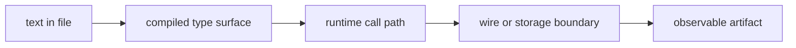

# Live Architecture Witness Research

*Kind: research report · Topics: architectural-truth-tests, nix-checks, positive-grep-ban, schema-stack, spirit-next · 2026-06-01 · operator lane*

## Question

The psyche correction is sharper than the earlier rule:

> A positive grep check does not prove the architecture is live. It just proves the symbol is in the file. The proof needed is that it is actually used.

Spirit records:

- `1341`: positive grep deployment checks are not allowed as proof; grep may remain as a narrow negative guard.
- `1342`: positive grep only proves text is present; live proof means compile, execute, round-trip, or otherwise witness that the intended type, trait, actor path, wire frame, or storage path is exercised by the real runtime.

## Core Distinction

There are three different things that had been mixed together:

| Check shape | What it proves | Status |
|---|---|---|
| `grep -R "SemaWriteInput" src/schema/lib.rs` | Text exists in a file | Not valid architecture proof |
| `! grep -R "NexusMail" src tests` | Retired surface is absent | Valid negative guard |
| Test that calls `SemaEngine::apply(sema::Sema<sema::WriteInput>)` and observes state | Generated SEMA write path is actually used | Valid live witness |

The rule is not "grep is evil." The rule is: **grep proves text, not use**. It can prove absence of forbidden text. It cannot prove a live path.

## What Real Use Looks Like



Positive proof should land at `Compile`, `Runtime`, `Boundary`, or `Artifact`, not stop at `Text`.

## Good Witness Patterns

### Compile-time Type Witness

The test must make the type checker enforce the architecture:

```rust
let nexus_output: nexus::Nexus<nexus::Output> =
    NexusEngine::execute(&mut nexus, nexus_input);
```

This proves more than a string in generated code. It proves the runtime object implements the generated trait and that the call takes and returns the generated schema envelope. A primitive helper enum or hand-written bypass would not satisfy this signature.

### Runtime Trace Witness

For actor or plane sequencing, record generated lifecycle events:

```rust
let output = accepted.process_with(&signal_actor, &mut nexus, &mut ledger_hook)?;

assert!(ledger.events().iter().any(MailLedgerEvent::is_sent));
assert!(ledger.events().iter().any(MailLedgerEvent::is_processed));
```

This proves the message went through the intended lifecycle hooks. Grepping for `MessageProcessed` does not.

### Boundary Witness

For CLI/daemon architecture, use the real process and wire:

```rust
let child = Command::new(env!("CARGO_BIN_EXE_spirit-next-daemon"))
    .arg(configuration_path)
    .spawn()?;

let output = Command::new(env!("CARGO_BIN_EXE_spirit-next"))
    .arg(input.to_nota())
    .output()?;
```

This proves the CLI text surface, binary rkyv socket, daemon decode path, engine path, and output decode path are connected. Grepping for `UnixStream` or `encode_signal_frame` does not.

### Negative Boundary Witness

The daemon must reject NOTA bytes on its binary socket:

```rust
transport.write_raw_frame(b"(Record (...))")?;
assert!(transport.read_output().is_err());
```

This proves the daemon cannot accidentally become a NOTA-speaking endpoint.

### Dependency Closure Witness

For "daemon has no NOTA decoder," inspect the dependency graph:

```rust
let tree = CargoTree::new().no_default_features().normal_edges().run();
assert!(!tree.contains("nota-next"));
```

This is not a source grep. It proves the compiled normal dependency closure excludes the text codec.

### Stateful Artifact Witness

For SEMA durability, write and reopen the actual `.sema` file:

```rust
SemaEngine::apply(&mut store, write_input)?;
drop(store);

let reopened = Store::open(path)?;
let observed = SemaEngine::observe(&reopened, read_input)?;
```

For handover, copy the `.sema` file into a candidate state directory and prove the candidate reads the copy while the original remains unchanged.

## Current Stack Findings

### spirit-next

Strong witnesses already exist:

- `tests/runtime_triad.rs` calls `SignalEngine`, `NexusEngine`, and split `SemaEngine` with generated schema objects.
- `tests/socket_negative.rs` rejects raw NOTA bytes through the binary frame decoder.
- `tests/process_boundary.rs` launches real CLI + daemon binaries and crosses the Unix socket.
- `tests/nix_integration.rs` launches Nix-built binaries through a real socket and parses CLI output through generated `Output::from_str`.
- `tests/dependency_surface.rs` uses `cargo tree` to prove the binary-only daemon surface excludes `nota-next`.
- `nix flake check` runs cargo build/test/clippy surfaces for binary-only and `nota-text`.

Remaining weak checks in `flake.nix`:

- `generated-schema-source-checked-in` contains many positive greps for build.rs method names and generated text.
- `nota-surface-is-opt-in` greps source strings even though `dependency_surface.rs` is the stronger witness.
- `binary-boundary-test` greps transport method names even though socket/process tests are stronger.
- `nix-integration-witness` greps test anchors rather than running the Nix integration app.
- `operator-271-closed-claims` mixes valid textual syntax guards with positive test-name greps.

Best replacement:

- Keep negative guards for retired surfaces and forbidden strings.
- Delete positive grep proof once the corresponding cargo/Nix test is named in `checks`.
- If a check needs to prove a specific text artifact, move it into a Rust fixture test that parses the artifact and asserts the typed value. Text exactness is allowed only when the claim is literally about source spelling.
- Make the Nix integration witness run the Nix-built integration runner, or expose it clearly as a cheap anchor check that is not deployment proof.

### schema-rust-next

Strong witnesses already exist inside cargo tests:

- emission tests lower real schemas into `Asschema`;
- generated fixtures are compiled as Rust;
- generated frame encode/decode and NOTA surfaces are exercised;
- split SEMA trait signatures are asserted through emitted code.

Remaining weak checks:

- `generated-rkyv-boundary`, `generated-nexus-traits`, `generated-mail-events`, `generated-upgrade-traits`, `generated-nota-boundary`, `generated-schema-module-path`, and `generated-cross-crate-imports` mostly grep generated fixture strings or test names.

Best replacement:

- Let `checks.test` and fixture-compilation be the positive proof.
- Keep only negative greps for retired surfaces such as `InputNexus`, `OutputNexus`, `NexusMail`, old macros, and obsolete fixtures.
- If a generated source detail matters, expose it as `RustModule` data and test that data before rendering, or compile a fixture crate that fails if the type/method is absent.

### schema-next

Strong witnesses:

- lowering tests execute the schema engine;
- macro library round-trips as typed data and still executes;
- raw core schema fixture tests parse legal NOTA before schema lowering;
- asschema-definition tests read real fixtures into typed `Asschema`.

Remaining weak checks:

- `design-examples` is a list of positive greps for test names.
- `macro-registry-used`, `declarative-schema-macros`, `namespace-braces-are-key-value`, `schema-module-entrypoint`, and `raw-core-schema-example` use positive greps as proof of implementation shape.

Best replacement:

- Keep syntax-forbidden negative scans.
- Make each positive claim a cargo test that constructs a real `SchemaEngine`, loads real fixture files, and asserts typed `Asschema` or typed `MacroLibrary` output.
- Delete test-name grep checks after cargo tests cover those claims.

### nota-next

Strong witnesses:

- parser/codec/design tests execute the parser and derive surfaces.

Remaining weak check:

- `design-examples` greps for test names. It proves only that test names remain in the file.

Best replacement:

- Delete it, or replace it with one cargo test that exercises the design-example fixture set directly.
- Keep negative source scans for production free functions or forbidden fixture style.

## Cleanup Rule For Nix Checks

Nix checks should fall into one of these buckets:

1. **Build/test/doc/format/clippy checks**: compile or run real code.
2. **Runtime/process checks**: launch binaries, cross sockets, read/write files.
3. **Artifact checks**: consume a produced artifact with the real reader for that layer.
4. **Dependency checks**: inspect `cargo tree` / metadata to prove closure boundaries.
5. **Negative source guards**: assert retired or forbidden text is absent.
6. **Text artifact spelling checks**: allowed only when the property under test is literally the spelling of an authored source artifact, and preferably moved into a parser test.

Anything else, especially positive grep for "method name exists" or "test name exists," is not an architecture witness.

## Recommended Implementation Order

1. `spirit-next`: remove positive greps from `binary-boundary-test` and `nota-surface-is-opt-in`; rely on existing runtime and dependency tests. Keep negative greps.
2. `schema-rust-next`: replace generated-source positive greps with compile-level fixture tests and `RustModule` data assertions. Keep negative retired-surface guards.
3. `schema-next`: remove `design-examples` test-name grep checks; require cargo tests to carry those names through actual engine execution.
4. `nota-next`: remove `design-examples` positive grep check or replace it with a cargo test aggregator.
5. Add a small flake-lint test in each repo that allows `! grep` and `if grep` negative guards, but fails new `grep ... >/dev/null` positive proof blocks unless the check name explicitly says it is a text-artifact spelling guard.

## Bottom Line

The research answer is:

Positive grep was being used as a cheap proxy for "this architecture exists." That is invalid. The replacement is not "more grep" and not "better grep." The replacement is a witness that fails if the path is not used:

- type-check the generated trait boundary;
- run through the runtime object;
- cross the wire;
- persist and reopen the storage artifact;
- inspect dependency closure;
- parse emitted text back into typed data.

That is the line: grep for absence, execute for use.
