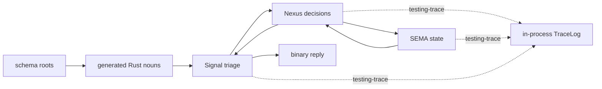
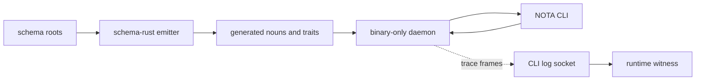

# Gap Vision And Subagent Implementation Brief

*Kind: implementation vision · Topics: spirit-next, schema-rust-next, testing-trace, live-witness, subagent-brief · 2026-06-01 · operator lane*

## Short Verdict

The intent is clear enough to implement the next clean slice.

The core invariant is: architecture is proven by live typed execution, not by
source-text presence. Schema defines the protocol nouns and engine interfaces;
Rust code uses those generated nouns; runtime tests observe the real
Signal/Nexus/SEMA path; production daemons stay lean and binary-only; NOTA
belongs at the CLI/human edge and schema authoring edge.

The current trace slice is useful but intentionally partial. It proves the
right runtime path inside `spirit-next`, but the trace surface is still
hand-written and in-process. The next slice should move that surface toward
the same architecture as the rest of the system: generated nouns, binary
frames, CLI-owned testing visibility, and runtime witnesses.

## Current Shape



This is already better than grep checks because tests call the runtime and
assert the observed events. But the dotted trace path is still a pilot path,
not the final architecture.

## Target Shape



The important change is that trace events are generated schema nouns and move
over a binary side channel. The CLI owns the human/testing view. The daemon
does not learn NOTA and does not expose a second control protocol.

## Gap 1: Trace Nouns Are Hand-Written

Current state: `spirit-next/src/trace.rs` defines `TraceEvent` by hand.

Why this is a gap: the point of the stack is that interface nouns come from
schema and schema-rust emission. If trace events stay hand-written, they
become a second local vocabulary that can drift away from the generated
Signal/Nexus/SEMA roots.

Lean: teach `schema-rust-next` to emit optional testing-trace support for a
schema. Keep the first version modest:

```rust
#[cfg(feature = "testing-trace")]
pub enum TraceEvent {
    SignalAdmitted { origin_route: OriginRoute, input: Signal<Input> },
    NexusEntered { origin_route: OriginRoute, input: Nexus<Input> },
    SemaWriteApplied { origin_route: OriginRoute, input: SemaWriteInput, output: SemaWriteOutput },
}
```

The exact fields can stay pilot-specific at first, but the nouns should be
emitted next to the generated protocol nouns. `spirit-next` then deletes the
hand-written `TraceEvent` and imports the generated one.

## Gap 2: Trace Delivery Is In-Process

Current state: tests inject `TraceLog::recording()` and inspect an in-memory
vector.

Why this is a gap: the psyche specifically wants the CLI to be the testing log
surface. In-process is useful for proving hooks, but it does not prove the
daemon can expose live runtime facts to a test client without accepting NOTA.

Lean: add a binary trace sink abstraction first, then a Unix socket sink.

```rust
pub trait TraceSink {
    type Error;
    fn record(&mut self, event: TraceEvent) -> Result<(), Self::Error>;
}
```

`TraceLog` can remain the in-memory test sink. A `TraceSocket` sink should send
length-prefixed rkyv `TraceEvent` frames to a configured Unix socket. The CLI
or test harness listens on that socket and decodes the frames using the same
generated Rust type.

## Gap 3: Testing Configuration Is Not Typed Data Yet

Current state: enabling trace is a Cargo feature plus test-only constructor
injection.

Why this is a gap: the intended system configures behavior with typed data, not
flags or ad hoc env conventions. The daemon still should not parse NOTA, so
the runtime configuration must arrive as binary rkyv.

Lean: add `TraceConfiguration` to the existing binary daemon configuration
behind `testing-trace`.

```rust
pub struct TraceConfiguration {
    pub socket_path: ConfigurationPath,
}

pub struct Configuration {
    pub signal_socket_path: ConfigurationPath,
    pub database_path: ConfigurationPath,
    pub trace: Option<TraceConfiguration>,
}
```

The CLI/test launcher can read a NOTA test configuration later and produce the
binary daemon configuration file. The daemon keeps the same rule: it starts
from binary configuration, not NOTA.

## Gap 4: Positive Grep Checks Still Exist

Current state: some grep checks remain as source spelling checks and some
still look like live-use proxies.

Why this is a gap: positive grep proves text is present, not that the
architecture runs. It is acceptable only for negative guards and narrow
checked-in artifact freshness anchors.

Lean: replace positive runtime claims with one of three witnesses:

- compile/type witness for API shape,
- process/socket witness for daemon boundaries,
- runtime event witness for actual engine use.

Do not delete a grep if it is really an artifact freshness check; rename it so
it says what it proves. Delete or replace greps that claim behavior.

## Gap 5: Production-Copy Handover Still Needs The Same Trace Discipline

Current state: production-copy handover is tracked as open work, and recent
trace tests prove runtime path at unit/integration level.

Why this is a gap: a daemon candidate is only credible if a fresh daemon can
consume a copied state database, answer through binary protocol, and emit the
same trace proof while doing so.

Lean: once socket trace exists, the production-copy handover test should assert
both normal response and trace events. That makes the handover test prove the
triad architecture, not only state file compatibility.

## What Is Clear

The following intent is settled enough to implement without asking again:

- `Signal` triages ingress and formats egress; it is not the heavy decision
  engine.
- `Nexus` is the decision-making actor and talks to SEMA only through the
  schema-defined SEMA interface.
- `SEMA` owns durable state and has split write/read interfaces.
- The daemon is binary-only; NOTA is for CLI/schema/human surfaces, not daemon
  wire input.
- Testing trace must prove live runtime paths, not source text.
- Old convenience APIs should be removed instead of preserved as compatibility
  clutter.

## What Is Still A Design Choice

Only two implementation details remain soft:

- Feature name: keep `testing-trace` because it is already landed in
  `spirit-next`, or rename to `runtime-trace` because the mechanism could be
  useful beyond tests. Operator lean: keep `testing-trace` now, rename only if
  a second non-test consumer appears.
- Trace schema home: emit per component first, or extract to `schema-core`
  immediately. Operator lean: per component first. Move to `schema-core` after
  a second component consumes the same trace nouns.

Neither blocks implementation.

## Subagent Implementation Brief

Use this brief for a worker if dispatched.

Read, in order: workspace `AGENTS.md`, `ESSENCE.md`, `INTENT.md`,
`repos/lore/AGENTS.md`, `orchestrate/AGENTS.md`, `skills/operator.md`, then
per-repo `AGENTS.md`, `skills.md`, `INTENT.md`, and `ARCHITECTURE.md` for each
repo touched. Before Rust edits, read the Rust discipline skills named in
workspace `AGENTS.md`. Use `jj` only, inline messages only. Do not push
designer branches to main. Operator work lands on main.

Goal: close the next testing-trace architecture slice cleanly.

Primary scope:

1. In `schema-rust-next`, add optional generated testing trace nouns beside the
   generated schema protocol nouns. The generated type must derive rkyv and must
   compile out when the feature is disabled.
2. In `spirit-next`, replace the hand-written `TraceEvent` with the generated
   type. Keep the current event names: `SignalAdmitted`, `SignalRejected`,
   `SignalReplied`, `NexusEntered`, `NexusDecided`, `SemaWriteApplied`,
   `SemaReadObserved`.
3. Add a `TraceSink` noun with one in-memory implementation and one binary
   Unix-socket implementation behind `testing-trace`.
4. Extend binary daemon configuration with optional trace socket configuration
   behind `testing-trace`. Do not add flags. Do not make the daemon decode NOTA.
5. Add an end-to-end test that starts or exercises the daemon with trace socket
   enabled, sends a real binary Signal request, receives the normal binary
   reply, and decodes trace frames proving Signal, Nexus, and SEMA all ran.
6. Replace remaining positive grep checks that claim live behavior with runtime
   witnesses. Keep only negative guards and explicit artifact freshness checks.

Non-goals:

- Do not add compatibility aliases for retired APIs.
- Do not reintroduce mail typestate wrappers or Nexus convenience bypasses.
- Do not make CLI flags. If the CLI needs richer test setup, express it as
  typed NOTA at the CLI/test-launcher surface and compile it to binary daemon
  configuration.
- Do not put trace events on the normal Signal reply path.

Acceptance:

- `cargo test --no-default-features` passes where applicable.
- `cargo test --features nota-text` passes where applicable.
- `cargo test --features testing-trace` passes and includes the socket witness.
- `cargo clippy --all-targets --features testing-trace -- -D warnings` passes.
- `nix flake check` passes.
- Daemon dependency guard still proves no `nota-next` normal dependency.
- A source search for hand-written `enum TraceEvent` in `spirit-next` fails
  after generated trace emission is wired.

## Operator Recommendation

Dispatch a worker only for the schema-rust emission plus spirit-next consumer
change. Keep the CLI log-socket work in the same worker if they can preserve a
small commit series; otherwise split after the generated noun replacement.

The first commit should be the smallest useful proof: generated trace nouns
compiled into `spirit-next` and current in-process tests still passing. The
second commit should add socket delivery. The third should replace positive
grep behavior checks with live witnesses.
