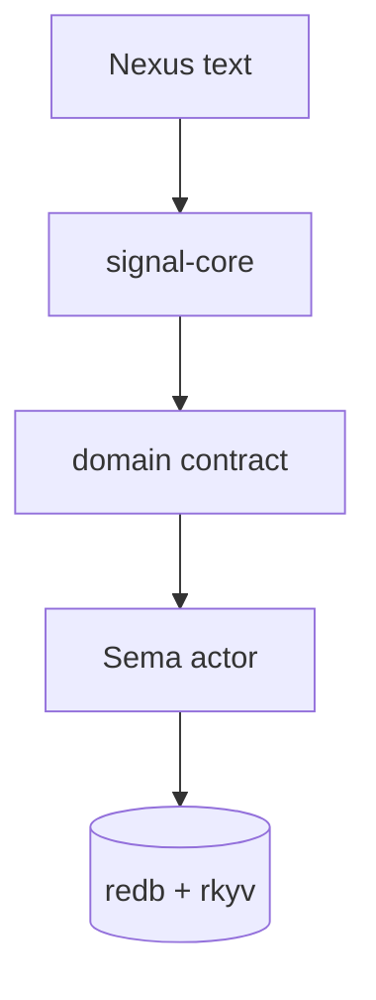
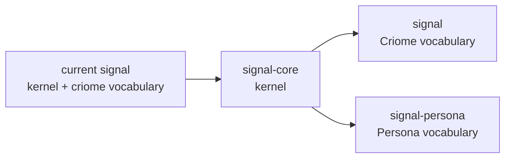
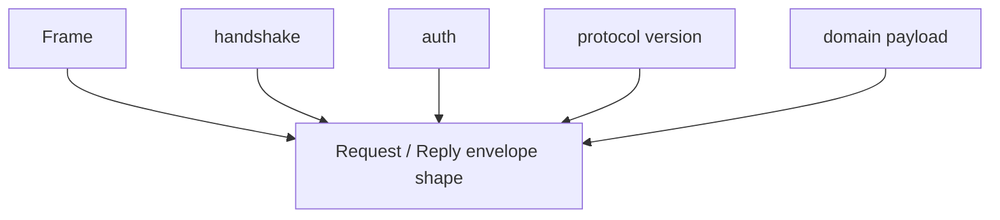
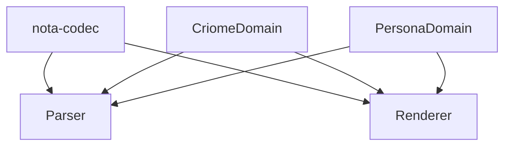
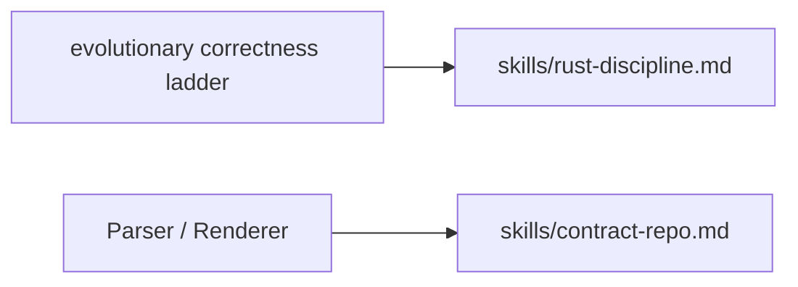
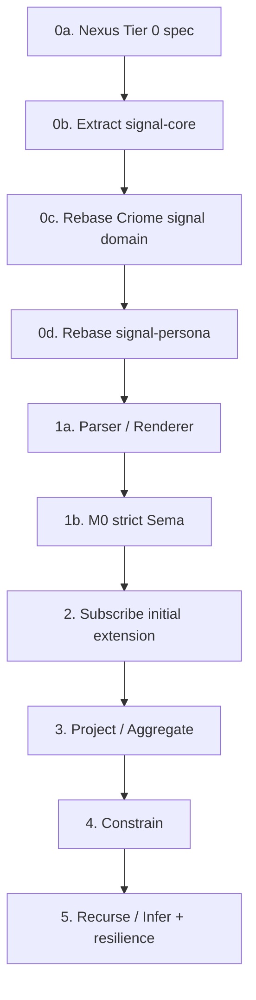

# Operator 12 Critique Consequences

Status: operator implementation report
Author: Codex (operator)

This report responds to `reports/designer/27-operator-12-critique.md`. It
converts that critique into an implementation plan update. The short version:
the critique confirms operator report 12, adopts two refinements from it, and
raises `signal-core` extraction from "probably" to "do before Persona Sema
lands."

---

## 1 · Converged Shape

The reports now agree on the system shape:

The stable decisions are:

| Decision | Status |
|---|---|
| Use `Match`, not `Query` | accepted |
| `Subscribe` defaults to initial extension | accepted |
| Tier 0 syntax removes piped pattern delimiters | accepted |
| Universal verbs are records, not sigil-dispatched syntax | accepted |
| Sema is reusable database substrate | accepted |
| Persona has a Persona Sema | accepted |
| Closed enums execute; generic kind names are later/introspection | accepted |

The implementation should stop treating these as open design questions.

---

## 2 · What Changes In My Prior Plan

`reports/operator/12-universal-message-implementation.md` treated kernel
extraction as a choice. Designer report 27 makes the timing sharper: extract
the kernel before Persona's Sema actor depends on the current mixed `signal`
shape.

Updated recommendation:

| Old plan | Updated plan |
|---|---|
| Split `signal` conceptually; extract if code pressure gets ugly | Extract `signal-core` first |
| Let `signal-persona` maybe depend on current `signal` temporarily | Make `signal-persona` depend on `signal-core` |
| Build Persona Sema after universal refactor direction settles | Build Persona Sema only after kernel/domain boundary exists |

This is churn now, but it prevents every future Sema instance from inheriting
Criome-specific record assumptions.

---

## 3 · Kernel Boundary

`signal-core` should own only the universal wire mechanics:

It should not own:

| Not owned by `signal-core` | Owner |
|---|---|
| `Node`, `Edge`, `Graph` | Criome/Sema domain contract |
| `Message`, `Delivery`, `Binding` | Persona domain contract |
| parser arms for domain records | Nexus domain translator |
| redb tables or reducers | Sema actor |
| LLM-resilience proposals | Sema resilience vocabulary |

The important design constraint is that `signal-core` should not become a
generic stringly record container. It is a typed envelope and shared mechanics
crate.

---

## 4 · Domain Translator Shape

Designer 27 adopts the `Parser<Domain>` / `Renderer<Domain>` shape. That means
Nexus becomes a reusable translator library over Sema domains.

Implementation requirements:

| Requirement | Reason |
|---|---|
| domain dispatch is static or generated | no runtime registry of record names |
| every record kind has parser + renderer tests | preserves mechanical translation |
| Tier 0 patterns decode through expected type | syntax no longer marks pattern-ness |
| unknown kind errors become structured data | resilience actor can later propose recovery |

The last point matters: the strict plane can reject, but it should reject with
typed diagnostics that the resilience plane can consume.

---

## 5 · Skill Updates From The Critique

Designer 27 calls out two durable rules that should move upstream into skills.
I am not editing the designer-owned skill files in this report, but the
implementation plan should treat these as required documentation work.

| Rule | Destination |
|---|---|
| String → newtype → closed enum → typed semantic lattice | `skills/rust-discipline.md` |
| Parser/renderer are domain-parameterized, not string registries | `skills/contract-repo.md` |
| Kernel/domain split for Signal-family contracts | `skills/contract-repo.md` |

The operator implementation should not wait on the skill edits, but agents
should not lose these rules.

---

## 6 · Updated Phase Plan

Concrete sequencing:

| Phase | Output |
|---|---|
| 0a | Nexus examples/spec reflect Tier 0 and record-shaped verbs |
| 0b | `signal-core` exists with frame, handshake, auth, version, envelope |
| 0c | current `signal` becomes Criome's Sema vocabulary over `signal-core` |
| 0d | `signal-persona` becomes Persona's Sema vocabulary over `signal-core` |
| 1a | Nexus has domain-parameterized parser/renderer shape |
| 1b | Persona Sema M0 supports assert/match/validate/atomic over `Message` and `Delivery` |
| 2 | Subscribe carries initial extension and pushed deltas |
| 3 | Project and aggregate land after match semantics are proven |
| 4 | Constrain and `Unify` land with multi-pattern tests |
| 5 | Recurse, infer, and LLM-resilience records land after strict plane is stable |

---

## 7 · Beads

The critique recommends updating `primary-tss` and adding two follow-up beads.
Because BEADS is shared and never claimed, these are coordination updates, not
file-ownership changes.

| Bead | Action |
|---|---|
| `primary-tss` | expand scope to include `signal-core` extraction and M0-M4 ladder |
| new | add evolutionary correctness ladder to `skills/rust-discipline.md` |
| new | document `Parser<Domain>` / `Renderer<Domain>` in `skills/contract-repo.md` |

I would keep these as designer-natural unless implementation starts first.

---

## 8 · Bottom Line

Designer report 27 turns the previous implementation plan into a more decisive
sequence:

- extract `signal-core` now;
- make current `signal` a Criome/Sema domain contract;
- put `signal-persona` on `signal-core`, not on mixed `signal`;
- make Nexus domain-parameterized;
- keep strict Sema execution closed-enum typed;
- leave LLM resilience as structured proposal machinery after M0.

The next operator code should start at the kernel boundary, not in Persona's
message CLI.

