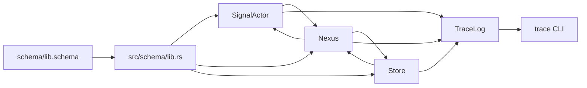

# Spirit-Next Live Trace And Triad Situation

Kind: implementation report. Topics: spirit-next, testing-trace, signal, nexus, sema, schema-derived traits. Date: 2026-06-01. Operator lane.

## Result

The testing trace path now crosses the real process boundary.

The daemon still receives only a binary rkyv configuration file and binary rkyv Signal frames. When the binary `Configuration` carries a trace socket path and the daemon is compiled with `testing-trace`, the daemon writes rkyv-encoded `TraceEvent` frames to that socket. The trace-enabled CLI binds the same socket through `SPIRIT_NEXT_TRACE_SOCKET`, sends the ordinary request over the ordinary daemon socket, decodes the binary trace events, and prints them after the normal Signal reply.

Normal packages remain separate from trace packages. The trace surface is opt-in through Cargo/Nix, not linked into the normal runtime by accident.

## Runtime Shape



Signal, Nexus, and SEMA still communicate through schema-emitted root envelopes and generated traits:

```rust
SignalEngine::triage(signal::Signal<Input>) -> nexus::Nexus<NexusInput>
NexusEngine::execute(&mut Nexus, nexus::Nexus<nexus::Input>) -> nexus::Nexus<nexus::Output>
SemaEngine::apply(&mut Store, sema::Sema<sema::WriteInput>) -> sema::Sema<sema::WriteOutput>
SemaEngine::observe(&Store, sema::Sema<sema::ReadInput>) -> sema::Sema<sema::ReadOutput>
SignalEngine::reply(nexus::Nexus<NexusOutput>) -> signal::Signal<Output>
```

The trace layer follows those same actor boundaries:

```rust
pub trait SignalEngine {
    fn trace_signal_triaged(&self, input: &signal::Signal<signal::Input>, output: &nexus::Nexus<nexus::Input>) {}
    fn triage_inner(&self, input: signal::Signal<signal::Input>) -> nexus::Nexus<nexus::Input>;
    fn triage(&self, input: signal::Signal<signal::Input>) -> nexus::Nexus<nexus::Input> { /* generated wrapper */ }
}

pub trait NexusEngine {
    fn trace_nexus_entered(&self, input: &nexus::Nexus<nexus::Input>) {}
    fn decide(&mut self, input: nexus::Nexus<nexus::Input>) -> nexus::Nexus<nexus::Output>;
    fn execute(&mut self, input: nexus::Nexus<nexus::Input>) -> nexus::Nexus<nexus::Output> { /* generated wrapper */ }
}

pub trait SemaEngine {
    fn trace_sema_write_applied(&self, input: &sema::Sema<sema::WriteInput>, output: &sema::Sema<sema::WriteOutput>) {}
    fn apply_inner(&mut self, input: sema::Sema<sema::WriteInput>) -> sema::Sema<sema::WriteOutput>;
    fn apply(&mut self, input: sema::Sema<sema::WriteInput>) -> sema::Sema<sema::WriteOutput> { /* generated wrapper */ }
}
```

Those hooks are emitted by `schema-rust-next`; they are no-op by default. `SignalActor`, `Nexus`, and `Store` implement the inner behavior methods and override the generated trace hooks in `testing-trace` builds to write into `TraceLog`. The call sites still use the public generated methods (`triage`, `execute`, `apply`, `observe`, `reply`), so tracing observes the same interface path the runtime uses.

## Package Shape

The flake now exposes:

- `packages.default`, `packages.cli`, `packages.daemon`: normal runtime.
- `packages.trace`, `packages.trace-cli`, `packages.trace-daemon`: trace-enabled runtime.

The trace packages are separate Nix outputs so testing instrumentation does not become a hidden production dependency.

No `last-version` package was added. The repository has no release tag or previous-version flake input to point at. Faking `last-version` as current main would make upgrade tests lie.

## Live Proof

The new process-boundary test starts a real daemon with binary configuration containing a trace socket, then runs the real CLI with `SPIRIT_NEXT_TRACE_SOCKET`.

For a record request it proves this event sequence reaches the CLI:

```text
SignalAdmitted
SignalTriaged
NexusEntered
SemaWriteApplied
NexusDecided
SignalReplied
```

For an observe request it proves:

```text
SignalAdmitted
SignalTriaged
NexusEntered
SemaReadObserved
NexusDecided
SignalReplied
```

That is a runtime witness. It does not merely prove strings exist in files. The in-process trace tests also assert each event's `(TraceActor, TraceInterface)` pair, so the proof names Signal admission, `SignalEngine`, `NexusEngine`, and `SemaEngine` as the interfaces actually crossed.

## Verification

Passed:

```text
cargo test --features testing-trace --test instrumentation_logging
cargo test --features nota-text,testing-trace --test process_boundary cli_receives_testing_trace_events_from_daemon_trace_socket -- --exact
cargo test --no-default-features
cargo test --features nota-text
cargo test --features nota-text,testing-trace
cargo clippy --all-targets --features nota-text,testing-trace -- -D warnings
cargo fmt --check
nix flake check
```

## Remaining Gaps

The trace event enum is still hand-authored in `spirit-next`; the next stronger version is schema-emitted trace vocabulary. The engine trace hooks are now generated by `schema-rust-next`, so the previous local parallel trace-trait gap is closed.

The CLI trace configuration currently uses `SPIRIT_NEXT_TRACE_SOCKET`, matching the existing `SPIRIT_NEXT_SOCKET` harness style. A future fully-schema debug call should carry trace options as typed input instead of environment wiring.

The previous-version package needs a real previous release input. Once a release tag exists, the flake should expose a `last-version` package and add upgrade/switchover tests that run current code against copied state and old-client frames.

The triad is honest for the current Spirit pilot. Nexus is the central decision object, but the domain is still small; future components should keep heavier algorithms inside Nexus while keeping Signal as boundary triage/reply and SEMA as durable state.
