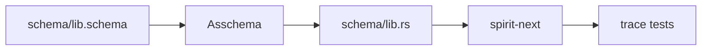
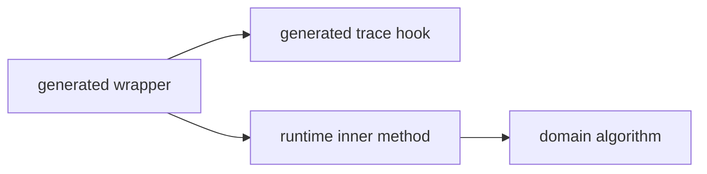
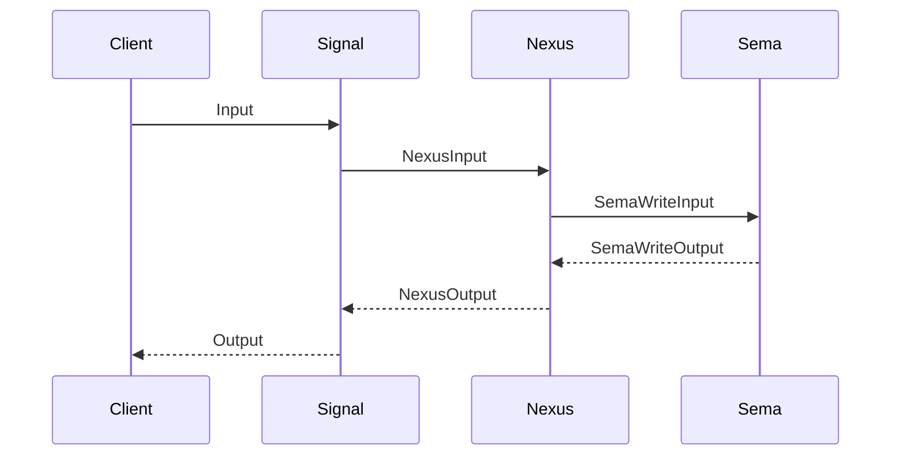
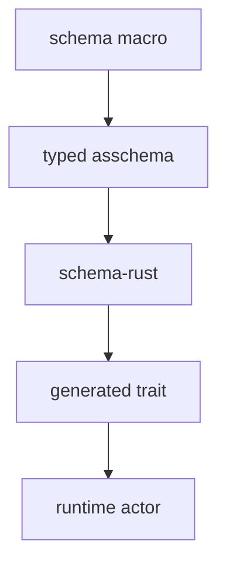
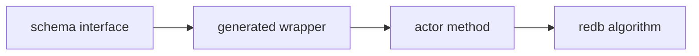

# Generated Interface Logic With Macros

*Kind: architecture walkthrough · Topics: schema-rust-next, spirit-next, generated interfaces, tracing, macro-emitted behavior · 2026-06-02 · operator lane*

## Frame

Psyche asked to show how the current generated interface logic works, and how more of the runtime logic could move with the interface written by schema/macros.

The short answer: the first slice is live. `schema-rust-next` now emits the engine traits, default wrapper methods, and trace hook surfaces. `spirit-next` implements the generated traits on the three runtime actors. The remaining move is to make the schema/macro layer emit more of the repeated policy scaffolding: trace event nouns, validation wrappers, admission/origin-route allocation, route projections, and per-variant decision targets.

Honest caveat: the current engine trait support is generated by `schema-rust-next`, but its rules still live in the emitter. It is not yet declared as macro data. The architectural endpoint is that schema/macros declare the interface behavior and the Rust emitter only renders the typed result.

## Current Pipeline



The authored schema says the component has Signal, Nexus, and SEMA roots:

```nota
{}
[(Record Entry) (Observe Query) (Remove RecordIdentifier)]
[(RecordAccepted SemaReceipt) (RecordsObserved ObservedRecords) (RecordRemoved RemoveReceipt) (Error ErrorReport) (Rejected SignalRejection)]
{
  NexusInput [(Signal Input) (SemaWrite SemaWriteOutput) (SemaRead SemaReadOutput)]
  NexusOutput [(SemaWrite SemaWriteInput) (SemaRead SemaReadInput) (Signal Output)]
  SemaWriteInput [(Record Entry) (Remove RecordIdentifier)]
  SemaReadInput [(Observe Query)]
  SemaWriteOutput [(Recorded SemaReceipt) (Removed RemoveReceipt) (Missed ErrorReport)]
  SemaReadOutput [(Observed ObservedRecords) (Missed ErrorReport)]
  Entry { Topics * Kind * Description * Magnitude * }
}
```

The key is that the interfaces are data first. The schema names the root messages and plane envelopes. `schema-rust-next` emits Rust nouns and traits from that data. `spirit-next` then implements the traits on its actors.

## Generated Trait Surface

This is the live generated interface in `spirit-next/src/schema/lib.rs`. The public engine methods are not handwritten in `spirit-next`; they are emitted by `schema-rust-next`.

```rust
pub trait SignalEngine {
    fn trace_signal_admitted(&self, _input: &signal::Signal<signal::Input>) {}
    fn trace_signal_rejected(&self, _output: &signal::Signal<signal::Output>) {}
    fn trace_signal_triaged(&self, _input: &signal::Signal<signal::Input>, _output: &nexus::Nexus<nexus::Input>) {}
    fn trace_signal_replied(&self, _output: &signal::Signal<signal::Output>) {}

    fn triage_inner(&self, input: signal::Signal<signal::Input>) -> nexus::Nexus<nexus::Input>;
    fn reply_inner(&self, output: nexus::Nexus<nexus::Output>) -> signal::Signal<signal::Output>;

    fn triage(&self, input: signal::Signal<signal::Input>) -> nexus::Nexus<nexus::Input> {
        let trace_input = input.clone();
        let output = self.triage_inner(input);
        self.trace_signal_triaged(&trace_input, &output);
        output
    }
}
```

The pattern repeats for Nexus and SEMA:

```rust
pub trait NexusEngine {
    fn trace_nexus_entered(&self, _input: &nexus::Nexus<nexus::Input>) {}
    fn trace_nexus_decided(&self, _output: &nexus::Nexus<nexus::Output>) {}

    fn decide(&mut self, input: nexus::Nexus<nexus::Input>) -> nexus::Nexus<nexus::Output>;

    fn execute(&mut self, input: nexus::Nexus<nexus::Input>) -> nexus::Nexus<nexus::Output> {
        self.trace_nexus_entered(&input);
        let output = self.decide(input);
        self.trace_nexus_decided(&output);
        output
    }
}

pub trait SemaEngine {
    fn trace_sema_write_applied(&self, _input: &sema::Sema<sema::WriteInput>, _output: &sema::Sema<sema::WriteOutput>) {}
    fn trace_sema_read_observed(&self, _input: &sema::Sema<sema::ReadInput>, _output: &sema::Sema<sema::ReadOutput>) {}

    fn apply_inner(&mut self, input: sema::Sema<sema::WriteInput>) -> sema::Sema<sema::WriteOutput>;
    fn observe_inner(&self, input: sema::Sema<sema::ReadInput>) -> sema::Sema<sema::ReadOutput>;
}
```

This is the important architectural split:



The generated wrapper owns the standard boundary behavior. The runtime actor owns only the domain-specific decision or database operation.

## Runtime Actors

The runtime side now implements generated traits instead of owning parallel local traits.

```rust
impl SignalEngine for SignalActor {
    fn triage_inner(&self, input: signal::Signal<Input>) -> nexus::Nexus<NexusInput> {
        let origin_route = input.origin_route();
        NexusInput::from(input.into_root()).with_origin_route(origin_route)
    }

    fn reply_inner(&self, output: nexus::Nexus<NexusOutput>) -> signal::Signal<Output> {
        output.into_signal_output()
    }
}
```

Nexus is the decision center. Its public `execute` method is generated; the actor implements `decide`.

```rust
impl NexusEngine for Nexus {
    fn decide(&mut self, input: nexus::Nexus<nexus::Input>) -> nexus::Nexus<nexus::Output> {
        let output = input.into_nexus_output();
        let origin_route = output.origin_route();
        match output.into_root() {
            NexusOutput::SemaWrite(input) => {
                let sema_output = SemaEngine::apply(&mut self.store, input.with_origin_route(origin_route));
                sema_output.into_nexus_input().into_nexus_output()
            }
            NexusOutput::SemaRead(input) => {
                let sema_output = SemaEngine::observe(&self.store, input.with_origin_route(origin_route));
                sema_output.into_nexus_input().into_nexus_output()
            }
            NexusOutput::Signal(output) => NexusOutput::from(output).with_origin_route(origin_route),
        }
    }
}
```

SEMA owns durable state. Its public `apply` and `observe` methods are generated; the store implements `apply_inner` and `observe_inner`.

```rust
impl SemaEngine for Store {
    fn apply_inner(&mut self, command: sema::Sema<sema::WriteInput>) -> sema::Sema<sema::WriteOutput> {
        let origin_route = command.origin_route();
        let output = match command.into_root() {
            SemaWriteInput::Record(entry) => match self.record(entry) {
                Ok(identifier) => SemaWriteOutput::Recorded(SemaReceipt { /* fields */ }),
                Err(error) => SemaWriteOutput::Missed(ErrorReport { /* fields */ }),
            },
            SemaWriteInput::Remove(identifier) => match self.remove(identifier.0) {
                Ok(true) => SemaWriteOutput::Removed(RemoveReceipt { /* fields */ }),
                Ok(false) => SemaWriteOutput::Missed(ErrorReport { /* fields */ }),
                Err(error) => SemaWriteOutput::Missed(ErrorReport { /* fields */ }),
            },
        };
        output.with_origin_route(origin_route)
    }
}
```

## Live Trace Witness

The trace tests now prove runtime use, not string presence. A record operation crosses these interfaces:



The live trace event sequence for a successful record is:

```text
SignalAdmitted
SignalTriaged
NexusEntered
SemaWriteApplied
NexusDecided
SignalReplied
```

That is the right kind of architecture witness. It proves the actor/interface boundary is executed at runtime. It is stronger than grep checks because it observes the live path.

## What Already Moved

The trace hooks moved from local runtime traits into generated engine traits.

Before the move, `spirit-next` had to define local trace traits or ad hoc trace functions. That shape made tracing a runtime convenience. After the move, tracing is part of the generated interface contract:

```rust
fn trace_nexus_entered(&self, _input: &nexus::Nexus<nexus::Input>) {}
fn trace_nexus_decided(&self, _output: &nexus::Nexus<nexus::Output>) {}

fn execute(&mut self, input: nexus::Nexus<nexus::Input>) -> nexus::Nexus<nexus::Output> {
    self.trace_nexus_entered(&input);
    let output = self.decide(input);
    self.trace_nexus_decided(&output);
    output
}
```

The implementation can opt into trace by overriding the hooks under `testing-trace`. A non-trace build keeps the no-op defaults and does not need the runtime trace logger.

## What Is Still Handwritten

Four important pieces still live too low in `spirit-next`.

1. Trace event nouns are still hand-authored in `trace.rs`.
2. Validation rules are still hand-authored methods on emitted nouns.
3. Signal admission still hand-mints origin routes and message identifiers.
4. Routing projections are still emitted by emitter heuristics, not by explicit schema macro data.

The current shape is acceptable as a pilot, but the clean target is stronger: the schema/macro surface should own the repetitive behavior, and the runtime actors should only supply domain decisions and algorithms.

## Moving Logic With The Interface

The next moves should keep one principle: when behavior is the same for every component plane, it belongs with the generated interface. When behavior is domain-specific computation, it belongs in the actor implementation.



### 1. Trace Event Vocabulary

The schema should declare that an engine plane has trace events. The macro expands that into trace event types plus hook methods.

Target syntax sketch:

```nota
TracePlane {
  Signal [Admitted Rejected Triaged Replied]
  Nexus [Entered Decided]
  Sema [WriteApplied ReadObserved]
}
```

Generated Rust target:

```rust
pub enum TraceEvent {
    SignalAdmitted { origin_route: OriginRoute, input: Input },
    SignalTriaged { origin_route: OriginRoute, input: Input, output: NexusInput },
    NexusEntered { origin_route: OriginRoute, input: NexusInput },
    SemaWriteApplied { origin_route: OriginRoute, input: SemaWriteInput, output: SemaWriteOutput },
}
```

Then `trace.rs` becomes transport and storage for trace events, not the owner of the event vocabulary.

### 2. Validation As Schema Constraints

Validation can move from handwritten methods to schema annotations.

Target syntax sketch:

```nota
Entry {
  Topics (Constraint NonEmpty)
  Kind *
  Description (Constraint NonEmpty)
  Magnitude *
}
```

Generated Rust target:

```rust
pub trait Validate {
    fn validate(&self) -> Result<(), ValidationError>;
}

impl Validate for Entry {
    fn validate(&self) -> Result<(), ValidationError> {
        self.topics.validate()?;
        self.description.validate()?;
        Ok(())
    }
}
```

The runtime admission actor calls a generated validation interface; it does not know individual field rules.

### 3. Admission As Generated Interface

Signal admission is still too handmade. It should become an emitted wrapper around an actor-provided allocator.

Current actor-specific logic:

```rust
pub fn admit(&self, input: Input) -> Result<SignalAccepted, SignalRejected> {
    let origin_route = self.issue_origin_route();
    let signal_input = input.with_origin_route(origin_route);
    let identifier = self.issue_message_identifier();
    signal_input.root().validate()?;
    self.trace_signal_admitted(&signal_input);
    Ok(SignalAccepted { sent: signal_input.message_sent(identifier), input: signal_input })
}
```

Target generated shape:

```rust
pub trait SignalAdmission: SignalEngine {
    fn issue_origin_route(&self) -> OriginRoute;
    fn issue_message_identifier(&self) -> MessageIdentifier;

    fn admit(&self, input: Input) -> Result<SignalAccepted, SignalRejected> {
        let origin_route = self.issue_origin_route();
        let signal_input = input.with_origin_route(origin_route);
        let identifier = self.issue_message_identifier();
        signal_input.root().validate()?;
        self.trace_signal_admitted(&signal_input);
        Ok(SignalAccepted::new(signal_input, identifier))
    }
}
```

The actor then supplies only allocation state. The interface owns the behavior shape.

### 4. Routing As Macro Data

The current routing is generated from name conventions. The more honest version is explicit routing data in schema.

Target syntax sketch:

```nota
Routes {
  Record (SignalToSemaWrite Record)
  Observe (SignalToSemaRead Observe)
  Remove (SignalToSemaWrite Remove)
}
```

Generated target:

```rust
impl signal::Signal<Input> {
    pub fn into_nexus_input(self) -> nexus::Nexus<NexusInput> {
        NexusInput::Signal(self.into_root()).with_origin_route(self.origin_route())
    }
}

impl nexus::Nexus<NexusInput> {
    pub fn into_nexus_output(self) -> nexus::Nexus<NexusOutput> {
        match self.into_root() {
            NexusInput::Signal(Input::Record(entry)) => NexusOutput::SemaWrite(SemaWriteInput::Record(entry)).with_origin_route(self.origin_route()),
            NexusInput::Signal(Input::Observe(query)) => NexusOutput::SemaRead(SemaReadInput::Observe(query)).with_origin_route(self.origin_route()),
            NexusInput::Signal(Input::Remove(identifier)) => NexusOutput::SemaWrite(SemaWriteInput::Remove(identifier)).with_origin_route(self.origin_route()),
            other => other.project_signal_output(),
        }
    }
}
```

That makes the schema the owner of the interface flow. The runtime Nexus still chooses whether to call SEMA, stash a result, inline a result, retry, or reject.

### 5. Decision Targets

Nexus currently has a thin `decide` because the pilot domain has little algorithmic choice. The next shape should generate per-variant decision methods, so heavy logic has precise slots.

Generated target:

```rust
pub trait NexusEngine {
    fn decide_record(&mut self, input: Entry, route: OriginRoute) -> nexus::Nexus<nexus::Output>;
    fn decide_observe(&mut self, input: Query, route: OriginRoute) -> nexus::Nexus<nexus::Output>;
    fn decide_remove(&mut self, input: RecordIdentifier, route: OriginRoute) -> nexus::Nexus<nexus::Output>;

    fn decide(&mut self, input: nexus::Nexus<nexus::Input>) -> nexus::Nexus<nexus::Output> {
        let route = input.origin_route();
        match input.into_root() {
            NexusInput::Signal(Input::Record(entry)) => self.decide_record(entry, route),
            NexusInput::Signal(Input::Observe(query)) => self.decide_observe(query, route),
            NexusInput::Signal(Input::Remove(identifier)) => self.decide_remove(identifier, route),
            other => self.decide_projected(other, route),
        }
    }
}
```

This is the best version of "move the logic with the interface": the generated trait owns the match shape and the boundary tracing; the actor fills the algorithmic methods.

## What Must Stay Handwritten

Some logic should not move into macros.

Store persistence is real domain algorithm:

```rust
fn record(&self, entry: Entry) -> Result<u64, StoreError> {
    let archive = rkyv::to_bytes::<rkyv::rancor::Error>(&entry)?;
    let transaction = self.database.begin_write()?;
    /* redb table mutation */
    transaction.commit()?;
    Ok(identifier)
}
```

The schema should define that SEMA has a `Record Entry -> Recorded SemaReceipt` operation. It should not define redb transaction mechanics. The boundary is:



That keeps the code terse without pretending database algorithms are schema declarations.

## Clean Next Slice

The next operator slice should move one more behavior family into the generated interface, without rewriting the world.

Recommended order:

1. Generate `TraceEvent`, `TraceActor`, and `TraceInterface` from schema data.
2. Keep `TraceLog`, socket transport, and frame encode/decode in `spirit-next` or a trace support crate.
3. Add tests proving the generated trace event enum replaces the hand-authored enum.
4. Then generate `Validate` from schema constraints.
5. Then generate `SignalAdmission` as the owner of origin-route/message-identifier admission flow.

This order is practical because trace is already wired through the generated trait hooks. Replacing the event vocabulary is a local strengthening of the system already running.

## Current Situation

Live:

- Schema source defines Signal, Nexus, SEMA root types and operation envelopes.
- `schema-rust-next` emits engine traits and trace wrappers.
- `spirit-next` actors implement those traits.
- Trace tests prove runtime calls cross Signal, Nexus, and SEMA interfaces.
- Trace is optional through `testing-trace`; non-trace builds retain no-op generated hooks.

Still to move:

- Trace event nouns.
- Validation rules.
- Signal admission policy.
- Route/projection tables.
- Per-variant Nexus decision slots.

The system is now on the right side of the line: generated interfaces are load-bearing in production behavior. The remaining work is to make the macro/schema layer own more of the repeated behavior so future components get the same actor triad shape by declaring the interface, not by copying runtime code.
