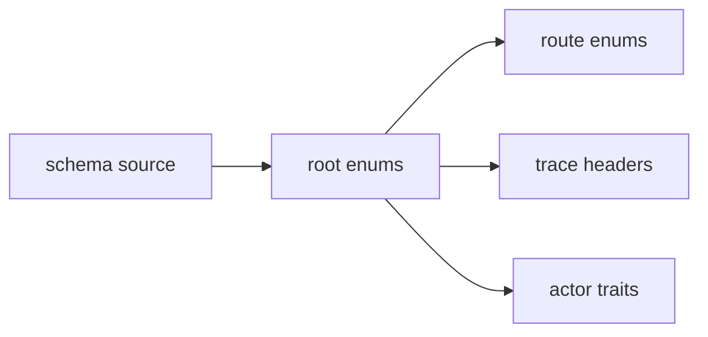
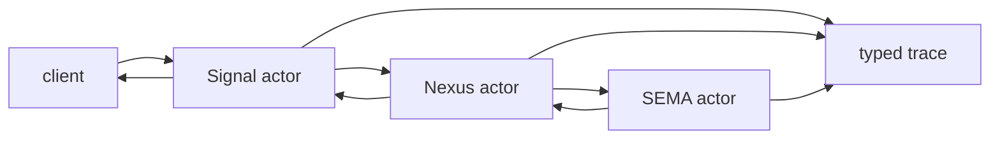
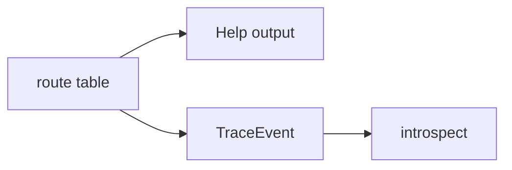

# Trace Header Generated Interface Situation

*Kind: architecture and implementation report · Topics: spirit-next, schema-rust-next, trace, header, generated interfaces, introspect · 2026-06-02 · operator lane*

## Frame

Psyche clarified the first item from designer 470. The trace name should not be a string chosen after macro expansion. The schema/macro interface already names the object language: root enums, variants, carried payload types, and actor trait activation points. Trace identifiers should be generated typed values from that language.

Captured as Spirit records:

- `1406`: trace object identity is generated from the schema interface language, not arbitrary strings.
- `1407`: root interfaces are meaningful multi-action enums; a one-action interface is underdeveloped.
- `1408`: trace headers derive from the interface header; compact numeric encodings are downstream from the typed header object.

This report answers what that means for the live stack and what the next implementation slice should change.

## The Current Live Shape

`spirit-next/schema/lib.schema` now has honest multi-action root signatures:

```nota
{}
[(Record Entry) (Observe Query) (Lookup RecordIdentifier) (Count Query) (Remove RecordIdentifier)]
[(RecordAccepted SemaReceipt) (RecordsObserved ObservedRecords) (RecordFound FoundRecord) (RecordsCounted CountedRecords) (RecordRemoved RemoveReceipt) (Error ErrorReport) (Rejected SignalRejection)]
{
  NexusInput [(Signal Input) (SemaWrite SemaWriteOutput) (SemaRead SemaReadOutput)]
  NexusOutput [(SemaWrite SemaWriteInput) (SemaRead SemaReadInput) (Signal Output)]
  SemaWriteInput [(Record Entry) (Remove RecordIdentifier)]
  SemaReadInput [(Observe Query) (Lookup RecordIdentifier) (Count Query)]
  SemaWriteOutput [(Recorded SemaReceipt) (Removed RemoveReceipt) (Missed ErrorReport)]
  SemaReadOutput [(Observed ObservedRecords) (Found FoundRecord) (Counted CountedRecords) (Missed ErrorReport)]
}
```

Each enum body is a homogeneous vector of variant blocks:

- `Record` would be a unit variant if written bare.
- `(Record Entry)` is one parenthesized data-variant signature block.
- The payload type name `Entry` resolves in the namespace below.

That header is already enough to derive route names, payload names, short headers, help text, and trace identity.

The current generated Rust already emits route identities for the outer Signal wire roots:

```rust
pub enum InputRoute {
    Record,
    Observe,
    Lookup,
    Count,
    Remove,
}

pub enum OutputRoute {
    RecordAccepted,
    RecordsObserved,
    RecordFound,
    RecordsCounted,
    RecordRemoved,
    Error,
    Rejected,
}
```

But the current trace event in `spirit-next/src/trace.rs` is still stringly:

```rust
pub struct TraceObjectName(pub String);

pub struct TraceEvent {
    object_name: TraceObjectName,
}
```

And `schema-rust-next` currently emits default trace hooks like:

```rust
fn trace_nexus_activation(&self, _object_name: &'static str) {}

fn trace_nexus_entered(&self) {
    self.trace_nexus_activation("NexusEntered");
}
```

That is useful as a runtime witness, but it is not the final design. The trace identity should be typed and generated from the same interface data that emits `InputRoute`, `OutputRoute`, and the engine traits.

## The Correct Mental Model

The schema header is the typed object language.



No graph label uses embedded newlines; that keeps rendered reports legible.

The root header has a small set of facts:

```nota
(Record Entry)
```

Means:

- root kind: `Input`
- variant name: `Record`
- payload type: `Entry`
- short route name: `InputRoute::Record`
- display header: `Input Record Entry`
- compact header: generated from that typed identity

For a nested plane header:

```nota
NexusInput [(Signal Input) (SemaWrite SemaWriteOutput) (SemaRead SemaReadOutput)]
```

Means `NexusInput::Signal` carries the whole `Input` root enum. If the actual runtime payload is `Input::Remove(RecordIdentifier)`, an extended trace header may include both rows:

```text
NexusInput Signal Input Remove RecordIdentifier
```

The typed object comes first. A 64-bit or 128-bit compact representation is only an encoding of that typed object.

## Two Trace Identities, One Rule

There are two traceable things, and both should be generated.

First: interface-object identity. This is the object language created by schema roots.

```rust
pub enum TraceInterfaceObject {
    SignalInput(InputRoute),
    SignalOutput(OutputRoute),
    NexusInput(NexusInputRoute),
    NexusOutput(NexusOutputRoute),
    SemaWriteInput(SemaWriteInputRoute),
    SemaReadInput(SemaReadInputRoute),
    SemaWriteOutput(SemaWriteOutputRoute),
    SemaReadOutput(SemaReadOutputRoute),
}
```

Second: actor-boundary identity. This is the object language created by the generated engine traits.

```rust
pub enum TraceActorObject {
    SignalAdmitted,
    SignalRejected,
    SignalTriaged,
    SignalReplied,
    NexusEntered,
    NexusDecided,
    SemaWriteApplied,
    SemaReadObserved,
}
```

Then the trace event is one generated noun:

```rust
pub enum TraceObject {
    Interface(TraceInterfaceObject),
    Actor(TraceActorObject),
}

pub struct TraceEvent {
    object: TraceObject,
}
```

This keeps the current “name-only” correction: trace events still do not snapshot full payloads. But the name is no longer an arbitrary string. It is a generated enum value derived from the interface and actor-trait macros.

## Why Actor Objects Still Matter

Psyche’s immediate phrase was “the name of the object being activated.” There are two valid readings:

- the interface object activated, such as `Input Remove RecordIdentifier`
- the actor boundary activated, such as `NexusEntered`

The current tests need the second kind because they prove Signal, Nexus, and SEMA actors actually ran. The first kind proves which schema-defined message route was processed. They complement each other:



If a future trace mode wants only interface objects, it can filter out `TraceObject::Actor`. The type system should still generate both because actor activation is the runtime proof that replaced grep checks.

## Generated Route Coverage Gap

The generator only emits route enums and short headers for the outer `Input` and `Output` roots today. It should emit route enums for every enum that is used as a plane root:

```rust
pub enum NexusInputRoute {
    Signal,
    SemaWrite,
    SemaRead,
}

pub enum SemaReadInputRoute {
    Observe,
    Lookup,
    Count,
}
```

Each root enum should get:

- `route() -> <RootName>Route`
- `short_header() -> u64` where that root travels as a framed binary root
- `trace_header() -> TraceInterfaceObject` where that root is observable
- a generated `Help` action in root interfaces that need human-visible command discovery

Generated `Help` should not satisfy the “more than one meaningful action” rule. A one-domain-action interface plus generated `Help` is still underdeveloped; the interface needs at least two meaningful domain actions before the generated help action is added.

## Short Header And Extended Header

Current Signal frames use an 8-byte short header. That is enough for wire dispatch:

```rust
frame.extend_from_slice(&self.short_header().to_le_bytes());
```

Trace needs a richer typed identity. The recommended split:

```rust
pub struct TraceHeader {
    object: TraceObject,
}

pub struct ShortHeader(pub u64);

pub struct ExtendedHeader {
    primary: ShortHeader,
    secondary: ShortHeader,
}
```

`TraceHeader` is semantic and generated from schema. `ShortHeader` and `ExtendedHeader` are compact encodings. If a 128-bit representation is wanted later, `ExtendedHeader` can be the two-word form without changing the semantic trace object.

The first implementation should not guess a permanent 128-bit layout. It should generate the typed route/header enums first, then add compact encodings once the route coverage is correct.

## Help And Introspect Use The Same Table

The same generated route table should serve three consumers:



`Help` is not a separate ad hoc string table. It is generated from interface descriptions and route metadata.

`introspect` should not guess trace strings. It should decode typed trace frames and store/query `TraceObject` values. That makes trace intel searchable by component, actor, root, variant, and payload type without parsing display text.

## Implementation Slice

The clean next operator slice is generator first, runtime second.

1. In `schema-rust-next`, emit `<RootName>Route` for every root-like enum used by Signal/Nexus/SEMA planes, not only outer `Input` and `Output`.
2. Emit `TraceInterfaceObject`, `TraceActorObject`, `TraceObject`, and `TraceEvent` from schema and generated engine-trait metadata.
3. Change generated trace hooks from `&'static str` to `TraceObject`.
4. In `spirit-next`, replace `TraceObjectName(String)` with the generated `TraceObject`.
5. Update trace tests to assert enum values, for example `TraceObject::Actor(TraceActorObject::NexusEntered)`, not strings.
6. Keep CLI trace delivery binary/rkyv; display rendering can turn the typed object into readable text at the edge.
7. Add route coverage tests proving `NexusInput`, `NexusOutput`, `SemaWriteInput`, `SemaReadInput`, `SemaWriteOutput`, and `SemaReadOutput` all have generated route types.

The expected trace sequence for a remove request should become typed:

```rust
[
    TraceObject::Actor(TraceActorObject::SignalAdmitted),
    TraceObject::Interface(TraceInterfaceObject::SignalInput(InputRoute::Remove)),
    TraceObject::Actor(TraceActorObject::SignalTriaged),
    TraceObject::Interface(TraceInterfaceObject::NexusInput(NexusInputRoute::Signal)),
    TraceObject::Actor(TraceActorObject::NexusEntered),
    TraceObject::Interface(TraceInterfaceObject::SemaWriteInput(SemaWriteInputRoute::Remove)),
    TraceObject::Actor(TraceActorObject::SemaWriteApplied),
    TraceObject::Actor(TraceActorObject::NexusDecided),
    TraceObject::Interface(TraceInterfaceObject::SignalOutput(OutputRoute::RecordRemoved)),
    TraceObject::Actor(TraceActorObject::SignalReplied),
]
```

This proves the actors ran and proves the schema-defined interfaces were used. It does not carry payload snapshots.

## Questions Still Worth Asking

1. Should actor-boundary trace and interface-object trace always both fire, or should the testing configuration choose one or both?
2. Should `Help` be generated on every root enum, or only externally visible Signal roots first?
3. Should compact headers be generated for all plane roots, or only roots that cross process boundaries?
4. Should nested extended headers include only one nested row, or recurse through nested enum payloads until the first struct/newtype payload?
5. Should the future `introspect` component store raw typed `TraceObject` only, or store both `TraceObject` and a pre-rendered display string for query speed?

Operator lean:

- Generate typed route identities for all roots now.
- Generate typed trace identity now.
- Keep actor and interface trace as two enum families under one `TraceObject`.
- Defer numeric width beyond the current `u64` wire header until the typed identity exists.
- Generate `Help` from the same route table, but do not count generated `Help` as a meaningful domain action for the multi-action root rule.

## What This Touches

`schema-next`: no immediate model change if Asschema already carries root variants and payload references. The source reader should validate multi-action roots and preserve payload names for route metadata.

`schema-rust-next`: main work. Emit all root route enums, generated trace identity, and typed trace hooks.

`spirit-next`: replace hand-written `TraceObjectName(String)` with generated trace identity and update tests/CLI rendering.

`introspect`: later consumer. It should decode typed trace frames, not parse strings.

`Help`: later consumer. It should render generated interface descriptions from the same route/header metadata.

`Nix`: keep normal and trace packages separate. No change to the principle: trace is opt-in and not linked into normal daemon builds.

## Bottom Line

The live stack is close: the interface header is honest, the triad traits are generated, trace crosses the real process boundary, and the CLI can receive trace output. The remaining mistake is that trace identity is still string-shaped. The next implementation should make trace identity a generated closed enum surface derived from the same schema header that already emits route and short-header logic.
