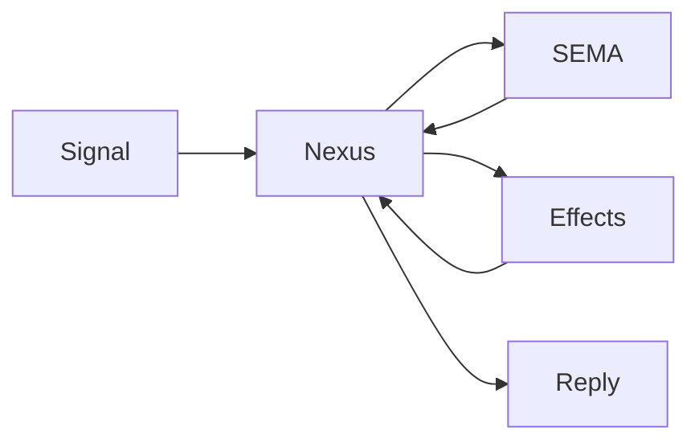

# 287 — Nexus Recursive Computation Continuation

## Sources Read

- `reports/designer/476-nexus-side-channel-maximum-escalation-2026-06-02.md`
- `repos/spirit-next/schema/lib.schema`
- `repos/spirit-next/src/nexus.rs`
- `repos/spirit-next/src/engine.rs`
- `repos/spirit-next/src/schema/lib.rs`
- Spirit records 1326-1439, especially 1330-1336, 1387-1389, 1419, 1422, 1437, 1438, 1439

## The Correction

The prior symmetric shape was wrong:

```nota
NexusInput  [(Signal ...) (SemaWrite ...) (SemaRead ...)]
NexusOutput [(Signal ...) (SemaWrite ...) (SemaRead ...)]
```

That reads like both sides are the same kind of thing. They are not.

The better frame is:

- **NexusWork**: what Nexus is currently asked to decide from.
- **NexusAction**: what Nexus chooses to do next.

Nexus can return an action that becomes more Nexus work. That is the
recursive continuation insight from Spirit 1439.



## Angle 1 — Semantic Model

Nexus is not just a pass-through from Signal to SEMA. It is the
component's computation center. It consumes facts, replies, and
continuations, then emits the next action.

The terms should be directional:

- `SignalArrived`: Signal has delivered a client request into Nexus.
- `SemaWriteFinished`: SEMA finished a write Nexus requested earlier.
- `SemaReadFinished`: SEMA finished a read Nexus requested earlier.
- `EffectFinished`: a non-SEMA Nexus effect finished.
- `InternalContinued`: Nexus recursively scheduled more work for itself.

Actions are also directional:

- `ReplyToSignal`: Nexus is done and has a wire reply.
- `CommandSemaWrite`: Nexus needs durable mutation.
- `CommandSemaRead`: Nexus needs durable observation.
- `CommandEffect`: Nexus needs a local runtime effect.
- `Continue`: Nexus immediately loops with more Nexus work.

That separates the meanings:

```nota
NexusWork [
  (SignalArrived Input)
  (SemaWriteFinished SemaWriteOutput)
  (SemaReadFinished SemaReadOutput)
  (EffectFinished NexusEffectResult)
  (InternalContinued NexusInternalWork)
]

NexusAction [
  (ReplyToSignal Output)
  (CommandSemaWrite SemaWriteInput)
  (CommandSemaRead SemaReadInput)
  (CommandEffect NexusEffectCommand)
  (Continue NexusWork)
]
```

The two roots are not mirrors. One is what Nexus receives; the other is
what Nexus decides next.

## Angle 2 — Schema Composition

Schemas can contain objects from other schemas. With Spirit 1422, the
Signal contract belongs in `signal-spirit`; the daemon imports those
types. Nexus and SEMA remain daemon-local until scale-out requires
otherwise.

That gives this source shape in a daemon schema:

```nota
{
  Input signal-spirit:lib:Input
  Output signal-spirit:lib:Output
  Entry signal-spirit:lib:Entry
  Query signal-spirit:lib:Query
}
[]
[]
{
  NexusWork [
    (SignalArrived Input)
    (SemaWriteFinished SemaWriteOutput)
    (SemaReadFinished SemaReadOutput)
    (EffectFinished NexusEffectResult)
    (InternalContinued NexusInternalWork)
  ]

  NexusAction [
    (ReplyToSignal Output)
    (CommandSemaWrite SemaWriteInput)
    (CommandSemaRead SemaReadInput)
    (CommandEffect NexusEffectCommand)
    (Continue NexusWork)
  ]

  SemaWriteInput [(Record Entry) (Remove RecordIdentifier)]
  SemaReadInput [(Observe Query) (Lookup RecordIdentifier) (Count Query)]
  SemaWriteOutput [(Recorded SemaReceipt) (Removed RemoveReceipt) (Missed ErrorReport)]
  SemaReadOutput [(Observed ObservedRecords) (Found FoundRecord) (Counted CountedRecords) (Missed ErrorReport)]

  NexusEffectCommand [(Stash StashRequest) (Fanout FanoutRequest) (Drop DropRequest)]
  NexusEffectResult [(Stashed StashResult) (FannedOut FanoutResult) (Dropped DropResult)]
  NexusInternalWork [(CheckStash StashResult) (FinishObserved ObservedRecords)]
}
```

This absorbs designer 476's side-channel list into a cleaner place:
`Stash`, `Fanout`, `Drop`, `Enqueue`, `Preempt`, `Cascade`, and
`Summarize` are not random final `NexusOutput` variants. They are
effect commands and effect results inside the Nexus continuation
language.

The exact effect set is component-specific. `spirit-next` might start
with `Stash` only. `introspect` might start with `Fanout`, `Summarize`,
and `Drop`. `orchestrate` might use `Preempt` and `Enqueue`.

## Angle 3 — Generated Runner

The generated runner should own the loop. Hand-written component code
should implement only domain decisions and effect algorithms.

```rust
impl ComponentRunner {
    pub fn run_signal(&mut self, input: signal::Signal<Input>) -> signal::Signal<Output> {
        let mut work = NexusWork::SignalArrived(input.into_root())
            .with_origin_route(input.origin_route());

        loop {
            let action = NexusEngine::decide(&mut self.nexus, work);
            match action.into_root() {
                NexusAction::ReplyToSignal(output) => {
                    return output.with_origin_route(action.origin_route());
                }
                NexusAction::CommandSemaWrite(command) => {
                    let reply = SemaEngine::apply(&mut self.sema, command.with_origin_route(action.origin_route()));
                    work = NexusWork::SemaWriteFinished(reply.into_root()).with_origin_route(reply.origin_route());
                }
                NexusAction::CommandSemaRead(command) => {
                    let reply = SemaEngine::observe(&self.sema, command.with_origin_route(action.origin_route()));
                    work = NexusWork::SemaReadFinished(reply.into_root()).with_origin_route(reply.origin_route());
                }
                NexusAction::CommandEffect(command) => {
                    let reply = NexusEffectEngine::apply(&mut self.effects, command.with_origin_route(action.origin_route()));
                    work = NexusWork::EffectFinished(reply.into_root()).with_origin_route(reply.origin_route());
                }
                NexusAction::Continue(next_work) => {
                    work = next_work.with_origin_route(action.origin_route());
                }
            }
        }
    }
}
```

This is the recursive model: Nexus can return a Nexus continuation
without leaving the Nexus computation language.

The production runner needs a continuation guard:

```rust
pub struct ContinuationBudget(pub Integer);
```

A loop that never reaches `ReplyToSignal` is a runtime error, not a
valid component behavior. The budget should be generated runner policy,
not hand-coded in every daemon.

## What Changes From Designer 476

Designer 476 identifies the right pressure: current Nexus is too thin.
The proposed direct answer in 476 is less clean because it adds
side-channel variants directly to the final `NexusOutput` surface.

The refined answer:

- Keep `NexusAction::ReplyToSignal(Output)` as the only final client
  exit.
- Put side effects under `NexusAction::CommandEffect`.
- Feed effect completions back as `NexusWork::EffectFinished`.
- Allow recursive `NexusAction::Continue(NexusWork)` for immediate
  self-continuation.

This keeps directionality and lets Nexus become the computation center
without turning every side effect into a fake reply.

## Spirit-Next Pilot Shape

Current `spirit-next`:

```nota
NexusInput [(Signal Input) (SemaWrite SemaWriteOutput) (SemaRead SemaReadOutput)]
NexusOutput [(SemaWrite SemaWriteInput) (SemaRead SemaReadInput) (Signal Output)]
```

Proposed pilot:

```nota
NexusWork [
  (SignalArrived Input)
  (SemaWriteFinished SemaWriteOutput)
  (SemaReadFinished SemaReadOutput)
  (EffectFinished NexusEffectResult)
  (InternalContinued NexusInternalWork)
]

NexusAction [
  (ReplyToSignal Output)
  (CommandSemaWrite SemaWriteInput)
  (CommandSemaRead SemaReadInput)
  (CommandEffect NexusEffectCommand)
  (Continue NexusWork)
]

NexusEffectCommand [(Stash StashRequest)]
NexusEffectResult [(Stashed StashResult)]
```

Then `Observe` can become:

1. `SignalArrived(Input::Observe(Query))`
2. `CommandSemaRead(SemaReadInput::Observe(Query))`
3. `SemaReadFinished(SemaReadOutput::Observed(ObservedRecords))`
4. `CommandEffect(NexusEffectCommand::Stash(StashRequest))`
5. `EffectFinished(NexusEffectResult::Stashed(StashResult))`
6. `ReplyToSignal(Output::RecordsObserved(SlimObservedRecords))`

The trace should show Nexus entered more than once for one original
Signal route. That is the runtime proof that recursive Nexus
continuation is real.

## Implementation Leans

1. Rename the current generated `NexusInput` / `NexusOutput` model
   when this lands. The words are too weak. Use `NexusWork` and
   `NexusAction`, or similarly directional nouns.

2. Keep SEMA split as command/result pairs. Do not collapse SEMA back
   into "operation" words; write/read direction matters.

3. Keep `NexusEffectCommand` and `NexusEffectResult` daemon-local.
   They are not client-facing Signal types. They can import payloads
   from Signal and SEMA schemas as needed.

4. Generate the runner loop in `schema-rust-next`, not in
   `spirit-next` by hand. The daemon should fill in trait impls for
   `NexusEngine`, `SemaEngine`, and `NexusEffectEngine`.

5. Pilot only one effect first: `Stash`. Do not implement the whole
   designer 476 list at once. Prove recursive continuation on one
   real operation, then generalize.

## Acceptance Tests

The pilot is done when these pass:

1. A process-boundary `Observe` request returns a slim Signal reply,
   not a full `Vec<Entry>`.

2. A follow-up request by handle returns the full records.

3. Testing trace for one `Observe` route shows:
   Signal admission, Nexus decision, SEMA read, Nexus decision again,
   Nexus effect, Nexus decision again, Signal reply.

4. `NexusAction::CommandEffect(Stash)` is schema-emitted from
   `schema/lib.schema`, not hand-written in `spirit-next`.

5. A negative test proves `CommandSemaRead`, `CommandSemaWrite`, and
   `CommandEffect` cannot be sent to the external Signal socket as
   client operations.

6. The generated runner has a continuation budget and returns a typed
   error if Nexus loops without a final `ReplyToSignal`.

## Main Open Question

The only name I am not fully settled on is `NexusWork`. It is clear,
but alternatives are possible:

- `NexusWork`: practical and readable.
- `NexusEvent`: emphasizes "thing received by Nexus."
- `NexusContinuation`: emphasizes recursion, but may be too abstract.

My lean is `NexusWork` for the consumed object and `NexusAction` for
the produced object. The pair reads naturally: Nexus receives work and
chooses an action.

## Bottom Line

The clean model is not "NexusOutput gets a pile of side-channel
variants." The clean model is:

```text
NexusWork -> NexusEngine -> NexusAction -> runner -> NexusWork | Signal reply
```

That makes Nexus the recursive computation center while preserving the
directional meanings the psyche corrected in Spirit 1438.
