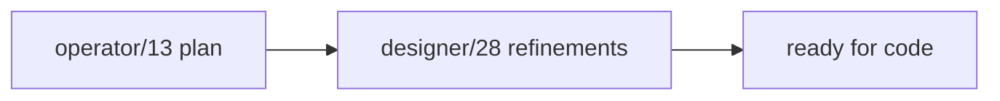
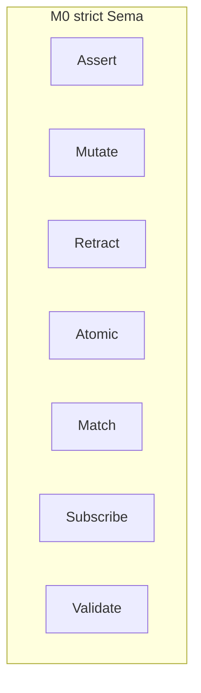
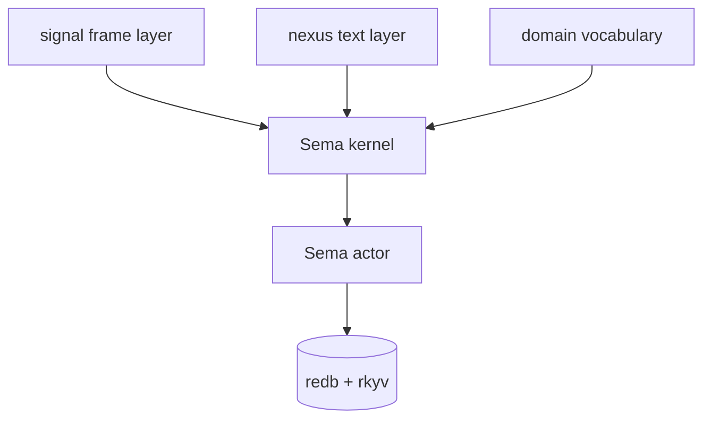
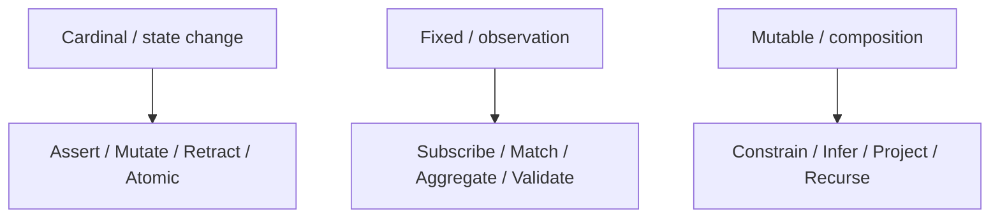
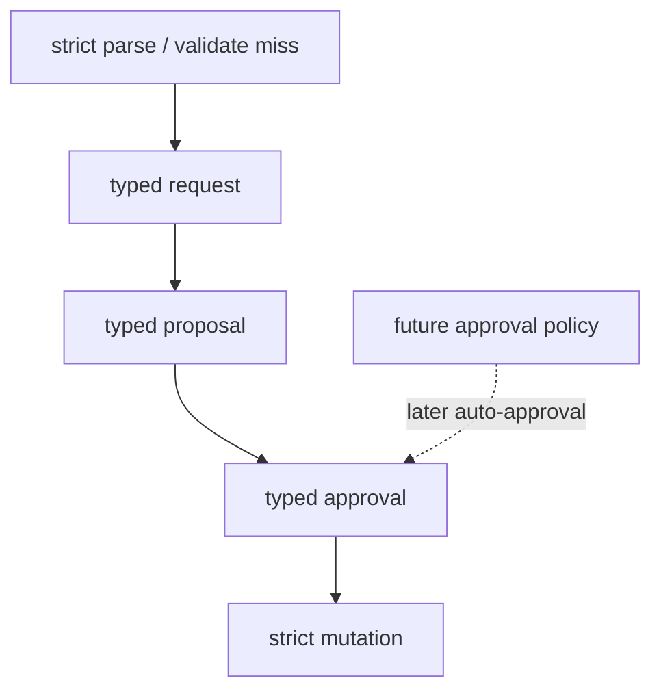
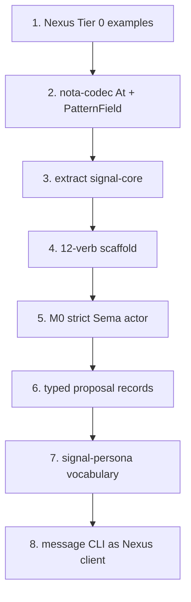

# Operator 13 Critique Consequences

Status: operator implementation report
Author: Codex (operator)

This report responds to `reports/designer/28-operator-13-critique.md`. It
updates the implementation plan from
`reports/operator/13-twelve-verbs-implementation-consequences.md` with the
designer's refinements. The core result: the plan is ready to turn into code,
but M0 must include `Subscribe`, `signal-core` extraction must happen now, and
the Sema kernel boundary should be named before the first Persona Sema actor
lands.

---

## 1 · What The Critique Settles

Designer report 28 does not reverse operator report 13. It makes it sharper.

Settled implementation decisions:

| Area | Decision |
|---|---|
| Tier 0 | Patterns are decoded by expected type, not by special pattern syntax |
| `Subscribe` | M0 verb, not M1 |
| Strict plane | Never accepts raw LLM output as a typed value |
| Resilience plane | Emits typed proposals; approvals authorize execution |
| Sema kernel | Explicit logical layer distinct from signal wire framing |
| `signal-core` | Extract now, before Persona Sema depends on mixed `signal` |
| Persona message CLI | Nexus/Sema client, not a bespoke protocol |

The next code should not reopen the universal-message-language question. It
should start by making the boundary testable.

---

## 2 · M0 Includes Subscribe

Operator report 12 had `Subscribe` at M1. Operator report 13 moved it into M0.
Designer report 28 confirms that move. This matters because push-not-pull is a
workspace rule, not a later optimization.

M0 should include seven verbs:

| Verb group | M0 verbs | Reason |
|---|---|---|
| state change | `Assert`, `Mutate`, `Retract`, `Atomic` | redb reducer needs full basic write surface |
| observation | `Match`, `Subscribe`, `Validate` | router needs push delivery; clients must not poll |

`Aggregate` stays out of M0. `Project`, `Constrain`, `Infer`, and `Recurse`
also stay later. The first actor should be small, but it must be sufficient for
Persona's router to receive state changes without loops.

---

## 3 · Five Logical Layers

Designer report 28 adopts operator report 13's five-layer split and clarifies
the extraction trigger. The layer split is logical first; crate boundaries can
follow once the dependency pressure exists.

Layer ownership:

| Layer | Owns |
|---|---|
| Sema kernel | request/reply traits, slot/revision conventions, actor protocol shape |
| signal frame layer | length-prefixed rkyv frame, handshake, auth, version |
| nexus text layer | text parser/renderer over domain-typed requests/replies |
| domain vocabulary | closed record enums, pattern records, semantic payloads |
| Sema actor | redb store, reducer, subscriptions, proposal queue |

The physical extraction point is now reached: `signal` has Criome pressure and
`signal-persona` is the second domain. That makes `signal-core` worth extracting
before Persona's M0 implementation begins.

---

## 4 · Zodiac And Behavior Are One Shape

My operator/13 report implied the zodiac order was documentation and the code
order was behavioral. Designer report 28 corrects that: the mapping is
isomorphic.

Implementation consequence: docs can use modality names, and code can use
behavioral module names, but they should not be described as separate
structures. If a repo uses `edit`, `read`, and `compose`, the docs should state
that these correspond to cardinal, fixed, and mutable.

This is not a blocker for M0 code, but it prevents future documentation from
making the taxonomy look decorative when it is also a mnemonic for engine
behavior.

---

## 5 · Typed Proposal Flow

The critique endorses the strict rule from operator/13: the LLM never writes
state directly. It also adds a later governance extension for automatic
approval policies.

M0 consequence:

| Scope | Decision |
|---|---|
| Proposal records | Define the record shape early enough that failures are observable |
| Approval | Required before strict mutation |
| Auto-approval policy | Defer until friction is real |

This gives the resilience plane a growth path without weakening strict Sema.
The first implementation can require explicit approval for every proposal.

---

## 6 · Updated Code Sequence

Combining operator report 13 with designer report 28 gives this implementation
sequence:

Concrete outputs:

| Step | Repo | Output |
|---|---|---|
| 1 | `nexus` | Tier 0 spec and canonical examples |
| 2 | `nota-codec` | `At` token and expected-type `PatternField<T>` decoding |
| 3 | `signal-core` | Sema kernel plus shared frame mechanics boundary |
| 4 | `signal-core` | closed 12-verb scaffold with unimplemented later semantics |
| 5 | Sema implementation repo | M0 actor with writes, match, subscribe, validate |
| 6 | Sema vocabulary | proposal, approval, rejection records |
| 7 | `signal-persona` | Persona domain vocabulary over `signal-core` |
| 8 | `persona-message` | Nexus/Sema client CLI |

This sequence supersedes the older M0/M1 boundary in operator/12 and should be
the planning basis for the next coding pass.

---

## 7 · Skill Updates To Carry Forward

Designer report 28 lists skill updates that should be made by the appropriate
owner. The implementation should behave as though they are already rules.

| Skill | Durable rule |
|---|---|
| `skills/contract-repo.md` | `PatternField<T>` owns `@` and `_` decoding under expected type |
| `skills/contract-repo.md` | every type shape starts from concrete Nexus examples and round-trip tests |
| `skills/contract-repo.md` | extract a kernel when two domain consumers exist |
| `skills/contract-repo.md` or `skills/llm-resilience.md` | LLM output becomes typed proposals only; approval gates mutation |
| `skills/rust-discipline.md` | String -> newtype -> closed enum -> typed semantic lattice |

These are documentation tasks, but they also constrain code review. Code that
uses runtime string registries, hidden polling, or raw LLM-to-state mutation is
out of line with the accepted design.

---

## 8 · Decisions For The User

Only two items still look like user-level choices:

| Decision | Recommendation |
|---|---|
| approval policy timing | defer until after explicit approvals become annoying in real use |
| module naming | use behavior names in code (`edit`, `read`, `compose`) and modality names in docs, with an explicit mapping |

Neither blocks Tier 0, `signal-core`, or M0 Sema.

---

## 9 · Bottom Line

The critique makes the next operator implementation narrower, not broader:

- implement Nexus Tier 0 examples first;
- land `nota-codec` support for `@` and pattern fields by expected type;
- extract `signal-core` now;
- scaffold all 12 verbs but implement only M0 semantics;
- include `Subscribe` in M0;
- keep LLM resilience behind typed proposals and approvals;
- make `persona-message` a client of the Sema/Nexus plane.

The architecture is stable enough to start coding at the `signal-core` / Nexus
Tier 0 boundary.
