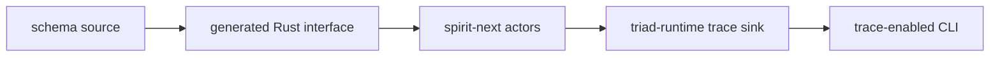
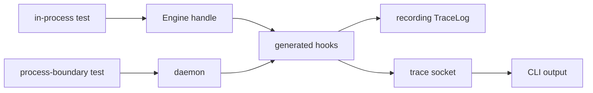

# Psyche Report: Tracing Mechanism Audit And Polish

*Kind: audit and implementation report · Topics: tracing, triad-runtime, schema-rust-next, spirit-next, testing-trace, runtime witness · 2026-06-03 · operator lane*

## Verdict

The tracing mechanism is now a real runtime witness, not a grep-shaped deployment check.

The current stack has three clean layers:



`schema-rust-next` emits the typed trace vocabulary and default trait hooks. `spirit-next` overrides those hooks on real actor objects. `triad-runtime` owns the reusable trace log, frame, socket, and listener mechanics. The trace-enabled CLI can receive binary rkyv trace frames from the daemon and print names after the ordinary signal reply.

The older designer 483 statement that `TraceLog` and socket transport were hand-written in `spirit-next` is stale. That support now lives in `triad-runtime`; `spirit-next` only supplies component-specific trace event archiving and hook overrides.

## What Is Live

The generated interface includes actor-boundary names and typed object names:

```rust
pub enum SignalObjectName {
    Input(InputRoute),
    Output(OutputRoute),
    Admitted,
    Rejected,
    Triaged,
    Replied,
    Started,
    Stopped,
}

pub enum NexusObjectName {
    Input(NexusInputRoute),
    Output(NexusOutputRoute),
    Entered,
    Decided,
    Started,
    Stopped,
}

pub enum SemaObjectName {
    WriteInput(SemaWriteInputRoute),
    ReadInput(SemaReadInputRoute),
    WriteOutput(SemaWriteOutputRoute),
    ReadOutput(SemaReadOutputRoute),
    WriteApplied,
    ReadObserved,
    Started,
    Stopped,
}
```

The generated traits call their default trace hooks from the public trait methods, so callers using the generated API cannot accidentally bypass the trace wrapper:

```rust
pub trait NexusEngine {
    fn trace_nexus_activation(&self, _object_name: NexusObjectName) {}
    fn trace_nexus_entered(&self) {
        self.trace_nexus_activation(NexusObjectName::Entered);
    }
    fn trace_nexus_decided(&self) {
        self.trace_nexus_activation(NexusObjectName::Decided);
    }

    fn execute_inner(&mut self, input: nexus::Nexus<nexus::Input>)
        -> nexus::Nexus<nexus::Output>;

    fn execute(&mut self, input: nexus::Nexus<nexus::Input>)
        -> nexus::Nexus<nexus::Output>
    {
        self.trace_nexus_entered();
        let output = self.execute_inner(input);
        self.trace_nexus_decided();
        output
    }
}
```

`spirit-next` implements the override on the concrete actor object:

```rust
impl NexusEngine for Nexus {
    #[cfg(feature = "testing-trace")]
    fn trace_nexus_activation(&self, object_name: NexusObjectName) {
        self.trace_log
            .record(TraceEvent::new(ObjectName::Nexus(object_name)));
    }
}
```

That is the intended split: macros generate the object language and insertion points; the component actor chooses where events are sent.

## Runtime Proof

The important test property is use, not presence.

`spirit-next/tests/instrumentation_logging.rs` drives `Engine::handle` and checks the actual in-process actor path:

```text
SignalAdmitted
SignalTriaged
NexusEntered
SemaWriteApplied
NexusDecided
SignalReplied
```

The same test checks lifecycle hooks:

```text
SemaStarted
NexusStarted
SignalStarted
SignalStopped
NexusStopped
SemaStopped
```

`spirit-next/tests/process_boundary.rs` starts the daemon, runs the real CLI, and receives daemon-emitted trace events through the trace socket. Startup lifecycle events are allowed as an optional prefix because the CLI listener is per request; in-process tests prove lifecycle deterministically because the listener exists before `Engine::start`.

The trace path is therefore proven in two ways:



No step here is a positive grep proving only that a string appears in a file.

## Polish Implemented

`triad-runtime` now has a sharper trace API:

```rust
pub fn record(&self, event: Event) {
    if let Err(error) = self.record_result(event) {
        eprintln!("triad-runtime trace: {error}");
    }
}

pub fn record_result(&self, event: Event) -> Result<(), TraceError> {
    match &self.destination {
        TraceDestination::Disabled => Ok(()),
        TraceDestination::Recording(events) => {
            events.lock().expect("trace event lock").push(event);
            Ok(())
        }
        TraceDestination::Socket(path) => path.write_event(&event),
    }
}
```

The default actor hook path stays non-fatal: tracing is observability, not the runtime contract. The fallible path is available for tests and any caller that wants to assert delivery.

`TraceSocketListener` also gained a count-bounded collector:

```rust
pub fn collect_until_count(
    &self,
    expected_count: usize,
    timeout: Duration,
) -> Result<Vec<Event>, TraceError>
```

This gives tests a direct way to say "wait until the expected typed events arrive" without relying only on a fixed sleep window. Existing fixed-window collection stays because the CLI does not always know how many events a request will produce.

New `triad-runtime` witnesses prove:

- disabled sinks are infallible and store nothing;
- missing socket listeners are visible through `record_result`;
- socket listeners collect until an expected count;
- count-bounded collection returns partial events on timeout instead of hanging;
- the existing rkyv frame and socket tests still pass.

Implementation commit: `1deeb1f3` (`triad-runtime: polish trace recording and socket collection`).

## Package Boundary

The package split remains correct:

- normal `spirit-next` packages do not compile trace;
- `testing-trace` packages compile typed trace hooks and `triad-runtime`;
- the daemon still speaks binary signal frames, not NOTA;
- the CLI is the text translation and trace display surface.

This is the right architecture for now. Trace is a testing/debug build surface, not a production dependency hidden behind ordinary packages.

## What Still Needs Work

The main remaining gap is interface-route trace use. The generated object names already include values like `SignalObjectName::Input(InputRoute::Record)`, but the live actor sequence currently records actor-boundary events such as `SignalTriaged` and `NexusEntered`. The next useful slice is to record both:

```text
SignalInputRecord
SignalTriaged
NexusInputSignal
NexusEntered
SemaWriteInputRecord
SemaWriteApplied
```

That would prove not only "Signal/Nexus/SEMA ran" but also "this exact schema-defined route was activated."

Effect-level tracing is also not complete. The Nexus stash effect from the observe path is visible indirectly through `RecordsStashed` and the actor sequence, but there is no generated `EffectObjectName` or `EffectEngine` trace hook yet. That should wait until effects are a firmer schema-emitted interface instead of adding another one-off trace family.

The trace-enabled CLI uses `SPIRIT_NEXT_TRACE_SOCKET`. That is acceptable as test harness wiring, but a future schema-owned debug call should carry trace options in a typed signal/configuration object. That move belongs with the broader single-argument NOTA and configuration architecture, not this small polish.

## Recommendation

Keep this mechanism. It now fits the design:

- trace names are typed generated objects, not strings chosen after the fact;
- trace hooks live on schema-generated engine traits;
- actor implementations override only the sink behavior;
- reusable trace transport lives in `triad-runtime`;
- process-boundary tests prove runtime use;
- trace stays out of normal builds.

The next implementation slice should be route-level trace emission, not more transport work.
