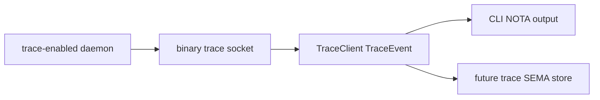

# Client Trace Genericization Overview

Kind: implementation synthesis. Topics: trace, client-library, NOTA-display, triad-runtime, spirit-next. Date: 2026-06-03. Lane: operator.

## Intent Captured

Spirit records 1489-1496 established the first trace-client shape: trace is a schema-defined typed interface, trace stays typed until the client boundary, the daemon does not decode NOTA, the CLI is thin around reusable client behavior, and old intent can be superseded only by review.

Spirit records 1502 and 1503 sharpened the display edge:

- Trace display at the client edge renders generated NOTA, not ad-hoc names.
- Trace client behavior belongs in a reusable library that can either display typed events or hand them to a SEMA-backed trace/introspect store.

## Current Implementation

The reusable trace client now lives in `triad-runtime`:

```rust
pub struct TraceClient<Event>
where
    Event: TraceEventFrame,
{
    listener: Option<TraceSocketListener<Event>>,
    collect_duration: Duration,
}

impl<Event> TraceClient<Event>
where
    Event: TraceEventFrame,
{
    pub fn from_environment(
        variable: impl Into<String>,
        collect_duration: Duration,
    ) -> Result<Self, TraceError>;

    pub fn events(&self) -> Result<Vec<Event>, TraceError>;
}

impl<Event> TraceClient<Event>
where
    Event: TraceEventFrame + Display,
{
    pub fn print_events(&self, writer: &mut impl Write) -> Result<(), TraceError>;
}
```

The key separation is that `triad-runtime` never knows NOTA. It collects typed `Event` values from a length-prefixed rkyv trace socket. The component decides what client display means by implementing `Display` for its generated trace event.

In `spirit-next`, that adapter is now:

```rust
#[cfg(feature = "nota-text")]
impl std::fmt::Display for TraceEvent {
    fn fmt(&self, formatter: &mut std::fmt::Formatter<'_>) -> std::fmt::Result {
        formatter.write_str(&<Self as crate::schema::lib::NotaEncode>::to_nota(self))
    }
}
```

The CLI stays thin:

```rust
let trace_client =
    TraceClient::from_environment("SPIRIT_NEXT_TRACE_SOCKET", Duration::from_millis(200))?;
let (_route, output) = SignalTransport::connect(socket_path)?.exchange(&input)?;
println!("{output}");
trace_client.print_events(&mut std::io::stdout())?;
```

## Runtime Shape



The daemon emits binary `TraceEvent` archives only. The CLI receives typed events and prints generated NOTA only at the display boundary. A future introspect/trace client can reuse `TraceClient::events()` and write the same typed events into a SEMA store instead of printing.

## Proofs

`spirit-next` commit `e6a3a70d` changes the process-boundary test so each CLI trace line is parsed back into `TraceEvent` and round-tripped through `Display`:

```rust
let event = TraceEvent::from_str(line).unwrap_or_else(|error| {
    panic!("trace CLI line should be generated NOTA {line:?}: {error}")
});
assert_eq!(
    event.to_string(),
    *line,
    "trace CLI line should be canonical NOTA"
);
```

Verification passed:

- `cargo fmt --check`
- `cargo test --features nota-text,testing-trace --test process_boundary cli_receives_testing_trace_events_from_daemon_trace_socket -- --exact`
- `cargo test --features testing-trace --test instrumentation_logging`
- `cargo clippy --all-targets --features nota-text -- -D warnings`
- `cargo clippy --all-targets --features nota-text,testing-trace -- -D warnings`
- `nix flake check`

## Commits

- `triad-runtime` `54991763`: documents the generated NOTA display boundary for component trace clients.
- `schema-rust-next` `56328360`: documents the emitter target for generated `TraceEventFrame` and NOTA display adapters.
- `spirit-next` `e6a3a70d`: renders trace client events as generated NOTA and tightens the process-boundary witness.

## Remaining Work

The remaining work is generation and storage, not this client boundary:

- `schema-rust-next` should emit the current mechanical `TraceEventFrame`, `Display`, `FromStr`, and aliases instead of `spirit-next` hand-writing them.
- The future `introspect` component should define the SEMA-backed trace store and ingest typed trace events through the same `TraceClient::events()` surface.
- Help/documentation still needs the mirror description namespace before the client help path can be generated honestly.
