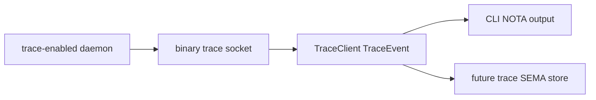

# Client Trace Genericization Overview

Kind: implementation synthesis. Topics: trace, client-library, NOTA-display, triad-runtime, spirit-next. Date: 2026-06-03. Lane: operator.

## Intent Captured

Spirit records 1489-1496 established the first trace-client shape: trace is a schema-defined typed interface, trace stays typed until the client boundary, the daemon does not decode NOTA, the CLI is thin around reusable client behavior, and old intent can be superseded only by review.

Spirit records 1502 and 1503 sharpened the display edge:

- Trace display at the client edge renders generated NOTA, not ad-hoc names.
- Trace client behavior belongs in a reusable library that can either display typed events or hand them to a SEMA-backed trace/introspect store.

Spirit records 1504 and 1505 sharpened the maintenance/runtime boundary:

- Context maintenance must repair stale examples in existing reports, not only append a newer synthesis.
- The default trace recording path stays nonfatal and silent; callers that need delivery proof use `record_result`.

Spirit records 1512-1514 settle the decisions surfaced in designer 487:

- no daemon-side `println!` or `eprintln!` trace fallback; observation goes
  through typed tracing/logging;
- trace enablement must be documented explicitly per case;
- the generic CLI trace-siting path belongs in `triad-runtime`, not as a
  schema-rust-next emitter mixin or component-local template.

## Current Implementation

The reusable trace client now lives in `triad-runtime`:

```rust
pub struct TraceClient<Event>
where
    Event: TraceEventFrame,
{
    listener: Option<TraceSocketListener<Event>>,
    collect_duration: Duration,
}

impl<Event> TraceClient<Event>
where
    Event: TraceEventFrame,
{
    pub fn from_environment(
        variable: impl Into<String>,
        collect_duration: Duration,
    ) -> Result<Self, TraceError>;

    pub fn events(&self) -> Result<Vec<Event>, TraceError>;
}

impl<Event> TraceClient<Event>
where
    Event: TraceEventFrame + Display,
{
    pub fn print_events(&self, writer: &mut impl Write) -> Result<(), TraceError>;
}
```

The key separation is that `triad-runtime` never knows NOTA. It collects typed `Event` values from a length-prefixed rkyv trace socket. The component decides what client display means by implementing `Display` for its generated trace event.

In `spirit-next`, that adapter is now:

```rust
#[cfg(feature = "nota-text")]
impl std::fmt::Display for TraceEvent {
    fn fmt(&self, formatter: &mut std::fmt::Formatter<'_>) -> std::fmt::Result {
        formatter.write_str(&<Self as crate::schema::lib::NotaEncode>::to_nota(self))
    }
}
```

The CLI stays thin:

```rust
let trace_client =
    TraceClient::from_environment("SPIRIT_NEXT_TRACE_SOCKET", Duration::from_millis(200))?;
let (_route, output) = SignalTransport::connect(socket_path)?.exchange(&input)?;
println!("{output}");
trace_client.print_events(&mut std::io::stdout())?;
```

This is now the chosen generic-client direction, not merely one option among
the alternatives from designer 487: `triad-runtime` owns the reusable trace
client helper; schema emission owns the typed trace vocabulary and adapters;
component CLIs stay thin.

## Runtime Shape



The daemon emits binary `TraceEvent` archives only. The CLI receives typed events and prints generated NOTA only at the display boundary. A future introspect/trace client can reuse `TraceClient::events()` and write the same typed events into a SEMA store instead of printing.

The runtime default trace sink is also silent on delivery failure. This keeps runtime trace mechanics from producing string fallback logs before the client boundary while preserving `record_result` as the explicit test/assertion API.

Trace enablement is explicit per case. Lean packages do not collect traces;
trace-enabled daemons emit only binary trace frames; trace-enabled clients
render generated NOTA or forward typed events into a trace/introspect SEMA
store; trace-of-trace stays disabled until its recursion policy is designed.

## Proofs

`spirit-next` commit `e6a3a70d` changes the process-boundary test so each CLI trace line is parsed back into `TraceEvent` and round-tripped through `Display`:

```rust
let event = TraceEvent::from_str(line).unwrap_or_else(|error| {
    panic!("trace CLI line should be generated NOTA {line:?}: {error}")
});
assert_eq!(
    event.to_string(),
    *line,
    "trace CLI line should be canonical NOTA"
);
```

Verification passed:

- `cargo fmt --check`
- `cargo test --features nota-text,testing-trace --test process_boundary cli_receives_testing_trace_events_from_daemon_trace_socket -- --exact`
- `cargo test --features testing-trace --test instrumentation_logging`
- `cargo clippy --all-targets --features nota-text -- -D warnings`
- `cargo clippy --all-targets --features nota-text,testing-trace -- -D warnings`
- `nix flake check`

## Commits

- `triad-runtime` `54991763`: documents the generated NOTA display boundary for component trace clients.
- `triad-runtime` `b4e494dd`: keeps default trace recording silent and leaves delivery assertion to `record_result`.
- `schema-rust-next` `56328360`: documents the emitter target for generated `TraceEventFrame` and NOTA display adapters.
- `spirit-next` `e6a3a70d`: renders trace client events as generated NOTA and tightens the process-boundary witness.
- `primary` context repair: updates `skills/context-maintenance.md`,
  `skills/component-triad.md`, operator 291, and this meta-report so stale
  string-display examples no longer survive as live guidance and the per-case
  trace enablement rule is explicit.

## Remaining Work

The remaining work is generation and storage, not this client boundary:

- `schema-rust-next` should emit the current mechanical `TraceEventFrame`, `Display`, `FromStr`, and aliases instead of `spirit-next` hand-writing them.
- The future `introspect` component should define the SEMA-backed trace store and ingest typed trace events through the same `TraceClient::events()` surface.
- Help/documentation still needs the mirror description namespace before the client help path can be generated honestly.
