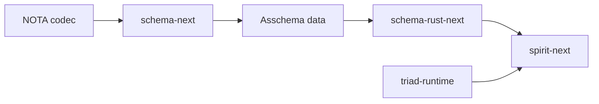
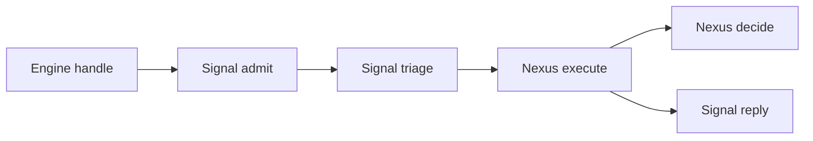
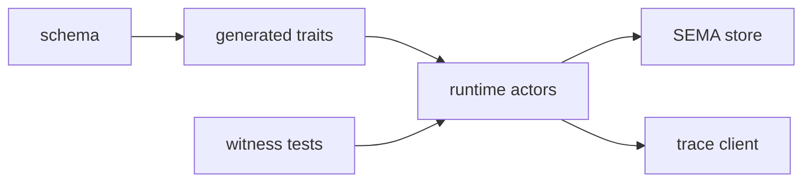

# Engine Report Tools Situation

Kind: context maintenance / tooling audit / first engine situation. Topics: engine-report, code-analysis, LSP, leta, rust-analyzer, schema-stack, triad-runtime, spirit-next. Date: 2026-06-03. Lane: operator.

## Current Understanding

The current stack is a schema-derived triad runtime pilot:



`nota-next` supplies structural parsing and typed body/document codec support. `schema-next` reads authored `.schema` and produces assembled schema data. `schema-rust-next` emits Rust nouns, root enums, engine traits, trace hooks, and upgrade surfaces from assembled schema. `triad-runtime` holds reusable runtime mechanics such as typed trace sockets and client collection. `spirit-next` is the runnable pilot where schema source lowers to generated Rust and the handwritten behavior implements the generated Signal/Nexus/SEMA traits.

## First Size Ledger

Generated with `tools/engine-situation`:

| repo | production Rust | generated Rust | test Rust | schema | asschema | generated fixtures | public types | tests |
|---|---:|---:|---:|---:|---:|---:|---:|---:|
| nota-next | 2517 | 0 | 1105 | 0 | 0 | 0 | 54 | 36 |
| schema-next | 6502 | 0 | 4018 | 330 | 6 | 0 | 111 | 102 |
| schema-rust-next | 2932 | 0 | 6990 | 193 | 0 | 4866 | 31 | 38 |
| triad-runtime | 346 | 0 | 181 | 0 | 0 | 0 | 8 | 9 |
| spirit-next | 1882 | 2134 | 2784 | 56 | 5 | 0 | 107 | 57 |

Interpretation:

- `spirit-next` is the best current end-to-end size example: 56 lines of authored schema plus 5 lines of checked-in assembled schema emit 2134 lines of checked-in generated Rust.
- `schema-rust-next` has more test Rust than production Rust because it carries generated fixture witnesses and emitter tests.
- `triad-runtime` is still intentionally tiny: 346 production Rust lines for shared runtime trace/client mechanics.
- The public type counts are inventory signals, not architectural proof.

## Schema To Code

The important live pilot map is `spirit-next`:

```text
schema/lib.schema      56 lines authored schema
schema/lib.asschema     5 lines assembled schema artifact
src/schema/lib.rs    2134 lines generated Rust
```

The generated file contains the root enums, typed routes, trace object-name enums, engine traits, and upgrade traits. The handwritten runtime then implements those traits in `src/engine.rs`, `src/nexus.rs`, `src/store.rs`, and transport/bin code.

`schema-next` is the authoring/assembly engine:

```text
schemas/builtin-macros.schema
schemas/core.schema
schemas/root.schema
schemas/spirit-min.schema
schemas/core.asschema
```

`schema-rust-next` is the emission engine and has 4866 lines of generated fixture Rust. Those fixtures are the current proof substrate for emitted Rust shape.

## Live Interface Snapshot

The generated triad traits in `spirit-next/src/schema/lib.rs` now carry lifecycle hooks, trace hooks, and root-typed methods.

Signal is ingress and egress:

```rust
pub trait SignalEngine {
    fn triage_inner(&self, input: signal::Signal<signal::Input>) -> nexus::Nexus<nexus::Work>;
    fn reply_inner(&self, output: nexus::Nexus<nexus::Action>) -> signal::Signal<signal::Output>;

    fn triage(&self, input: signal::Signal<signal::Input>) -> nexus::Nexus<nexus::Work>;
    fn reply(&self, output: nexus::Nexus<nexus::Action>) -> signal::Signal<signal::Output>;
}
```

Nexus is the decision center:

```rust
pub trait NexusEngine {
    fn decide(&mut self, input: nexus::Nexus<nexus::Work>) -> nexus::Nexus<nexus::Action>;
    fn execute(&mut self, input: nexus::Nexus<nexus::Work>) -> nexus::Nexus<nexus::Action>;
}
```

SEMA is split into write and read:

```rust
pub trait SemaEngine {
    fn apply_inner(&mut self, input: sema::Sema<sema::WriteInput>) -> sema::Sema<sema::WriteOutput>;
    fn observe_inner(&self, input: sema::Sema<sema::ReadInput>) -> sema::Sema<sema::ReadOutput>;

    fn apply(&mut self, input: sema::Sema<sema::WriteInput>) -> sema::Sema<sema::WriteOutput>;
    fn observe(&self, input: sema::Sema<sema::ReadInput>) -> sema::Sema<sema::ReadOutput>;
}
```

The root enum inventory in the generated file includes:

```text
NexusWork, NexusAction, NexusEffectCommand, NexusEffectResult
SemaWriteInput, SemaReadInput, SemaWriteOutput, SemaReadOutput
Input, Output
SignalObjectName, NexusObjectName, SemaObjectName
SignalEngine, NexusEngine, SemaEngine
```

## Runtime Path Witness

`leta calls --from SignalAccepted::process_with --max-depth 2` produced a useful live path. This is stronger than grep because it follows callable symbols:



The call hierarchy showed `SignalAccepted::process_with` calling:

```text
SignalEngine::triage
NexusEngine::execute
SignalEngine::reply
MessageSent::push_to
MessageProcessed::push_to
trace_signal_triaged
trace_signal_replied
trace_nexus_entered
trace_nexus_decided
```

That is the correct proof direction for future reports: show the generated trait methods are on the runtime path, not only present in generated Rust.

## Tooling Situation

`leta` is installed and is the agent-facing LSP tool the psyche remembered:

```text
/home/li/.nix-profile/bin/leta
Leta (LSP Enabled Tools for Agents)
```

Useful commands that worked:

```sh
leta workspace add
leta files -N 30
leta show SignalEngine --context 0
leta show SignalAccepted::process_with --context 1
leta calls --from SignalAccepted::process_with --max-depth 2 -N 80
```

Operational caveat: `leta` can lose its daemon/session state. `leta workspace info` still knew the workspace while `leta daemon info` showed no active workspaces, and a broad call query returned `EOF while parsing a value`. Recovery was:

```sh
leta daemon restart
leta workspace add
```

Then narrow `leta show` and `leta calls` queries worked again. The engine-report skill now says to prefer narrow symbol queries and restart the daemon on connection loss.

`rust-analyzer` is also installed. `rust-analyzer symbols < file.rs` is useful for one-file symbol inventory. `rust-analyzer analysis-stats <repo>` gives semantic stats but produces a lot of progress output; quote only the top summary in reports.

`tokei`, `rg`, and `jq` are available. `ctags` is GNU Emacs etags here, not universal-ctags, so it is less useful than `leta` for this stack. `lspci` is unrelated hardware tooling, not an LSP tool.

## Skill Added

Added `skills/engine-report.md` and indexed it in `skills/skills.nota`.

The standard report now requires:

- component ledger;
- production/generated/test/schema size ledger;
- schema-to-code ledger;
- exact interface signatures;
- runtime path witness;
- witness ledger;
- tooling state.

It also repeats the graph rule from recent psyche feedback: use small graphs, single-line labels, and no manual `\n` or `<br/>` in Mermaid nodes.

## Helper Added

Added `tools/engine-situation`.

Default usage:

```sh
tools/engine-situation
tools/engine-situation /git/github.com/LiGoldragon/spirit-next
```

It prints the size ledger used above. This is intentionally simple shell so it can be copied into other worktrees or replaced later by a typed Rust tool if the report discipline grows.

## Current Gaps

The first report tool is inventory-first. It does not yet produce:

- JSON output for downstream graph/report generation;
- top files by production code size;
- per-schema generated ratio;
- a Nix check inventory;
- automatic `leta` symbol extraction;
- automatic proof classification by architectural claim.

Those are the right future extensions. The most important rule is already captured: inventory is not proof. Every architecture-live claim needs a call path, runtime test, trace event, type-system assertion, process-boundary witness, database artifact, or removal-breaks-behavior witness.

## Next Engine Report Target

The next round should run the full engine report against `spirit-next` itself:



That report should answer whether the current triad behavior is production-shaped enough to be the template for `schema-daemon`, `introspect`, and `persona` supervision, using the new `engine-report` skill plus `leta` call-path witnesses.
