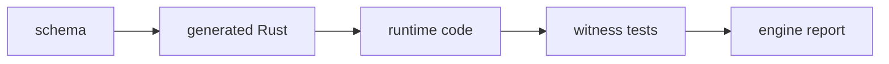
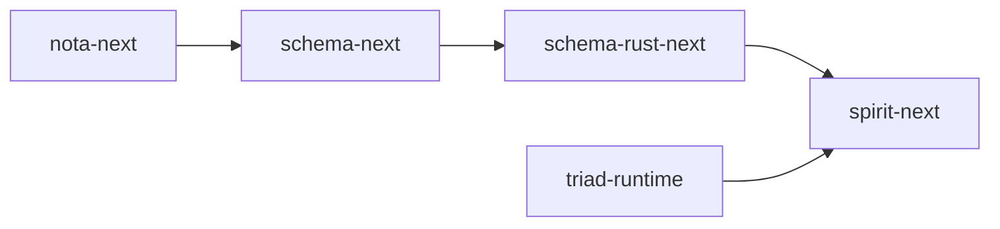
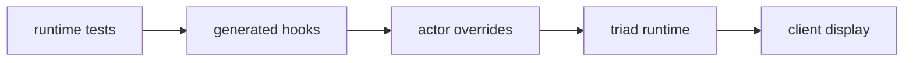
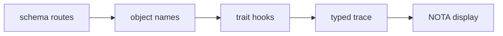

# 294 — Engine Report Refresh From Basics

## The Basic Line Of Thought

The system we are building is meant to be readable because the types name the
work. The schema names the interface. The generated Rust names the objects and
traits. The handwritten code should mostly be the real algorithm: match the
typed input, make the decision, call the next typed interface, return a typed
output.

That is why an engine report exists. It is not a code-size vanity report. It is
the fast way to answer:



The report should let you walk from "what is the system?" to "what code is
actually running?" without needing the whole thread loaded.

The fresh intent that changes how this report must be written is:

> [Psyche reports should let the psyche follow the line of thought all the way back to the basics: when a report refreshes or audits prior work, it should re-ground the current issues from first principles instead of assuming the reader already has the whole context loaded.]

Two nearby rules also matter here:

> [Psyche reports MUST show actual code with surrounding context, not summarise as line counts or vague references.]

> [Reference intent records in prose markdown by quoting the description summary literally as bracketed text — the bracketed form IS the citation — not by the record number alone.]

## What I Audited

I refreshed two reports:

- `reports/operator/291-tracing-mechanism-audit-and-polish-2026-06-03.md`
- `reports/operator/293-engine-report-tools-situation-2026-06-03.md`

Report 291 was the last report explicitly titled "Psyche Report". It audited
the trace mechanism. It had the right conclusion, but one code snippet had gone
stale: it showed `NexusEngine::execute_inner`, while current generated code now
uses `NexusEngine::decide` plus the generated wrapper `execute`.

Report 293 introduced the engine-report skill and size helper. It was useful
as a tooling situation report, but it was not good enough as a Psyche report:
it started downstream, assumed too much stack context, used the older report
metadata line, and did not bracket-quote the central intent summaries.

I updated `skills/engine-report.md` so a Psyche-variant engine report must
start from first principles and show actual code.

## What The Stack Is

The current next-stack shape is:



In plain terms:

- `nota-next` reads typed text structure.
- `schema-next` turns schema source into assembled schema data.
- `schema-rust-next` emits Rust types and traits from assembled schema.
- `triad-runtime` owns reusable runtime mechanics, currently trace transport/client mechanics.
- `spirit-next` is the pilot daemon using generated Signal/Nexus/SEMA interfaces.

The most important pilot ratio is still:

```text
spirit-next/schema/lib.schema      56 lines
spirit-next/schema/lib.asschema     5 lines
spirit-next/src/schema/lib.rs    2134 lines
```

That means the authored interface is small, and the generated surface is large
enough to carry real structure: root enums, route enums, object names, engine
traits, trace event types, and upgrade traits.

## Current Generated Engine Traits

The generated trait surface in `spirit-next/src/schema/lib.rs:2026-2120` is
the heart of the current engine pilot.

Signal handles the outside boundary: admit/triage/reply.

```rust
pub trait SignalEngine {
    fn on_start(&mut self) -> Result<(), ActorStartFailure> {
        Ok(())
    }
    fn on_stop(&mut self) -> Result<(), ActorStopFailure> {
        Ok(())
    }

    fn trace_signal_activation(&self, _object_name: SignalObjectName) {}
    fn trace_signal_admitted(&self) {
        self.trace_signal_activation(SignalObjectName::Admitted);
    }
    fn trace_signal_rejected(&self) {
        self.trace_signal_activation(SignalObjectName::Rejected);
    }
    fn trace_signal_triaged(&self) {
        self.trace_signal_activation(SignalObjectName::Triaged);
    }
    fn trace_signal_replied(&self) {
        self.trace_signal_activation(SignalObjectName::Replied);
    }

    fn triage_inner(&self, input: signal::Signal<signal::Input>) -> nexus::Nexus<nexus::Work>;
    fn reply_inner(&self, output: nexus::Nexus<nexus::Action>) -> signal::Signal<signal::Output>;

    fn triage(&self, input: signal::Signal<signal::Input>) -> nexus::Nexus<nexus::Work> {
        let output = self.triage_inner(input);
        self.trace_signal_triaged();
        output
    }

    fn reply(&self, output: nexus::Nexus<nexus::Action>) -> signal::Signal<signal::Output> {
        let signal_output = self.reply_inner(output);
        self.trace_signal_replied();
        signal_output
    }
}
```

Nexus is the decision center. This is the corrected current code; report 291's
older `execute_inner` snippet is stale.

```rust
pub trait NexusEngine {
    fn on_start(&mut self) -> Result<(), ActorStartFailure> {
        Ok(())
    }
    fn on_stop(&mut self) -> Result<(), ActorStopFailure> {
        Ok(())
    }

    fn trace_nexus_activation(&self, _object_name: NexusObjectName) {}
    fn trace_nexus_entered(&self) {
        self.trace_nexus_activation(NexusObjectName::Entered);
    }
    fn trace_nexus_decided(&self) {
        self.trace_nexus_activation(NexusObjectName::Decided);
    }

    fn decide(&mut self, input: nexus::Nexus<nexus::Work>) -> nexus::Nexus<nexus::Action>;

    fn execute(&mut self, input: nexus::Nexus<nexus::Work>) -> nexus::Nexus<nexus::Action> {
        self.trace_nexus_entered();
        let output = self.decide(input);
        self.trace_nexus_decided();
        output
    }
}
```

SEMA is durable state. It has split write/read entry points.

```rust
pub trait SemaEngine {
    fn apply_inner(&mut self, input: sema::Sema<sema::WriteInput>) -> sema::Sema<sema::WriteOutput>;
    fn observe_inner(&self, input: sema::Sema<sema::ReadInput>) -> sema::Sema<sema::ReadOutput>;

    fn apply(&mut self, input: sema::Sema<sema::WriteInput>) -> sema::Sema<sema::WriteOutput> {
        let output = self.apply_inner(input);
        self.trace_sema_write_applied();
        output
    }

    fn observe(&self, input: sema::Sema<sema::ReadInput>) -> sema::Sema<sema::ReadOutput> {
        let output = self.observe_inner(input);
        self.trace_sema_read_observed();
        output
    }
}
```

The important point: the public methods `triage`, `reply`, `execute`, `apply`,
and `observe` are generated wrappers. The component implements the inner
behavior, and the wrapper supplies the standard trace hook.

## Current Runtime Path

`spirit-next/src/engine.rs:258-277` is the live path through the generated
traits:

```rust
pub fn process_with<Signal>(
    self,
    signal_engine: &Signal,
    nexus: &mut Nexus,
) -> signal_plane::Signal<Output>
where
    Signal: SignalEngine,
{
    self.sent
        .push_to(&mut nexus.mail_ledger().hook())
        .expect("spirit-next mail ledger is infallible");
    let identifier = self.identifier();
    let nexus_input = signal_engine.triage(self.input);
    let origin_route = nexus_input.origin_route();
    let nexus_output = NexusEngine::execute(nexus, nexus_input);
    let signal_output = signal_engine.reply(nexus_output);
    MessageProcessed::new(identifier, origin_route, signal_output.root().clone())
        .push_to(&mut nexus.mail_ledger().hook())
        .expect("spirit-next mail ledger is infallible");
    signal_output
}
```

`leta calls --from SignalAccepted::process_with --max-depth 2` confirms the
same path through the language server:

```text
SignalAccepted::process_with
  SignalEngine::triage
    trace_signal_triaged
    triage_inner
  NexusEngine::execute
    trace_nexus_entered
    decide
    trace_nexus_decided
  SignalEngine::reply
    trace_signal_replied
    reply_inner
```

This is the difference between a useful architecture witness and a positive
grep. A grep can show that `NexusEngine` appears in a file. The call hierarchy
shows the generated trait method on the path that handles a request.

## Current Trace Runtime

The trace transport is in `triad-runtime`, not component-local code. The core
sink in `triad-runtime/src/trace.rs:174-186` is silent by default and has an
explicit fallible assertion surface:

```rust
pub fn record(&self, event: Event) {
    let _ = self.record_result(event);
}

pub fn record_result(&self, event: Event) -> Result<(), TraceError> {
    match &self.destination {
        TraceDestination::Disabled => Ok(()),
        TraceDestination::Recording(events) => {
            events.lock().expect("trace event lock").push(event);
            Ok(())
        }
        TraceDestination::Socket(path) => path.write_event(&event),
    }
}
```

The client side in `triad-runtime/src/trace.rs:292-321` collects typed trace
events and only prints at the display boundary:

```rust
pub fn from_environment(
    variable: impl Into<String>,
    collect_duration: Duration,
) -> Result<Self, TraceError> {
    let variable = variable.into();
    match env::var(&variable) {
        Ok(path) => Self::listen(path, collect_duration),
        Err(env::VarError::NotPresent) => Ok(Self::disabled()),
        Err(source) => Err(TraceError::Environment { variable, source }),
    }
}

pub fn events(&self) -> Result<Vec<Event>, TraceError> {
    match &self.listener {
        Some(listener) => listener.collect_for(self.collect_duration),
        None => Ok(Vec::new()),
    }
}

pub fn print_events(&self, writer: &mut impl Write) -> Result<(), TraceError> {
    for event in self.events()? {
        writeln!(writer, "{event}")?;
    }
    Ok(())
}
```

`print_events` is not daemon logging. It is the client display edge.

`spirit-next/src/trace.rs:21-25` defines that display as generated NOTA:

```rust
#[cfg(feature = "nota-text")]
impl std::fmt::Display for TraceEvent {
    fn fmt(&self, formatter: &mut std::fmt::Formatter<'_>) -> std::fmt::Result {
        formatter.write_str(&<Self as crate::schema::lib::NotaEncode>::to_nota(self))
    }
}
```

That matches the key boundary:

> [The default trace recording path should not print string fallback logs from the runtime. Trace failures remain available through the fallible typed API for tests and callers that choose to assert delivery; the normal nonfatal path silently preserves the no-string-before-client boundary.]

## What The Tests Prove

`spirit-next/tests/instrumentation_logging.rs:39-108` drives the engine in
process and checks the typed trace sequence:

```rust
let recorded = engine.handle(spirit_next::Input::Record(entry("trace witness")));

assert_activation_names(
    &trace_log.events(),
    &[
        "SignalAdmitted",
        "SignalTriaged",
        "NexusEntered",
        "SemaWriteApplied",
        "NexusDecided",
        "SignalReplied",
    ],
);

let archive =
    rkyv::to_bytes::<rkyv::rancor::Error>(&events[3]).expect("trace event archives as rkyv");
let decoded = rkyv::from_bytes::<TraceEvent, rkyv::rancor::Error>(&archive)
    .expect("trace event decodes from rkyv");
assert_eq!(decoded, events[3]);
```

`spirit-next/tests/process_boundary.rs:420-450` proves the same class of
event across the real CLI/daemon boundary:

```rust
recorded.assert_trace_sequence_after_optional_lifecycle_start(&[
    "SignalAdmitted",
    "SignalTriaged",
    "NexusEntered",
    "SemaWriteApplied",
    "NexusDecided",
    "SignalReplied",
]);

observed.assert_trace_sequence(&[
    "SignalAdmitted",
    "SignalTriaged",
    "NexusEntered",
    "SemaReadObserved",
    "NexusDecided",
    "SignalReplied",
]);
```

The process-boundary test also parses each CLI trace line back into
`TraceEvent` and checks canonical `Display` round-trip. That proves the CLI is
printing typed generated NOTA, not ad hoc strings.

```rust
let event = TraceEvent::from_str(line).unwrap_or_else(|error| {
    panic!("trace CLI line should be generated NOTA {line:?}: {error}")
});
assert_eq!(
    event.to_string(),
    *line,
    "trace CLI line should be canonical NOTA"
);
```

## What Report 291 Got Right

Report 291's main conclusion still holds:



The trace mechanism is not just source text. It is called by generated engine
trait wrappers, overridden by the actors, recorded through `triad-runtime`, and
observed in tests.

The no-daemon-string rule is also clean for trace. The daemon still has
ordinary startup error `eprintln!` surfaces, but trace failures do not fall
back to daemon-side string logs. That distinction matters:

- startup error display is a process error edge;
- trace logging is a typed runtime interface and stays typed until the client.

## What Report 291 Got Wrong Or Stale

Report 291 should be refreshed rather than trusted verbatim.

1. It showed stale generated code for `NexusEngine`. Current code uses
   `decide` and wrapper `execute`, not `execute_inner`.
2. It did not show enough of the actual runtime path for a psyche reader to
   follow the basics without context.
3. It named the route-level trace gap correctly, but did not make clear enough
   that actor-boundary tracing is live while route-level tracing is not.

The relevant still-open trace gap is precise:

```text
live today:
  SignalAdmitted
  SignalTriaged
  NexusEntered
  SemaWriteApplied
  NexusDecided
  SignalReplied

not live yet:
  SignalInputRecord
  NexusInputSignal
  SemaWriteInputRecord
  SemaWriteOutputRecorded
```

The schema already generates route object names. The runtime simply does not
emit them yet at every route boundary.

## What Report 293 Got Right

Report 293 correctly introduced `tools/engine-situation` and
`skills/engine-report.md`.

The helper still works:

```text
repo              production  generated  tests  schema  asschema
nota-next              2517          0   1105       0         0
schema-next            6502          0   4018     330         6
schema-rust-next       2932          0   6990     193         0
triad-runtime           346          0    181       0         0
spirit-next            1882       2134   2784      56         5
```

That is a useful first screen. It tells us where the code weight is and where
generated Rust dominates.

## What Report 293 Was Missing

Report 293 was not wrong, but it was too thin as a psyche-facing explanation.
It did not walk from first principles to the code path. It also predated the
new report-header rule, so it uses the old metadata line instead of YAML front
matter.

The engine-report skill now has a Psyche-variant section so the next engine
report starts with the system shape before listing numbers.

## Code That Needs No Immediate Update

The runtime trace transport does not need another ad hoc patch:

- no `triad-runtime` trace fallback `eprintln!` remains;
- `TraceLog::record_result` is the explicit assertion surface;
- `TraceClient<Event>` is generic over typed events;
- `spirit-next` renders trace events as generated NOTA at the CLI edge;
- tests prove in-process and process-boundary traces.

The CLI still has:

```rust
println!("{output}");
trace_client.print_events(&mut std::io::stdout())?;
```

That is acceptable because this is the user-facing display edge, not daemon
runtime logging.

## Code That Should Move Next

Two relevant implementation issues remain.

First, `spirit-next/src/trace.rs:8-35` is mechanical and should be generated by
`schema-rust-next` once the emitter grows that slice:

```rust
impl TraceEventFrame for TraceEvent {
    fn to_trace_archive(&self) -> Result<Vec<u8>, TraceError> {
        rkyv::to_bytes::<rkyv::rancor::Error>(self)
            .map(|archive| archive.to_vec())
            .map_err(|_| TraceError::ArchiveEncode)
    }

    fn from_trace_archive(archive: &[u8]) -> Result<Self, TraceError> {
        rkyv::from_bytes::<Self, rkyv::rancor::Error>(archive)
            .map_err(|_| TraceError::ArchiveDecode)
    }
}
```

This is not component-specific algorithm. It is the same adapter shape any
schema-emitted trace interface will need.

Second, route-level trace activation should be emitted/called by the generated
interface wrappers, not hand-written after the fact. The schema already has
typed route names like `SignalObjectName::Input(InputRoute::Record)`. The
runtime should be able to emit both actor-boundary and route-boundary events.

The desired trace becomes:

```text
SignalInputRecord
SignalAdmitted
SignalTriaged
NexusInputSignal
NexusEntered
SemaWriteInputRecord
SemaWriteApplied
NexusDecided
SignalOutputRecordAccepted
SignalReplied
```

The exact event order can be refined, but the principle is clear: trace should
show which schema-defined object activated, not only which actor phase ran.

## Refreshed Recommendation

The right next move is not more trace transport. The transport exists.

The next code slice should be in `schema-rust-next` and `spirit-next`:

1. Generate the `TraceEventFrame`, `Display`, `FromStr`, and `TraceClient` /
   `TraceLog` aliases for emitted trace interfaces.
2. Emit route-level trace wrapper calls for schema-defined input/output route
   objects.
3. Extend the process-boundary test so the CLI receives route-level typed NOTA
   trace events.

That would close the remaining gap between the idea and the code:



This report is the current psyche-readable refresh. Reports 291 and 293 remain
useful as history, but this is the version that carries the current line of
thought from basics to remaining work.
