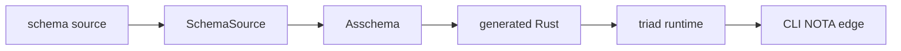
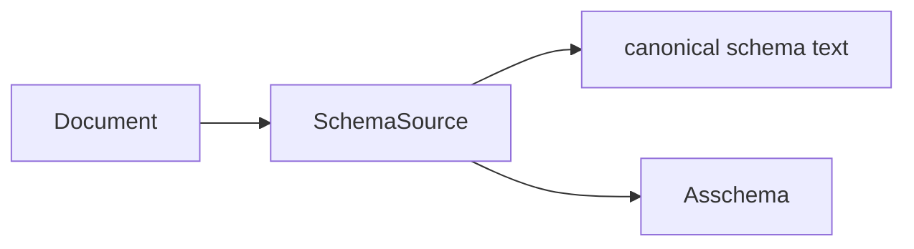
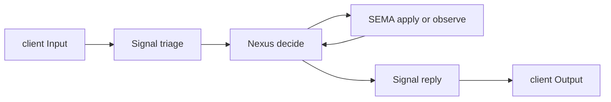

# Typed Text Design Audit

## Intent Anchors

[Psyche-facing audits and presentations should show the primordial typed text
forms at the layers where text is the representation, including NOTA and schema
source, so the line of thought is visible through concrete code rather than
only abstract prose.]

[The triad-engine readability principle: the system should be readable because
types name the work, schema names the interface, generated Rust names the
objects and traits, and handwritten code is mostly the real algorithm: match
typed input, make the decision, call the next typed interface, return typed
output.]

[Strings only at the edges; the system is typed.]

## Verdict

The live design is now coherent enough to read from the primordial text forms
forward:



The key success is that each layer now names what it is:

- `schema/lib.schema` is authored schema source, still carrying source sugar.
- `SchemaSource` is the typed source value with an in/out codec.
- `schema/lib.asschema` is macro-free assembled schema as typed NOTA text.
- `src/schema/lib.rs` is generated Rust carrying rkyv everywhere and NOTA only
  behind `nota-text`.
- `TraceEvent` is typed binary inside the daemon and becomes NOTA only at the
  CLI display edge.

The remaining gaps are not conceptual contradictions. They are mostly closure
work: direct source-node lowering, generated runner extraction, generic client
trace helper, help/description namespace, and a few local style remnants.

## Layer 1: Authored Schema Source

The current spirit schema is readable as an interface header plus namespace:

```schema
{}
[(Record Entry) (Observe Query) (Lookup RecordIdentifier) (Count Query) (Remove RecordIdentifier) (LookupStash StashHandle)]
[(RecordAccepted SemaReceipt) (RecordsObserved ObservedRecords) (RecordsStashed StashedObservation) (RecordFound FoundRecord) (RecordsCounted CountedRecords) (RecordRemoved RemoveReceipt) (Error ErrorReport) (Rejected SignalRejection)]
{
  NexusWork [(SignalArrived Input) (SemaWriteCompleted SemaWriteOutput) (SemaReadCompleted SemaReadOutput) (EffectCompleted NexusEffectResult)]
  NexusAction [(CommandSemaWrite SemaWriteInput) (CommandSemaRead SemaReadInput) (ReplyToSignal Output) (CommandEffect NexusEffectCommand) (Continue NexusWork)]
  SemaWriteInput [(Record Entry) (Remove RecordIdentifier)]
  SemaReadInput [(Observe Query) (Lookup RecordIdentifier) (Count Query)]
  Topic String
  Topics (Vec Topic)
  Entry { Topics * Kind * Description * Magnitude * Privacy * }
  Query { TopicMatch * kind (Optional Kind) privacy_selection PrivacySelection }
  Kind [Decision Principle Correction Clarification Constraint]
}
```

This is the right kind of source text:

- The root positions are known by the schema file type, so there is no fake
  `(Input ...)` or `(Output ...)` wrapper.
- Brackets hold a homogeneous vector of variant-signature objects. A data
  variant is one parenthesized object: `(Record Entry)`.
- Braces are key/value maps. `Entry { Topics * Kind * ... }` means each
  PascalCase key is the field's type and `*` says the field name is derived.
- `Topic String` and `Topics (Vec Topic)` are source newtypes, and they emit as
  Rust tuple structs.

This is the "primordial code" for the spirit interface. It is the first place a
reader can see the component's language.

## Layer 2: SchemaSource

`schema-next` now has a typed source object:

```rust
pub struct SchemaSource {
    imports: SourceImports,
    input: SourceRootEnum,
    output: SourceRootEnum,
    namespace: SourceNamespace,
}

pub struct SchemaSourceArtifact(SchemaSource);
```

The important design point is not the exact struct fields; it is the separation:



`SchemaSourceArtifact` reads and writes canonical `.schema` text. That means
schema source is no longer only a parser side effect. It is a real typed value
with an in/out codec.

The current transitional weakness is that `SchemaSource::lower` still
canonicalizes back through text before the macro registry assembles it. That is
acceptable for the first implementation because it proves the layer, but the
elegant endpoint is direct source-node lowering:

```text
SchemaSource nodes -> macro/source lowering -> Asschema
```

without re-entering through rendered text.

## Layer 3: Assembled Schema as NOTA

The assembled artifact is typed NOTA data. It is not schema-source sugar:

```asschema
(spirit-next:lib [0.1.0])
[]
[]
[(Record (Some (Plain Entry))) (Observe (Some (Plain Query))) (Lookup (Some (Plain RecordIdentifier))) (Count (Some (Plain Query))) (Remove (Some (Plain RecordIdentifier))) (LookupStash (Some (Plain StashHandle)))]
[(RecordAccepted (Some (Plain SemaReceipt))) (RecordsObserved (Some (Plain ObservedRecords))) (RecordsStashed (Some (Plain StashedObservation))) ...]
[(Public SourcePath (Newtype (SourcePath String))) ...]
```

Read this as data, not as author syntax:

- `(Some (Plain Entry))` is an explicit typed payload reference.
- `(Public SourcePath (Newtype ...))` is a declaration in the assembled type
  table.
- The root is a known body: identity, imports, resolved imports, input variants,
  output variants, namespace declarations.

The build proves both text and binary forms:

```rust
let artifact = AsschemaArtifact::new(asschema);
artifact.write_nota_file(artifact_files.nota_path())?;
artifact.write_binary_file(artifact_files.binary_path())?;

RustEmitter::new(RustEmissionOptions::feature_gated_nota("nota-text"))
    .emit_file_from_nota_path(checked_in_artifact.path())?
    .assert_matches_binary_artifact(&artifact_files)
```

That last witness matters: generated Rust from `.asschema` text must match
generated Rust from `.asschema.rkyv`.

## Layer 4: Generated Rust

The generated Rust is where the schema becomes concrete nouns and interfaces.

Newtypes now emit as tuple structs:

```rust
#[cfg_attr(feature = "nota-text", derive(nota_next::NotaDecode, nota_next::NotaEncode))]
#[derive(rkyv::Archive, rkyv::Serialize, rkyv::Deserialize, Clone, Debug, PartialEq, Eq)]
pub struct Topic(pub String);

#[cfg_attr(feature = "nota-text", derive(nota_next::NotaDecode, nota_next::NotaEncode))]
#[derive(rkyv::Archive, rkyv::Serialize, rkyv::Deserialize, Clone, Debug, PartialEq, Eq)]
pub struct Topics(pub Vec<Topic>);
```

Multi-field structs remain named-field structs:

```rust
pub struct Entry {
    pub topics: Topics,
    pub kind: Kind,
    pub description: Description,
    pub magnitude: Magnitude,
    pub privacy: Privacy,
}
```

Root interfaces are enums:

```rust
pub enum Input {
    Record(Entry),
    Observe(Query),
    Lookup(RecordIdentifier),
    Count(Query),
    Remove(RecordIdentifier),
    LookupStash(StashHandle),
}

pub enum Output {
    RecordAccepted(SemaReceipt),
    RecordsObserved(ObservedRecords),
    RecordsStashed(StashedObservation),
    RecordFound(FoundRecord),
    RecordsCounted(CountedRecords),
    RecordRemoved(RemoveReceipt),
    Error(ErrorReport),
    Rejected(SignalRejection),
}
```

The generated traits carry the triad mechanism:

```rust
pub trait SignalEngine {
    fn triage_inner(&self, input: signal::Signal<signal::Input>) -> nexus::Nexus<nexus::Work>;
    fn reply_inner(&self, output: nexus::Nexus<nexus::Action>) -> signal::Signal<signal::Output>;
}

pub trait NexusEngine {
    fn decide(&mut self, input: nexus::Nexus<nexus::Work>) -> nexus::Nexus<nexus::Action>;
}

pub trait SemaEngine {
    fn apply_inner(&mut self, input: sema::Sema<sema::WriteInput>) -> sema::Sema<sema::WriteOutput>;
    fn observe_inner(&self, input: sema::Sema<sema::ReadInput>) -> sema::Sema<sema::ReadOutput>;
}
```

This is the strongest alignment point in the current system: handwritten code
implements these traits instead of inventing a second interface.

## Layer 5: Trace as Typed Interface

Tracing is now typed until the client display edge. The generated trace type is
a closed language:

```rust
pub enum ObjectName {
    Signal(SignalObjectName),
    Nexus(NexusObjectName),
    Sema(SemaObjectName),
}

pub struct TraceEvent(pub ObjectName);
```

The actor traits have default trace hooks:

```rust
fn trace_nexus_activation(&self, _object_name: NexusObjectName) {}

fn execute(&mut self, input: nexus::Nexus<nexus::Work>) -> nexus::Nexus<nexus::Action> {
    self.trace_nexus_entered();
    let output = self.decide(input);
    self.trace_nexus_decided();
    output
}
```

The daemon records a binary typed event:

```rust
impl TraceEventFrame for TraceEvent {
    fn to_trace_archive(&self) -> Result<Vec<u8>, TraceError> {
        rkyv::to_bytes::<rkyv::rancor::Error>(self)
            .map(|archive| archive.to_vec())
            .map_err(|_| TraceError::ArchiveEncode)
    }
}
```

The CLI is the text edge:

```rust
#[cfg(feature = "nota-text")]
impl std::fmt::Display for TraceEvent {
    fn fmt(&self, formatter: &mut std::fmt::Formatter<'_>) -> std::fmt::Result {
        formatter.write_str(&<Self as crate::schema::lib::NotaEncode>::to_nota(self))
    }
}
```

A real test pins the rendered form:

```rust
let rendered = events[3].to_string();
assert_eq!(rendered, "(Sema WriteApplied)");
let parsed = rendered.parse::<TraceEvent>()?;
assert_eq!(parsed, events[3]);
```

So the log that comes out of the CLI is real NOTA output, but only because the
CLI is compiled with `nota-text`. The daemon sends rkyv frames to the trace
socket. It does not print strings and it does not need NOTA to run.

## Live Runtime Shape

The current spirit runtime is readable as:



The production call chain is:

```text
Engine::handle
SignalActor::admit
SignalAccepted::process_with
SignalEngine::triage
NexusEngine::execute
SemaEngine::apply or observe
SignalEngine::reply
```

This is not only static presence. The trace tests assert the runtime sequence:

```text
SignalAdmitted
SignalTriaged
NexusEntered
SemaWriteApplied
NexusDecided
SignalReplied
```

and the process-boundary test reads trace events from the CLI output, parses
them back into `TraceEvent`, and checks the same activation names.

## Findings

### Finding 1: The typed-text layer separation is now real

`Raw NOTA -> SchemaSource -> Asschema -> generated Rust` is no longer only a
diagram. `SchemaSourceArtifact` gives `.schema` an in/out codec, and
`AsschemaArtifact` gives `.asschema` both NOTA text and rkyv binary forms.

### Finding 2: The generated Rust is aligned with the source model

Newtypes like `Topic` and `Topics` emit as tuple structs. Multi-field records
like `Entry` emit as named-field structs. Root interfaces emit as enums. That
matches the schema source semantics instead of forcing every single-field type
through a named-field struct.

### Finding 3: Trace is correctly typed internally

Trace does not need strings until display. The daemon's trace sink is
`TraceLog<TraceEvent>` and the socket frame is rkyv. The CLI converts
`TraceEvent` to NOTA with the generated `NotaEncode` implementation.

### Finding 4: The runtime traits are honest but the runner is still local

`SignalEngine`, `NexusEngine`, and `SemaEngine` are generated and load-bearing.
The remaining runner composition is still local in `spirit-next`:

```rust
pub struct Engine {
    signal_actor: SignalActor,
    nexus: Mutex<Nexus>,
    trace_log: TraceLog,
}
```

The next elegant endpoint is a schema-carried or triad-runtime-carried runner
so each daemon writes less composition code and only implements the real
algorithm.

### Finding 5: Source lowering is proven but not yet elegant enough

The new `SchemaSource` layer writes canonical source text and can round-trip.
The less elegant part is that lowering still re-enters through rendered text.
The next cleanup should lower from typed source nodes directly.

### Finding 6: The macro library has the right typed shape, but bootstrap closure remains

The macro source is itself NOTA:

```nota
(SchemaMacro SchemaStructDefinition NamespaceDeclaration
  ($Name {$*Fields})
  (Type (Struct $Name [$*Fields])))

(SchemaMacro SchemaEnumDefinition NamespaceDeclaration
  ($Name [$*Variants])
  (Type (Enum $Name ($*Variants))))
```

The datatype it fits into should remain one noun:

```rust
MacroLibrarySourceEntry::SchemaMacro(SchemaMacro)
```

There should not be a separate source enum and artifact enum that mirror each
other. The current direction has been cleaned toward one serializable
`MacroLibrary`; the remaining architectural closure is to have schema declare
more of this macro vocabulary through the same source/asschema path.

### Finding 7: There are still small style remnants

`spirit-next/build.rs` still has a build-script-local one-field named struct:

```rust
struct CheckedInAsschemaArtifact {
    path: PathBuf,
}
```

Adjacent wrappers such as `GeneratedSchemaSourceFile(PathBuf)` already use the
newtype style. This is not a behavioral bug, but it is a small consistency
remnant and should be cleaned when the build script gets its next pass.

## Next Moves

The next implementation moves I would take, in order:

1. Direct lowering from `SchemaSource` nodes into `Asschema`, without
   canonical text as an intermediate.
2. Generic trace client helper in `triad-runtime`, so component CLIs stay thin
   and only choose the socket variable and display sink.
3. Schema-carried triad runner emission, so `Engine` composition stops being
   reimplemented per daemon.
4. Help/description namespace for generated root actions and trace interfaces,
   rendered as typed NOTA at the client edge.
5. Macro-library bootstrap closure: macro declarations become ordinary
   schema/asschema data wherever possible.

The design principle remains simple: text appears where text is the interface;
everywhere else, the code should hold typed values.
