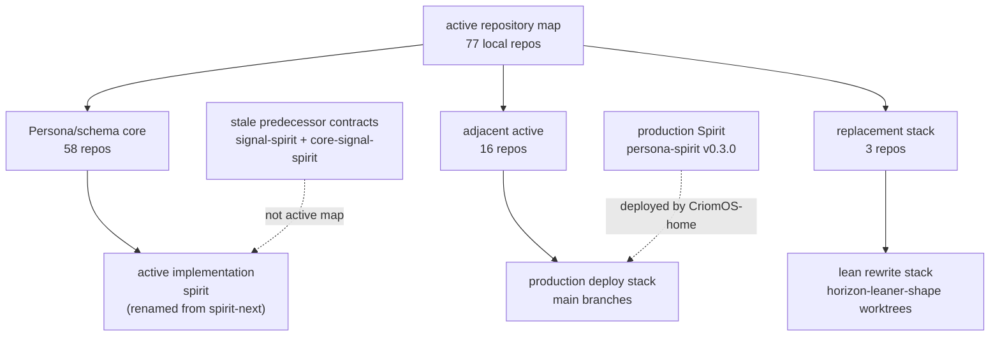

# 303 - Repository stack state audit - overview

## Current answer

The repository situation is coherent if read through the active map, but
misleading if read through local checkout names alone. There are 77 repositories
in `protocols/active-repositories.md`: 58 in the current core stack, 16
adjacent active, and 3 in the replacement stack. Every active-map path exists
locally. All active-map repositories inspected by `jj st` are clean except
`primary`, which is dirty because this audit deleted report 302, wrote reports
303/304, and updated the active map.

Spirit topology has now been cleaned up at the repository level while
production safety remains separate:

- `persona-spirit` is the deployed production Spirit source. The installed
  `spirit` wrapper resolves to `spirit-v0.3.0`, and `CriomOS-home/flake.lock`
  pins production v0.3.0 to `persona-spirit` rev
  `df09280a464f8a7be1c20ff433de4bfc4afc7f53`.
- `spirit` at `/git/github.com/LiGoldragon/spirit` is now the active runnable
  schema-derived implementation. It is the renamed former `spirit-next` repo:
  GitHub `LiGoldragon/spirit-next` was renamed to `LiGoldragon/spirit`, local
  `/git/github.com/LiGoldragon/spirit-next` was moved to
  `/git/github.com/LiGoldragon/spirit`, `repos/spirit` points there,
  `repos/spirit-next` is gone, and the repo origin is
  `git@github.com:LiGoldragon/spirit.git`. Per current Spirit intent:
  [`spirit-next is intended to be Spirit; agents created a separate spirit-next
  repo because the psyche kept referring to the next Spirit, but the active
  schema-derived implementation should carry the spirit name.] and [Rename
  spirit-next to spirit and delete the stale spirit repository rather than
  treating spirit-next as a permanent second Spirit repository.]

The stale GitHub `LiGoldragon/spirit` repository was deleted before the rename.
The `signal-spirit` / `core-signal-spirit` predecessor contract checkouts still
exist locally and remain stale relative to current `meta-signal-*` guidance
unless a later contract-split slice reopens them.

## Work performed before the audit

The obsolete operator report was deleted:

- Deleted:
  `reports/operator/302-Research-claude-session-cleanup-and-anthropic-valuation-2026-06-04.md`.
- Kept:
  `reports/operator/301-Research-codex-session-recovery-2026-06-04.md`.

The deletion retires the Claude/cloud cleanup report the psyche identified as
not relevant to this operator session. The report number 302 remains retired;
the next report number is 303.

## Coordination state

All lane locks were idle when checked through `tools/orchestrate status`.
The ordinary open-bead list initially hit the embedded-Dolt exclusive-lock
failure, but the read-only form succeeded:

```text
bd --readonly list --status open --limit 0 --flat --no-pager
```

Relevant open P1/P2 surfaces include:

- `primary-a1px`: emit the `OutputNexus` client-side dispatcher.
- `primary-9hx0`: split `lib.schema` into three schema-type files.
- `primary-lrf8`: promote mail handling to explicit queue + fanout observers.
- `primary-kbmi`: implement cloud and domain-criome runtime daemons.
- `primary-36iq`: coordinate NOTA bracket-string merge and consumer migration.
- `primary-ihee`: horizon rewrite / leaner shape multi-repo feature.

`tools/orchestrate verify-jj` scanned 73 tracked repositories and returned
non-zero because old `push-*` bookmarks remain. The largest hygiene issues are
`primary` with 63 open `push-*` bookmarks and `horizon-rs` with 8. Most are
delete candidates; a smaller set are rebase-or-abandon candidates. This is not
a code correctness bug, but it makes repository state harder to read.

## Designer state

The current designer handoff is
`reports/designer/495-design-to-code-port-audit-2026-06-04/6-overview.md`
with the psyche-facing summary in
`reports/designer/496-Psyche-schema-stack-state-and-decisions-2026-06-04.md`.

The operator-relevant findings are:

1. Most recent schema-stack intent is already in code and clean.
2. The real correctness bug is in `schema-next`: the production
   `SchemaSource::lower` path has multi-pass bare-header resolution, while the
   registry `SchemaEngine::lower_source` path does not, so the two lowering
   engines can disagree.
3. Missing witnesses remain for daemon string-boundary constraints, lifecycle
   hook order, schema lowering equivalence, alias payload emission, and compiled
   alias fixtures.
4. Designer landed one verified feature branch in `triad-runtime`:
   bookmark `designer-strings-at-edges-2026-06-04`, commit `0c079c79`,
   while `main` remains `2b51462f`. This is ready for operator integration, not
   yet production/main state.
5. The current psyche decisions ratify the component runner extraction, the
   Rust item / impl / match token model, and the flat `Vec<Name>` symbol path
   with role recovered from schema position. Smaller cleanups still need no
   ratification: length-prefixed frame codec, `ComponentArgument`, and
   `thiserror` cleanup.
6. The same decision batch says schema sugar syntax should not be assumed
   implemented until audited and proved, and every engine should have an object
   with daemon startup/transport boilerplate hidden behind libraries or macros.

## Stack map



## Active repository classes

| Class | Count | Current reading |
|---|---:|---|
| Current core stack | 58 | Persona, schema, NOTA, signal, sema, upgrade, repository-ledger, production Spirit, and active contract/runtime surfaces. |
| Adjacent active work | 16 | Criome, cloud/domain-criome, system/deploy stack, horizon/lojix production, chroma, chronos, prose. |
| Replacement stack | 3 | `signal-lojix`, `lojix`, `criomos-horizon-config` for the lean horizon rewrite. |
| Active-map missing locally | 0 | Every active-map path resolves locally. |
| Dirty active-map repos | 1 | `primary` only, due to this report/deletion session. |

`RECENT-REPOSITORIES.md` is broader than the active map. It includes recent
checkouts, archives, prototypes, and older adjacent surfaces. Do not infer
current work focus from `ghq list` alone.

## Deploy stack situation

The production versus rewrite split remains exactly as `INTENT.md` and
`protocols/active-repositories.md` describe:

| Stack | Repositories | Branch/path | Status |
|---|---|---|---|
| Production today | `horizon-rs`, `lojix-cli`, `CriomOS`, `CriomOS-home`, `CriomOS-lib`, `goldragon` | canonical `/git/...` checkouts on `main` | Running stack. Production fixes go here. |
| Lean rewrite | `horizon-rs`, `lojix`, `signal-lojix`, `CriomOS`, `CriomOS-home`, `CriomOS-lib`, `goldragon`, `criomos-horizon-config` | `~/wt/.../horizon-leaner-shape/` | Smoke-built, not cut over. Rewrite edits go here. |
| Superseded rewrite branch | same older line plus `lojix-cli` and `CriomOS-test-cluster` | `~/wt/.../horizon-re-engineering/` | Still exists locally but superseded; do not pick up for new work. |

Observed `horizon-leaner-shape` worktrees:

```text
/home/li/wt/github.com/LiGoldragon/CriomOS-home/horizon-leaner-shape
/home/li/wt/github.com/LiGoldragon/CriomOS-lib/horizon-leaner-shape
/home/li/wt/github.com/LiGoldragon/CriomOS/horizon-leaner-shape
/home/li/wt/github.com/LiGoldragon/goldragon/horizon-leaner-shape
/home/li/wt/github.com/LiGoldragon/horizon-rs/horizon-leaner-shape
/home/li/wt/github.com/LiGoldragon/lojix/horizon-leaner-shape
/home/li/wt/github.com/LiGoldragon/signal-lojix/horizon-leaner-shape
```

## Spirit source topology

| Track | Runtime repo | Contract repos | Status |
|---|---|---|---|
| Production Spirit | `persona-spirit` | `signal-persona-spirit`, `owner-signal-persona-spirit` | Deployed via `spirit-v0.3.0`; still production source. |
| Canonical Spirit implementation | `spirit` (renamed from `spirit-next`) | crate-local `schema/spirit.schema` emitted by `schema-next` + `schema-rust-next`; no split contract repo yet | Active schema-derived implementation surface. Repo rename/delete is landed; package and binary names still need a code follow-up. |
| Stale predecessor contract checkouts | deleted old `spirit` runtime repo; local `signal-spirit`, `core-signal-spirit` still exist | `signal-spirit`, `core-signal-spirit` | Runtime repo was deleted on GitHub before the active implementation took the name. Contract checkouts remain stale unless reopened. |

The installed `spirit-next` wrapper in the current user profile is a separate
naming trap: it is built from the `persona-spirit-next` deployment slot in
`CriomOS-home`, not from the renamed `/git/github.com/LiGoldragon/spirit` repo.
The renamed repo is the active schema-derived implementation source, but the
deployed side-by-side slot still belongs to `persona-spirit` today.

`persona-spirit` package evidence:

```toml
[package]
name         = "persona-spirit"
version      = "0.3.0"
edition      = "2024"
rust-version = "1.89"

[[bin]]
name = "spirit"

[[bin]]
name = "spirit-next"

[[bin]]
name = "persona-spirit-daemon"
```

Current `spirit` repo package evidence, after the repo rename but before the
internal package/binary rename follow-up:

```toml
# /git/github.com/LiGoldragon/spirit/Cargo.toml
[package]
name         = "spirit-next"
version      = "0.1.0"
edition      = "2024"
rust-version = "1.85"
repository   = "https://github.com/LiGoldragon/spirit-next"

[features]
default = []
nota-text = ["dep:nota-next"]
testing-trace = ["dep:triad-runtime"]
```

Pre-delete stale `spirit` concept-track evidence from the earlier audit:

```toml
[package]
name         = "spirit"
version      = "0.4.0-pre"

[dependencies]
signal-spirit = { git = "https://github.com/LiGoldragon/signal-spirit.git", branch = "designer-running-concept-2026-05-26" }
nota-next = { git = "https://github.com/LiGoldragon/nota-next.git", branch = "main" }
```

The production source and active implementation answer the psyche's "is there
two repositories?" question with a correction: there are two relevant Spirit
runtime roles today, not two permanent Spirit implementation repositories.
`persona-spirit` protects production intent capture until cutover. The active
implementation repo is now named `spirit`; the old temporary `spirit-next` repo
name and stale `spirit` runtime repo are gone. Internal Cargo package, library,
binary, and repository-url names still say `spirit-next` and need a code rename
slice.

## Production Spirit pins

The installed CLI:

```text
/home/li/.nix-profile/bin/spirit
-> /nix/store/...-spirit-v0.3.0/bin/spirit-v0.3.0
```

`CriomOS-home/flake.lock` pins side-by-side production versions:

| Input | Repo | Rev |
|---|---|---|
| `persona-spirit-v0-1-0` | `LiGoldragon/persona-spirit` | `e7a1b184f09c289eb774020e8bf4f1eaf0e2b54a` |
| `persona-spirit-v0-1-1` | `LiGoldragon/persona-spirit` | `e137f5de4c663b0cb9a8b52f87d9bdadff80841f` |
| `persona-spirit-v0-2-0` | `LiGoldragon/persona-spirit` | `ba1956d232178c05b75d60963e40d5961dbce98a` |
| `persona-spirit-v0-3-0` | `LiGoldragon/persona-spirit` | `df09280a464f8a7be1c20ff433de4bfc4afc7f53` |
| `persona-spirit-next` | `LiGoldragon/persona-spirit` | `df09280a464f8a7be1c20ff433de4bfc4afc7f53` |

The deployed `persona-spirit` revision pins production working contracts:

| Dependency | Source |
|---|---|
| `signal-persona-spirit` | `main#4c7b51ff56a90c2838c4a3475fb219a8b43cc12f` |
| `owner-signal-persona-spirit` | `main#cf932a619e1f6f3afc80cb62b6c0da6460e1c1f0` |
| `signal-frame` transitive branch | `operator-full-schema-spirit-2026-05-26#4d3264ff...` |

The local `signal-persona-spirit` checkout is ahead at `a69769b...`, so deployed
wire-shape reads must use the pinned revision, not current checkout `main`.

That branch-pinned `signal-frame` lineage is one of the visible dependency
skews between production Spirit and the new schema-derived stack.

## Important dependency versions

| Family | Current observed version/pin | Notes |
|---|---|---|
| Rust edition | 2024 | Standard across active Rust crates. |
| `rust-version` | 1.85, 1.88, 1.89 | Next-stack libraries mostly 1.85; current Persona runtimes often 1.88/1.89. |
| `rkyv` | 0.8.16 in locks | Feature set consistently uses `std`, `bytecheck`, `little_endian`, `pointer_width_32`, `unaligned`. |
| `redb` | 4.1.0 and 2.6.3 | Production/sema/persona line commonly locks 4.1.0; `schema-next`, `schema-rust-next`, renamed `spirit`, and `chroma` lock 2.6.3. This split is real. |
| `kameo` | 0.20.0 | Some crates use crates.io-style `version=0.20`; others pin LiGoldragon's `persona-lifecycle-terminal-outcome` branch. |
| `tokio` | 1.52.3 mostly, 1.52.1 in some crates | Visible minor lock drift. |
| `thiserror` | 2.0.18 | Standard typed error dependency. |
| `anyhow` | 1.0.102 | Still present in several runtime locks; edge errors should remain crate-owned enums. |
| `clap` | 4.6.1 in `criome`; 4.5.60 in `horizon-rs` lock | CLI parser presence is limited, but Spirit/component binaries should still follow the single-argument NOTA rule. |
| `nota-codec` | 0.1.0, git `main` in current stack | Used by production/current stack. |
| `nota-next` | 0.1.0, git `main` in schema-derived stack | Used by `schema-next`, `schema-rust-next`, renamed `spirit`, and `upgrade` optional text surfaces. |
| `schema-next` / `schema-rust-next` | 0.1.0, git `main` | Active codegen path for `spirit`. |
| `triad-runtime` | 0.1.0, git `main` | Active shared trace/runtime helper; designer feature branch exists for integration. |

Nix input split:

| Repo group | Nix input state |
|---|---|
| `nota-next`, `schema-next`, `schema-rust-next`, renamed `spirit` | Share `nixpkgs` rev `f9d8b659...`, `fenix` rev `6012e546...`, `crane` rev `edb38893...`. |
| `triad-runtime` | Uses different `nixpkgs` rev `4df1b885...`, `fenix` rev `f6670530...`, `crane` rev `0532eb17...`. |
| `persona-spirit` | Uses `nixpkgs` rev `d2339023...`, `fenix` rev `b7bd9323...`, `crane` rev `edb38893...`. |
| production deploy stack | `CriomOS-home` / `CriomOS` pin `LiGoldragon/nixpkgs` rev `0726a0ec...`; `CriomOS-home` pins `lojix-cli` rev `4c66b8a6...`. |

The most important dependency state is not a crates.io bump. It is generation
drift: production Spirit is still on `persona-spirit` +
`signal-persona-spirit` + `owner-signal-persona-spirit`, while schema work is
on the renamed `spirit` repo + `schema-next` + `schema-rust-next` +
`triad-runtime`, and several old signal contracts still pin branch names from
the full-schema Spirit prototype.

The active-protocol drift found by the audit has been patched:
`protocols/active-repositories.md` now names `spirit` at
`/git/github.com/LiGoldragon/spirit` and records the production `lojix-cli` pin
as `4c66b8a6fa55`.

## Active versus stale or abandoned

| Surface | Status | Evidence |
|---|---|---|
| Active core stack | Active | Listed in `protocols/active-repositories.md`; all paths exist locally. |
| `spirit` | Active implementation | Active map names it at `/git/github.com/LiGoldragon/spirit`; repo origin is `git@github.com:LiGoldragon/spirit.git`. |
| `persona-spirit` | Production deployed, not current schema-stack target | Installed `spirit-v0.3.0` comes from it; active map now lists it as production Spirit source until cutover. |
| stale old `spirit` runtime repo | Deleted / retired | GitHub `LiGoldragon/spirit` was deleted before `LiGoldragon/spirit-next` was renamed into the canonical name. |
| `signal-spirit` / `core-signal-spirit` | Stale predecessor contract checkouts | Local repos still exist; not in active map; `core-signal-*` contradicts current `meta-signal-*` guidance. |
| `signal-persona` | Retired compatibility shim | Active map explicitly says new code depends on `owner-signal-persona` or `signal-engine-management` directly. |
| `owner-signal-*` fleet | Legacy migration leftovers | `meta-signal-upgrade` rename landed; 12 owner-signal repos and `core-signal-spirit` remain per operator report 300. |
| `horizon-re-engineering` worktrees | Superseded | Active map says new work belongs to `horizon-leaner-shape`; local old worktrees still exist. |
| `lojix-archive`, `criomos-archive`, `nexus-spec-archive` | Archive / historical | Local checkout names mark archive status; not active map. |
| `design-*` repos | Prototype/history | Useful for archaeology only; not active map. |
| `forge` as old `lojix` redirect | Not deploy-stack `lojix` | Active map warns GitHub redirects are stale; `forge` is unrelated to the new `lojix` deploy stack. |
| RECENT pruned repos (`atom`, `annas-mcp`, `maisiliym`) | Out of primary working set | `RECENT-REPOSITORIES.md` says they were pruned by commit-date cutoff. |

## Glaring issues

1. **Spirit repo naming was corrected, but internal names still lag.** The
   active repo is now `/git/github.com/LiGoldragon/spirit`, but its
   `Cargo.toml` still says `package.name = "spirit-next"`, `lib.name =
   "spirit_next"`, `repository = "https://github.com/LiGoldragon/spirit-next"`,
   and binaries `spirit-next` / `spirit-next-daemon`.
2. **Production Spirit is now visible but still a separate source line.**
   `persona-spirit` is in the active map as production source until cutover;
   agents must still not confuse it with the renamed schema-derived `spirit`
   checkout.
3. **Policy-contract naming is mid-migration.** Guidance says
   `meta-signal-*`; live fleet still has many `owner-signal-*` repos and the
   local `core-signal-spirit` predecessor. This is expected drift, but it is a
   high-confusion surface.
4. **`schema-next` has a real correctness bug.** Two lowering paths disagree
   on bare-header payload resolution, exactly where missing witnesses hid the
   problem.
5. **Designer code is not automatically production state.** The
   `triad-runtime` strings-at-edges witness is pushed on a designer feature
   branch and awaits operator integration.
6. **Dependency locks are not uniform across the schema stack.** The next-stack
   group is mostly aligned, but `triad-runtime` has different Nix pins and
   production Spirit has separate pins.
7. **Old `push-*` bookmarks create noise.** `verify-jj` reports many delete
   and rebase-or-abandon candidates. This does not block the audit, but it is
   a repository hygiene backlog.

## Remaining operator actions

1. Rename the internal `spirit` repo package/library/binary/repository-url
   surfaces away from `spirit-next` where that is now stale, while preserving
   the separate deployed `persona-spirit` side-by-side `spirit-next` slot until
   deployment is explicitly rewired.
2. Integrate the designer `triad-runtime` branch
   `designer-strings-at-edges-2026-06-04` after reviewing its diff and tests.
   It is a small, verified constraint-witness landing from designer 495.
3. Fix `schema-next` by making `SchemaSource` the single lowering front end,
   then add the both-paths-agree witness for bare headers. This is the highest
   correctness issue.
4. Add the remaining constraint witnesses from designer 495 before broad
   abstraction work: daemon binary string-boundary scan, lifecycle order,
   multi-pass forward reference, alias payload no-`From`, and compiled alias
   fixture.
5. Continue the `meta-signal-*` rename as coordinated slices, not a blind fleet
   replacement. The next obvious Spirit slice is `core-signal-spirit` →
   `meta-signal-spirit`, but only if the contract split remains desired after
   the stale repo deletion.
6. Run a bookmark cleanup pass for delete candidates from `verify-jj`,
   especially in `primary`, before another broad repo audit. This should be
   its own contained session so it does not mix with code changes.

## Open questions for the psyche

1. The recent Spirit log contains a low-certainty cleanup issue: record 1577
   confirms flat `Vec<Name>` `SymbolPath` plus position-derived role as
   canonical at `Maximum`, while record 1586 says to try a structured
   `SymbolPath` record but is already certainty `Zero`. Treat 1577 as active;
   clean up 1586 in an intent-maintenance pass.
2. Should old `horizon-re-engineering` worktrees be garbage-collected now that
   `horizon-leaner-shape` is the active feature branch, or kept as local
   archaeology until cutover?
