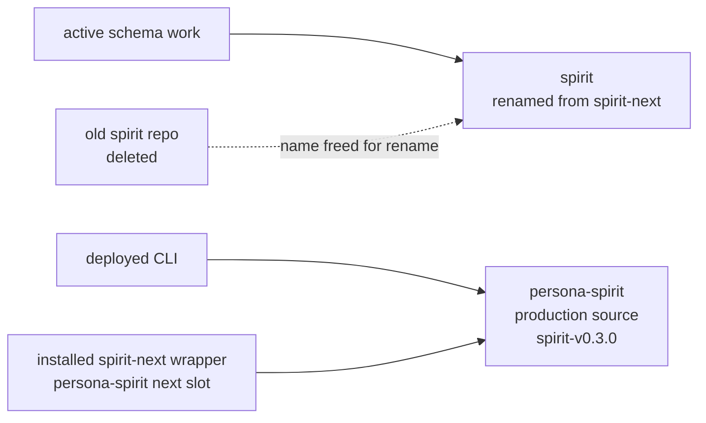

# 304 - Repository stack state and decisions

## The low-down

The workspace is not in a random mess. The active map is coherent: 76 active
repositories, all present locally, all clean except `primary` because this
session is writing reports and deleting one old report. The confusing part is
that old generations are still checked out beside current ones, and the names
are dangerously similar.

For Spirit, the repo-level rename/delete has landed:



So the earlier report wording was wrong in the way you caught, and the cleanup
has now happened. GitHub stale `LiGoldragon/spirit` was deleted, then
`LiGoldragon/spirit-next` was renamed to `LiGoldragon/spirit`. Locally,
`/git/github.com/LiGoldragon/spirit-next` moved to
`/git/github.com/LiGoldragon/spirit`, `repos/spirit` points there,
`repos/spirit-next` is gone, and `origin` is
`git@github.com:LiGoldragon/spirit.git`.

Production is the separate safety lane: `persona-spirit` still provides the
deployed `spirit` CLI/daemon today. One extra trap: the installed
`spirit-next` command in the current profile is also from `persona-spirit`'s
side-by-side next slot, not from the renamed `/git/github.com/LiGoldragon/spirit`
repo.

## The code clue

Production Spirit:

```toml
# /git/github.com/LiGoldragon/persona-spirit/Cargo.toml
[package]
name         = "persona-spirit"
version      = "0.3.0"
rust-version = "1.89"

[[bin]]
name = "spirit"

[[bin]]
name = "persona-spirit-daemon"
```

Active implementation, after repo rename but before internal package/binary
rename:

```toml
# /git/github.com/LiGoldragon/spirit/Cargo.toml
[package]
name         = "spirit-next"
version      = "0.1.0"
rust-version = "1.85"
repository   = "https://github.com/LiGoldragon/spirit-next"

[features]
nota-text = ["dep:nota-next"]
testing-trace = ["dep:triad-runtime"]
```

Pre-delete stale concept-track evidence from the earlier audit:

```toml
# /git/github.com/LiGoldragon/spirit/Cargo.toml
[package]
name         = "spirit"
version      = "0.4.0-pre"

[dependencies]
signal-spirit = { branch = "designer-running-concept-2026-05-26" }
```

That last branch name is the warning label: it reads like a designer concept,
not the operator's current implementation source. That runtime repo has now
been retired; the local `signal-spirit` and `core-signal-spirit` contract
checkouts remain as stale predecessor surfaces unless reopened.

## The most glaring issues

| Issue | Why it matters | Operator lean |
|---|---|---|
| Spirit repo rename landed, but internal names lag | A fresh operator can still see `spirit-next` in the package, library, binaries, and repository URL inside the renamed `spirit` repo. | Do a code rename slice for internal names, separate from the repo-level move that already landed. |
| Installed `spirit-next` is not the renamed `spirit` repo | A deploy audit can inspect the wrong source if it follows the wrapper name. | Treat the profile `spirit-next` command as `persona-spirit`'s next slot until deployment is rewired. |
| `persona-spirit` is a separate production source | The deployed `spirit` source is not the same checkout as the schema-derived implementation. | `protocols/active-repositories.md` now lists it explicitly as production Spirit source until cutover. |
| `schema-next` has two lowering engines that disagree | Designer 495 found a real correctness bug hidden by missing tests. | Unify on `SchemaSource` and add the failing equivalence witness. |
| Schema sugar syntax is not proven | The shorthand codec goal depends on sugar actually lowering and round-tripping. | Audit and prove sugar before depending on it. |
| Designer's `triad-runtime` witness is not on `main` | The code is verified but not integrated. | Review it after the main implementation and adopt better logic, planes, or names. |
| Policy-signal naming is mid-migration | `meta-signal-*` is current guidance; many `owner-signal-*` repos and `core-signal-spirit` remain. | Continue in coordinated slices, not a blind fleet rename. |
| Active protocol pin drift is now corrected | The audit found stale `lojix-cli` pin `42529ebd...`; the protocol now says `4c66b8a6fa55`. | No report follow-up; main operator owns the protocol file. |
| Old `push-*` bookmarks are noisy | `primary` has 63 open push bookmarks; `horizon-rs` has 8. | Do a cleanup pass separately so audits stop seeing stale branch clutter. |

## Dependency picture

The important versions are stable enough to work with, but not perfectly
aligned:

| Dependency | State |
|---|---|
| Rust | Edition 2024 everywhere active; rust-version split across 1.85, 1.88, 1.89. |
| `rkyv` | 0.8.16 in active locks, with portable bytecheck/little-endian settings. |
| `redb` | Split: 4.1.0 in much of production/sema/persona, 2.6.3 in renamed `spirit`/`schema-next`/`chroma`. |
| `kameo` | 0.20.0, sometimes via LiGoldragon branch `persona-lifecycle-terminal-outcome`. |
| `tokio` | Mostly 1.52.3, with some 1.52.1. |
| `thiserror` | 2.0.18. |
| Nix pins | `nota-next`/`schema-next`/`schema-rust-next`/renamed `spirit` align; `triad-runtime`, `persona-spirit`, and deploy-stack repos use different Nix pins. |

The main risk is not "one crate has a slightly old version." The main risk is
generation drift: production Spirit, the active schema implementation, and old
contract predecessor repos are built from different dependency branches and
naming eras.

## Decisions now settled

1. `spirit-next` becoming `spirit` has landed at the repository level; the stale
   `spirit` runtime repo was deleted/retired rather than kept as a competing
   implementation.
2. Lean/correct development architecture wins over development compatibility;
   production remains protected, but development surfaces may break.
3. The generic triad runtime runner should be extracted, with every engine
   owning an object and daemon boilerplate pushed behind libraries or macros.
4. The Rust item / impl / match token model for `schema-rust-next` emission is
   ratified.
5. Flat `Vec<Name>` `SymbolPath` plus role from schema position is the active
   canonical direction: record 1577 is `Maximum`; the contrary record 1586 is
   already at certainty `Zero` and should be cleaned up through
   intent-maintenance rather than treated as equal-weight intent.

## Remaining next operator slice

My lean is:

1. Finish the internal Spirit name follow-up inside `/git/github.com/LiGoldragon/spirit`:
   package name, library name, binary names, repository URL, schema namespace,
   and source paths that still say `spirit-next`.
2. Then implement the generic runtime runner in the now-canonical Spirit
   surface and extract the shared shape into `triad-runtime`.
3. Fix the `schema-next` lowering divergence and add a witness that the retained
   lowering path handles bare headers and shorthand round-trip.
4. Audit schema sugar syntax before relying on it as the schema codec surface.
5. Review the designer implementation afterward for better logic, logical
   planes, and names; shorter code is not the criterion.
