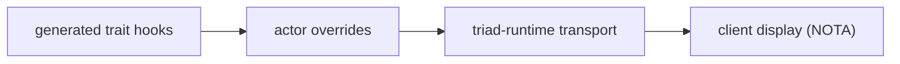

# 318 — Refresh — schema-derived trace runtime and the live-witness discipline

## What this report is

The canonical operator surface for the trace thread. It agglomerates the
2026-06-01 → 2026-06-03 trace/instrumentation reports (273-294) into one
current-state report. The mature parts of this substance have permanent homes —
`spirit-next/ARCHITECTURE.md` §"testing-trace" documents the runtime surface,
and `skills/architectural-truth-tests.md` carries the live-witness discipline —
so this Refresh keeps only the working-artifact state: the mechanism shape as it
runs today, the live trace sequence the tests assert, and the one open gap.

The anchor for this Refresh is the previous in-thread Psyche refresh (operator
294), which already re-grounded the trace mechanism from first principles and
absorbed reports 291 and 293. This Refresh carries 294's substance forward and
retires the whole pile.

## The live-witness discipline (absorbs 273, 274, 277)

The load-bearing rule the trace thread was built to satisfy: **architecture is
proven by live typed execution, not by source-text presence.** A positive grep
proves a symbol exists in a file; it does not prove the symbol is on the path a
real request takes. The permanent home for this rule is
`skills/architectural-truth-tests.md` (live proof = compile, execute,
round-trip, or otherwise witness that the intended type / trait / actor path /
wire frame / storage path is exercised by the real runtime; grep survives only
as a narrow negative guard).

The trace mechanism is itself the strongest witness instrument the pilot has:
it makes the Signal → Nexus → SEMA call path observable as a typed event
sequence, which is exactly the "actually used, not merely present" proof the
discipline demands.

## The trace mechanism — three layers (absorbs 275, 280, 281, 282, 291, 294)



The mechanism is not component-local glue. Its three layers:

1. **Generated trait hooks.** `schema-rust-next` emits the engine traits
   (`SignalEngine`, `NexusEngine`, `SemaEngine`) with default wrapper methods
   (`triage`, `reply`, `execute`, `apply`, `observe`) that call a trace hook
   around the component-implemented inner method. The component supplies the
   algorithm (`triage_inner`, `decide`, `apply_inner`, …); the generated
   wrapper supplies the standard trace call. The trace identity is a generated
   typed object name (`SignalObjectName`, `NexusObjectName`), not a string
   chosen after expansion.

2. **triad-runtime transport.** `triad-runtime` owns the reusable trace log,
   the length-prefixed binary frame, the Unix trace socket listener, and the
   generic client-side collector (`TraceClient<Event>`, generic over typed
   events). The sink is silent by default (`TraceDestination::Disabled`); a
   `record_result` surface returns `Result<(), TraceError>` so tests and
   callers that choose to assert delivery can, while the normal nonfatal path
   stays string-free until the client edge. No daemon-side `eprintln!` fallback
   exists on the trace path; startup error display is a separate process-error
   edge.

3. **Client display.** The CLI renders trace events as generated NOTA at the
   display boundary (`Display` delegates to the generated `NotaEncode`). The
   process-boundary test parses each printed line back into `TraceEvent` and
   asserts canonical round-trip — proving the CLI prints typed generated NOTA,
   not ad-hoc strings.

This layering is documented permanently in `spirit-next/ARCHITECTURE.md`
§"testing-trace" (spirit owns the typed aggregate `TraceEvent` over plane-local
generated object names; triad-runtime owns the reusable transport).

## The typed-trace-name rule (absorbs 282)

Trace identifiers are generated typed values from the schema interface language
— root enums, variants, carried payload types, and actor trait activation
points. They are not arbitrary strings. Trace headers derive from the interface
header; compact numeric encodings are a downstream projection of the typed
header object, not the source of identity. The schema already generates route
object names (`SignalObjectName::Input(InputRoute::Record)`); trace names come
from that language.

## The live trace sequence (absorbs 280, 291, 294)

The in-process and process-boundary tests assert this sequence today:

```text
SignalAdmitted
SignalTriaged
NexusEntered
SemaWriteApplied   (or SemaReadObserved on a read path)
NexusDecided
SignalReplied
```

That sequence is actor-boundary tracing: each generated wrapper emits its
activation event. The test also archives a trace event through rkyv and decodes
it back, proving the typed trace event is wire-serializable.

## The one open gap — route-level trace activation (absorbs 281, 294)

Actor-boundary tracing is live; **route-level tracing is not yet emitted.** The
schema already generates per-route object names, but the runtime does not yet
emit an event at every route boundary. The desired extended sequence interleaves
route events with actor events:

```text
SignalInputRecord       (route — not yet live)
SignalAdmitted
SignalTriaged
NexusInputSignal        (route — not yet live)
NexusEntered
SemaWriteInputRecord    (route — not yet live)
SemaWriteApplied
NexusDecided
SignalReplied
```

Two concrete next slices, both in `schema-rust-next` + `spirit-next`:

1. **Generate the trace adapters.** `TraceEventFrame` (rkyv to/from archive),
   `Display`, `FromStr`, and the `TraceClient` / `TraceLog` aliases are
   mechanical per-interface boilerplate currently hand-written in
   `spirit-next/src/trace.rs`. They should be emitted by `schema-rust-next` —
   the same adapter shape any schema-emitted trace interface needs.
2. **Emit route-level wrapper calls.** The generated interface wrappers should
   call route-boundary trace activation for schema-defined input/output route
   objects, so the trace shows which schema-defined object activated, not only
   which actor phase ran.

## What carried forward / what dropped

Carried forward into this Refresh: the three-layer mechanism, the typed-name
rule, the live sequence, the witness discipline, and the route-level gap.
Dropped from the source reports because already mature in a permanent home or
superseded:

- The positive-grep-ban discipline (273, 274, 277) → `skills/architectural-truth-tests.md`.
- The testing-trace runtime surface (275, 280) → `spirit-next/ARCHITECTURE.md`.
- The designer-463 pattern extraction (279) → designer 463 retired in the
  designer sweep; the still-live patterns are folded above.
- The per-thread context-maintenance ledger (284) → superseded by this Refresh.
- The stale generated-code snippets (291's `execute_inner`) → corrected to
  `decide` + wrapper `execute` above; the stale form is not reproduced.

Sources retired by this Refresh: operator 273, 274, 275, 277, 278, 279, 280,
281, 282, 284, 291, 293, 294. Git history preserves them; this Refresh is the
landing witness.
