# 327 — Schema / NOTA / Triad-Engine Study — Frame & Method

## What the psyche asked

> "Get all of the fresh intent design on schema-next, the new NOTA, the new
> schema, the new triad engine. Use a sub-agent to do context maintenance, and
> use sub-agents to explore and understand the architecture **as intended and
> as implemented**. Use the new **spirit** as the worked example. I want to see
> how the schema language works, how it lowers, how it relates to NOTA. I want
> an **audit** that schema doesn't implement its own parsing logic — that it
> uses NOTA's interfaces for structural macros. I want to see what the schema
> data types look like in Rust and how they're structured for easy Rust
> emission (their main use). And I want to make sure there's **no custom
> string-emitting pseudo-macro** in the Rust schema — it should all use real
> Rust macro infrastructure, feeding the structured schema data into the macro
> to emit the code."

This is a **psyche report** session: every output file in this directory is
written for the human to read — plain English, diagrams, real code excerpts
with `file:line` citations.

## The pipeline under study (one picture)

```mermaid
flowchart LR
    subgraph authored["Authored source (text)"]
        S[".schema file<br/>(full NOTA — at-binder sugar)"]
    end
    subgraph nota["nota-next"]
        SB["raw structural block parse<br/>+ source spans + qualifies_as_*"]
        SMN["StructuralMacroNode codec<br/>#derive, type-directed decode"]
    end
    subgraph schema["schema-next"]
        SIR["schema-in-Rust<br/>(typed, rkyv-serializable,<br/>canonical round-trip image)"]
    end
    subgraph rust["schema-rust-next"]
        LOW["LowerToRust&lt;Target&gt;<br/>quote!/proc-macro2 tokens<br/>+ prettyplease"]
        GEN["generated src/schema/*.rs"]
    end
    subgraph runtime["triad-runtime + spirit (pilot)"]
        ENG["Signal / Nexus / SEMA<br/>engine traits"]
        RUN["triad_main! runner"]
        BIN["spirit CLI + persona-spirit-daemon<br/>rkyv over Unix socket"]
    end

    S --> SB --> SMN -->|"deserialize"| SIR
    SIR -->|"lower"| LOW --> GEN --> ENG --> RUN --> BIN

    classDef removed fill:#fdd,stroke:#900;
    ASS["Asschema / assembled-IR step<br/>REMOVED (vez8, fc7l)"]:::removed
    SIR -.->|"no separate IR"| ASS
```

The headline shape (per `vez8`, Maximum): a `.schema` file **is** full NOTA; it
**deserializes** through the structural-macro-node codec directly into
*schema-in-Rust* (a typed, rkyv-serializable value that is a faithful canonical
round-trip image of the schema), and schema-in-Rust then **lowers** into Rust
interface code. There is **no separate assemble/Asschema step** — that IR was
removed; the resolution it used to do (hoisting inline declarations, ordering,
symbol paths, visibility) now lives as **methods on the schema-in-Rust types**.

## The intent basis — what the audit measures against

| Record | Cert. | The intent in one line |
|---|---|---|
| `vez8` | Maximum | Schema is a specialized NOTA dialect on structural macro nodes; `.schema` is full NOTA; deserialize→schema-in-Rust→lower; **Asschema removed**. |
| `xai7` | VeryHigh | The **structural macro node**: a NOTA enum decoded by SHAPE not tag; type-directed, declaration-order match, recursive, bidirectional; a `#[derive(StructuralMacroNode)]`. Not a registry/string-dispatch. |
| `z544` | High | Structural macro nodes are typed codec behavior — **not a separate NOTA parser or global registry**. |
| `4np2` | **VeryHigh** (raised today) | Schema→Rust lowering uses **real Rust macro infra** (quote!/proc-macro2 TokenStream/ToTokens), **not** a hand-rolled string generator; the 52-method `RustWriter` god-struct + string-concat is replaced entirely. |
| `de8i` | High | Lowering is **methods/trait on the schema nouns themselves** (each Rust-model noun renders itself), not delegated to an emitter/writer god-struct. |
| `e6v5` | High | The string-emission surface is **transitional, mid-migration**; rust-native is the decided end state. |
| `jypw` | Maximum | **Every schema must produce Rust** — emission is the value and purpose of schema (why the data types are shaped for easy emission). |
| `fz9n` | High | schema-in-Rust is the rkyv value; canonical round-trip (not byte-identical); no public `SchemaResolution` IR; emission lowers from high-level schema datatype methods. |
| `n2z3` | High | Authored declaration surface settled on the **at-binder** form: `Name@{...}` struct, `Name@(...)` enum, `name@Type` field/member binder; root is the implicit filename-named struct. |
| `mha3`/`fo38` | Med/High | Enum-decl and macro-application share the identical `head + one grouped body` shape; head discriminator (sigil or known-operator vocab) is what disambiguates. |
| `z6qu` | VeryHigh | The **Nexus schema is the engine's internal feature catalog** — every internal feature must be a declared Nexus verb+object; visibility is its main purpose. |
| `3d5z` | VeryHigh | Triad engine separation is strict: SEMA owns all durable-state code, Nexus all decision-making, Signal all communication. |
| `lc2r`/`l6zw` | VeryHigh/High | A component is ≥3 plane-schema files; Signal wire contract stays wire-only; Nexus+SEMA plane schemas live inside the daemon crate; contracts emit wire types+codec only, no engine traits. |

## The two hard audit criteria

**Criterion 1 — Schema owns no parser.** schema-next must consume nota-next's
structural block parse + the `StructuralMacroNode` codec. PASS = schema
semantics ride entirely on NOTA's structural-macro interfaces; FAIL = any
hand-rolled tokenizer/parser/grammar inside schema-next that re-reads NOTA text
or re-implements structural matching. (records `vez8` `xai7` `z544` `y1n5`)

**Criterion 2 — Rust emission is token-based, not string-based.** schema-rust-next
must build Rust through `quote!`/`proc_macro2::TokenStream`/`ToTokens`, with the
typed schema tree feeding the template; strings allowed only as the final
checked-in-`.rs` artifact boundary (via `prettyplease`). PASS = token streams
all the way down; FAIL = `format!`/`self.line`-style string concatenation as the
internal generator language (the `RustWriter` god-struct). Expected current
state per report 317 + `e6v5`: **mid-migration** — declaration surface tokenized
(`2437413f`), runtime/support surface still on `RustWriter`. The audit reports
the real line, honestly. (records `4np2` `de8i` `e6v5`)

## Method — the agent roster

Five agents fan out (4 exploration + 1 context-maintenance), then 2 adversarial
verifiers independently re-read the code to confirm/refute the two criteria.

| # | Agent | Repos | Scope & output |
|---|---|---|---|
| 1 | context-maintenance | `primary` | Fold fresh 06-05/06 intent into `protocols/active-repositories.md` + schema/nota/triad skills; report edits + per-repo INTENT/ARCH drift. → `1-context-maintenance.md` |
| 2 | NOTA & structural macro node | `nota-next`, `nota-codec`, `nota-derive` | How NOTA is a typed text language; what the structural macro node is; the derive; type-directed decode. → `2-nota-structural-macro-node.md` |
| 3 | schema language & lowering | `schema-next` (+ spirit schema as example) | The at-binder language; deserialize→schema-in-Rust; Asschema removal; **Criterion 1 audit**. → `3-schema-language-and-lowering.md` |
| 4 | schema-in-Rust & emission | `schema-rust-next` (+ spirit generated `.rs`) | The schema-in-Rust model nouns; how they're shaped for emission; **Criterion 2 audit** (token vs string). → `4-schema-in-rust-and-emission-audit.md` |
| 5 | triad engine & spirit pilot | `spirit`, `triad-runtime` | Signal/Nexus/SEMA engine traits; `NexusWork`/`NexusAction`/`triad_main!`; spirit end-to-end as worked example. → `5-triad-engine-and-spirit-pilot.md` |
| V1/V2 | adversarial verifiers | `schema-next` / `schema-rust-next` | Independently re-read code, try to REFUTE the agent-3 / agent-4 verdicts. Feed the synthesis. |

Synthesis lands as the highest-numbered file (`6-overview.md`).

## How to read this directory

Start here (`0`), then read whichever plane interests you (`2`=NOTA, `3`=schema
language, `4`=Rust emission, `5`=runtime triad), or jump to `6-overview.md` for
the verdict and the cross-plane picture. `1` is the workspace-context bookkeeping
pass. The directory is one session unit, garbage-collected together.
