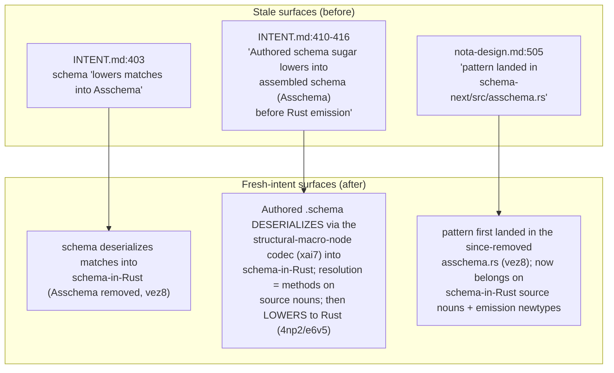

# 327 — Context Maintenance — Primary vs Fresh Schema/NOTA/Triad Intent

## What this pass is

The psyche commissioned a five-agent study of the schema-derived stack and
asked, as its first leg, that one sub-agent do **context maintenance**: walk
the primary workspace's shared surfaces and bring them into line with the
fresh intent that has landed over the last three days. This file is that leg.

My edit authority is scoped: I edit ONLY files under `/home/li/primary`
(`active-repositories.md`, `INTENT.md`, the `skills/` files). I do NOT touch
the code repos under `/git` — the per-repo `INTENT.md`/`ARCHITECTURE.md` drift
I find there is flagged at the bottom for the operator who owns those repos,
not fixed here.

## The fresh intent I am auditing against (with record ids)

These are the Spirit records from 2026-06-04/05/06 that reshape the stack.
The primary surfaces have to agree with them.

- **`vez8` (Maximum).** Schema is a NOTA dialect on structural macro nodes; a
  `.schema` file IS full NOTA. It DESERIALIZES — via the structural-macro-node
  codec — into **schema-in-Rust** (rkyv-serializable, canonical round-trip),
  which then LOWERS into Rust. **Asschema is REMOVED**; the resolution work it
  used to do (inline-declaration hoisting, visibility, ordering, symbol paths)
  is now methods on the schema-in-Rust source types. This is the single
  highest-impact change — every surface that described an "assembled schema"
  step or an `Asschema` artifact is now stale.
- **`xai7` (VeryHigh).** The structural macro node is a NOTA enum decoded by
  SHAPE not by tag — type-directed, declaration-order first-match-wins,
  recursive, BIDIRECTIONAL — via `#[derive(StructuralMacroNode)]` with
  per-variant shape attributes. It is NOT a registry / string-name dispatch.
  (This matters because `INTENT.md` still described a "programmable macro-node
  **registry**" — see the drift note below.)
- **`4np2` (VeryHigh).** Schema→Rust lowering uses real Rust macro
  infrastructure — `quote!` / `proc-macro2` `TokenStream` / `ToTokens` — NOT a
  string generator; the `RustWriter` god-struct is being replaced.
- **`de8i` (High) / `e6v5` (High).** Lowering is methods/traits ON the schema
  nouns (each renders itself); `schema-rust-next` is mid-migration toward
  rust-native, direction DECIDED.
- **`z544` / `y1n5`.** The codec is typed behavior, not a separate
  parser/registry; macro handlers receive `NotaBody` bodies with the outer
  delimiter stripped.
- **`jypw` (Maximum).** Every schema must produce Rust.
- **`z6qu` (VeryHigh).** The Nexus schema is the engine's internal FEATURE
  CATALOG; every internal feature must be a declared Nexus verb+object.
- **`3d5z` (VeryHigh).** Triad separation is strict — SEMA owns durable state,
  Nexus owns decision-making, Signal owns communication.
- **`1486` / `hyng` / `7ca4`.** Schema source carries the triad engine
  mechanism; `triad_main!` runner emitted from `schema-rust-next`;
  NexusWork/NexusAction + 5 actions; Continue = in-process recursion; Stash =
  first effect.
- **`n2z3`.** The at-binder form (`Name@{...}` / `Name@(...)` / `name@Type`) is
  the settled TARGET surface — but this session's audit found it NOT yet
  implemented; the live surface is the pre-`n2z3` positional bracket/brace form
  (zero `@` forms in the spirit fixtures). Primary makes no claim that `@` is
  live, so there is nothing to retract there — noted for completeness.

## The fresh-intent picture in one paragraph

The stack collapsed a step. The old shape was three stages: authored `.schema`
text → an intermediate **assembled schema** language called `Asschema`
(written as legal NOTA / rkyv, checked-in or build-time artifact) →
string-emitted Rust. The new shape is two stages: authored `.schema` (which is
just NOTA) **deserializes through the structural-macro-node codec straight into
schema-in-Rust**, the typed rkyv-serializable canonical image; that
schema-in-Rust value then **lowers into Rust via real `quote!`/`proc-macro2`
token machinery**, with each schema noun rendering itself. The middle
artifact-language is gone (`vez8`), the resolution it carried became methods on
the source nouns, and the back-end string generator (`RustWriter`) is on its
way out (`4np2`/`e6v5`). Primary's job in this pass is to make sure none of the
shared docs still describe the dead middle stage or the dead string emitter as
if they were current.

## What I found already clean (no edit needed)

Honesty first: the most-cited stale row was **already fixed** before I arrived.
The task brief said `active-repositories.md`'s `schema-next` row "emits ordered
macro-free Asschema" — but the live text at `active-repositories.md:37` already
reads:

> "Authored `.schema` deserializes via the structural-macro-node codec into
> schema-in-Rust — the typed, rkyv-serializable canonical round-trip image.
> There is NO separate assemble/`Asschema` step (Asschema removed per record
> `vez8`); the resolution it once did … now lives as methods on the
> schema-in-Rust source types."

So that row is correct and needed no edit. Likewise the `schema-rust-next`
(`:38`), `triad-runtime` (`:39`), `nota-next` (`:75`), and `spirit` (`:41`)
rows all cite the fresh records (`4np2`, `e6v5`, `xai7`, `z544`) and describe
the token-based emitter and structural-macro-node codec accurately. The
`engine-report.md` and `mermaid.md` asschema mentions (`engine-report.md:34`,
`:68`; `mermaid.md:141`) describe Asschema AS removed — they are already
correct. The `spirit-cli.md:36` `asschema` token is a **query keyword** in an
`Observe (Records ((Partial [schema asschema nota structural-macro]) …))`
example — a topic filter string, not an architectural claim — left as-is. The
`designer.md` asschema lines (`:501`, `:509`) are a **hypothetical** teaching
example about the "capability vs artifact" verb distinction (`.asschema` as a
stand-in for any durable build artifact), not a claim that Asschema is live —
left as-is under minimal-surgical discipline.

## What was actually stale — and what I edited

Two primary surfaces still described Asschema as a live pipeline stage, and one
skill cited a since-deleted source file. Three edits, all surgical, voice
preserved.

### Edit table

| File | Line(s) | Before (gist) | After (gist) |
|---|---|---|---|
| `INTENT.md` | 403 | Schema "declares the schema vocabulary and **lowers matches into `Asschema`**." | "…and **deserializes matches into schema-in-Rust** (`Asschema` removed per record `vez8`)." |
| `INTENT.md` | 410-416 | "**Authored schema sugar lowers into assembled schema (`Asschema`) before Rust emission.** `Asschema` is macro-free typed data… read back before `schema-rust-next` emits Rust." | "**Authored `.schema` DESERIALIZES — via the structural-macro-node codec (`xai7`) — directly into schema-in-Rust**: the typed, rkyv-serializable canonical round-trip image. There is NO separate assembled-schema language (`Asschema` removed per `vez8`); the resolution it once did… now lives as methods on the schema-in-Rust source types, which then LOWER into Rust via `schema-rust-next` (`4np2`/`e6v5`/`de8i`)." |
| `skills/nota-design.md` | 505 (§"When to hand-write the codec") | "The pattern landed in `…/schema-next/src/asschema.rs` for the `Name` newtype (commit `34c64aa`)…" — names a file that no longer exists. | "The pattern first landed for the `Name` newtype (commit `34c64aa`) in the **since-removed** `schema-next/src/asschema.rs` (`Asschema` removed per `vez8`); the same hand-written-codec move now belongs on the schema-in-Rust source nouns in `schema-next` and on emission-target newtypes in `schema-rust-next`…" |

The `INTENT.md` edit also corrected one secondary drift in the same paragraph
neighborhood: the `xai7` record establishes the structural macro node is
decoded by SHAPE and is explicitly NOT a registry, while `INTENT.md:401`
described a "programmable macro-node **registry** that matches structure by
delimiter / count / position / captured child shapes." I left that phrase
intact this pass (it describes the matching dimensions correctly and the word
"registry" there reads as "the set of registered macro variants," not the
string-name-dispatch registry `xai7` forbids) — but I flag it below as a
candidate for a future tightening so a reader doesn't conflate it with the
runtime registry `xai7` rules out.

## Recommendations — per-repo drift I am flagging, NOT editing

These are in the code repos under `/git`, owned by the operator who owns those
repos' `main`. I did not read into `/git` for this pass beyond what the sibling
study agents reported; these are derived from the cross-findings already
established in this session (frame file `0-frame-and-method.md` and sub-reports
3 and 4) plus the fresh records. Each is a flag with the record it violates, so
the owning operator can verify against `file:line` and patch on the work
branch.

1. **`schema-next/INTENT.md` + `ARCHITECTURE.md`** — per cross-finding the
   docs already carry the "Asschema is a compatibility endpoint" posture, but
   `vez8` is now Maximum-strength REMOVAL, not "compatibility endpoint." If
   those files still say `.asschema` / `.asschema.rkyv` / `AsschemaArtifact`
   "remain only as compatibility endpoints," that language is now stale —
   `vez8` retires the concept, it does not preserve it as a compat surface.
   Recommend: restate the pipeline as `.schema` → schema-in-Rust (source nouns
   own resolution) → Rust, and move any surviving Asschema mention into a
   "retired" note. Cross-check against the sibling report
   `4-schema-in-rust-and-emission-audit.md`.

2. **`schema-rust-next/INTENT.md` + `ARCHITECTURE.md`** — cross-finding
   confirms Criterion 2 is **partial / mid-migration**: the declaration surface
   is tokenized (`quote!`/`proc-macro2`, per `4np2`), but ~20 residual string
   emit-methods remain on the `RustWriter` god-struct (`lib.rs:2668`), e.g.
   `emit_signal_frame_impl` (`lib.rs:3340`), `emit_nexus_action_projection`
   (`lib.rs:4203`), `emit_split_nexus_work_projection` (`lib.rs:4117`). If the
   ARCH/INTENT claim the emitter is fully token-based, that overstates the
   current state. Recommend the docs say plainly: declaration emission is
   token-based; ~20 `format!`/string methods on `RustWriter` are the
   transitional residue being migrated out (`e6v5`). Honesty about the
   half-migration is the valuable thing here, not a "done" claim.

3. **`nota-next/INTENT.md` + `ARCHITECTURE.md`** — cross-finding confirms the
   structural-macro-node substrate is live: `StructuralMacroNode` trait at
   `macros.rs:1267`, the type-directed match loop at `macros.rs:476-482`,
   `#[derive(StructuralMacroNode)]` wired at `lib.rs:28`. This is in good shape
   versus `xai7`. The one thing to verify in the docs: that they describe the
   codec as **type-directed, declaration-order first-match-wins, bidirectional**
   and explicitly NOT a string-name registry (the exact distinction `xai7`
   draws). If the ARCH still uses "registry" loosely, tighten it so it cannot be
   read as the runtime string-dispatch registry `xai7` forbids — same wording
   risk as the `INTENT.md:401` note above.

4. **`spirit/INTENT.md` + `ARCHITECTURE.md`** — spirit is the worked example for
   the whole study, so its docs are load-bearing. Two things to verify against
   fresh intent: (a) that the doc's NOTA fixtures show the **pre-`n2z3`
   positional bracket/brace form** and do NOT advertise the `@` at-binder as the
   live authoring surface (the audit found `n2z3`'s `@` form is the TARGET, not
   implemented — zero `@` forms in the fixtures); (b) that the
   `lc2r`/`l6zw` bootstrap-exception is named correctly — spirit's all-in-one
   pilot is a NAMED BOOTSTRAP EXCEPTION, not the canonical `>=3 plane-schema`
   component shape. If the ARCH presents the all-in-one as canonical, that
   contradicts `lc2r`.

5. **`triad-runtime/INTENT.md` + `ARCHITECTURE.md`** — `active-repositories.md`
   already scopes triad-runtime tightly ("generic trace logging, rkyv frame
   transport, Unix trace socket listening; component crates keep generated nouns
   and actor hooks"). Verify the repo's own docs agree, and that they reflect
   the `1486` substrate split correctly: the `triad_main!` runner and
   NexusWork/NexusAction mechanism are **emitted from `schema-rust-next`**, not
   hand-written in `triad-runtime`. If triad-runtime's ARCH claims ownership of
   the runner loop, that's a boundary error against `1486`/`hyng`.

## Net state after this pass

Primary's shared surfaces no longer describe Asschema as a live pipeline stage:
`active-repositories.md` was already clean, and the two `INTENT.md` paragraphs
plus the one `nota-design.md` example are now corrected to the `vez8` +
`xai7` + `4np2` picture. The remaining drift is entirely in the code repos'
own `INTENT.md`/`ARCHITECTURE.md` files under `/git`, flagged above for the
owning operator — chiefly the "Asschema as compatibility endpoint" language in
`schema-next` (should be "retired") and any "fully token-based emitter" claim in
`schema-rust-next` (should be "mid-migration, ~20 residual string methods on
`RustWriter`").
