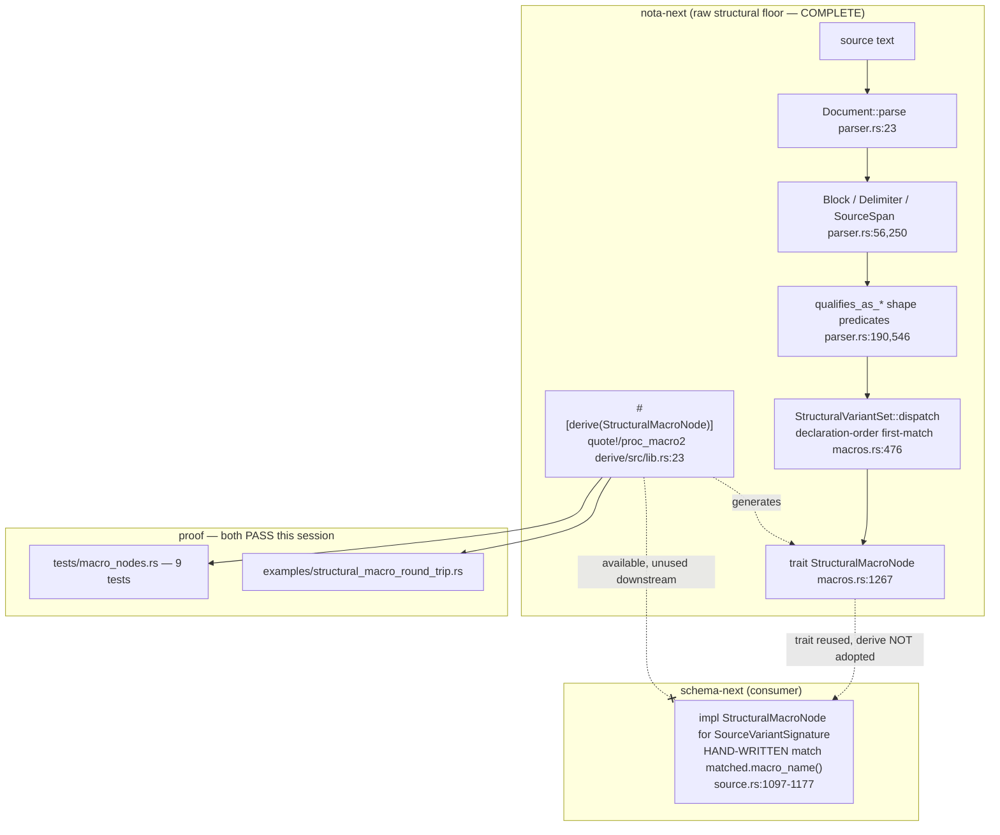

## Headline

nota-next's structural macro node is a **real, fully-implemented, typed derive
codec** — not a registry and not string-name dispatch. The trait, the
type-directed declaration-order match loop, and the
`#[derive(StructuralMacroNode)]` proc-macro all exist, are written with
`quote!`/`proc_macro2`, and **work**: the 9-test `macro_nodes` suite and the
`structural_macro_round_trip` example both compile and pass, exercising all four
xai7 properties end to end.

The gap is one layer down: **schema-next's single consumer has not adopted the
derive.** Its `impl StructuralMacroNode for SourceVariantSignature`
(`schema-next/src/source.rs:1097-1177`) is a hand-written trait impl that
dispatches on **string macro names** (`"unit variant"`, `"data variant"`, …) —
precisely the string-keyed shape the derive was built to erase. The derive
proves out in nota-next's own tests; downstream adoption is still pending.

A second honesty note: the at-binder `@` syntax. `nota-next/ARCHITECTURE.md`
§"At-Binding Syntax" presents `Name@{...}` / `Name@[...]` / `name@(...)` as the
live parser surface, and the parser **does** implement it
(`parser.rs:691` `parse_atom_or_at_binding`). But per Spirit n2z3 this session's
audit found the **authored schema fixtures still use the pre-n2z3 positional
bracket/brace form** — the `@` path is built in the floor but not yet the form
the schema layer writes.

## 1. What NOTA is as a typed text language

NOTA (rnrg / xai7 framing: a typed "hack on the text user interface") is a
text serialization where **everything is a known type** before semantics are
applied, with three load-bearing properties the workspace enforces everywhere:

- **Bracket-only strings.** Strings come exclusively from bracket forms —
  `[text]` inline, `[|text|]` bracket-safe / multi-line, or a bare
  camelCase/kebab/Pascal atom at a `String` schema position. Quotation marks do
  not form string types; the codec structurally cannot emit `"`. nota-next
  encodes this in the delimiter table: pipe-square `[|...|]` is the text form,
  not recursive structure (`parser.rs:250-277`, `Delimiter` enum +
  `opening_text`/`closing_text`).
- **Positional records, not labeled.** A record is a type head followed by its
  fields in declared order — no `(key value)` keyword pairs. `(Optional Integer)`
  is a head `Optional` with one positional argument `Integer`.
- **Delimiter-typed structure.** `(...)` parenthesis = composite / macro-call /
  type reference; `[...]` square bracket = vector; `{...}` brace = ordered map;
  the recursive pipe forms `(|...|)` / `{|...|}` give enum-like / struct-like
  declaration shapes. Each is a distinct `Delimiter` variant
  (`parser.rs:250-256`).

A tiny real NOTA example — a recursive type reference, taken verbatim from the
running round-trip example output:

```
(Vec (Map (Optional RecordIdentifier)))
```

Decodes (shape-directed) to the Rust value:

```
Vector(Application(TypeName("Map"), Optional(Named(TypeName("RecordIdentifier")))))
```

and re-encodes back to the exact same text. No tags, no quotation marks, fully
positional, every node a known type.

## 2. nota-next's division of labor — the raw structural floor

The intent is explicit (`nota-next/INTENT.md:10-13`):

> *NOTA is the library that gives methods on raw delimiter structures: factual
> delimiter predicates, root-object queries, source spans, and structural
> candidate classification. It does not decide schema semantics.*

`ARCHITECTURE.md:106-110` §"Boundary" restates it: *"This crate does not know
what a schema type, field, declaration, enum, macro, or import means."*

**As implemented this holds.** The cross-finding (Criterion 1) is confirmed:
schema-next owns no parser; its raw-text entries all call
`nota_next::Document::parse`. The parse API and the char-scan live HERE, in
nota-next, not in schema-next.

### Block / Delimiter / Document parse API

`Document::parse` is the single entry point (`parser.rs:23`):

```rust
// parser.rs:22-31
impl Document {
    pub fn parse(source: impl Into<String>) -> Result<Self, NotaError> {
        let source = source.into();
        let mut parser = Parser::new(&source);
        let root_objects = parser.parse_document()?;
        Ok(Self { source, root_objects })
    }
```

`Block` is the three-way structural sum — delimited, pipe-text, or atom — each
carrying a `SourceSpan` (`parser.rs:56-65`):

```rust
// parser.rs:56-65
pub enum Block {
    Delimited {
        delimiter: Delimiter,
        span: SourceSpan,
        root_objects: Vec<Block>,
    },
    PipeText(PipeText),
    Atom(Atom),
}
```

`Delimiter` owns the textual delimiter table — opening/closing text per variant
(`parser.rs:250-277`), which is exactly where the bracket-only-string property is
encoded structurally.

### Factual `is_*` and structural `qualifies_as_*`

`ARCHITECTURE.md:18-19` draws the line: *"Factual methods use `is_*`.
Structural candidate methods use `qualifies_as_*`."* Both live on `Block`/`Atom`:

```rust
// parser.rs:190-207  (Block)
pub fn qualifies_as_symbol(&self) -> bool { self.atom().is_some_and(Atom::qualifies_as_symbol) }
pub fn qualifies_as_pascal_case_symbol(&self) -> bool { self.atom().is_some_and(Atom::qualifies_as_pascal_case_symbol) }
pub fn qualifies_as_camel_case_symbol(&self) -> bool { ... }
pub fn qualifies_as_kebab_case_symbol(&self) -> bool { ... }
```

The actual character scanning — the only place case is judged — is here, on
`Atom`, over `self.text.chars()`:

```rust
// parser.rs:546-554
pub fn qualifies_as_pascal_case_symbol(&self) -> bool {
    self.qualifies_as_symbol()
        && self.text.chars().next()
            .is_some_and(|character| character.is_ascii_uppercase())
        && !self.text.contains('-')
}
```

and the lexical scan itself is the cursor in `parser.rs` — `peek`/`peek_next`/
`bump` over `self.source[self.cursor.byte_offset..].chars()`
(`parser.rs:949-969`). **No char-scan exists in schema-next**; it consumes
`Block` and the `qualifies_as_*` predicates, never raw text. This is the
division of labor working as intended.

## 3. THE structural macro node

### The trait (`macros.rs:1267`)

```rust
// macros.rs:1267-1308
pub trait StructuralMacroNode: Sized {
    type Error;

    fn structural_position() -> PositionPredicate;
    fn structural_variants() -> Vec<StructuralVariant>;
    fn to_structural_nota(&self) -> String;                       // <- encode

    fn from_structural_nota(source: &str)
        -> Result<Self, StructuralMacroError<Self::Error>> {      // <- decode
        let document = crate::Document::parse(source)...?;
        match document.root_objects() {
            [single] => Self::from_structural_block(single),
            many => Err(StructuralMacroError::ExpectedSingleRoot { found: many.len() }),
        }
    }

    fn from_structural_block(block: &Block) -> Result<Self, ...> {
        Self::from_structural_candidate(MacroCandidate::from_block(
            Self::structural_position(), block))
    }
    fn from_structural_candidate(candidate: MacroCandidate<'_>) -> Result<Self, ...>;
}
```

The trait IS the bidirectional codec: `from_structural_nota` (decode) +
`to_structural_nota` (encode) live on the same type. `Box<Inner>` forwards both
(`macros.rs:1310-1333`) — this is how recursion through Rust storage indirection
stays the same NOTA shape, per `INTENT.md:64-67`.

### The type-directed, declaration-order first-match loop (`macros.rs:476-482`)

```rust
// macros.rs:469-490  (StructuralVariantSet::dispatch)
pub fn dispatch<'block>(&self, candidate: &MacroCandidate<'block>)
    -> Result<MacroMatch<'block>, StructuralVariantError> {
    let mut tried = Vec::new();
    let mut expected = Vec::new();
    if self.position() == candidate.position() {
        for variant in self.variants() {                 // declaration order
            tried.push(variant.name().to_owned());
            expected.push(format!("{}: {}", variant.name(), variant.expected()));
            if let Some(matched) = variant.matches(candidate.blocks()) {
                return Ok(matched);                       // FIRST match wins
            }
        }
    }
    Err(StructuralVariantError::NoMatch { ... })
}
```

The position gate (`self.position() == candidate.position()`) is the
**type-directed** part: the expected enum type names its position
(`PositionPredicate::named(#node_name)`), and only variants for that position are
tried. The `for variant in self.variants()` loop with `return Ok` on first hit
is the **declaration-order first-match-wins** part. A second guard,
`validate_no_silent_conflicts` (`macros.rs:492-506`), rejects a variant set where
an earlier general variant would make a later specific one unreachable.

### The derive — `#[derive(StructuralMacroNode)]`

Crucial correction to the task framing: the derive does **NOT** live in the
separate `/git/.../nota-derive` repo. That repo is the **legacy** five-derive set
(`NotaRecord`, `NotaEnum`, `NotaMapKey`, `NotaTransparent`, `NotaTryTransparent`
per its `INTENT.md:22-28`) and contains **no** `StructuralMacroNode`
(grep of `nota-derive/src` returns nothing). The real derive is the in-repo
companion crate `nota-next/derive/` (re-exported at `nota-next/src/lib.rs:28`):

```rust
// nota-next/src/lib.rs:28
pub use nota_next_derive::{NotaDecode, NotaEncode, StructuralMacroNode};
```

It IS written with real proc-macro infra (`nota-next/derive/src/lib.rs:3-9`):

```rust
use proc_macro::TokenStream;
use proc_macro2::TokenStream as TokenStreamTwo;
use quote::{format_ident, quote};
use syn::{ ... DeriveInput, ... parse_macro_input };

#[proc_macro_derive(StructuralMacroNode, attributes(shape))]   // lib.rs:23
pub fn derive_structural_macro_node(input: TokenStream) -> TokenStream {
    let input = parse_macro_input!(input as DeriveInput);
    StructuralDerive::new(input).expand().into()
}
```

The expansion (`derive/src/lib.rs:654-741`) generates the whole trait impl from
the enum's declaration order: `structural_variants()` builds the variant list in
source order; `from_structural_block` walks `direct_decode_arms` (one per
variant, **in order**, first matching condition wins); `to_structural_nota`
matches each variant back to its NOTA text. Per-variant `#[shape(...)]`
attributes are parsed into three cases (`derive/src/lib.rs:844-907`):

```rust
enum StructuralVariantShape {
    PascalAtom,                       // #[shape(pascal_atom)]
    Headed { head: String, arity },   // #[shape(head = "Optional", arity = 2)]
    PascalHead { arity },             // #[shape(pascal_head, arity = 2)]
}
```

The generated decode is **recursive by construction** — each field is itself
decoded as a `StructuralMacroNode` (`derive/src/lib.rs:813-821`):

```rust
<#field_type as ::nota_next::StructuralMacroNode>::from_structural_block(#block)
    .map_err(|error| ::nota_next::StructuralMacroNodeError::Field { ... })?
```

### Confirming the four xai7 properties against real code

| xai7 property | Where in real code | Evidence |
|---|---|---|
| **(a) shape not tag** | `direct_match_condition` `derive/src/lib.rs:967-989` | `PascalAtom` matches `block.qualifies_as_pascal_case_symbol()`; `Headed` matches `is_parenthesis() && holds_root_objects()==arity && root_object_at(0)==head`. No `(Named ...)` tag wrapper exists — `Integer` decodes as `Named` purely from its PascalCase **shape**. |
| **(b) declaration-order first-match** | dispatch loop `macros.rs:476-482` + generated `direct_decode_arms` `derive/src/lib.rs:679-681,702` | First matching variant in source order returns; `validate_no_silent_conflicts` (`macros.rs:492-506`) rejects an unreachable later variant. |
| **(c) recursive** | `derive/src/lib.rs:813-821` field decode dispatches to `<#field_type as StructuralMacroNode>` ; `Box<Inner>` forwards `macros.rs:1310-1333` | `(Vec (Map (Optional X)))` nests three levels. |
| **(d) bidirectional encode** | `to_structural_nota` + `encode_body` `derive/src/lib.rs:733-737, 1036-1063` | every variant writes the same NOTA surface back; example asserts `*input == output` and `value == re-decode(output)`. |

### One real structural-macro-node enum decoding (verbatim, and it runs)

From `examples/structural_macro_round_trip.rs:68-78`:

```rust
#[derive(Clone, Debug, Eq, PartialEq, StructuralMacroNode)]
enum TypeReference {
    #[shape(pascal_atom)]
    Named(TypeName),
    #[shape(head = "Optional", arity = 2)]
    Optional(Box<TypeReference>),
    #[shape(head = "Vec", arity = 2)]
    Vector(Box<TypeReference>),
    #[shape(pascal_head, arity = 2)]
    Application(TypeName, Box<TypeReference>),
}
```

Running `cargo run --example structural_macro_round_trip` (verified this
session) prints, among others:

```
in  : (Vec (Map (Optional RecordIdentifier)))
rust: Vector(Application(TypeName("Map"), Optional(Named(TypeName("RecordIdentifier")))))
out : (Vec (Map (Optional RecordIdentifier)))
      text round-trips exactly; value round-trips exactly
```

and demonstrates declaration-order shadowing rejection: a `MisorderedReference`
enum that puts the general `Application` (pascal_head) before the specific
`Optional` head fails construction with *"structural variant conflict between
Application and Optional"*. All four properties, exercised by one running enum.

## 4. Maturity

**The mechanism is fully implemented in nota-next — not partial, not a stub.**

- Trait: `macros.rs:1267-1308`.
- Type-directed declaration-order match: `macros.rs:469-506`.
- Derive: `derive/src/lib.rs:23-27` (entry), `645-1079` (full expansion).
- Tests: `tests/macro_nodes.rs` — **9 tests, all pass** (verified:
  `structural_macro_node_derive_uses_enum_variant_order` at line 342 round-trips
  `(Optional Integer)` and rejects the misordered enum).
- Example: `examples/structural_macro_round_trip.rs` — **runs, round-trips,
  asserts** (verified).

### Where it is NOT yet used: schema-next

schema-next does **not** use `#[derive(StructuralMacroNode)]` anywhere (grep:
zero derive sites; exactly one `impl StructuralMacroNode for ...`). Its single
consumer is **hand-written string-keyed dispatch** (`schema-next/src/source.rs:1097-1177`):

```rust
// source.rs:1097, 1113-1123
impl StructuralMacroNode for SourceVariantSignature {
    type Error = SchemaError;
    ...
    fn from_structural_candidate(candidate: MacroCandidate<'_>) -> Result<Self, ...> {
        let variants = StructuralVariantSet::new(...)?;
        let matched = variants.dispatch(&candidate)...?;
        (|| -> Result<Self, Self::Error> {
            match matched.macro_name() {          // <- STRING dispatch
                "unit variant"   => { ... }
                "data variant"   => { ... }
                "opens variant"  => { ... }
                "belongs variant"=> { ... }
                other => Err(SchemaError::MacroDidNotMatch { macro_name: other.to_owned() }),
            }
        })()
        .map_err(StructuralMacroError::MatchedNode)
    }
    fn to_structural_nota(&self) -> String { self.to_schema_text() }   // source.rs:1174
}
```

This uses the right substrate (`StructuralVariantSet::dispatch`, so the
declaration-order loop is shared) but reads the result by **string macro name**
— the exact shape xai7 says the derive should erase, and it hand-writes the
reverse encode as `to_schema_text()` rather than letting per-variant
`#[shape]` attributes generate it.

**What adopting the derive would change.** Replacing this impl with
`#[derive(StructuralMacroNode)]` on a `SourceVariantSignature`-shaped enum
(variants carrying their `#[shape(...)]` attributes) would: (1) delete the
`match matched.macro_name()` string ladder — variant selection becomes the
generated declaration-order condition chain; (2) delete the hand-written
`to_schema_text()` reverse path — encode is generated per variant; (3) make the
enum's declaration the single source of truth for both directions, so the schema
dialect becomes "specialized NOTA" rather than a one-way lowering with a manual
back-channel. The blocker is that the current `SourceVariantSignature` carries
richer payload semantics (`StreamRelation::Opens`/`Belongs`, nested
`SourceVariantPayload`) than the derive's three flat shapes
(`pascal_atom` / `headed` / `pascal_head`) currently express; closing the gap
likely needs either a few more shape attributes or a payload-decode hook the
derive can call.

## Diagram — intended pipeline vs current wiring



## Audit I own — verdict

**Is nota-next's structural-macro-node a typed derive codec (not a registry /
string-name dispatch)?**

**YES — in nota-next it is a genuine typed derive codec.** The decode/encode is
generated by `#[proc_macro_derive(StructuralMacroNode)]`
(`nota-next/derive/src/lib.rs:23`) from the enum's declaration order and
per-variant `#[shape(...)]` attributes, dispatching by structural **shape**
(`derive/src/lib.rs:967-989`), not by any registered string name. The
`MacroRegistry` (`macros.rs`, surfaced via `lib.rs:21-27`) remains only an
exploration/diagnostics surface, exactly as `INTENT.md:104-106` and
`ARCHITECTURE.md:73-82` intend — it is **not** the typed-node trait boundary.
The trait is bidirectional, type-directed, recursive, and declaration-order
first-match, all confirmed against running code.

**Caveat (owned honestly):** the verdict is about nota-next. The one
**downstream** consumer (schema-next `source.rs:1097-1177`) is still hand-written
**string-keyed** dispatch on `matched.macro_name()`. So the codec exists and is
typed; its adoption is incomplete — the derive is built and tested but not yet
consumed where xai7 ultimately wants it.
