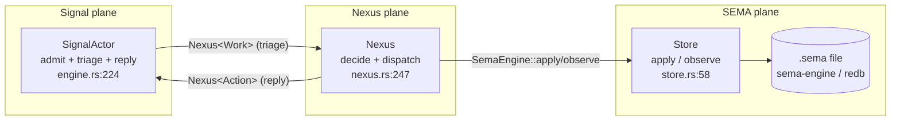
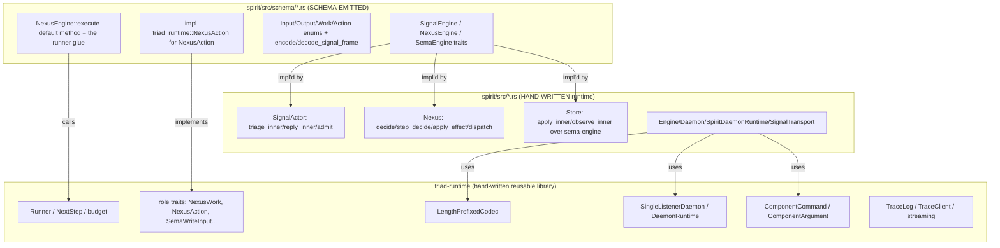

## Headline verdict

The triad engine is real and running. Spirit is a working Signal / Nexus / SEMA
daemon whose three plane interfaces are emitted from `schema/{signal,nexus,sema}.schema`
and whose recursive decision loop is owned by `triad-runtime`. On the three
audit questions:

- **3d5z (strict triad separation): HONOURED.** SEMA (`Store`) owns all durable
  state and is the only code that touches the `.sema`/redb database; Nexus
  (`Nexus`) owns all decision-making and owns no socket and no database handle
  of its own (it holds `Store` but reaches it only through the generated
  `SemaEngine` trait); Signal (`SignalActor`) owns admission/validation/route
  minting and the wire reply. No plane reaches across another's boundary.
- **z6qu (Nexus schema is the internal feature catalog): HONOURED in the
  current feature set.** Every internal feature Spirit has — the three SEMA
  writes, the three SEMA reads, and the three effects (`Stash`, `ClassifyState`,
  `OpenIntentSubscription`) — is a declared Nexus verb+object in
  `schema/nexus.schema`. I found no hidden inline engine logic that should have
  been a schema verb. `decide_signal_arrival` is pure routing of declared
  inputs to declared actions, not feature logic.
- **1486 (the runner mechanism): HONOURED in substance, DIVERGENT in name.**
  `NexusWork`/`NexusAction` with the five actions exist, `Continue` is
  in-process recursion, and the recursive `Runner` is runtime-owned. But the
  `triad_main!` macro named in the task **does not exist anywhere** in spirit,
  triad-runtime, or schema-rust-next. The actual near-one-line main is
  `DaemonCommand::from_environment().run()` (`spirit/src/bin/spirit-daemon.rs:4`),
  hand-written, not macro-emitted. And the "first effect" the runner reaches on
  an `Observe` is `Stash`, not a SEMA write — `Stash` is the first effect
  command in the schema enum and the first effect any read triggers.

Spirit is explicitly the **single-repo ALL-IN-ONE pilot — a NAMED bootstrap
exception (lc2r/l6zw), NOT the canonical >=3-plane split.** One daemon crate
holds all three plane schemas, the engine, the store, the transport, and both
binaries. The canonical shape (separate `signal-<component>` wire-only repo,
separate `meta-signal-<component>`, separate engine/daemon/CLI crates) is
named-but-not-built here on purpose, so the Nix proof harness stays intact
(`spirit/ARCHITECTURE.md:544-560`).

## 1. The three engine traits (3d5z) — schema-emitted vs hand-written

The triad is three traits, each emitted into its own generated plane module,
each implemented by one hand-written runtime object.

| Trait | Defined in (schema-emitted) | Implemented by (hand-written) | Shape |
|---|---|---|---|
| `SignalEngine` | `spirit/src/schema/signal.rs:1483` | `SignalActor` (`spirit/src/engine.rs:224`) | triage in, reply out |
| `NexusEngine` | `spirit/src/schema/nexus.rs:677` | `Nexus` (`spirit/src/nexus.rs:247`) | `execute(&mut self)` heavy logic |
| `SemaEngine` | `spirit/src/schema/sema.rs:617` | `Store` (`spirit/src/store.rs:58`) | `apply(&mut self)` / `observe(&self)` |

Every trait *definition* is `// @generated by schema-rust-next` (the header is
`spirit/src/schema/signal.rs:1`). Every trait *impl* is hand-written component
code. This is exactly the readability principle the runtime INTENT states:
schema names the interface, generated Rust names the trait, hand-written code is
"match typed input, decide, call the next typed interface, return typed output"
(`triad-runtime/INTENT.md:6-7`).

**SignalEngine = triage.** The generated trait carries default no-op lifecycle
and trace hooks plus two abstract methods the component must fill,
`triage_inner` and `reply_inner`:

```rust
// spirit/src/schema/signal.rs:1483 (@generated)
pub trait SignalEngine {
    type NexusInput;
    type NexusOutput;
    fn on_start(&mut self) -> Result<(), ActorStartFailure> { Ok(()) }
    ...
    fn triage_inner(&self, input: signal::Signal<signal::Input>) -> Self::NexusInput;
    fn reply_inner(&self, output: Self::NexusOutput) -> signal::Signal<signal::Output>;
    fn triage(&self, input: signal::Signal<signal::Input>) -> Self::NexusInput {
        let output = self.triage_inner(input);
        self.trace_signal_triaged();
        output
    }
    ...
}
```

`SignalActor` fills the two `_inner` methods by hand — triage is genuinely light
(it just wraps the admitted `Input` as a `NexusWork::SignalArrived` envelope):

```rust
// spirit/src/engine.rs:246 (hand-written)
fn triage_inner(&self, input: signal_schema::signal::Signal<Input>)
    -> nexus_schema::nexus::Nexus<NexusWork> {
    let origin_route = input.origin_route();
    NexusWork::signal_arrived(input.into_root()).with_origin_route(origin_route.into())
}
fn reply_inner(&self, output: nexus_schema::nexus::Nexus<NexusAction>)
    -> signal_schema::signal::Signal<Output> {
    output.into_signal_output()
}
```

**NexusEngine = heavy logic, `execute(&mut self)`.** The generated trait owns
the `execute` *default method* (the recursive driver) and declares the
component hooks abstract. The component implements one decision step plus the
storage/effect dispatch — but NOT the loop:

```rust
// spirit/src/schema/nexus.rs:713 (@generated — the loop is emitted)
fn execute(&mut self, input: nexus::Nexus<nexus::Work>) -> nexus::Nexus<nexus::Action>
where Self: Sized {
    self.trace_nexus_entered();
    let origin_route = input.origin_route();
    let first_work = input.into_root();
    let runner = triad_runtime::Runner::new(self.continuation_limit());
    let mut runner_adapter = NexusRunnerAdapter::new(self, origin_route);
    let reply = runner.drive(&mut runner_adapter, first_work);
    let output = NexusAction::reply_to_signal(reply).with_origin_route(origin_route);
    self.trace_nexus_decided();
    output
}
```

`Nexus` (`spirit/src/nexus.rs:247`) implements the abstract hooks
`decide` / `apply_sema_write` / `observe_sema_read` / `run_effect` /
`budget_exhausted_reply`. The `&mut self` on `execute` is the single-flight
guard: `Engine::handle` locks the Nexus mutex before calling it
(`spirit/src/engine.rs:132-133`), so two executions cannot overlap.

**SemaEngine = `apply(&mut self)` / `observe(&self)`.** The generated trait
splits the mutation surface (`&mut self`) from the read surface (`&self`):

```rust
// spirit/src/schema/sema.rs:617 (@generated)
pub trait SemaEngine {
    ...
    fn apply_inner(&mut self, input: sema::Sema<sema::WriteInput>) -> sema::Sema<sema::WriteOutput>;
    fn observe_inner(&self, input: sema::Sema<sema::ReadInput>) -> sema::Sema<sema::ReadOutput>;
    fn apply(&mut self, input: ...) -> ... { let output = self.apply_inner(input); self.trace_sema_write_applied(); output }
    fn observe(&self, input: ...) -> ... { let output = self.observe_inner(input); self.trace_sema_read_observed(); output }
}
```

`Store` (`spirit/src/store.rs:58`) implements `apply_inner`/`observe_inner` over
`sema-engine`. The `&self` on `observe` is load-bearing: parallel readers can
share the store reference; `tests/runtime_triad.rs` has a scoped-thread witness
(`spirit/ARCHITECTURE.md:325`).

### 3d5z verdict (the audit I own)

**Spirit honours 3d5z.** Each plane object owns exactly its slice and reaches
the next plane only through the generated trait:

- **SEMA owns all durable state.** Only `Store` constructs a `sema_engine::Engine`
  (`spirit/src/store.rs:184-189`) and only `Store` calls `assert_identified` /
  `mutate_identified` / `retract_identified` / `match_identified`
  (`store.rs:217-338`). Nexus holds a `Store` but never opens it or queries
  redb directly — it only calls `SemaEngine::apply` / `SemaEngine::observe`
  (`spirit/src/nexus.rs:282-297`).
- **Nexus owns all decision-making.** Every routing choice — which input
  becomes which action, what a read completion replies with — lives in
  `step_decide` and its helpers (`spirit/src/nexus.rs:328-431`). Signal does NOT
  decide (it only validates and wraps); SEMA does NOT decide (it only persists
  and reads).
- **Signal owns all communication.** `SignalActor::admit` mints the origin
  route, validates, and produces `SignalAccepted` (`spirit/src/engine.rs:190`);
  the wire frames are the generated `encode_signal_frame`/`decode_signal_frame`
  on `Input`/`Output` (`spirit/src/schema/signal.rs:989,998`). Nexus and SEMA
  never touch a socket.



## 2. Nexus mechanism (1486): NexusWork / NexusAction, the five actions, the runner

The decision plane is two enums and a five-way dispatch.

**`NexusWork`** is the fact stream Nexus decides FROM. **`NexusAction`** is the
command stream Nexus emits NEXT. Both are declared as enum bodies in the schema:

```text
# spirit/schema/nexus.schema:19-20 (root enum bodies, positional NOTA)
[SignalArrived SemaWriteCompleted SemaReadCompleted EffectCompleted]
[CommandSemaWrite CommandSemaRead ReplyToSignal CommandEffect Continue]
```

The **five actions** are `CommandSemaWrite`, `CommandSemaRead`, `ReplyToSignal`,
`CommandEffect`, `Continue` (`schema/nexus.schema:20` and `:37`). The generated
`NexusAction` projects each into `triad_runtime::NextStep`:

```rust
// spirit/src/schema/nexus.rs:660 (@generated projection — this is one of the
// ~20 residual emit-methods from criterion 2; here it is correct and tight)
impl triad_runtime::NexusAction for NexusAction {
    type Reply = ReplyToSignal; type SemaWrite = CommandSemaWrite;
    type SemaRead = CommandSemaRead; type Effect = CommandEffect; type Work = NexusWork;
    fn into_next_step(self) -> NexusRunnerNextStep {
        match self {
            Self::CommandSemaWrite(input) => triad_runtime::NextStep::SemaWrite(input),
            Self::CommandSemaRead(input)  => triad_runtime::NextStep::SemaRead(input),
            Self::ReplyToSignal(output)   => triad_runtime::NextStep::Reply(output),
            Self::CommandEffect(effect)   => triad_runtime::NextStep::RunEffect(effect),
            Self::Continue(work)          => triad_runtime::NextStep::Continue(work),
        }
    }
}
```

**`Continue` = in-process recursion.** In the runtime loop `Continue` simply
re-enters `decide_next_step` with the new work, spending one budget step and NOT
touching storage or effects:

```rust
// triad-runtime/src/runner.rs:177
NextStep::Continue(next_work) => {
    if let Err(exhausted) = budget.spend_next_step() {
        return engines.budget_exhausted_reply(exhausted);
    }
    work = next_work;
}
```

**The runner is runtime-owned** (`triad-runtime/src/runner.rs:149`,
`Runner::drive`). It is a `loop` over the five `NextStep` outcomes: `Reply`
exits; the other four each spend a budget step (default 32,
`runner.rs:3`) and re-enter with completion work. Budget exhaustion returns a
typed `budget_exhausted_reply`, never a panic.

### "first effect = Stash" — the divergence from the task's wording

The task says "Stash = first effect." Reading the schema, `Stash` is literally
the first variant of `NexusEffectCommand`:

```text
# spirit/schema/nexus.schema:39
NexusEffectCommand [(Stash Stash) (ClassifyState ClassifyState) (OpenIntentSubscription OpenIntentSubscription)]
```

And operationally it IS the first effect the runner reaches on the common
`Observe` path: a SEMA read completion with non-empty results does NOT reply
directly — it recurses through the `Stash` effect so the wire reply carries a
slim handle, not the full record set:

```rust
// spirit/src/nexus.rs:389 (decide_sema_read_completion)
SemaReadOutput::Observed(observed) => {
    // Observe's slim-output path: recurse through Stash effect so the
    // wire reply carries a handle, not the full record set.
    NexusAction::command_effect(NexusEffectCommand::stash(StashRequest {
        records: observed.record_set, database_marker: observed.database_marker,
    }))
}
```

### `triad_main!` — DOES NOT EXIST (honest divergence)

The task names a `triad_main!` runner macro "emitted from schema-rust-next."
I grepped spirit, triad-runtime, and schema-rust-next: **there is no
`triad_main!` and no `macro_rules!` for it anywhere.** The actual
near-one-line daemon main is hand-written, not macro-emitted:

```rust
// spirit/src/bin/spirit-daemon.rs:1 (the WHOLE file)
use spirit::DaemonCommand;
fn main() {
    if let Err(error) = DaemonCommand::from_environment().run() {
        eprintln!("spirit-daemon: {error}");
        std::process::exit(1);
    }
}
```

`DaemonCommand::run()` is hand-written in `spirit/src/daemon.rs:88`. The
*recursive runner* (`Runner::drive`) is what is shared in `triad-runtime`; the
*program entry point* is not macro-generated. So the substance of 1486 (a shared
recursive runner reached from a tiny main) is true; the specific `triad_main!`
emission named in the brief is aspirational / not-yet-built. The
`NexusEngine::execute` default method (`nexus.rs:713`) is the closest thing to a
"runner emitted from schema" — and it IS schema-emitted — but it is a trait
method, not a `main`-replacing macro.

## 3. z6qu — Nexus schema as the internal feature catalog

Record z6qu requires every internal engine feature to be a declared Nexus
verb+object in the schema, never hidden inline logic. Spirit's
`schema/nexus.schema` declares its complete internal-feature surface:

- **Three SEMA writes**, as a Nexus-plane enum (NOT a raw pass-through of the
  SEMA write enum): `schema/nexus.schema:27`
  `CommandSemaWrite [(Record Record) (Remove Remove) (ChangeCertainty ChangeCertainty)]`.
- **The read command** `CommandSemaRead SemaReadInput` (`:31`).
- **Three effects**, declared in the effect-command enum
  (`schema/nexus.schema:39`):
  `NexusEffectCommand [(Stash Stash) (ClassifyState ClassifyState) (OpenIntentSubscription OpenIntentSubscription)]`
  with their result counterparts at `:43`
  `NexusEffectResult [(Stashed Stashed) (StateClassified StateClassified) (IntentSubscriptionOpened IntentSubscriptionOpened)]`.

**Does spirit comply? Yes.** Each declared effect has exactly one hand-written
implementation branch in `Nexus::apply_effect`, and there are no extra branches
doing undeclared work:

```rust
// spirit/src/nexus.rs:219 (apply_effect — one branch per schema effect)
fn apply_effect(&mut self, command: NexusEffectCommand) -> NexusEffectResult {
    match command {
        NexusEffectCommand::ClassifyState(statement) => { ... }          // schema:41
        NexusEffectCommand::Stash(StashRequest { records, database_marker }) => { ... } // schema:40
        NexusEffectCommand::OpenIntentSubscription(_query) => { ... }     // schema:42
    }
}
```

The `State` classification feature is the textbook z6qu case: Signal admits the
raw statement but does NOT classify; Nexus first emits
`CommandEffect(ClassifyState(...))` (`nexus.rs:339-341`), proving the
classification feature is a declared schema effect rather than a hidden write
branch. The classified `Entry` then flows back as `StateClassified` and becomes
an ordinary `CommandSemaWrite(Record(...))` (`nexus.rs:414-415`). No internal
feature hides in `decide_*` — those methods only route declared inputs to
declared actions. **z6qu: compliant.** (`spirit/INTENT.md:56-64` and
`ARCHITECTURE.md:217-227` both state the rule explicitly as the repo's own
discipline.)

## 4. End-to-end worked example: one `(Record ...)` operation

Trace of a single `Record` write from CLI argv to rendered NOTA, every hop with
real source. The CLI text edge accepts NOTA like
`(Record (Entry [...topics...] Decision [desc] Medium Zero))`; the canonical
binary path is identical for any input variant.

```mermaid
sequenceDiagram
    participant U as User / argv
    participant CLI as spirit (CLI bin)
    participant T as SignalTransport
    participant Sock as Unix socket
    participant DR as SpiritDaemonRuntime
    participant SA as SignalActor (Signal)
    participant NX as Nexus (decide loop)
    participant RUN as triad_runtime::Runner
    participant ST as Store (SEMA)
    participant DB as .sema (sema-engine/redb)

    U->>CLI: argv = one NOTA string
    CLI->>CLI: ComponentCommand::from_environment (one arg)
    CLI->>CLI: text.parse::<Input>()  (NOTA decode at edge)
    CLI->>T: SignalTransport::connect + exchange(&input)
    T->>T: input.encode_signal_frame() (short header + rkyv)
    T->>Sock: LengthPrefixedCodec::write_body (4-byte len + frame)
    Sock->>DR: accepted UnixStream -> handle_stream
    DR->>T: read_input -> Input::decode_signal_frame (rkyv)
    DR->>SA: engine.handle(input)
    SA->>SA: admit: mint origin route, validate Entry
    SA->>NX: triage -> Nexus<Work>::SignalArrived
    NX->>RUN: NexusEngine::execute (Runner::drive)
    RUN->>NX: decide_next_step(SignalArrived) -> SemaWrite(Record)
    RUN->>NX: apply_sema_write -> SemaEngine::apply
    NX->>ST: Store::apply_inner(Sema<WriteInput::Record>)
    ST->>DB: assert_identified -> new identifier, commit++
    DB-->>ST: SemaReceipt(identifier, DatabaseMarker)
    ST-->>RUN: Work::SemaWriteCompleted(Recorded)
    RUN->>NX: decide_next_step -> Reply(RecordAccepted)
    RUN-->>SA: NexusAction::ReplyToSignal(Output)
    SA->>SA: reply -> Signal<Output>
    DR->>T: write_output -> Output::encode_signal_frame (rkyv)
    T->>Sock: LengthPrefixedCodec::write_body
    Sock-->>T: (CLI side) read_output -> Output::decode_signal_frame
    T-->>CLI: (route, Output::RecordAccepted)
    CLI->>U: println!("{output}")  (NOTA render via Display)
```



Hop-by-hop with code:

**Hop 1 — argv -> one NOTA argument.** `ComponentCommand::from_environment()`
enforces the single-argument rule; the CLI reads exactly one inline-NOTA /
file argument (`spirit/src/bin/spirit.rs:28-32`, `:72-88`).

**Hop 2 — NOTA decode at the CLI edge.** The text is parsed straight into the
generated `Input` via the schema-emitted `FromStr`/`NotaDecode`:

```rust
// spirit/src/bin/spirit.rs:105
fn parse_input(&self) -> Result<Input, NotaDecodeError> {
    self.text.parse::<Input>().or_else(|error| {            // generated NotaDecode
        LegacyStateInput::from_source(&self.text)            // only State shorthand shim
            .map(LegacyStateInput::into_input).ok_or(error)
    })
}
```

**Hop 3 — rkyv frame + Unix socket.** `exchange` encodes a short-header+rkyv
signal frame and wraps it in the runtime length-prefix codec:

```rust
// spirit/src/transport.rs:51,86
pub fn exchange(&mut self, input: &Input) -> Result<(OutputRoute, Output), TransportError> {
    self.write_input(input)?; self.read_output()
}
fn write_frame(&mut self, frame: Vec<u8>) -> Result<(), TransportError> {
    LengthPrefixedCodec::default()
        .write_body(&mut self.stream, &LengthPrefixedFrameBody::new(frame))?;
    self.stream.flush()?; Ok(())
}
```

The signal frame itself is the generated `encode_signal_frame` — short header
(the route discriminant) followed by the rkyv archive
(`spirit/src/schema/signal.rs:989`).

**Hop 4 — daemon read + Signal triage.** The shared `SingleListenerDaemon`
accepts the stream and calls the component's `handle_stream`, which decodes the
frame and hands the `Input` to `Engine::handle`:

```rust
// spirit/src/daemon.rs:148
fn handle_stream(&self, stream: UnixStream) -> Result<(), DaemonError> {
    let subscription_writer = stream.try_clone()?;
    let mut transport = SignalTransport::new(stream);
    let (_route, input) = transport.read_input()?;                  // rkyv decode
    let output = self.engine.handle(input);                          // into the triad
    let root_output = output.root().clone();
    transport.write_output(&root_output)?;                          // rkyv reply
    ...
}
```

`Engine::handle` admits (validates) then runs the Signal->Nexus composition
under the Nexus mutex (`spirit/src/engine.rs:120-134`); `process_with` does the
flat triage / execute / reply composition (`engine.rs:282-309`). For a `Record`,
`triage_inner` wraps it as `NexusWork::SignalArrived` (`engine.rs:246`).

**Hop 5 — Nexus execute (the recursion).** `NexusEngine::execute`
(`spirit/src/schema/nexus.rs:713`) spins up `Runner::drive`. Step 1:
`decide_signal_arrival` routes `Input::Record` to a SEMA write command:

```rust
// spirit/src/nexus.rs:342
Input::Record(record) => NexusAction::command_sema_write(CommandSemaWrite::record(record)),
```

The runner projects that to `NextStep::SemaWrite` (`nexus.rs:668`) and calls
`apply_sema_write` (`runner.rs:159`).

**Hop 6 — SEMA apply over .sema / sema-engine.** `Nexus::apply_sema_write`
converts the Nexus-plane `CommandSemaWrite` into the SEMA-plane `WriteInput` and
calls the generated `SemaEngine::apply` on `Store`:

```rust
// spirit/src/nexus.rs:277
fn apply_sema_write(&mut self, origin_route: ..., input: CommandSemaWrite) -> SemaWriteOutput {
    SemaEngine::apply(&mut self.store, input.into_sema_write_input().with_origin_route(...)).into_root()
}
```

`Store::apply_inner` matches `Record` and writes durably through sema-engine,
allocating the numeric identifier and advancing the commit sequence:

```rust
// spirit/src/store.rs:83 (inside apply_inner)
SemaWriteInput::Record(record) => match self.record(record) {
    Ok(identifier) => SemaWriteOutput::recorded(SemaReceipt {
        record_identifier: identifier, database_marker: self.database_marker(),
    }),
    ...
}
// spirit/src/store.rs:217
fn record(&self, entry: Entry) -> Result<u64, StoreError> {
    Ok(self.database
        .assert_identified(IdentifiedAssertion::new(self.entries, entry))?
        .identifier().value())
}
```

The `DatabaseMarker` is a real content hash: blake3 over each record's
`(identifier, archived bytes)` folded with the commit sequence
(`spirit/src/store.rs:313-331`).

**Hop 7 — Nexus translate completion -> Signal reply.** The runner re-enters
with `Work::SemaWriteCompleted(Recorded)`; `decide_sema_write_completion` turns
it into a `ReplyToSignal`:

```rust
// spirit/src/nexus.rs:374
SemaWriteOutput::Recorded(receipt) => NexusAction::reply_to_signal(Output::record_accepted(receipt)),
```

`Runner::drive` sees `NextStep::Reply` and exits (`runner.rs:158`);
`execute` wraps it as a `Nexus<Action>::ReplyToSignal`, and
`SignalEngine::reply_inner` projects it back to `Signal<Output>` via the
generated `into_signal_output` (`engine.rs:254-259`, `engine.rs:522-534`).

**Hop 8 — rkyv back + NOTA render.** The daemon writes the output frame
(`daemon.rs:155` -> `transport.rs:64` -> generated `Output::encode_signal_frame`,
`signal.rs`); the CLI decodes it (`transport.rs:68`) and renders it through the
generated `Display` (NOTA encode):

```rust
// spirit/src/bin/spirit.rs:44
let (_route, output) = transport.exchange(&input)?;
println!("{output}");   // generated Display -> NOTA, e.g. (RecordAccepted (SemaReceipt 1 (DatabaseMarker 1 ...)))
```

The full loop crosses a real Unix-socket process boundary (proven by
`tests/process_boundary.rs`, `ARCHITECTURE.md:519-534`), so this is actor /
interface use, not in-memory function calls.

## 5. triad-runtime's actual role and the boundary

`triad-runtime` is the shared, component-agnostic runtime library. Reading its
source, it owns exactly these mechanics and nothing component-specific:

- **Generic length-prefixed frame transport** — `LengthPrefixedCodec` (the
  4-byte big-endian length envelope), `FrameBody` is "intentionally just bytes"
  and the codec "does not know about schema roots, trace events, signal frames,
  NOTA, or rkyv" (`triad-runtime/ARCHITECTURE.md:16-27`). Spirit's `transport.rs`
  uses it as the outer envelope (`transport.rs:8,87`).
- **The recursive Nexus runner** — `Runner`, `NextStep`, `RunnerEngines`,
  `ContinuationLimit/Budget/Exhausted` (`triad-runtime/src/runner.rs`). This is
  the loop; the component supplies the typed actions.
- **Reusable role traits** — `NexusWork`, `NexusAction`, `SemaWriteInput`,
  `SemaReadInput`, `NexusEffectCommand`, ... (`triad-runtime/src/role.rs`).
  These are how the runtime speaks generically about a component's enums.
- **The single-listener (and multi-listener ordinary/meta) daemon shell** —
  `SingleListenerDaemon` / `DaemonRuntime` (`triad-runtime/src/daemon.rs`):
  socket prep, stale-file removal, bind, accept loop, request-error isolation,
  start/stop lifecycle. Spirit's `Daemon::run` hands `SpiritDaemonRuntime` to it
  (`spirit/src/daemon.rs:104`).
- **The single-argument rule** — `ComponentCommand` / `ComponentArgument`
  (`triad-runtime/src/argument.rs`), used by both spirit binaries.
- **Generic trace logging + Unix trace socket** — `TraceLog`, `TraceFrame`,
  `TraceSocketListener`, `TraceClient` (`triad-runtime/src/trace.rs`). The
  runtime owns the log and socket mechanics; the component owns its typed
  `TraceEvent`.
- **Streaming subscription mechanics** — `SubscriptionTokenIssuer`,
  `SubscriptionRegistry`, `SubscriptionEventPublisher`
  (`triad-runtime/src/streaming.rs`).

### exposes vs schema-emitted vs hand-written — the boundary



The boundary is clean and three-layered:

- **triad-runtime exposes** the runner loop, role traits, frame codec, daemon
  shell, argument rule, trace, streaming — all generic, no Spirit nouns.
- **schema-rust-next emits** (into `spirit/src/schema/*.rs`) the three engine
  *traits*, the `execute` default method that *calls* `triad_runtime::Runner`,
  the wire enums with their `encode/decode_signal_frame`, and the
  `impl triad_runtime::NexusAction for NexusAction` bridge that connects the
  emitted action enum to the runtime role trait.
- **spirit hand-writes** the three *impls* (`SignalActor`, `Nexus`, `Store`),
  the composition objects (`Engine`, `Daemon`, `SpiritDaemonRuntime`,
  `SignalTransport`), and the component-specific behavior (validation,
  classification policy, query predicates, blake3 digest).

So the runner is hand-written *in triad-runtime*, the glue that reaches it is
*schema-emitted in spirit*, and the engine behavior is *hand-written in spirit*.
`triad-runtime` never parses NOTA, never owns a SEMA table, never names a Spirit
variant. (`triad-runtime/ARCHITECTURE.md:185-189`, `INTENT.md:35-39`.)

## Spirit is the named bootstrap exception (lc2r), not the canonical split

To be unambiguous: this single crate holds `schema/signal.schema`,
`schema/nexus.schema`, `schema/sema.schema`, the engine, the store, the
transport, and both binaries. The canonical component shape per lc2r/l6zw is
**>=3 plane-schema files across separate repos** — a wire-only
`signal-<component>` repo with NO engine traits, a `meta-signal-<component>`,
and separate engine/daemon/CLI crates. Spirit deliberately does NOT do that:

> "The repo-triad split (`spirit`, `signal-spirit`, `meta-signal-spirit`) is
> not represented in this pilot repo." — `spirit/ARCHITECTURE.md:559`

> "Main currently keeps the single crate so the Nix proof harness remains
> intact." — `spirit/ARCHITECTURE.md:547-549`

It carries the meta slot as a reserved-but-unbound `meta_socket_path` in
`Configuration` (`spirit/INTENT.md:90-96`, `ARCHITECTURE.md:164-170`) precisely
because the meta signal contract is not yet authored. Spirit is the copyable
plane/runtime *exemplar*; the multi-repo boundaries are the named next migration
(`spirit/ARCHITECTURE.md:544-551`), not a flaw in the pilot.

## Honest divergences summary (intended vs implemented)

| Intended (brief / records) | Implemented | Status |
|---|---|---|
| `triad_main!` runner macro emitted from schema-rust-next | No such macro anywhere; main is hand-written `DaemonCommand::from_environment().run()` (`bin/spirit-daemon.rs:4`) | DIVERGENT (name); substance lives in `NexusEngine::execute` default method + `Runner::drive` |
| Stash = "first effect" (as a write) | `Stash` is first `NexusEffectCommand` variant (`nexus.schema:39`) AND the first effect any `Observe` triggers (`nexus.rs:389`) — it is an effect, not a write | MATCHES (it is an effect, not a SEMA write) |
| z6qu every internal feature a Nexus verb+object | All 3 writes, 3 reads, 3 effects declared in `nexus.schema`; one impl branch each | HONOURED |
| 3d5z strict triad separation | SEMA-only DB access, Nexus-only decisions, Signal-only comms | HONOURED |
| `n2z3` at-binder `Name@{...}` schema form | Schema files use pre-n2z3 positional bracket/brace form, zero `@`, zero `\|` (`schema/*.schema`) | NOT YET (matches the session's cross-finding) |
| canonical >=3-plane multi-repo split | single all-in-one crate | NAMED BOOTSTRAP EXCEPTION (lc2r), intended |
