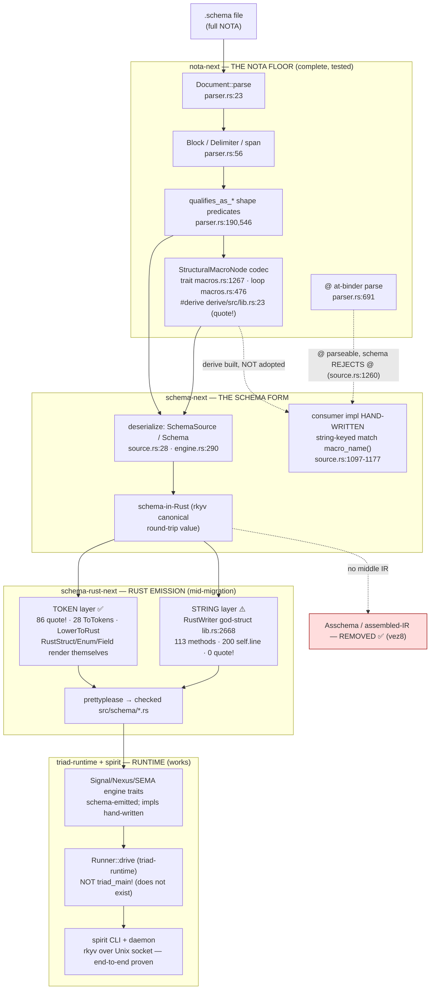
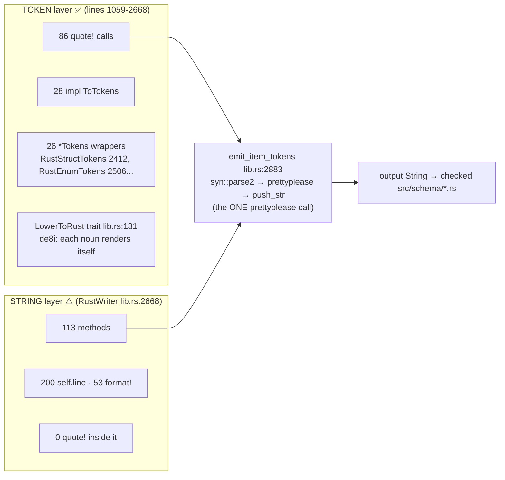

# 327 — Overview & Audit Verdict

## Bottom line

Both audit criteria you named are **already settled intent** (captured
2026-06-05), so this was a compliance check against the live code, cross-checked
by two independent adversarial verifiers. The verdicts:

| Your audit criterion | Verdict | Confidence |
|---|---|---|
| **Schema implements NO parser of its own** — it rides NOTA's structural-macro interfaces | ✅ **COMPLIANT** | High — an adversarial re-read *tried to refute it and failed* |
| **No custom string-emitting pseudo-macro in the Rust schema** — real Rust macro infra (quote!/proc-macro2/ToTokens) | ⚠️ **PARTIAL — mid-migration, by design** | High — exact counts reproduced independently |

In one sentence: **the schema language is clean (it is genuinely "specialized
NOTA," owning no parser), the structural-macro-node codec is real and tested in
nota-next, and the Rust emitter is honestly half-way through the string→token
migration the psyche ordered — with the back-half still on the `RustWriter`
god-struct.** Spirit runs end-to-end as a real Signal/Nexus/SEMA daemon and
proves the whole pipeline works in practice.

The single most useful output of this study is the **debt ledger** below: four
concrete intent-vs-implementation gaps, each grounded in `file:line`, each with
what closes it.

## The pipeline — intended vs implemented, in one picture

Read the dotted lines: they are the gaps. The solid lines all work.

## Plane-by-plane: intended vs implemented

| Plane | As intended (record) | As implemented | Verdict |
|---|---|---|---|
| **NOTA floor** (`nota-next`) | typed text language; raw structural parsing + `qualifies_as_*` only; the structural-macro-node codec is a `#[derive]` type-directed shape-matcher (`xai7`/`z544`) | All present and **tested** — 9-test suite + round-trip example pass; derive written with `quote!`/`proc_macro2` | ✅ complete |
| **Schema language** (`schema-next`) | a `.schema` IS full NOTA; deserializes via the codec into schema-in-Rust; no assemble step (`vez8`); owns no parser | Owns no parser (all 6 raw entries call `nota_next::Document::parse`; deps = `nota-next` + `rkyv` only); Asschema gone | ✅ compliant — **Criterion 1** |
| **Rust emission** (`schema-rust-next`) | token-based via real Rust macro infra; per-noun `ToTokens`; `RustWriter` replaced entirely (`4np2`/`de8i`/`e6v5`) | Declaration surface tokenized; ~20 runtime/support emit-methods still string-based on `RustWriter` | ⚠️ partial-mid-migration — **Criterion 2** |
| **Runtime triad** (`spirit`/`triad-runtime`) | strict Signal/Nexus/SEMA split (`3d5z`); Nexus schema is the feature catalog (`z6qu`); schema-carried runner (`1486`) | Strict split HONOURED; z6qu HONOURED; runner is a triad-runtime library + schema-emitted `execute` default — but `triad_main!` macro doesn't exist | ✅ runs; ⚠️ one named gap |

## Audit Criterion 1 — schema owns no parser ✅

**Confirmed compliant, and an adversarial verifier could not break it.** The
verifier independently hunted for a hand-rolled parser inside schema-next and
came up empty:

- All 6 raw-text entry points call `nota_next::Document::parse` — `raw.rs:16`,
  `engine.rs:295/324/425`, `source.rs:29`, `declarative.rs:44`. `Document::parse`
  is *not defined* in schema-next (it lives at `nota-next/parser.rs:23`).
- `grep` for `Parser|Scanner|Cursor|Grammar|Token|Lexer|Tokenizer` over
  schema-next/src returns **empty**. `grep` for `peekable|char_indices|as_bytes`
  returns **empty** — the char-level scan lives only in `nota-next/parser.rs`.
- `Cargo.toml` has exactly two deps: `nota-next` + `rkyv`. No `nom`/`pest`/
  `logos`/`chumsky`/`winnow`.
- Every `.chars()`/`split`/`strip` site in schema-next operates on *already-parsed
  atom strings* (PascalCase classification, camelCase→snake conversion,
  symbol-path `:` split, `$`-capture tokens) — never on raw NOTA structure.

The structural reading rides `nota_next::{Block, Delimiter, Document}` and the
`StructuralMacroNode` trait throughout. This is exactly the "schema is
specialized NOTA, not a separate language" intent (`vez8`) realized in code.

## Audit Criterion 2 — token-based emission, not string pseudo-macro ⚠️

**Confirmed partial-mid-migration — honestly half-done — with both agents'
counts independently reproduced by the verifier.** There is a clean split
inside one file (`schema-rust-next/src/lib.rs`) where two emission substrates
both feed one output `String`:

What is **already tokenized** (the part the psyche's objection already moved):
aliases, tuple newtypes, structs, fields, enums, variants, type references, and
since report 317 the engine traits, trace hooks, object-name enums, plane
envelopes, mail lifecycle, and the Nexus runner adapter.

What is **still string-based** (~20 `emit_*` methods on `RustWriter`): the
binary signal-frame codec `emit_signal_frame_impl` (`lib.rs:3340`, 44
`self.line` + 13 `format!`), and the cross-plane projections
`emit_nexus_action_projection` (`lib.rs:4203`) and `emit_split_nexus_work_projection`
(`lib.rs:4117`). These are the imperative `match`/panic bodies, harder to
tokenize than the declarative type shapes.

One extra finding beyond report 317's named debt: **`migration.rs` is a separate,
fully string-based emitter** (0 `quote!`, 21 `format!`, 6 `self.line`) for
upgrade-migration modules — untokenized surface *not* mentioned in the
`INTENT.md` migration-debt clause. Worth naming explicitly so it isn't missed.

This matches `e6v5` exactly: the string surface is **transitional, the direction
is decided**, and the build-time-tokens-into-checked-`.rs` boundary (via
`prettyplease`, `build.rs:504`) is the intended artifact shape — *not* inline
proc-macro expansion — so generated interfaces stay diffable and inspectable.

## The debt ledger — every intent-vs-implementation gap

This is the actionable core. Four gaps, ordered by how load-bearing they are.

### Gap 1 — schema-rust-next emission is ~20 methods short of fully token-based

- **Intent:** `4np2` (VeryHigh, raised today) — the `RustWriter` god-struct is
  replaced *entirely*; emission is `quote!` all the way down.
- **Reality:** declaration surface tokenized; ~20 runtime/support emit-methods
  still on `RustWriter` (`lib.rs:2668`), plus a separate string emitter in
  `migration.rs`.
- **Closes it:** token-wrapper nouns for the residual sections — a
  `SignalFrameImplTokens`, and per-noun token wrappers for the Nexus/SEMA
  projections — then delete `RustWriter`. Report 317 already names this as the
  next slice and warns it "wants named cross-object nouns first, especially a
  `PlaneType` model" so the isolated `ToTokens` impls don't secretly share
  string predicates.

### Gap 2 — schema-next hasn't adopted the StructuralMacroNode derive

- **Intent:** `xai7` (VeryHigh) — the structural macro node is realized as
  `#[derive(StructuralMacroNode)]`, type-directed, *not* string-name dispatch.
- **Reality:** the derive is **built and tested in nota-next** (`derive/src/lib.rs:23`,
  written with `quote!`/`proc_macro2`/`syn`; 9 tests pass) — but schema-next's
  one consumer is **hand-written string-keyed dispatch**:
  `match matched.macro_name() { "unit variant" => …, "data variant" => … }`
  (`schema-next/source.rs:1097-1177`) — precisely the shape `xai7` says the
  derive should erase.
- **Closes it:** replace that `impl` with `#[derive(StructuralMacroNode)]` on a
  `SourceVariantSignature`-shaped enum carrying `#[shape(...)]` attributes. The
  blocker report 2 names: the current payload is richer
  (`StreamRelation::Opens/Belongs`, nested payloads) than the derive's three flat
  shapes (`pascal_atom`/`headed`/`pascal_head`) express — so closing it needs a
  few more shape attributes or a payload-decode hook.

### Gap 3 — `triad_main!` does not exist

- **Intent:** `1486`/`1419` and the primary skill `component-triad.md` describe a
  `triad_main!` runner macro **emitted from schema-rust-next**.
- **Reality:** report 5 grepped spirit, triad-runtime, **and** schema-rust-next:
  there is no `triad_main!` and no `macro_rules!` for it. The near-one-line main
  is hand-written `DaemonCommand::from_environment().run()`
  (`spirit/src/bin/spirit-daemon.rs:4`). The *substance* of 1486 exists — a shared
  recursive `Runner::drive` (`triad-runtime/runner.rs:149`) reached from a
  schema-emitted `NexusEngine::execute` default method (`spirit/src/schema/nexus.rs:713`)
  — but it's a trait method + library, not a `main`-replacing macro.
- **Closes it:** either build `triad_main!` as the emitted entry-point macro, or
  annotate the intent/skill that the macro is the *named-but-unbuilt* next step
  and the shared `Runner` + schema-emitted `execute` default is the current
  realization. **This is a primary-surface item** (`component-triad.md` currently
  reads as if `triad_main!` is emitted) — flagged for your call, not edited
  unilaterally.

### Gap 4 — the n2z3 at-binder is parseable but not the schema form

- **Intent:** `n2z3` — authored surface settled on `Name@{...}` (struct),
  `Name@(...)` (enum), `name@Type` (binder).
- **Reality (reconciled in code this session):** the **nota-next parser
  implements `@`-binding** (`parser.rs:691` `parse_atom_or_at_binding`,
  distinguishing declaration- vs member-binding) — but **schema-next rejects
  `@`** (`source.rs:1255-1261` `SourceVariantName::is_valid` requires
  `!contains('@')`), and **zero** authored `.schema` fixtures use it (all use the
  pre-n2z3 positional bracket/brace form). So n2z3 is realized at the NOTA floor,
  not at the schema form.
- **Closes it:** teach schema-next's declaration handling to consume the
  at-binder blocks the parser already produces, then migrate the fixtures.

### The recurring theme

Three of the four gaps are the **same shape**: *nota-next (the floor) is built
ahead of schema-next (the form)*. The structural-macro-node derive exists but
isn't adopted; the `@` at-binder parses but isn't consumed. The remaining two are
*mid-migration back-ends*: the Rust emitter's string residue, and the runner
that's a library not yet a macro. None of these are violations of decided
direction — they are the **unfinished tail of migrations the psyche has already
ordered**. The direction is right; the adoption/cleanup is incomplete.

## What is solid (the good news)

- **schema-next is genuinely "specialized NOTA"** — owns no parser, period.
- **The structural-macro-node codec is real, typed, bidirectional, recursive,
  declaration-order, and tested** — the part of NOTA's original design `xai7`
  says was "never implemented" now exists and passes 9 tests + a round-trip
  example in nota-next.
- **Asschema is genuinely removed** (`vez8`) — only an absence-asserting test
  references it. (One naming hazard: a surviving `Assembled*` family in
  `schema-next/declarative.rs:1374-1605` is the *user-macro template-expansion*
  layer, not the old IR — a rename would prevent future confusion.)
- **Spirit honours `3d5z` and `z6qu`** and runs end-to-end across a real
  Unix-socket process boundary: CLI NOTA decode → rkyv frame → Signal triage →
  Nexus execute → SEMA apply over `.sema`/redb → Nexus translate → Signal reply
  → NOTA render (full trace with code in report 5, proven by
  `tests/process_boundary.rs`).
- **The clean three-layer boundary**: triad-runtime exposes the generic runner +
  frame codec + daemon shell; schema-rust-next emits the engine traits + the glue
  that calls the runner; spirit hand-writes only the behavior. No NOTA between
  components; binary rkyv on the wire.

## Context-maintenance outcome (report 1)

Primary's shared surfaces are now truthful against the fresh intent:

- `protocols/active-repositories.md` was **already clean** — the `schema-next`
  row already says "NO separate assemble/Asschema step (Asschema removed per
  `vez8`)". The brief's worry was stale.
- **Edited:** `INTENT.md:403` and `:410-418` (replaced the "lowers into assembled
  schema (Asschema)" language with the `vez8`/`xai7`/`4np2` deserialize→schema-in-Rust→
  token-lower picture); `skills/nota-design.md:505` (the hand-written-codec
  example no longer cites the deleted `schema-next/src/asschema.rs` as a live
  file).
- **Flagged for the code repos** (not edited — they want a work branch):
  schema-next docs that still call Asschema a "compatibility endpoint" should read
  "retired"; schema-rust-next docs that claim a fully-token-based emitter should
  say "mid-migration, ~20 residual `RustWriter` methods"; spirit/triad-runtime
  docs should reflect the `triad_main!`-not-built and at-binder-not-live reality.

## Recommended next moves (for your call)

1. **Finish the schema-rust-next token migration** (Gap 1) — the highest-value
   slice; it's what your "no string pseudo-macro" intent is waiting on. Start with
   a `PlaneType` model + token wrappers for the signal-frame impl and the Nexus
   projections; include `migration.rs`.
2. **Adopt the StructuralMacroNode derive in schema-next** (Gap 2) — deletes the
   string-keyed `match macro_name()` and makes the schema dialect truly
   bidirectional-by-derive.
3. **Decide `triad_main!`** (Gap 3) — build it, or soften the skill/intent to
   match the library-runner reality. Either way, reconcile `component-triad.md`.
4. **Rename the `Assembled*` family** in schema-next so it can't be mistaken for
   the removed Asschema IR.

## Reading guide

- `0-frame-and-method.md` — the question, intent table, method.
- `1-context-maintenance.md` — primary-surface edits + per-repo drift flags.
- `2-nota-structural-macro-node.md` — NOTA as typed text; the derive codec, proven.
- `3-schema-language-and-lowering.md` — the schema language; Criterion 1 audit.
- `4-schema-in-rust-and-emission-audit.md` — the schema-in-Rust nouns; Criterion 2 audit.
- `5-triad-engine-and-spirit-pilot.md` — the runtime triad; spirit end-to-end.
- `6-overview.md` — this file.
