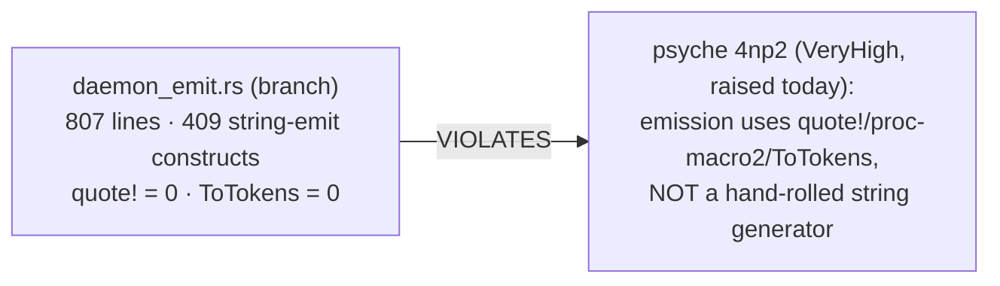

# 328 — triad_main audit, fix, migration — Frame

## What the psyche asked

> "triad_main is implemented. Audit it, fix any obvious flaw or bad design/pattern,
> then start migrating all components to the new runtime: mind, message,
> orchestrate, router, terminal-control, spirit, persona."

## The situation (as found)

`triad_main!` is the **emitted daemon module** (design 542; *not* a literal Rust
macro). Per handoff report 543 it is implemented on three
`designer-daemon-emit-2026-06-06` branches, verified green end-to-end, but **NOT
yet landed to main**:

- **triad-runtime** branch `4454952f` — `DaemonConfiguration` trait +
  `ExitReport::from_result`. Diverged from main (merge-base `fdfd183`).
- **schema-rust-next** branch `304d52e7` — the daemon emitter `daemon_emit.rs`
  (807 lines) + `ModuleEmission::daemon_module`, gated by a `NexusDaemonShape`
  schema declaration. Diverged from main (merge-base `799f678`).
- **spirit** branch `ad122e3e` — the pilot: `impl ComponentDaemon for
  SpiritDaemon`, emitted `src/schema/daemon.rs`, one-liner bin, hand-written
  daemon + `SubscriptionHub` deleted. Clean descendant of current main.

**Concurrency hazard:** in this same session I landed **Gap 1** (the
RustWriter→token emission rewrite) to schema-rust-next main (`4ac90de`). The
daemon-emit branch was built off *pre-Gap-1* main, so it follows the old
string-emission style.

## Headline flaw (pre-landing, already confirmed)

`daemon_emit.rs` re-introduces exactly the string-based emitter Gap 1 just
eliminated. **It must be rewritten to token-based emission (matching the Gap-1
`RustModuleRenderer`/`ToTokens` approach) as part of landing** — not landed
as-is. The lib.rs hook is only +4 additive lines (`pub mod daemon_emit;` +
re-export), so the rest of the reconciliation is small; the emitter rewrite is
the substance.

## Method

Three-phase, sequential (the migration depends on a landed, clean triad_main):

1. **Audit** (this directory) — fan out reviewers over the branch code to
   surface ALL flaws/bad patterns, not just the string emitter. Reports `1`–`3`,
   synthesis in the highest-numbered file.
2. **Land + fix** — integrate the three branches to main in dependency order
   (triad-runtime → schema-rust-next → spirit), rewriting `daemon_emit.rs` to
   tokens + applying audit fixes, regenerating lockfiles, verifying each repo
   green (esp. spirit `process_boundary` against the emitted daemon).
3. **Migrate** — components onto the landed runtime. Current state: spirit is the
   pilot (done); message has the triad-runtime dep but a `.concept.schema`; mind,
   orchestrate, router, persona, persona-spirit, terminal-control are at the
   concept stage (no plane schemas, no triad dep). Each migrates
   concept→plane-schemas + `NexusDaemonShape` + `ComponentDaemon` impl.

## Reviewer roster (audit phase)

| # | Reviewer | Scope |
|---|---|---|
| 1 | emission discipline | `daemon_emit.rs` string-vs-token (quantify + scope the rewrite); the emitted `daemon.rs` quality |
| 2 | daemon design & Rust discipline | `ComponentDaemon` trait, `GeneratedDaemonRuntime` spine, `DaemonConfiguration`/single-arg rule, `DaemonError`, Single/Multi listener, methods-on-nouns |
| 3 | triad/engine conformance | 3d5z separation, engine traits, no-NOTA-between-components, Option-B streaming emission, the spirit pilot integration, cross-repo landing risks |

## Landing dependency order (from handoff 543)

`triad-runtime` → `schema-rust-next` (`cargo update -p triad-runtime`) → `spirit`
(`cargo update -p triad-runtime -p schema-rust-next`), regenerating each lockfile
against the freshly-landed upstream main.
