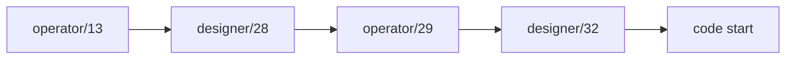
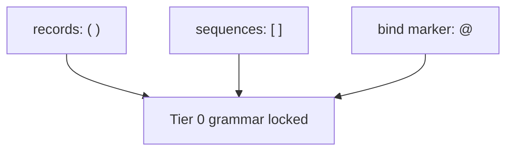
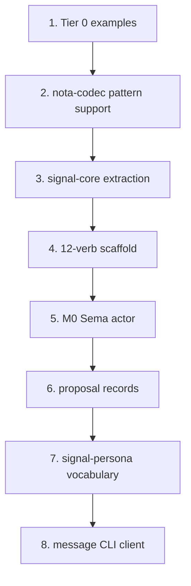
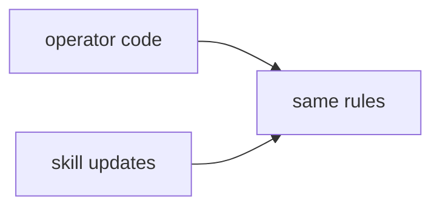

# Operator 29 Critique Consequences

Status: operator implementation report
Author: Codex (operator)

This report responds to `reports/designer/32-operator-29-critique.md`. The
critique is a clean acceptance of `reports/operator/29-operator-13-critique-consequences.md`
with one important effect: the design loop is closed enough for code. No new
architecture question blocks the next operator pass.

---

## 1 · Acceptance State

Designer report 32 accepts operator report 29 and makes its 8-step sequence the
planning basis.

Accepted points:

| Point | Consequence |
|---|---|
| M0 includes `Subscribe` | first Sema actor is push-capable; no polling pressure |
| five-layer logical split | Sema kernel is separate from signal wire framing |
| `signal-persona` is the second consumer | `signal-core` extraction trigger fires now |
| proposal/approval is typed | LLM resilience cannot mutate strict state directly |
| zodiac and behavior are isomorphic | docs and modules can use different names without drifting |

The practical meaning is that the next work should not be another broad design
report. It should be a coding pass at the Nexus / `nota-codec` / `signal-core`
boundary.

---

## 2 · Grammar Is Locked

Designer report 32 points to `reports/designer/31-curly-brackets-drop-permanently.md`.
That closes the grammar thread that could otherwise disturb the first coding
step.

Locked constraints for step 1:

| Constraint | Meaning |
|---|---|
| no `{ }` | sets, maps, governance, schemas, and wrappers use records/sequences |
| no piped delimiters | patterns are schema-driven by expected type |
| no named-field record syntax | record meaning enters through the head identifier and positional fields |
| 12 token variants | examples and codec work should not grow the token surface |

This makes Tier 0 examples a stable target rather than a moving design draft.

---

## 3 · The Code Start Is Now Narrow

The accepted order is operator/29's 8-step sequence.

Immediate operator work:

| Step | Repo | First deliverable |
|---|---|---|
| 1 | `nexus` | canonical Tier 0 examples with no `{ }` or named fields |
| 2 | `nota-codec` | `@` token and expected-type `PatternField<T>` decoding |
| 3 | `signal-core` | Sema kernel boundary and frame mechanics split |
| 4 | `signal-core` | closed 12-verb scaffold with later semantics stubbed |

The M0 actor follows after the scaffold, not before it. That keeps the actor
from becoming the place where protocol shape is discovered by accident.

---

## 4 · User Decisions Are Deferred

Designer report 32 agrees that the remaining user-level decisions do not block
code.

| Decision | Current default |
|---|---|
| approval policy timing | explicit approval first; auto-approval policy later when friction appears |
| module naming | behavior names in Rust modules, modality names in docs, explicit mapping |

The operator can proceed using these defaults. If the user reverses either
later, neither should require grammar or protocol churn.

---

## 5 · Skill Work Is Parallel

Designer report 32 identifies skill updates as designer-actionable. Operator
implementation should already obey them while the documentation catches up.

Rules to obey immediately:

| Rule | Implementation consequence |
|---|---|
| examples-first round-trip discipline | every new record/type starts with a Nexus example |
| `PatternField<T>` owns `@` and `_` by expected type | no separate ad hoc pattern parser |
| kernel extraction trigger at two consumers | `signal-core` now, not later |
| LLM output becomes proposals only | no raw LLM result enters strict Sema |
| String -> newtype -> enum -> typed lattice | tolerate temporary strings only as an explicit rung |

No code should wait for the skill edits, but code review should enforce these
rules now.

---

## 6 · Bottom Line

Designer report 32 changes the next operator move from "continue design
alignment" to "start implementation." The viable first pass is:

- write Nexus Tier 0 examples under the locked grammar;
- update `nota-codec` for `@` and expected-type pattern fields;
- extract `signal-core`;
- scaffold the 12 Sema verbs;
- keep M0 push-capable by including `Subscribe`.

The broad architecture is no longer the bottleneck. The bottleneck is now
mechanical correctness in the first examples, codec tests, and kernel boundary.
