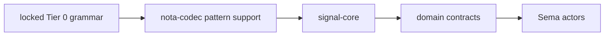
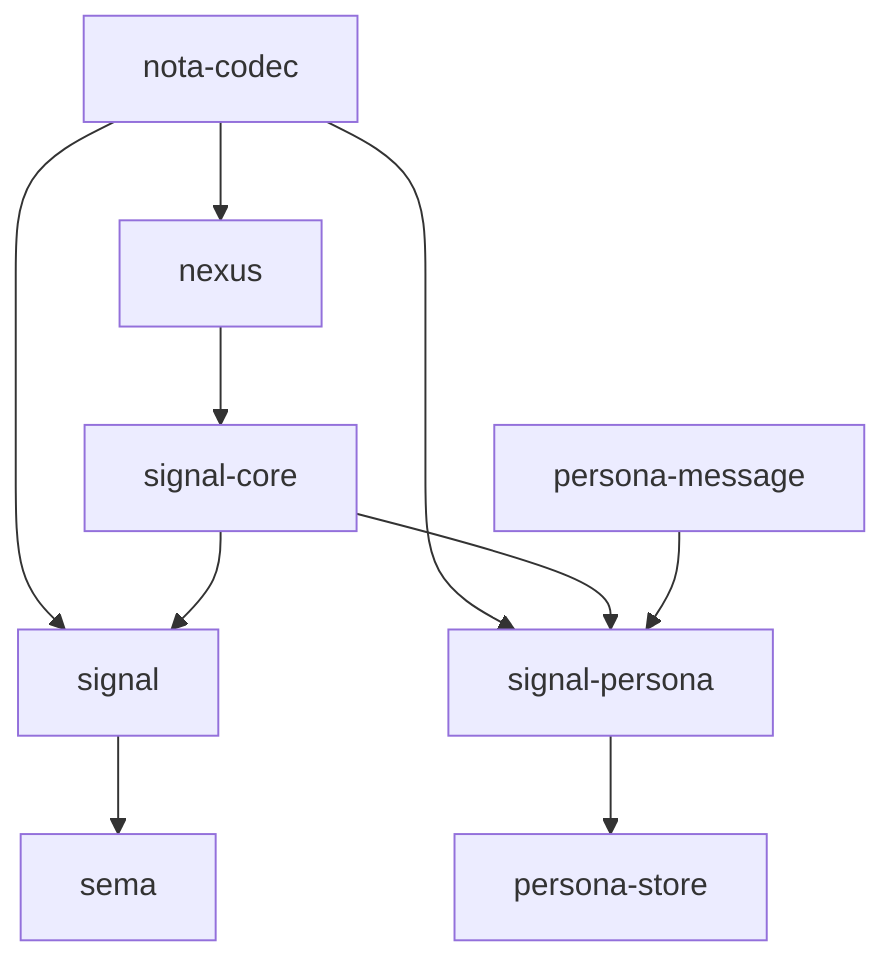
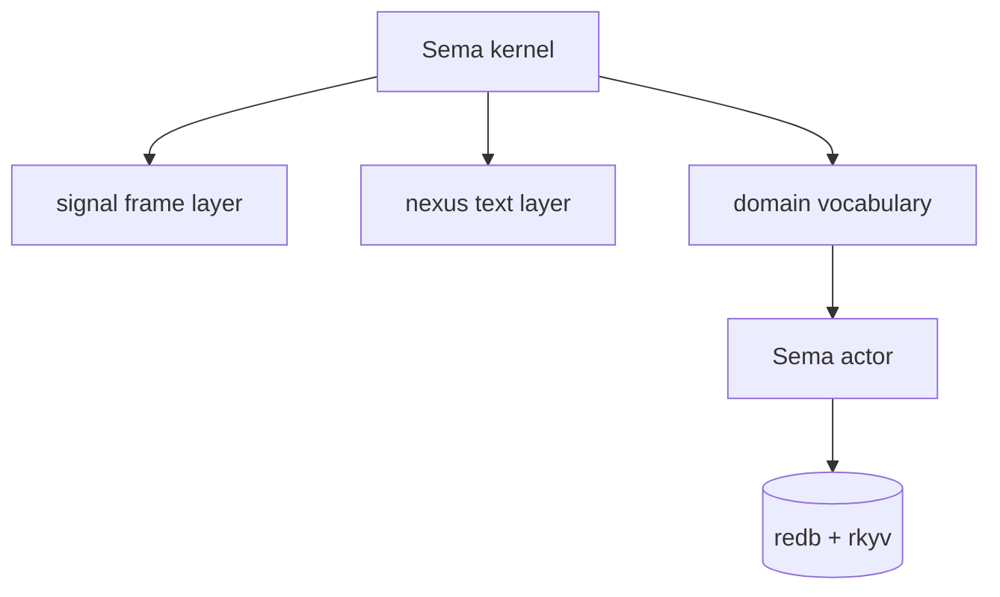
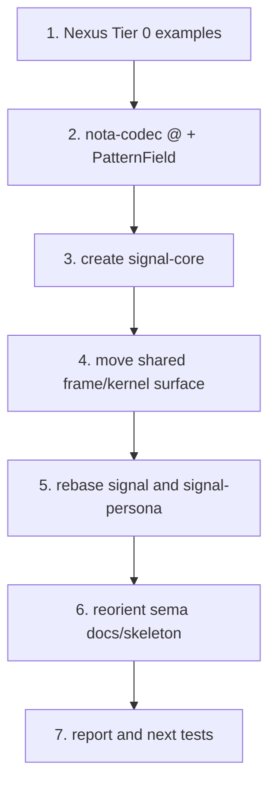
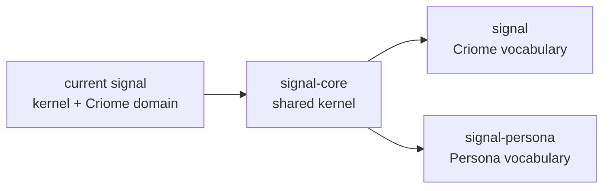

# Sema Signal Nexus Restructure Plan

Status: operator implementation plan
Author: Codex (operator)

This report responds to `reports/designer/32-operator-29-critique.md` and the
user request to refactor `nexus`, `sema`, `signal`, and the new repos needed
around them. It describes how I intend to restructure the project before the
next code pass, and why that shape follows from the accepted design.

---

## 1 · What Report 32 Settles

Designer report 32 accepts operator report 29 and says the design arc is ready
for code. The next work is not more broad architecture search; it is mechanical
alignment of repos to the accepted split.

The accepted constraints:

| Constraint | Consequence |
|---|---|
| `{ }` stays dropped | Nexus examples use only records, sequences, primitives, and `@` |
| `Subscribe` is M0 | the first Sema actor must support push delivery |
| five logical layers | kernel, frame, text, domain, actor stay distinct |
| `signal-persona` is a second consumer | `signal-core` extraction happens now |
| proposal/approval is typed | LLM output cannot mutate strict state directly |

This makes the first restructuring pass a boundary cleanup: create the kernel,
make domain crates depend on it, and stop letting old repo names imply old
ownership.

---

## 2 · Target Repository Map

The target shape is a small ecosystem of contracts and actors, not one crate
that knows everything.

Responsibilities:

| Repo | Destination role |
|---|---|
| `nota-codec` | text tokenization, record decoding/encoding, expected-type pattern fields |
| `nexus` | human text language spec and domain-parameterized text translator |
| `signal-core` | Sema kernel contract and shared signal frame mechanics |
| `signal` | Criome/Sema domain vocabulary over `signal-core` |
| `signal-persona` | Persona/Sema domain vocabulary over `signal-core` |
| `sema` | reusable redb+rkyv database substrate and actor-facing store mechanics |
| `persona-store` | Persona's Sema instance using Persona vocabulary |
| `persona-message` | CLI client that renders/parses Nexus text into Persona Sema requests |

The key change is that `signal` stops being "everything sema-shaped." It
becomes Criome's domain contract. The shared kernel moves to `signal-core`.

---

## 3 · Layer Boundaries

The accepted five-layer split becomes the practical editing guide.

Layer ownership:

| Layer | Owner | Why |
|---|---|---|
| Sema kernel | `signal-core` | every Sema-speaking domain needs the same request/reply spine |
| signal frame layer | `signal-core` first | frame, handshake, auth, and version are shared mechanics |
| nexus text layer | `nexus` + `nota-codec` | text is a human projection, not the Rust-to-Rust wire |
| domain vocabulary | `signal`, `signal-persona` | closed payload enums differ by domain |
| Sema actor/store | `sema`, `persona-store`, Criome store owner | reducers and tables are runtime ownership, not contract records |

I will keep the first physical cut conservative: `signal-core` may contain both
kernel and frame modules while the logical layer names stay explicit. If the
frame layer later needs a narrower crate, that split will be visible from real
use rather than guessed up front.

---

## 4 · First Code Pass

The next implementation pass should land in this order.

Concrete plan:

| Step | Work |
|---|---|
| 1 | Add canonical Nexus Tier 0 examples with no `{ }`, no named fields, no piped pattern delimiters |
| 2 | Validate and finish existing `nota-codec` work around `@` and expected-type `PatternField<T>` |
| 3 | Create public `signal-core` repo with Nix, Rust, architecture, and skills boilerplate |
| 4 | Put `Frame`, length prefix, handshake/version, auth shell, and 12-verb request scaffold in `signal-core` |
| 5 | Make `signal` the Criome domain contract and `signal-persona` the Persona domain contract over `signal-core` |
| 6 | Rewrite `sema` architecture so it is reusable Sema substrate, not Criome-exclusive prose |
| 7 | Run `nix flake check` per repo, commit with `jj`, push each repo, then write an implementation report |

I will not start by changing `persona-message`. It should move after
`signal-persona` has the right dependency shape; otherwise the CLI will encode
the transition design instead of the destination.

---

## 5 · Why `signal-core` Comes First

The danger in continuing inside current `signal` is that new universal pieces
will keep accreting beside Criome-specific records.

The extraction trigger has fired because two domains need the same spine:

| Consumer | Needs |
|---|---|
| `signal` | Criome records over the Sema verb scaffold |
| `signal-persona` | Persona records over the same Sema verb scaffold |

Leaving the kernel in `signal` would make `signal-persona` depend on a crate
whose name and contents imply Criome's domain vocabulary. That is the exact
kind of boundary confusion the contract-repo pattern exists to avoid.

---

## 6 · What Changes In Existing Repos

### `nexus`

`nexus` becomes the text surface and translator, not a Criome-specific gateway.
Its architecture should say: text goes in, typed domain request comes out. The
parser/renderer shape is domain-parameterized; it does not keep a runtime
string registry of kind names.

### `nota-codec`

`nota-codec` owns lexical and structural text mechanics. The important change
is that `@` and `_` mean bind/wildcard only because the expected receiving type
is `PatternField<T>`. The top-level parser does not have a separate pattern
language.

### `signal`

`signal` becomes Criome's domain vocabulary over `signal-core`. It should keep
Criome record kinds such as graph records, diagnostics, identity/config records,
and their closed domain payload enums. Shared frame, handshake, auth, version,
and verb spine move out.

### `signal-persona`

`signal-persona` becomes Persona's domain vocabulary over `signal-core`. Its
current frame/handshake/auth duplication should collapse onto the core types.
Persona-specific payloads remain here: messages, harness bindings, delivery
decisions, system observations, and store identifiers.

### `sema`

`sema` becomes the reusable database substrate. It owns redb+rkyv storage
patterns, slots, revisions, table wrappers, version-skew records, and actor-facing
store mechanics. It should not say that Criome exclusively owns Sema as a
concept. Criome and Persona each instantiate Sema with their own domain
vocabulary.

---

## 7 · Rules I Will Enforce While Refactoring

The implementation must obey the workspace discipline read before this pass.

| Rule | Effect on this refactor |
|---|---|
| behavior lives on types | no utility free functions for frame, parser, or store behavior |
| no hollow ZST method holders | parser/renderer/frame/store types carry real state or behavior belongs elsewhere |
| full English identifiers | no `tok`, `op`, `ctx`, `de`, `msg` in new code |
| redb+rkyv for Rust state/wire | no JSON or NOTA between Rust components |
| NOTA/Nexus for humans | text projection stays at CLI/daemon/harness boundaries |
| no polling | `Subscribe` lands in M0; clients do not loop `Match` |
| github flake inputs | committed flakes use `github:LiGoldragon/<repo>`, not `git+file` |
| `nix flake check` gate | every edited Rust repo gets checked before push |

The goal is not just to move files. The goal is to make the wrong dependency
shape hard to write.

---

## 8 · Known Implementation Risks

| Risk | Guardrail |
|---|---|
| `signal-core` becomes a generic record bag | keep closed request/reply spine; domain payloads are type parameters or closed domain enums |
| `sema` becomes a storage utility crate | model state ownership explicitly; actor-facing handles own their data |
| `nexus` hard-codes Criome names | examples and translator tests use domain interfaces rather than string registries |
| `signal-persona` duplicates core frame logic | make core dependency first, then delete duplicated frame/handshake code |
| `nota-codec` tests prove strings instead of objects | examples round-trip real records through public API |

The beauty test applies here: if the dependency graph reads as a workaround, the
boundary is wrong.

---

## 9 · Next Report

After the implementation pass, I will write a separate operator report that
records what actually changed, why each repo moved, what tests ran, and what
remains. This report is the intended restructuring plan; the later report is
the implementation record.
