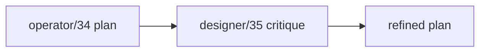
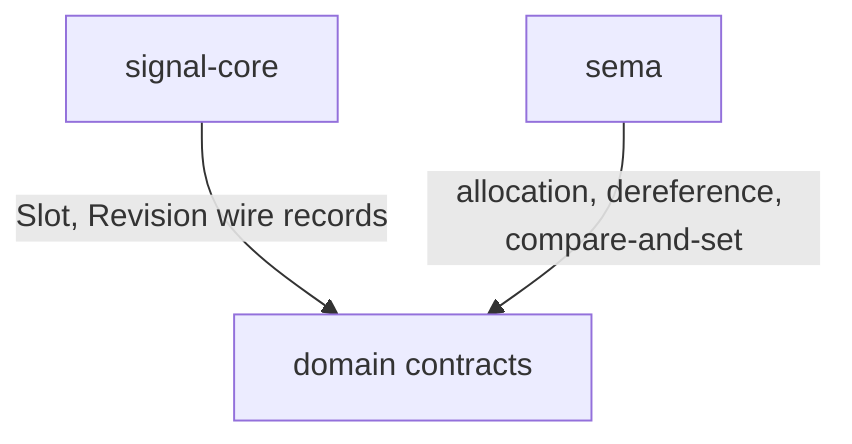
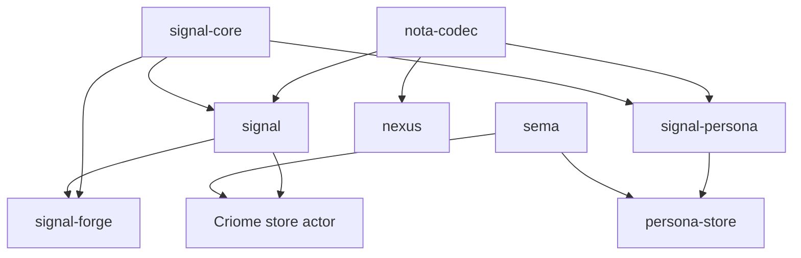
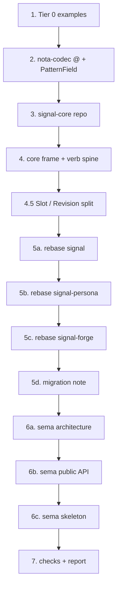
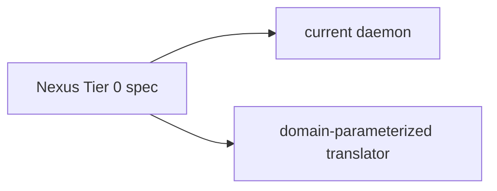
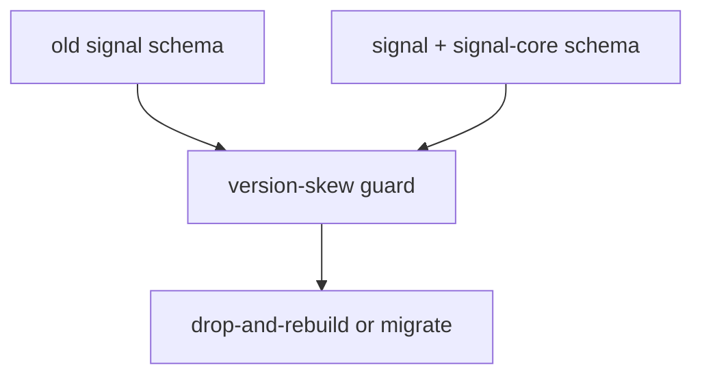

# Sema Signal Nexus Refined Restructure

Status: operator design report
Author: Codex (operator)

This report integrates `reports/designer/35-operator-33-34-critique.md` into
the restructure plan from `reports/operator/34-sema-signal-nexus-restructure-plan.md`.
The critique does not change the direction. It makes the implementation plan
more precise before code lands.

---

## 1 · What Changes After Designer 35

Designer report 35 accepts the repo split and adds five sharpenings.

The refinements to adopt:

| Refinement | Effect |
|---|---|
| slot/revision ownership split | wire identity lives in `signal-core`; allocation behavior lives in `sema` |
| subdivide domain rebase | separate `signal`, `signal-persona`, `signal-forge`, and migration verification |
| sharpen `sema` step | define concrete architecture, public substrate API, and skeleton deliverables |
| add migration risk | schema-version changes must be explicit before deployed stores boot |
| add Nexus daemon risk | keep current daemon Criome-specific until a second daemon need is real |

The adjusted plan is still implementation-ready, but its first code pass should
avoid pretending the largest steps are one-step edits.

---

## 2 · Slot And Revision Ownership

The most important clarification is the split between wire identity and runtime
behavior.

Ownership:

| Concept | Owner | Reason |
|---|---|---|
| `Slot<T>` wire type | `signal-core` | every Sema domain needs the same typed identity shape |
| `Revision` wire type | `signal-core` | compare-and-set requests and replies need a shared record |
| slot allocation | `sema` | allocation is behavior over persistent database state |
| slot dereference | `sema` | dereference reads redb tables |
| revision bumping | `sema` | revision changes are transactional store behavior |
| domain payload references | `signal`, `signal-persona`, layered crates | domain records choose what their slots point at |

Rule of thumb: if it archives onto the wire as identity, it belongs in
`signal-core`; if it mutates or observes the store, it belongs in `sema` or the
domain's Sema actor.

This prevents `signal-core` from becoming a storage crate and prevents `sema`
from redefining wire identity.

---

## 3 · Updated Repository Map

Designer 35 correctly notes that `signal-forge` must appear in the map. Layered
effect crates are not side notes; they prove why the kernel must be separate.

Dependency intent:

| Repo | Depends on | Why |
|---|---|---|
| `signal` | `signal-core`, `nota-codec` | Criome domain payloads over shared Sema spine |
| `signal-persona` | `signal-core`, `nota-codec` later as needed | Persona domain payloads over shared Sema spine |
| `signal-forge` | `signal-core` and `signal` | shared frame mechanics plus Criome record references |
| `nexus` | `nota-codec`, domain contract crates | text translator over concrete domains |
| `sema` | no domain contract by default | reusable substrate; domains use it, not vice versa |

`signal-forge` should use `signal-core` directly for frame and handshake types.
It may still depend on `signal` for Criome record kinds used by forge-specific
effect payloads.

---

## 4 · Refined Implementation Sequence

Designer 35 expands the original seven-step pass into reviewable sub-steps.
This is the new sequence I will follow.

Concrete outputs:

| Step | Output |
|---|---|
| 1 | Nexus Tier 0 examples target the spec, not the current daemon |
| 2 | `nota-codec` has real record round trips for `@` and `PatternField<T>` |
| 3 | public `signal-core` repo with Nix, Rust, AGENTS, skills, architecture |
| 4 | `signal-core` owns frame, length prefix, handshake, version, auth shell, twelve verbs |
| 4.5 | `signal-core` and `sema` docs both name the slot/revision split |
| 5a | `signal` drops duplicated core mechanics and becomes Criome domain contract |
| 5b | `signal-persona` imports core mechanics and keeps Persona domain payloads |
| 5c | `signal-forge` depends directly on `signal-core` and on `signal` for Criome kinds |
| 5d | schema migration stance is documented before deployed actors use the new schema |
| 6a | `sema/ARCHITECTURE.md` describes reusable substrate |
| 6b | `sema` public substrate types/traits are named |
| 6c | `sema` skeleton compiles with `todo!()` where behavior is not M0 |
| 7 | per-repo `nix flake check`, `jj` commits, pushes, implementation report |

This split makes every step independently auditable.

---

## 5 · Nexus Daemon Decision

Designer 35 asks whether the current Nexus daemon becomes domain-parameterized
immediately. My answer: no, not in the first pass.

M0 stance:

| Surface | Decision |
|---|---|
| Nexus spec and examples | domain-neutral Tier 0 |
| current Nexus daemon | remains Criome-specific until another concrete daemon need exists |
| future translator | becomes domain-parameterized when `signal-persona` has a real translation consumer |

Why: parameterizing the daemon now would mix the kernel extraction with a
substantial actor/daemon refactor. The spec can become universal first while
the existing daemon keeps serving Criome. That reduces disruption and avoids a
generic abstraction before the second runtime consumer is real.

---

## 6 · Schema Migration Stance

The rebase from `signal` to `signal-core` changes rkyv archive schemas. That is
a breaking change for existing persisted stores and long-lived actors.

M0 stance:

| Case | Decision |
|---|---|
| pre-stable test stores | drop and rebuild is acceptable |
| deployed Criome store that must survive | requires explicit migration before boot |
| `signal-persona` scaffold | no migration expected until it has real persisted consumers |

Every affected architecture file should say that schema changes are coordinated
upgrades. Silent compatibility is not a goal.

---

## 7 · `sema` Deliverables

Designer 35 flags that "reorient sema" was vague. The concrete deliverables are:

| Deliverable | Meaning |
|---|---|
| architecture rewrite | `sema` is reusable substrate, not Criome-owned concept |
| substrate types | slot allocation, revision, version-skew, table wrapper types are named |
| actor-facing surface | public API is shaped for domain actors to own their reducers |
| compiled skeleton | signatures compile even where behavior remains `todo!()` |

The substrate does not own domain records. It owns mechanics that multiple Sema
instances need: durable table patterns, allocation, revision checks, schema
version guard, and typed redb+rkyv helpers.

---

## 8 · Open Decisions

Designer 35 lists user/operator questions. My implementation defaults are:

| Question | Default I will use unless redirected |
|---|---|
| approval policy for M0 | explicit approval records only; no auto-approval policy yet |
| module naming | behavior names in code, modality names in docs |
| Criome schema migration | drop-and-rebuild for pre-stable stores unless user says a store must survive |
| existing `sema` code | preserve working code, reframe it as substrate, do not throw it away |
| `signal-forge` dependency | direct `signal-core` dependency plus `signal` for Criome domain kinds |
| current `nota-codec` work | audit and finish it before building higher layers |
| `persona-orchestrate` name | leave it reserved for workspace coordination; use `persona-store` for Persona Sema instance |
| Nexus daemon | keep Criome-specific for M0; domain-neutrality starts in spec/examples |

Only the schema-migration question can become blocking if a real deployed
store must be preserved. Everything else has a safe default.

---

## 9 · Bottom Line

The refined plan is:

- create `signal-core` as the shared wire/kernel contract;
- explicitly split slot/revision wire types from store behavior;
- keep Nexus daemon refactor out of the first cut;
- include `signal-forge` in the dependency rebase;
- make `sema` concrete as reusable redb+rkyv substrate;
- document schema-version breakage instead of pretending compatibility exists.

This makes the next code pass narrower and more honest: skeleton first, then
domain rebases, then store mechanics, with every step testable and pushed.
