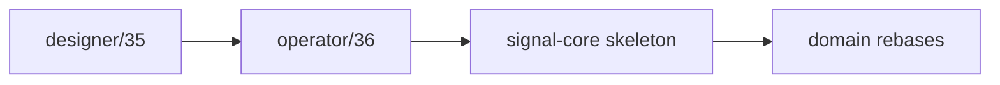
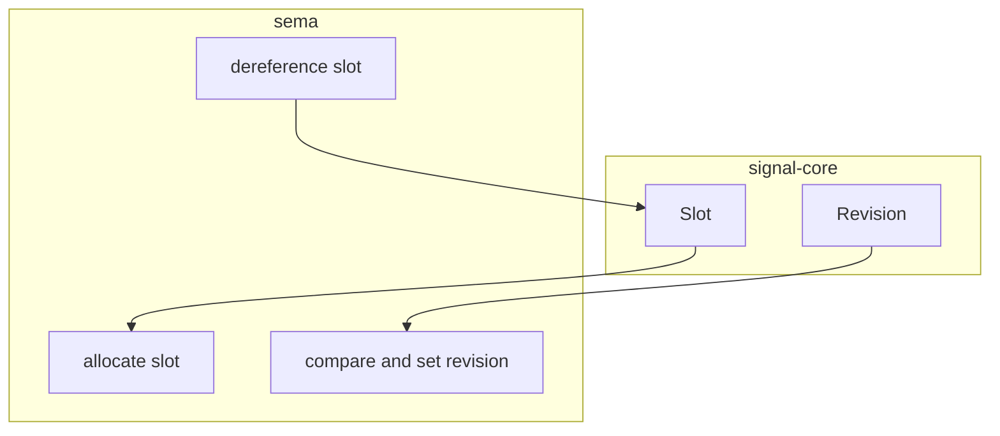
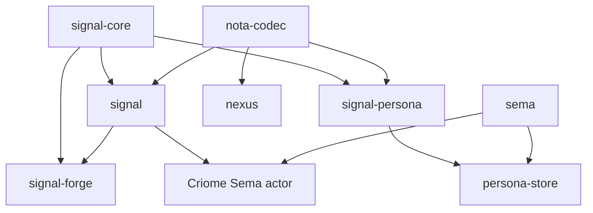
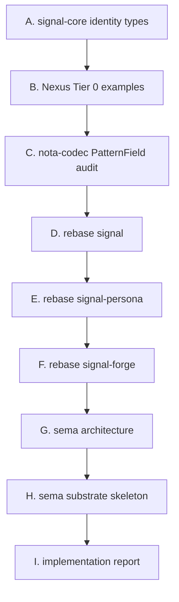
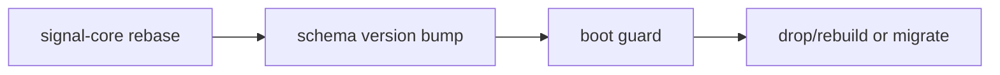

# Sema Signal Nexus Execution Plan

Status: operator plan report
Author: Codex (operator)

This report rereads and integrates
`reports/designer/35-operator-33-34-critique.md` into the current execution
plan. It supersedes the broad sequencing in
`reports/operator/34-sema-signal-nexus-restructure-plan.md` for day-to-day
implementation. `reports/operator/36-sema-signal-nexus-refined-restructure.md`
already captured the critique once; this report turns it into the concrete
working plan now that `signal-core` exists.

---

## 1 · Current State

`signal-core` has already moved from proposal to a real public repository.

State as of this report:

| Piece | State |
|---|---|
| `signal-core` repo | created, public, pushed |
| `signal-core` checks | `cargo test` passed; `nix flake check` passed |
| primary index | `RECENT-REPOSITORIES.md` and `repos/signal-core` updated |
| skill updates | designer-owned skill edits are in progress; operator will not commit them |
| next implementation | slot/revision split, then domain rebases |

This changes the next action from "create `signal-core`" to "make the
`signal-core` boundary correct enough for consumers."

---

## 2 · Design Corrections From Designer 35

Designer 35 adds five corrections that I will treat as hard constraints.

| Correction | Implementation meaning |
|---|---|
| slot/revision split | `signal-core` owns wire identity; `sema` owns allocation and revision behavior |
| step 5 subdivision | rebase `signal`, `signal-persona`, and `signal-forge` separately |
| step 6 concreteness | `sema` needs architecture, public API, and compiled skeleton deliverables |
| schema migration risk | rkyv schema changes are coordinated upgrades, not silent compatibility |
| Nexus daemon risk | keep current daemon Criome-specific for M0; universalize the spec first |

The largest change to my working behavior is that I will not fold
`signal-forge` and `signal-persona` into one broad "domain rebase" commit. They
are separate review units.

---

## 3 · Slot And Revision Boundary

The split is now explicit:

Ownership table:

| Concept | Repo | Why |
|---|---|---|
| `Slot<T>` | `signal-core` | typed wire identity shared by every Sema domain |
| `Revision` | `signal-core` | wire value used in compare-and-set requests/replies |
| slot counter | `sema` | persistent database state |
| slot binding table | `sema` | durable lookup behavior |
| revision bump | `sema` | transactional mutation behavior |
| domain payload slots | `signal`, `signal-persona`, `signal-forge` | domain records decide what the slot refers to |

Immediate consequence: `signal-core` needs `Slot<T>` and `Revision` before the
domain crates rebase. The existing skeleton has the frame and verb spine; the
next `signal-core` edit should add these identity types and document that they
do not allocate themselves.

---

## 4 · Dependency Map

The updated map includes layered effect crates.

Dependency rules:

| Repo | Rule |
|---|---|
| `signal` | depends on `signal-core`; owns Criome domain payloads |
| `signal-persona` | depends on `signal-core`; owns Persona domain payloads |
| `signal-forge` | depends on `signal-core` for frame mechanics and `signal` for Criome kinds |
| `nexus` | spec becomes domain-neutral; current daemon stays Criome-specific for M0 |
| `sema` | does not depend on a domain contract by default |

This keeps the kernel free of domain records while still letting layered crates
use both the universal frame and the domain records they need.

---

## 5 · Execution Sequence

This is the concrete sequence I will follow from here.

Step outputs:

| Step | Output | Test gate |
|---|---|---|
| A | `signal-core` adds `Slot<T>`, `Revision`, schema-version notes | `nix flake check` in `signal-core` |
| B | `nexus` gets Tier 0 canonical examples | `nix flake check` in `nexus` if code/docs trigger it |
| C | `nota-codec` existing `@` work is audited and finished with real record tests | `nix flake check` in `nota-codec` |
| D | `signal` imports core frame/handshake/auth/version and remains Criome domain | `nix flake check` in `signal` |
| E | `signal-persona` imports core frame/handshake/auth/version | `nix flake check` in `signal-persona` |
| F | `signal-forge` rebases on `signal-core` plus `signal` | `nix flake check` in `signal-forge` |
| G | `sema/ARCHITECTURE.md` rewritten as reusable substrate | repo status clean after commit |
| H | `sema` names substrate public API and compiles skeleton | `nix flake check` in `sema` |
| I | operator implementation report records what changed and why | primary report commit |

Each step commits and pushes its own repo before the next repo depends on it.

---

## 6 · Nexus Daemon Stance

Designer 35 warns that domain-parameterizing the current daemon is real work.
The M0 stance is:

| Surface | Decision |
|---|---|
| Nexus grammar/spec | universal Tier 0 |
| Nexus examples | domain-neutral where possible; domain examples explicit when used |
| current daemon | stays Criome-specific |
| future daemon | parameterized after Persona has a real translator need |

The first Nexus work should therefore avoid touching the daemon unless tests or
docs require small alignment. The goal is to lock examples and grammar, not to
change actor topology.

---

## 7 · Schema Migration Stance

Rebasing `signal` on `signal-core` changes rkyv schema layout. That is a
breaking wire/store event.

Default:

| Store | M0 stance |
|---|---|
| pre-stable Criome test stores | drop and rebuild |
| any store the user marks durable | pause and write migration path |
| Persona stores | no migration until real persisted consumers exist |

No code should pretend old rkyv archives remain readable unless a tested
migration explicitly proves it.

---

## 8 · `sema` Concrete End State

Designer 35 correctly rejected the vague phrase "reorient sema." The concrete
target is:

| File/area | End state |
|---|---|
| `ARCHITECTURE.md` | reusable Sema substrate, not Criome-exclusive prose |
| `skills.md` | agent rules for substrate work and redb+rkyv invariants |
| `src/lib.rs` | preserves working store code while moving toward substrate naming |
| future modules | table wrappers, slot allocation, revision guard, schema version guard |
| tests | preserve current behavior, then add tests for new substrate types |

The existing `sema` code is working code, not disposable sketch. I will preserve
it and rename/reframe only where the new substrate shape requires it.

---

## 9 · Defaults For Open Questions

Unless the user redirects, these are the defaults:

| Question | Default |
|---|---|
| approval policy | explicit approval records only in M0 |
| code module names | behavior names in code; modality names in docs |
| Criome migration | drop/rebuild pre-stable stores |
| existing `sema` code | preserve and evolve |
| `signal-forge` dependency | direct `signal-core` plus `signal` |
| `persona-orchestrate` | reserved for workspace coordination; use `persona-store` for Persona Sema |
| Nexus daemon | Criome-specific for M0 |

These defaults are chosen to reduce code churn while preserving the accepted
architecture.

---

## 10 · Bottom Line

The next implementation pass is not broad refactoring. It is ordered boundary
work:

1. finish `signal-core` identity types;
2. lock Nexus Tier 0 examples;
3. finish `nota-codec` pattern-field support;
4. rebase domain contracts one at a time;
5. make `sema` a concrete reusable substrate;
6. report what changed.

Designer 35's main warning is correct: the plan is good, but the big steps must
be split before code lands. This report is that split.
