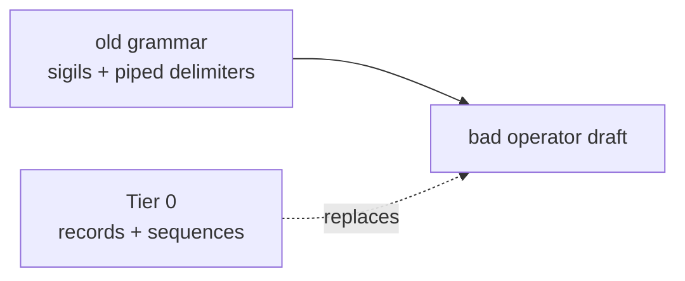
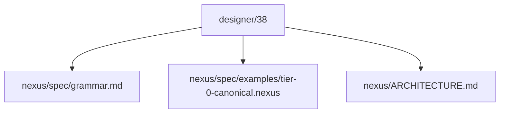
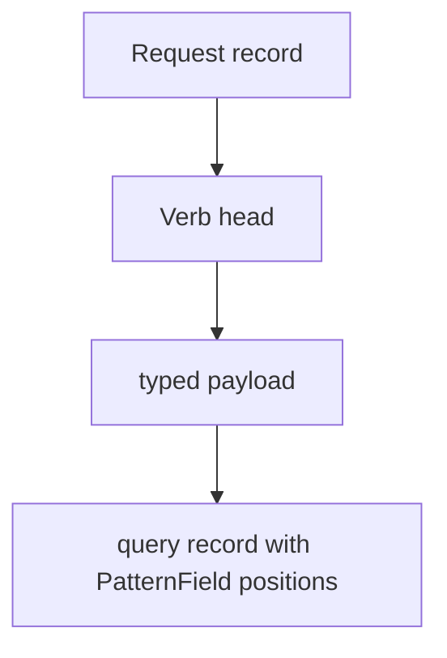
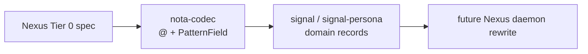

# Nexus Tier 0 Rewrite Implementation Plan

Status: operator implementation plan
Author: Codex (operator)

This plan integrates
`reports/designer/38-nexus-tier-0-grammar-explained.md` into the current Nexus
renovation. The immediate correction is that Nexus Tier 0 is **typed text over
records and sequences**, not the older sigil-and-piped-delimiter grammar.

---

## 1 · Correction

My first `tier-0-canonical.nexus` draft reused old Nexus forms:



The implementation must rewrite that file and the spec around the grammar
designer/38 names:

| Surface | Tier 0 decision |
|---|---|
| records | `(Kind field0 field1 ...)` |
| sequences | `[elem0 elem1 ...]` |
| binds | `@fieldname` only in `PatternField<T>` positions |
| wildcard | `_` only in `PatternField<T>` positions |
| verbs | record heads: `(Assert ...)`, `(Match ...)`, `(Subscribe ...)` |
| dropped | no `(| |)`, no `[| |]`, no `{ }`, no `~ ! ? *`, no `=` |

---

## 2 · Implementation Defaults

Designer/38 names open questions. To keep the implementation moving, I will use
these defaults unless the user redirects after seeing the diff.

| Question | Default for this pass |
|---|---|
| implicit assert shorthand | no shorthand; every top-level request has a verb head |
| reply slots | use typed `SlotBinding` examples, not anonymous `Tuple` |
| slot reference syntax | bare integers in slot-typed positions |
| query naming | `NodeQuery`, `EdgeQuery`, `GraphQuery` |
| wildcard outside pattern positions | invalid; examples keep `_` only inside query records |

These are documentation/spec defaults in Nexus. They do not force the existing
Criome-specific daemon to be rewritten in this same pass.

---

## 3 · Files To Change



Planned changes:

| File | Change |
|---|---|
| `spec/grammar.md` | rewrite around Tier 0 structural grammar; preserve useful old facts only when still true |
| `spec/examples/tier-0-canonical.nexus` | replace old-sigil examples with explicit verb-record examples |
| `ARCHITECTURE.md` | state that spec is being universalized first while current daemon remains Criome-specific |

I will not update parser/renderer code in this pass unless a compile failure
forces a small doc-test or build fix. The daemon still implements the old
Criome-facing M0 parser; the spec is moving first.

---

## 4 · Canonical Example Shape



Examples will use this shape:

```nexus
(Assert (Node User))
(Match (NodeQuery @name) Any)
(Subscribe (NodeQuery @name) ImmediateExtension Block)
(Validate (Assert (Node "dry run")))
(Atomic [(Assert (Node A)) (Assert (Node B))])
```

Reply examples will avoid anonymous tuples:

```nexus
(Ok)
[(SlotBinding 1024 (Node User))]
(Diagnostic Error E0099 "Mutate is outside the current daemon scope")
```

---

## 5 · Test Gate

This is primarily a spec/documentation rewrite. I will still run:

| Gate | Purpose |
|---|---|
| `cargo test` | confirm existing daemon/parser tests still compile |
| `nix flake check` | confirm flake packaging remains intact |

If tests fail because the current parser contradicts the new spec, I will not
paper over it. I will either make a narrow code update or leave the failure
explicit in the implementation report if it requires a larger parser rewrite.

---

## 6 · Next Code After This Pass

After the spec is coherent, the next implementation step is the codec boundary:



The key code work is not more Nexus sigil support. It is expected-type decoding
for `PatternField<T>` in `nota-codec`, then domain records that can use the
uniform verb-record text shape.

