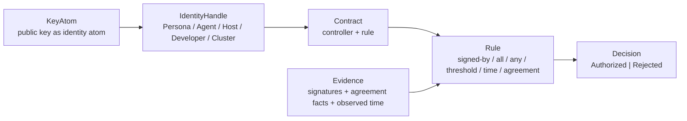
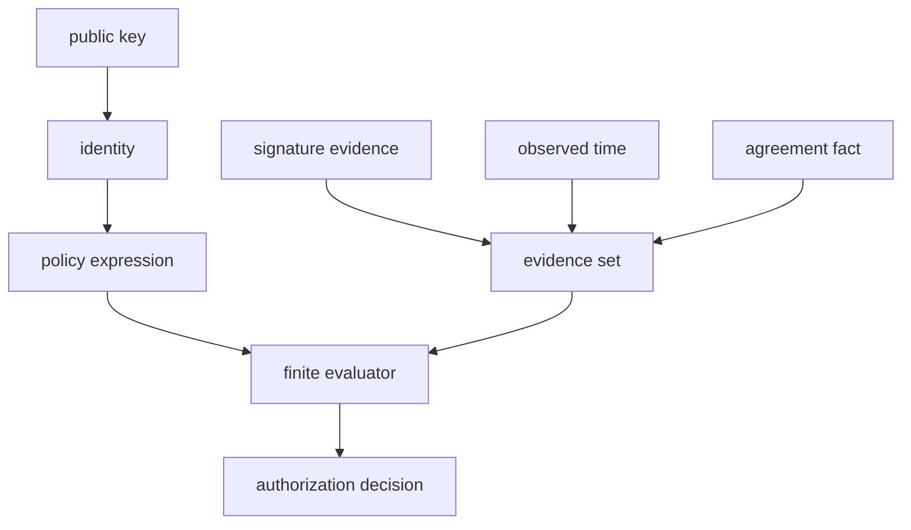

# Criome Internal Language POC

Operator report for the Criome internal language proof of concept, landed on
`criome` main as two commits:

- `865f8b3c` — the initial language policy POC commit; its subject used the
  wrong spelling.
- `132f6202` — `criome: include schema sketches in Nix source`

## Frame

The psyche prompt asked for a Criome internal language: a limited, typed
operation set for identity, public keys, complex authority, quorum / timelock
mechanics, and divergence reconciliation. I implemented the operator POC in
today's `criome` repo, but scoped it as **eventual-Criome concept code**, not as
a production `signal-criome` wire migration.

That scope matters because current repo intent says today's `criome` is the
Spartan authentication and attestation daemon, while eventual `Criome` is the
larger universal computing paradigm. The POC is therefore compiled design
pressure: real Rust and tests, plus a schema sketch, without pretending the
daemon now exposes this language over the public socket.

Spirit capture: `niuj` records the durable low-certainty design direction:
Criome starts as a limited typed policy language over public-key identity
atoms, complex identity contracts, quorum / timelock rules, and explicit
divergence-reconciliation objects.

Claim status: `tools/orchestrate claim operator /git/github.com/LiGoldragon/criome`
failed before editing because the orchestration helper could not fetch its
`nota-codec` dependency at the pinned revision. I proceeded narrowly and record
that failure here.

## External Research Anchors

The POC took shape from primary-source constraints rather than copying any chain
VM.

- Ethereum account abstraction (`ERC-4337`) separates the requested operation
  from account-specific validation: a `UserOperation` carries intent, while the
  account validates signatures, validity windows, and custom logic. Source:
  [EIP-4337](https://eips.ethereum.org/EIPS/eip-4337).
- Solana's account model makes storage explicit: state lives in accounts keyed
  by addresses, while programs are executable accounts and are stateless.
  Sources: [Solana accounts](https://solana.com/docs/core/accounts),
  [Solana programs](https://solana.com/docs/core/programs).
- Tezos and OpenZeppelin governance surfaces keep multisig and timelock as
  explicit policy objects rather than implicit ambient behavior. Sources:
  [Octez multisig](https://octez.tezos.com/docs/user/multisig.html),
  [Tezos timelocks](https://docs.tezos.com/smart-contracts/timelocks),
  [OpenZeppelin TimelockController](https://docs.openzeppelin.com/contracts/4.x/api/governance#TimelockController).

Operator synthesis: Criome should not start as "EVM but ours." The better
kernel is a typed policy evaluator over evidence. Public keys are atoms;
identity contracts compose atoms into authority; operations ask whether a
specific evidence set satisfies the policy.

## Objects And Verbs



The first useful verb is not "execute arbitrary bytecode." It is:

```text
Contract + Evidence -> Decision
```

That single relation covers the first important policy family:

- one signer controls an object;
- N-of-M signers control an object;
- the quorum changes after a time boundary;
- a contract is locked until a time boundary;
- a resolver identity signs a divergence-resolution fact.

## Schema Sketch

The schema sketch lives at
`/git/github.com/LiGoldragon/criome/schema/criome.language.schema`.
It is intentionally marked concept schema until the generator consumes this
surface directly.

```nota
Rule [
  (SignedBy IdentityHandle)
  (All (Vector Rule))
  (Any (Vector Rule))
  (Threshold Threshold)
  (ActiveAfter TimedRule)
  (ActiveUntil TimedRule)
  (TimeSwitch TimeSwitch)
  (Agreement AgreementRule)
]

Threshold {
  required_signatures RequiredSignatureThreshold
  authorities (Vector IdentityHandle)
}

AgreementRule {
  divergence ObjectDigest
  resolution ObjectDigest
  resolver IdentityHandle
}
```

The full file also names `Contract`, `Evidence`, `AgreementFact`, `Moment`,
and `Decision`.

## Rust POC

The compiled evaluator lives at `/git/github.com/LiGoldragon/criome/src/language.rs`.
The public shape is:

```rust
pub struct Contract {
    rule: Rule,
}

pub enum Rule {
    SignedBy(Identity),
    All(Vec<Rule>),
    Any(Vec<Rule>),
    Threshold(Threshold),
    ActiveAfter(TimedRule),
    ActiveUntil(TimedRule),
    TimeSwitch(TimeSwitch),
    Agreement(AgreementRule),
}

impl Contract {
    pub fn evaluate(&self, evidence: &Evidence) -> Decision {
        if self.rule.satisfied_by(evidence) {
            Decision::Authorized
        } else {
            Decision::Rejected
        }
    }
}
```

The evaluator is deliberately finite. There is no parser, no dynamic dispatch
by string, no provider call, and no arbitrary method language. A future LLM
resolver appears as a signed `AgreementFact` from a resolver identity; the
actual provider selection and payment machinery belongs outside this first
kernel.

## Tests

The witness tests live at
`/git/github.com/LiGoldragon/criome/tests/language.rs`.

They prove:

- duplicate signatures do not satisfy a threshold twice;
- one-of-two before a boundary can become two-of-two after the boundary;
- a timelock rejects before release and authorizes at release;
- divergence reconciliation accepts only the exact `(divergence, resolution,
  resolver)` fact;
- the schema sketch names every POC construct the Rust module implements.

Verification run locally before commit:

```text
cargo fmt --check
cargo test --test language
cargo test
cargo clippy --all-targets -- -D warnings
```

Remote Nix verification was run against the pushed ref, not a local path:

```text
nix build --no-link --print-out-paths github:LiGoldragon/criome/main#checks.x86_64-linux.test
nix build --no-link --print-out-paths github:LiGoldragon/criome/main#checks.x86_64-linux.clippy
nix build --refresh --no-link --print-out-paths github:LiGoldragon/criome/main#checks.x86_64-linux.test
nix build --refresh --no-link --print-out-paths github:LiGoldragon/criome/main#checks.x86_64-linux.clippy
nix build --refresh --no-link --print-out-paths github:LiGoldragon/criome/main#checks.x86_64-linux.build
```

The first remote Nix attempt correctly found a packaging miss:
`craneLib.cleanCargoSource` filtered out `schema/criome.language.schema`, so
the test could not `include_str!` it in the builder. Commit `132f6202` changes
the crate source filter to include `.schema` files; the refreshed remote Nix
test, clippy, and build checks passed against that commit.

## What This Proves

The POC supports the design direction:



The "best of VM" move is subtraction:

- Keep account abstraction's idea that an account / contract owns validation.
- Keep account-based explicit state and typed operation inputs.
- Keep multisig and timelock as first-class policy primitives.
- Drop arbitrary bytecode as the starting point.
- Represent external judgement as signed facts, not a hidden call inside the
  policy evaluator.

## Not Done

This POC does not expose new `signal-criome` operations, persist contracts in
`criome.sema`, parse NOTA contract text, call LLM providers, model payments, or
perform cross-network reconciliation. Those are next slices after the object
set stabilizes.

The immediate next implementable slice is to move the concept schema into a
generated contract surface once the owner decides whether Criome policy belongs
in `signal-criome`, `meta-signal-criome`, or a new `signal-criome-policy` contract.
My lean: keep it out of `signal-criome` until one daemon path actually consumes
`Contract + Evidence -> Decision`; then hoist the wire vocabulary to the
contract crate that owns that boundary.
