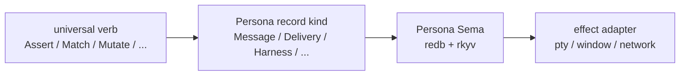
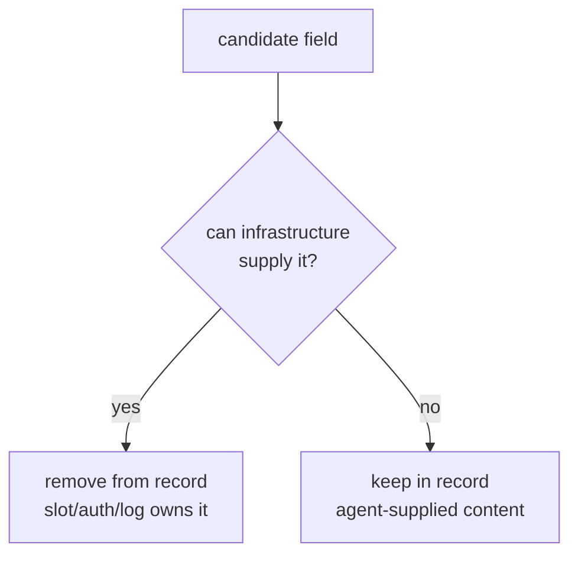
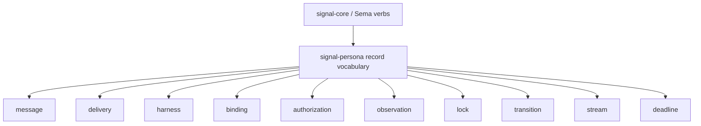
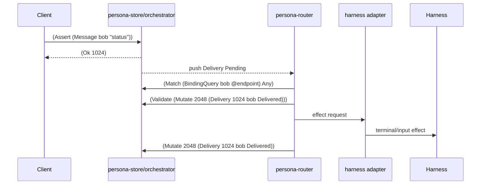
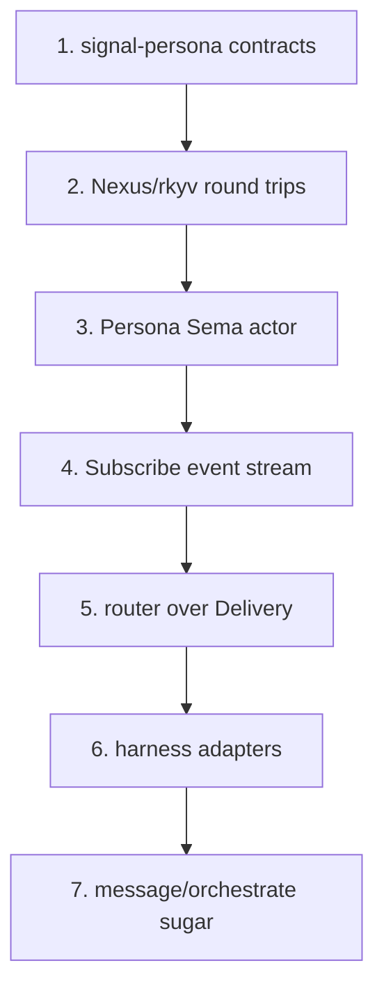
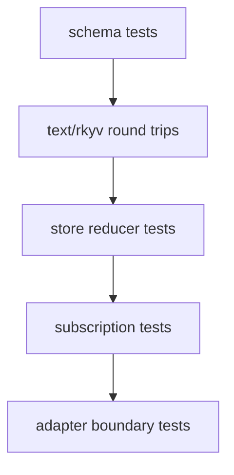
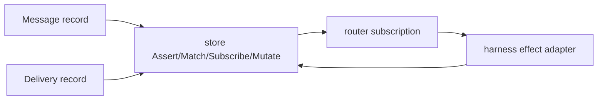

# Persona Twelve-Verbs Implementation Consequences

Status: operator implementation-consequence report
Author: Codex (operator)

This report translates
`reports/designer/40-twelve-verbs-in-persona.md` into the next
implementation shape. The key shift is simple: Persona does not
need a Persona-specific command language. Persona needs typed
record kinds that move through the universal twelve Sema/Nexus
verbs.

---

## 1 · Main Consequence

Report 40 settles that every Persona operation is one of the
twelve verb records:

```text
Cardinal: Assert Mutate Retract Atomic
Fixed: Subscribe Match Aggregate Validate
Mutable: Constrain Infer Project Recurse
```

The verb is the protocol move. The record kind is the Persona
meaning.



Implementation consequence: the code should stop growing bespoke
commands named after Persona workflows. `Send`, `Deliver`,
`Defer`, `ClaimScope`, and `Status` are convenience surfaces at
most; the durable wire move is a twelve-verb request over a typed
record.

---

## 2 · Identity Discipline Becomes Schema Discipline

Report 40's most important implementation rule is not just about
messaging. It is a schema test for every Persona record:

> If infrastructure can supply a value, the agent must not put it
> in the record body.



Schema consequences:

| Value | Implementation owner | Record-body decision |
|---|---|---|
| identity | store mints `Slot<T>` | no `id` field |
| sender | authenticated connection | no `sender` field |
| commit time | transition log | no `created_at` / `updated_at` field |
| recipient | agent content | keep |
| body | agent content | keep |
| lifecycle state | agent or reducer decision | keep |
| deadline / scheduled time | agent content when semantically chosen | keep as typed timestamp |

Every current and future `signal-persona` type should be reviewed
against this table before it becomes contract code. This is where
the old message sketches with `m-*` IDs, `from`, and string
timestamps are superseded.

---

## 3 · Persona Record Modules

`signal-persona` should own Persona's record vocabulary, not a new
verb vocabulary.



First contract modules:

| Module | Record kinds |
|---|---|
| `message` | `Message`, `MessageQuery`, reply/thread references |
| `delivery` | `Delivery`, `DeliveryState`, `BlockReason`, `DeliveryQuery` |
| `authorization` | `Authorization`, `AuthorizationDecision`, `AuthorizationQuery` |
| `binding` | `Binding`, `HarnessEndpoint`, `BindingQuery` |
| `harness` | `Harness`, `HarnessKind`, `LifecycleState`, `HarnessQuery` |
| `observation` | `FocusObservation`, `InputBufferObservation`, `WindowClosed`, `HarnessObservation` |
| `lock` | `Lock`, `Scope`, `RoleName`, `LockStatus`, `LockQuery` |
| `transition` | `Transition`, `TransitionQuery` |
| `stream` | `StreamFrame`, `StreamFrameQuery` |
| `deadline` | `Deadline`, `DeadlineExpired`, query records |

The `*Query` types are payload records for `Match`, `Subscribe`,
`Aggregate`, `Project`, `Constrain`, `Infer`, and `Recurse`.
They are not top-level verbs.

---

## 4 · Store And Reducer Shape

Persona's Sema instance should have one durable owner of database
state. The natural owner remains the orchestrator/store actor.



The effect adapter writes to terminals, sockets, or window-system
interfaces. That effect is outside the twelve verbs. The durable
decision before and after the effect is inside the verbs.

Immediate reducer responsibilities:

| Event | Reducer consequence |
|---|---|
| `Message` asserted | create authorization and pending delivery, likely via `Atomic` |
| `FocusObservation` asserted | update delivery/binding readiness if relevant |
| `WindowClosed` asserted | retract or mutate the affected binding/delivery |
| `HarnessObservation` asserted | mutate `Harness` lifecycle state |
| `DeadlineExpired` asserted | mutate delivery to expired/deferred |

No polling loop is implied. Reducers and routers hold `Subscribe`
requests and react to pushed events.

---

## 5 · CLI And Sugar Surfaces

The command-line tools can stay ergonomic, but they should lower
to verb records before crossing the process boundary.

```mermaid
flowchart LR
    cli["message CLI / orchestrate CLI"]
    sugar["human sugar<br/>send bob status"]
    nexus["Nexus text<br/>(Assert (Message bob \"status\"))"]
    signal["rkyv frame<br/>Request::Assert"]
    store["Persona Sema"]

    cli --> sugar --> nexus --> signal --> store
```

Near-term consequences:

| Tool | Implementation direction |
|---|---|
| `message` | client wrapper around `(Assert (Message recipient body))` and inbox `Match` / `Subscribe` |
| `orchestrate` | sugar over `Lock` asserts/retracts/matches |
| harness tests | assert messages and observe delivery transitions through the store |
| router tests | subscribe to pending delivery; never scan files or poll logs |

The CLI should not mint IDs, timestamps, or sender names. Replies
from the store carry assigned slots. Sender comes from auth or the
runtime principal binding.

---

## 6 · Implementation Order



Concrete order:

| Step | Repository | Output |
|---|---|---|
| 1 | `signal-persona` | record modules with no agent-minted identity/sender/time fields |
| 2 | `signal-persona` / `nexus` | examples and round-trip tests for verb records over Persona payloads |
| 3 | `persona-store` or orchestrator-owned repo | redb+rkyv actor with `Assert`, `Mutate`, `Retract`, `Atomic`, `Match`, `Subscribe`, `Validate` M0 |
| 4 | `persona-router` | subscription-driven delivery loop |
| 5 | `persona-system` / `persona-harness` | observation asserts and effect adapters |
| 6 | `persona-message` | CLI sugar over the same verb records |

M0 does not need every advanced verb implemented. It does need
`Subscribe`, because push-not-pull is not optional for Persona's
router.

`Aggregate`, `Project`, `Constrain`, `Recurse`, and `Infer` are
deferred to M1. They are not load-bearing for the message-routing
slice in §9, but become load-bearing as soon as queries need counts,
field projection, joins, thread walks, or recovery rules.

---

## 7 · Tests To Add First

The first useful tests should prove the design properties that
report 40 cares about, not just string snapshots.



Test cases:

| Test | What it proves |
|---|---|
| encoded `Message` is `(Message recipient body)` | no sender/id/timestamp body fields |
| `(Assert (Message bob "hello"))` round-trips | send is Assert |
| assert reply returns `Slot<Message>` | store mints identity |
| authenticated sender appears in transition log | auth, not model text, owns sender |
| pending delivery arrives through `Subscribe` | router does not poll |
| delivery success is `Mutate Delivery -> Delivered` | effect result becomes durable state |
| `WindowClosed` is Assert and binding loss is Retract/Mutate | fact/state split is enforced |

These tests should use fixture Nexus files where text syntax matters,
and Rust constructors where the contract type is the subject.

---

## 8 · Decisions To Keep Visible

Report 40 leaves a few implementation choices that need to stay
visible while coding:

| Decision | Operator recommendation |
|---|---|
| Store owner | one Persona Sema owner, probably orchestrator/store; other components are clients |
| `Lock` release | prefer `Retract Lock <slot>` for active lock disappearance; preserve history in transition log |
| `Delivery` lifecycle | keep as mutable state record; observations stay immutable asserts |
| proposal records | define only when the first LLM recovery feature needs them; do not block M0 |
| heterogeneous status replies | prefer typed status reply records over anonymous mixed tuples |
| token vocabulary | lock the Tier 0 lexer to current Nexus records; no compatibility tokens for retired sigils or delimiters |

The most important guardrail: do not reintroduce agent-minted
string IDs as "temporary" test fixtures. Tests should use store
slots or typed fixture slots, because the fixture trains the future
agent and the future code.

---

## 9 · Bottom Line

Report 40 is directly implementable. The next code should make
`signal-persona` a clean record vocabulary over the twelve verbs,
then make the Persona store actor the only durable owner of those
records.

The minimum useful slice is:



If that slice obeys the identity discipline, uses `Subscribe`
instead of polling, and models effects outside the verbs, the rest
of Persona can grow without inventing another protocol.
