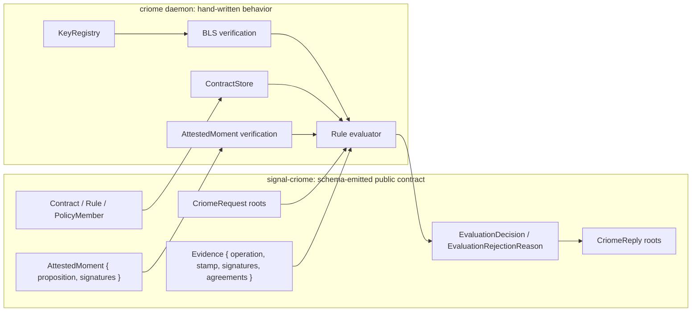
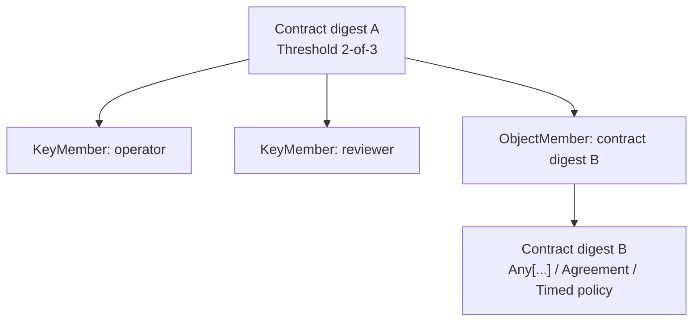
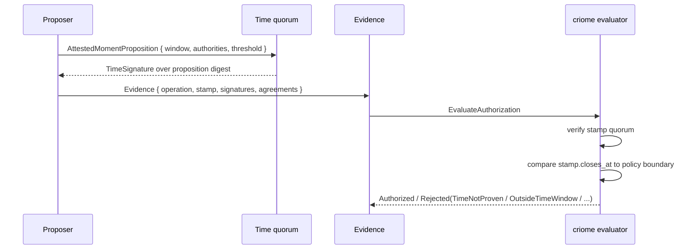
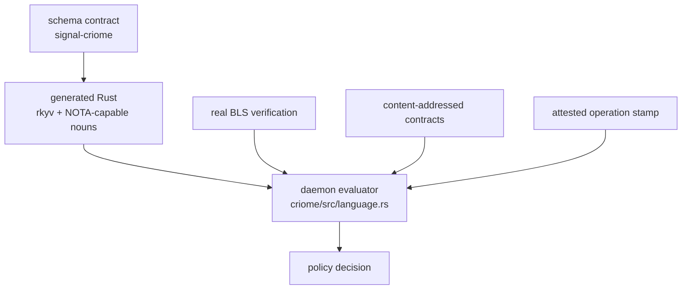

# 410 — criome policy language main landing: schema-first attested identity policy

This report shows what landed on main after reviewing Designer's criome capstone
(`reports/designer/674-criome-internal-engine/15-implementation-architecture-and-constraints.md`)
and the attested-clock prototype (`reports/designer/674-criome-internal-engine/14-attested-clock-stamped-envelope-poc.md`).

The main landing is deliberately **schema-first**:

- `signal-criome` owns the public policy vocabulary and verb roots as generated
  schema/Rust.
- `criome` owns the hand-written evaluator over those schema-emitted nouns.
- Designer's useful refinements were adopted: `Evidence.stamp` and the public
  `TimeNotProven` rejection.
- Designer's handwritten prototype was not landed directly; it remains evidence.

Main commits:

- `signal-criome` main `f10fb54d` — `signal-criome: align attested moment evidence naming`
- `criome` main `cd1de18f` — `criome: repin policy stamp integration to signal-criome main`

## What Was Made

At the public contract layer, criome now has a schema-defined identity-policy
surface:

- content-addressed contracts,
- composable rules,
- key-or-object quorum members,
- time-varying policies,
- signed agreement facts,
- crystallized-past attested moments,
- authorization evaluation input/output roots.

At the daemon layer, criome now has a Rust evaluator that:

- admits contracts into an acyclic digest-addressed store,
- verifies real BLS signatures through the deployed `MasterKey` / `VerifyBls`
  path,
- verifies the operation signature against the exact operation digest and the
  exact attested time stamp,
- rejects malformed or under-signed time stamps before evaluating policy,
- evaluates `SignedBy`, `All`, `Any`, `Threshold`, `ActiveAfter`,
  `ActiveUntil`, `TimeSwitch`, `Agreement`, and `EscalateToPsyche`.

## Shape



The split is the important part:

- Signal says **what can be sent and stored**.
- Nexus/daemon logic says **what the policy means**.
- SEMA is still the next hardening step for durable contract/moment storage.

## Schema: Public Roots

The new public roots are in `signal-criome/schema/lib.schema`:

```nota
[(Sign SignRequest)
 ...
 (RejectAuthorization AuthorizationRejection)
 (AdmitContract Contract)
 (LookupContract ContractDigest)
 (EvaluateAuthorization AuthorizationEvaluation)
 (SubscribeIdentityUpdates IdentitySubscription opens IdentityUpdateStream)
 ...]
[(SignReceipt SignReceipt)
 ...
 (ContractAdmitted ContractAdmitted)
 (ContractFound ContractFound)
 (ContractMissing ContractMissing)
 (ContractAdmissionRejected ContractAdmissionRejected)
 (AuthorizationEvaluated AuthorizationEvaluated)
 ...]
```

That means contracts and authorization evaluation are not an internal Rust-only
toy anymore. They are part of the working `signal-criome` wire contract and
therefore generated into rkyv/NOTA-capable Rust.

## Schema: Policy Objects

The contract shape is a closed rule vocabulary, intentionally not a VM:

```nota
Contract {
  rule Rule
}

Rule [
  (SignedBy Identity)
  (All (Vector ContractDigest))
  (Any (Vector ContractDigest))
  (Threshold Threshold)
  (ActiveAfter TimedRule)
  (ActiveUntil TimedRule)
  (TimeSwitch TimeSwitch)
  (Agreement AgreementRule)
  EscalateToPsyche
]

PolicyMember [
  (KeyMember Identity)
  (ObjectMember ContractDigest)
]

Threshold {
  required_signatures RequiredSignatureThreshold
  members (Vector PolicyMember)
}
```

The load-bearing point: a quorum member can be a direct key or another
content-addressed policy object. That is the mechanism that turns the language
from "a tree of ad hoc conditions" into a reusable contract DAG.



## Schema: Crystallized Time

Designer's attested-time model landed as schema, not only Rust:

```nota
TimeWindow {
  opens_at TimestampNanos
  closes_at TimestampNanos
}

AttestedMomentProposition {
  window TimeWindow
  required_signatures RequiredSignatureThreshold
  authorities (Vector Identity)
}

TimeSignature {
  signer Identity
  envelope SignatureEnvelope
}

AttestedMoment {
  proposition AttestedMomentProposition
  signatures (Vector TimeSignature)
}

Evidence {
  operation OperationDigest
  stamp AttestedMoment
  signatures (Vector SignatureEnvelope)
  agreements (Vector AgreementFact)
}
```

`Evidence.stamp` is the key field. The evaluator never asks ambient wall time
inside the language path. It uses the operation's own crystallized time proof.



The semantics are crystallized-past:

- an open window is proposed,
- authorities sign that "now" falls within that window,
- the closed signed window becomes a proof that now has passed at least that
  far,
- policies compare against the operation's own stamp, not the machine clock.

## Rust: Content Addressing and Admission

`signal-criome/src/lib.rs` gives schema-emitted types digest methods. A
contract digest is derived from canonical rkyv bytes:

```rust
impl Contract {
    pub fn digest(&self) -> Result<ContractDigest, ContractDigestError> {
        self.to_wire_bytes()
            .map(|bytes| ContractDigest::from_bytes(bytes.as_ref()))
            .map_err(|_| ContractDigestError::Encode)
    }
}

impl AttestedMomentProposition {
    pub fn digest(&self) -> Result<AttestedMomentDigest, AttestedMomentDigestError> {
        self.to_wire_bytes()
            .map(|bytes| AttestedMomentDigest::from_bytes(bytes.as_ref()))
            .map_err(|_| AttestedMomentDigestError::Encode)
    }
}
```

`criome/src/language.rs` admits only shape-valid contracts and stores them by
digest:

```rust
impl ContractStore {
    pub fn admit(&mut self, contract: Contract) -> Result<ContractDigest, AdmissionError> {
        ContractAdmission::new(&contract).validate_against(self)?;
        let digest = contract.digest()?;
        if !self.contains(&digest) {
            self.entries.push(ContractEntry {
                digest: digest.clone(),
                contract,
            });
        }
        Ok(digest)
    }

    pub fn evaluate(
        &self,
        digest: &ContractDigest,
        evidence: &Evidence,
        registry: &KeyRegistry,
    ) -> Result<EvaluationDecision, EvaluationError> {
        let contract = self.resolve(digest)?;
        if let Some(reason) = evidence.stamp.rejection_reason(registry) {
            return Ok(EvaluationDecision::Rejected(reason));
        }
        contract.rule().decide(evidence, self, registry)
    }
}
```

That early `evidence.stamp.rejection_reason(...)` is the important guard:
time proof failure stops evaluation before any policy leaf can authorize.

## Rust: Signature Preimages

There are two signed statements:

```rust
pub struct OperationStatement<'a> {
    signer: &'a Identity,
    operation: &'a OperationDigest,
    stamp: &'a AttestedMoment,
}

pub struct AttestedMomentStatement<'a> {
    proposition: &'a AttestedMomentProposition,
}
```

Operation authorization binds the signer, operation digest, and attested moment
digest:

```rust
impl<'a> OperationStatement<'a> {
    pub fn to_signing_bytes(&self) -> Result<Vec<u8>, StatementError> {
        let mut bytes = b"CRIOME-OPERATION-AUTHORIZATION-V1".to_vec();
        self.signer.encode_into(&mut bytes);
        self.operation.object_digest().encode_into(&mut bytes);
        self.stamp
            .proposition
            .digest()?
            .object_digest()
            .encode_into(&mut bytes);
        Ok(bytes)
    }
}
```

Time authority signatures bind the time proposition itself:

```rust
impl<'a> AttestedMomentStatement<'a> {
    pub fn to_signing_bytes(&self) -> Result<Vec<u8>, StatementError> {
        let mut bytes = b"CRIOME-ATTESTED-MOMENT-V1".to_vec();
        self.proposition
            .digest()?
            .object_digest()
            .encode_into(&mut bytes);
        Ok(bytes)
    }
}
```

This is what prevents replay across time windows: the operation signature is not
just "operator signed operation X"; it is "operator signed operation X under
this exact crystallized time proposition."

## Rust: Rule Evaluation

The rule evaluator is deliberately small and closed:

```rust
impl RuleEvaluation for Rule {
    fn decide(
        &self,
        evidence: &Evidence,
        store: &ContractStore,
        registry: &KeyRegistry,
    ) -> Result<EvaluationDecision, EvaluationError> {
        match self {
            Self::SignedBy(identity) => Ok(evidence.decision_for_signature(identity, registry)),
            Self::All(references) => {
                EvaluationDecision::all(store.evaluate_all(references, evidence, registry)?)
            }
            Self::Any(references) => {
                EvaluationDecision::any(store.evaluate_all(references, evidence, registry)?)
            }
            Self::Threshold(threshold) => threshold.decide(evidence, store, registry),
            Self::ActiveAfter(timed_rule) => {
                if evidence.stamp.closes_at().into_u64() >= timed_rule.boundary.into_u64() {
                    Ok(evidence.decision_for_signature(&timed_rule.signed_by, registry))
                } else {
                    Ok(EvaluationDecision::Rejected(
                        EvaluationRejectionReason::OutsideTimeWindow,
                    ))
                }
            }
            Self::ActiveUntil(timed_rule) => {
                if evidence.stamp.closes_at().into_u64() < timed_rule.boundary.into_u64() {
                    Ok(evidence.decision_for_signature(&timed_rule.signed_by, registry))
                } else {
                    Ok(EvaluationDecision::Rejected(
                        EvaluationRejectionReason::OutsideTimeWindow,
                    ))
                }
            }
            Self::TimeSwitch(time_switch) => time_switch
                .active_threshold(evidence)
                .decide(evidence, store, registry),
            Self::Agreement(agreement) => Ok(evidence.decision_for_agreement(agreement, registry)),
            Self::EscalateToPsyche => Ok(EvaluationDecision::EscalateToPsyche),
        }
    }
}
```

That is the "limited language" line in executable form: there is no loop, no
arbitrary user computation, and no gas meter. Halting is guaranteed by the
closed rule vocabulary plus acyclic contract admission.

## Rust: Real BLS, Not Set Membership

The evaluator verifies actual BLS signatures:

```rust
impl EvidenceVerification for Evidence {
    fn has_valid_signature_from(&self, identity: &Identity, registry: &KeyRegistry) -> bool {
        let Some(admitted_key) = registry.public_key(identity) else {
            return false;
        };
        let Ok(statement) =
            OperationStatement::new(identity, &self.operation, &self.stamp).to_signing_bytes()
        else {
            return false;
        };
        self.signatures.iter().any(|envelope| {
            matches!(envelope.scheme, SignatureScheme::Bls12_381MinPk)
                && &envelope.public_key == admitted_key
                && admitted_key.verify_bls(&envelope.signature, &statement)
        })
    }
}
```

And it verifies time quorum signatures with the same real crypto path:

```rust
impl AttestedMomentVerification for AttestedMoment {
    fn rejection_reason(&self, registry: &KeyRegistry) -> Option<EvaluationRejectionReason> {
        let authorities = &self.proposition.authorities;
        let required = self.proposition.required_signatures.into_u16();
        if self.proposition.window.opens_at.into_u64()
            >= self.proposition.window.closes_at.into_u64()
            || required == 0
            || required > authorities.len() as u16
            || DuplicateIdentityScan::new(authorities).has_duplicates()
        {
            return Some(EvaluationRejectionReason::TimeNotProven);
        }
        let Ok(statement) = AttestedMomentStatement::new(&self.proposition).to_signing_bytes()
        else {
            return Some(EvaluationRejectionReason::TimeNotProven);
        };
        let mut satisfied: Vec<Identity> = Vec::new();
        for signature in &self.signatures {
            if !authorities.contains(&signature.signer) || satisfied.contains(&signature.signer) {
                continue;
            }
            let Some(admitted_key) = registry.public_key(&signature.signer) else {
                continue;
            };
            if matches!(signature.envelope.scheme, SignatureScheme::Bls12_381MinPk)
                && &signature.envelope.public_key == admitted_key
                && admitted_key.verify_bls(&signature.envelope.signature, &statement)
            {
                satisfied.push(signature.signer.clone());
            }
        }
        if satisfied.len() as u16 >= required {
            None
        } else {
            Some(EvaluationRejectionReason::TimeNotProven)
        }
    }
}
```

This closes the two foundational prototype holes Designer called out earlier:

- no `Vec::contains` pretending to verify signatures,
- no caller-supplied timestamp pretending to be trusted time.

## Tests: Schema Round Trips

`signal-criome` proves the public surface round-trips through the generated
wire/NOTA code:

```rust
fn evidence() -> Evidence {
    Evidence {
        operation: operation_digest(),
        stamp: attested_moment(),
        signatures: vec![envelope()],
        agreements: Vec::new(),
    }
}

#[test]
fn request_variants_round_trip_through_length_prefixed_frame() {
    let requests = vec![
        ...
        CriomeRequest::AdmitContract(policy_contract()),
        CriomeRequest::LookupContract(contract_digest()),
        CriomeRequest::EvaluateAuthorization(AuthorizationEvaluation {
            contract: contract_digest(),
            evidence: evidence(),
        }),
        ...
    ];

    for request in requests {
        assert_eq!(round_trip_request(request.clone()), request);
    }
}
```

The operation-head test asserts the public roots are actually present:

```rust
assert_eq!(
    <CriomeRequest as SignalOperationHeads>::HEADS,
    &[
        ...
        "AdmitContract",
        "LookupContract",
        "EvaluateAuthorization",
        ...
    ]
);
```

## Tests: Timelocks

`criome` proves `ActiveAfter` uses the operation stamp:

```rust
#[test]
fn active_after_rule_models_timelock_release() {
    ...
    assert_eq!(
        store.evaluate(
            &digest,
            &signed_evidence(operation.clone(), clock.moment(90, 99), &[&operator]),
            &registry,
        ),
        Ok(EvaluationDecision::Rejected(
            EvaluationRejectionReason::OutsideTimeWindow
        ))
    );
    assert_eq!(
        store.evaluate(
            &digest,
            &signed_evidence(operation, clock.moment(90, 100), &[&operator]),
            &registry,
        ),
        Ok(EvaluationDecision::Authorized)
    );
}
```

The operation becomes authorized only when the crystallized window closes at or
after the boundary.

## Tests: Invalid Time Stops Evaluation

The time proof is checked before the policy leaf:

```rust
#[test]
fn invalid_time_attestation_rejects_before_policy_evaluation() {
    ...
    let stamp = clock.moment_with_authorities(
        10,
        20,
        2,
        vec![clock.authority().identity(), other_timekeeper.identity()],
    );
    ...
    let evidence = signed_evidence(operation, stamp, &[&operator]);

    assert!(matches!(
        store.evaluate(&contract, &evidence, &registry),
        Ok(EvaluationDecision::Rejected(
            EvaluationRejectionReason::TimeNotProven
        ))
    ));
}
```

Here the operation signature may be good, but the time stamp lacks enough valid
time-authority signatures. The result is `TimeNotProven`, not policy
authorization.

## Tests: Replay Binding to the Stamp

The operation signature includes the stamp digest. A signature made for one
moment cannot be replayed under another:

```rust
#[test]
fn operation_signature_is_bound_to_the_attested_moment() {
    ...
    let signed_moment = clock.moment(10, 20);
    let replayed_moment = clock.moment(20, 30);
    ...
    let evidence = Evidence {
        operation: operation.clone(),
        stamp: replayed_moment,
        signatures: vec![operator.sign_operation(&operation, &signed_moment)],
        agreements: Vec::new(),
    };

    assert!(matches!(
        store.evaluate(&contract, &evidence, &registry),
        Ok(EvaluationDecision::Rejected(
            EvaluationRejectionReason::SignatureMissing(_)
        ))
    ));
}
```

This is the current G4 proof in miniature: the signature is not portable across
moments. Full G4 still needs branch and monotonic-version binding.

## Nix Proof

The final checks were run from remote GitHub refs, not local `path:` overrides.

`signal-criome`:

```text
nix build --builders '' --log-format bar-with-logs --print-out-paths --no-link \
  'git+https://github.com/LiGoldragon/signal-criome.git?ref=main#checks.x86_64-linux.test-nota-text'

/nix/store/jjdq7a3vw54cp1s2k03zaym677cakjig-signal-criome-test-0.1.0
```

The release test target ran `cargo test --locked --features nota-text --all-targets`
and passed 17 tests.

`criome`:

```text
nix build --builders '' --log-format bar-with-logs --print-out-paths --no-link \
  'git+https://github.com/LiGoldragon/criome.git?ref=main#checks.x86_64-linux.test-nota-text'

/nix/store/wak4nahdckwws5lik0lp4mgq355b72kr-criome-test-0.1.1
```

The release test target ran `cargo test --release --locked --features nota-text --all-targets`
and passed:

- 11 library tests,
- 2 actor-discipline tests,
- 23 daemon-skeleton tests,
- 15 language tests.

## What This Means

The useful center of the criome design is now real on main:



This is not "all criome complete." It is the right first production shape:
public interface first, generated nouns first, hand-written evaluator over those
nouns, tests proving the real cryptographic and time-bound semantics.

## Still Deferred

The remaining work is real and should not be hidden:

- Durable SEMA storage for the contract DAG and attested-moment objects. The
  current `ContractStore` / `KeyRegistry` in the language path are in-memory
  proof structures.
- Full replay binding: branch and monotonic version need to join the signing
  preimage with operation digest and attested moment.
- A shared stamped triad envelope for every relevant criome input/output, rather
  than only `Evidence.stamp` in the policy evaluator path.
- Router-driven signature solicitation and external adjudicator transport.
  Criome verifies signed facts; router/persona do the transport and judgment.
- Deployment integration is separate from main landing; this report covers code
  main and remote Nix checks.

## Bottom Line

Designer's capstone said: take the schema-first surface, fold in the
attested-moment envelope, and leave evaluator bodies hand-written. That is what
landed.

The important constraint is preserved: criome is not becoming a VM and not
running an oracle. It is a typed, schema-emitted policy contract plus a small
deterministic evaluator that verifies content-addressed, BLS-signed evidence.
